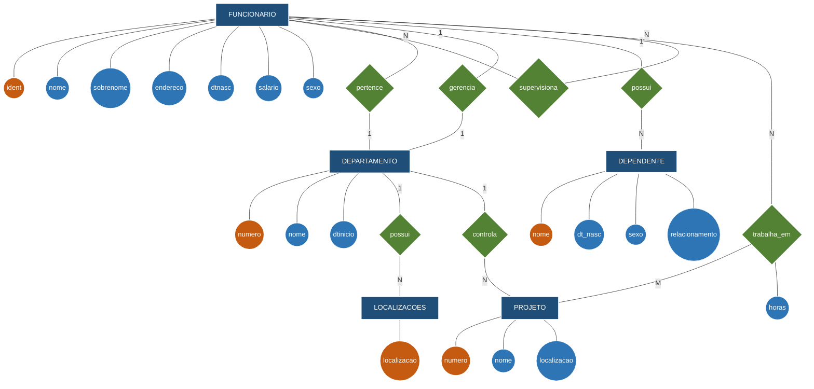
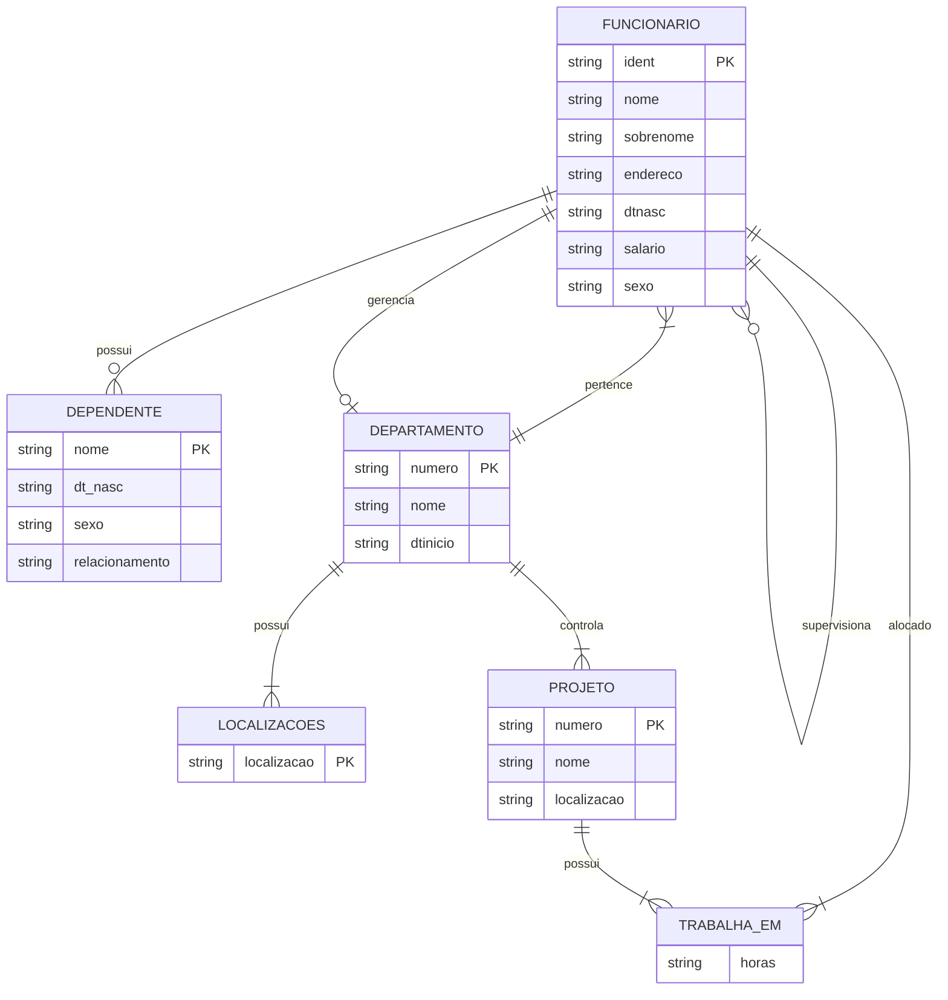

```mermaid
graph TD
    %% Estilos de Formato
    classDef entidade fill:#1f4e79,stroke:#fff,stroke-width:2px,color:#fff;
    classDef entidadeFraca fill:#1f4e79,stroke:#fff,stroke-width:4px,color:#fff;
    classDef atributo fill:#2e75b6,stroke:#fff,stroke-width:1px,color:#fff;
    classDef atributoPK fill:#c55a11,stroke:#fff,stroke-width:2px,color:#fff;
	    classDef relacao fill:#548235,stroke:#fff,stroke-width:2px,color:#fff;

    %% --- ENTIDADES ---
    FUNC[FUNCIONARIO]:::entidade
    DEP[DEPARTAMENTO]:::entidade
    PROJ[PROJETO]:::entidade
    LOC[LOCALIZACOES]:::entidade
    DEPEND[DEPENDENTE]:::entidadeFraca

    %% --- ATRIBUTOS FUNCIONARIO ---
    F_IDENT((ident)):::atributoPK
    F_NOME((nome)):::atributo
    F_SOBRENOME((sobrenome)):::atributo
    F_END((endereco)):::atributo
    F_DTNASC((dtnasc)):::atributo
    F_SAL((salario)):::atributo
    F_SEXO((sexo)):::atributo

    FUNC --- F_IDENT
    FUNC --- F_NOME
    FUNC --- F_SOBRENOME
    FUNC --- F_END
    FUNC --- F_DTNASC
    FUNC --- F_SAL
    FUNC --- F_SEXO

    %% --- ATRIBUTOS DEPARTAMENTO ---
    D_NUM((numero)):::atributoPK
    D_NOME((nome)):::atributo
    D_DTINI((dtinicio)):::atributo

    DEP --- D_NUM
    DEP --- D_NOME
    DEP --- D_DTINI

    %% --- ATRIBUTOS PROJETO ---
    P_NUM((numero)):::atributoPK
    P_NOME((nome)):::atributo
    P_LOC((localizacao)):::atributo

    PROJ --- P_NUM
    PROJ --- P_NOME
    PROJ --- P_LOC

    %% --- ATRIBUTOS LOCALIZACOES ---
    L_LOC((localizacao)):::atributoPK

    LOC --- L_LOC

    %% --- ATRIBUTOS DEPENDENTE ---
    DEP_NOME((nome)):::atributoPK
    DEP_DTNASC((dt_nasc)):::atributo
    DEP_SEXO((sexo)):::atributo
    DEP_REL((relacionamento)):::atributo

    DEPEND --- DEP_NOME
    DEPEND --- DEP_DTNASC
    DEPEND --- DEP_SEXO
    DEPEND --- DEP_REL

    %% --- RELACIONAMENTOS (LOSANGOS) ---
    
    %% Supervisao (Auto-relacionamento)
    R_SUPER{supervisiona}:::relacao
    FUNC ---|1| R_SUPER
    R_SUPER ---|N| FUNC

    %% Pertence (Funcionario - Departamento)
    R_PERT{pertence}:::relacao
    FUNC ---|N| R_PERT
    R_PERT ---|1| DEP

    %% Gerencia (Funcionario - Departamento)
    R_GER{gerencia}:::relacao
    FUNC ---|1| R_GER
    R_GER ---|1| DEP

    %% Possui Dependente (Funcionario - Dependente)
    R_POSS_DEP{possui}:::relacao
    FUNC ---|1| R_POSS_DEP
    R_POSS_DEP ---|N| DEPEND

    %% Possui Localizacao (Departamento - Localizacoes)
    R_POSS_LOC{possui}:::relacao
    DEP ---|1| R_POSS_LOC
    R_POSS_LOC ---|N| LOC

    %% Controla (Departamento - Projeto)
    R_CTRL{controla}:::relacao
    DEP ---|1| R_CTRL
    R_CTRL ---|N| PROJ

    %% Trabalha Em (Funcionario - Projeto)
    R_TRAB{trabalha_em}:::relacao
    FUNC ---|N| R_TRAB
    R_TRAB ---|M| PROJ
    
    %% Atributo do Relacionamento
    T_HORAS((horas)):::atributo
    R_TRAB --- T_HORAS
```

```mermaid
erDiagram
    FUNCIONARIO {
        string ident PK
        string nome
        string sobrenome
        string endereco
        string dtnasc
        string salario
        string sexo
    }

    DEPENDENTE {
        string nome PK
        string dt_nasc
        string sexo
        string relacionamento
    }

    DEPARTAMENTO {
        string numero PK
        string nome
        string dtinicio
    }

    LOCALIZACOES {
        string localizacao PK
    }

    PROJETO {
        string numero PK
        string nome
        string localizacao
    }

    TRABALHA_EM {
        string horas
    }

    FUNCIONARIO ||--o{ FUNCIONARIO : "supervisiona"
    FUNCIONARIO }|--|| DEPARTAMENTO : "pertence"
    FUNCIONARIO ||--o| DEPARTAMENTO : "gerencia"
    FUNCIONARIO ||--o{ DEPENDENTE : "possui"
    DEPARTAMENTO ||--|{ LOCALIZACOES : "possui"
    DEPARTAMENTO ||--|{ PROJETO : "controla"

    FUNCIONARIO ||--|{ TRABALHA_EM : "alocado"
    PROJETO ||--|{ TRABALHA_EM : "possui"
```
