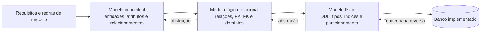
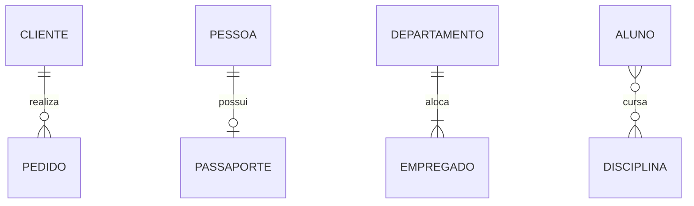
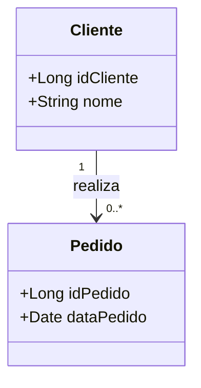
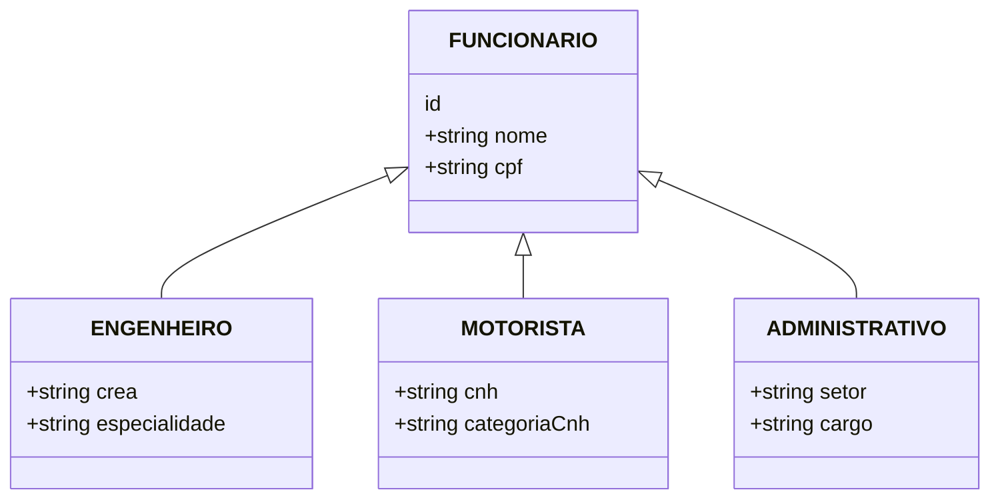
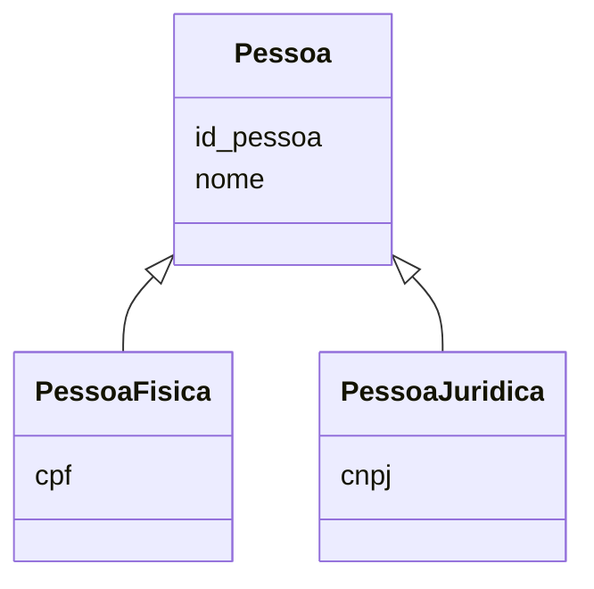

# 1.1 Modelagem de dados: conceitual, lógica e física

> [!important] Prioridade CESGRANRIO: **ALTA**
> Modelagem ER/relacional é um dos núcleos mais recorrentes em provas de Processos de Negócio. A banca costuma apresentar um cenário ou diagrama e perguntar qual modelo preserva corretamente cardinalidades, chaves e regras de negócio. Não basta decorar definições: é preciso transformar um nível de modelo no seguinte.

## O que você DEVE MANTER e REVISAR — o “coração” da CESGRANRIO

A CESGRANRIO concentra as questões deste subtema em cinco pilares:

1. **Conceitual × lógico × físico (Seção 1):** o conceitual representa o negócio; o lógico organiza os dados segundo um paradigma; o físico implementa o esquema em tecnologia concreta. **Pegadinha:** tipos SQL, índices e tablespaces pertencem ao físico, não ao conceitual.

2. **Entidades, atributos e relacionamentos (Seção 2):** reconhecer o que possui existência própria, o que descreve uma entidade e o que expressa associação entre conceitos. Um atributo de relacionamento descreve a associação, não uma entidade isolada.

3. **Cardinalidade e participação (Seções 2 e 3):** interpretar mínimo e máximo nos dois sentidos. `1:N` informa o máximo, mas não diz sozinho se a participação é obrigatória. **Pegadinha:** trocar o lado `1` pelo lado `N` ao migrar uma FK.

4. **Transformação entre níveis (Seções 2 a 4):** acompanhar a passagem de entidade para tabela, identificador para PK e relacionamento para FK ou tabela associativa, preservando as regras do modelo anterior.

5. **Independência e finalidade de cada modelo (Seções 1 e 4):** um modelo lógico depende do paradigma, mas não de Oracle ou PostgreSQL; o físico depende do SGBD. A qualidade deve ser julgada segundo o objetivo do nível analisado.

## Objetivos de aprendizagem

Ao final deste módulo, você deve conseguir:

1. diferenciar modelo conceitual, lógico e físico;
2. reconhecer o que pertence — e o que não pertence — a cada nível;
3. interpretar entidades, atributos, relacionamentos, cardinalidades e participação;
4. transformar um modelo ER em esquema relacional;
5. reconhecer decisões físicas de implementação;
6. identificar as pegadinhas mais frequentes da CESGRANRIO.

## 1. Visão geral: três níveis, três perguntas

| Nível          | Pergunta principal                                                 | Independência                                                                 | Elementos típicos                                                                                               | Não deveria conter                                                            |
| -------------- | ------------------------------------------------------------------ | ----------------------------------------------------------------------------- | --------------------------------------------------------------------------------------------------------------- | ----------------------------------------------------------------------------- |
| **Conceitual** | Quais dados e regras o negócio possui?                             | Independente de tecnologia e, idealmente, do paradigma de BD                  | Entidades, atributos, relacionamentos, cardinalidades, especializações e regras de negócio                      | `VARCHAR(100)`, índices, tablespaces, sintaxe SQL                             |
| **Lógico**     | Como os dados serão organizados no modelo escolhido?               | Independente do SGBD específico, mas dependente do paradigma, como relacional | Relações/tabelas, colunas, PK, FK, chaves alternativas, domínios e restrições lógicas                           | Detalhes de armazenamento, partições físicas, parâmetros do PostgreSQL/Oracle |
| **Físico**     | Como o esquema será implementado e armazenado em um SGBD concreto? | Dependente do SGBD e da infraestrutura                                        | Tipos concretos, índices, particionamento, compressão, tablespaces, materialização, parâmetros e DDL específico | Abstração puramente de negócio sem decisão técnica                            |

### Regra de bolso

- **Conceitual = negócio.**
- **Lógico = estrutura.**
- **Físico = implementação e desempenho.**



> [!warning] Pegadinha CESGRANRIO
> “Independente de tecnologia” não significa que os três modelos sejam igualmente independentes. O **conceitual** é o mais independente; o **lógico** já depende do modelo de dados adotado (relacional, documentos, grafos); o **físico** depende do SGBD concreto.

## 2. Modelo conceitual

O modelo conceitual representa a semântica do domínio. Seu objetivo é capturar o que existe no negócio, como os objetos se relacionam e quais restrições devem ser preservadas. Ela não se preocupa com SGBD

### 2.1 Modelo Entidade Relacionamento (MER)
O modelo conceitual é frequentemente representado através do **Modelo Entidade-Relacionamento (MER)** (conceituado por Peter Chen em 1976) e formalizado pelo **Diagrama Entidade-Relacionamento (DER ou ER)**.
#### A. Entidades
Uma **entidade** é uma ocorrência distinguível do domínio: um cliente específico, um contrato específico ou um produto específico. Um **tipo/conjunto de entidades** agrupa ocorrências com a mesma estrutura, como `CLIENTE`.
- **Entidade Forte:** Possui identidade própria. É totalmente autônoma e pode ser identificada de forma única apenas usando seus próprios atributos (possui sua própria _Chave Primária_). Ex: **Cliente** (pode ser identificado unicamente pelo CPF)
- **Entidade Fraca:** Não possui autonomia. Depende da existência de uma _entidade forte_ e de uma relação com ela para poder ser identificada, pois seus próprios atributos não são suficientes. Ex: **Dependente** (só existe e é identificado no sistema atrelado a um **Funcionário**).
	- Exemplo: `ITEM_PEDIDO` identificado por `(id_pedido, numero_item)`.
	- **Obs.:** Entidade fraca não significa “tabela sem chave primária”. No esquema relacional, ela terá uma chave primária, geralmente composta.
- **Entidade Associativa:** Surge para resolver relacionamentos complexos do tipo “Muitos para Muitos” (N:N) entre duas ou mais entidades, convertendo a relação em algo estruturado que guarda seus próprios atributos.

#### B. Atributos

| Tipo          | Exemplo                               | Observação                                                           |
| ------------- | ------------------------------------- | -------------------------------------------------------------------- |
| Simples       | CPF                                   | Não é decomposto para o objetivo do modelo                           |
| Composto      | Endereço → logradouro, número, cidade | Pode ser dividido em componentes semanticamente relevantes           |
| Monovalorado  | Data de nascimento                    | Um valor por entidade em dado estado                                 |
| Multivalorado | Telefones                             | Pode ter vários valores para a mesma entidade                        |
| Derivado      | Idade derivada da data de nascimento  | Em geral é calculado; armazená-lo pode gerar inconsistência temporal |
| Identificador | matrícula do empregado                | Distingue unicamente uma ocorrência                                  |

> [!warning] Pegadinha CESGRANRIO
> “Composto” e “multivalorado” são dimensões diferentes. `Endereço` pode ser composto e monovalorado; `Telefones` pode ser simples e multivalorado. Atributo derivado não é sinônimo de atributo composto.

#### C. Relacionamentos e grau

Um relacionamento associa entidades.

- **Unário/recursivo:** empregado supervisiona empregado.
- **Binário:** cliente realiza pedido.
- **Ternário:** fornecedor fornece peça a projeto.
- **N-ário**: Múltiplas relações

Um relacionamento ternário não pode ser automaticamente substituído por três relacionamentos binários. A decomposição pode perder a informação de que um fornecedor específico fornece uma peça específica para um projeto específico.

#### D. Cardinalidade 
A cardinalidade define o número máximo (e mínimo) de instâncias de uma entidade que podem estar associadas a uma instância de outra entidade. 
- **1:1 (Um para Um):** Uma instância de A relaciona-se com no máximo uma de B, e vice-versa (ex.: `Pessoa` — _possui_ — `CPF`).
- **1:N (Um para Muitos):** Uma instância de A relaciona-se com várias de B, mas uma de B relaciona-se com no máximo uma de A (ex.: `Departamento` — _possui_ — `Funcionário`).
- **N:M (Muitos para Muitos):** Uma instância de A relaciona-se com várias de B, e vice-versa (ex.: `Aluno` — _cursa_ — `Disciplina`).

##### Notação Min/Max
Exemplo:

```text
CLIENTE (0,N) ─── REALIZA ─── (1,1) PEDIDO
```

Leitura correta:

- um `CLIENTE` pode realizar de zero a muitos `PEDIDOS`;
- cada `PEDIDO` deve ser realizado por exatamente um `CLIENTE`.
- Para um pedido existir, ele precisa de um cliente, mas um cliente não precisa de um pedido para existir

| Restrição | Significado |
|---|---|
| `(0,1)` | participação opcional; no máximo uma ocorrência relacionada |
| `(1,1)` | participação obrigatória; exatamente uma ocorrência relacionada |
| `(0,N)` | participação opcional; várias ocorrências possíveis |
| `(1,N)` | ao menos uma ocorrência; várias possíveis |
##### **Participação (Cardinalidade Mínima)**

Indica a **obrigatoriedade** (ou permissão) de uma entidade fazer parte de ao menos uma instância do relacionamento.

- **Participação Total (Obrigatória / Cardinalidade Mínima = 1):**
    - Todas as instâncias da entidade **devem obrigatoriamente** estar associadas a pelo menos uma instância da outra entidade.
    - _Exemplo:_ Todo `PEDIDO` deve ser emitido por pelo menos 1 `CLIENTE`. Se não houver cliente, o pedido não existe no sistema.
    - _No Diagrama:_ Representada comumente por uma **linha dupla** (ou `1..N`, `1..1`).
- **Participação Parcial (Opcional / Cardinalidade Mínima = 0):**
    - As instâncias da entidade **podem existir no banco sem estar associadas** a qualquer instância da outra entidade.
    - _Exemplo:_ Um `CLIENTE` cadastrado pode ainda não ter efetuado nenhum `PEDIDO`.
    - _No Diagrama:_ Representada por uma **linha simples** (ou `0..N`, `0..1`).


### 2.2 Formas de representação do modelo ER

O mesmo modelo pode ser desenhado em diferentes **notações**. Elas representam ideias semelhantes, mas usam símbolos distintos. Primeiro identifique a notação; só depois interprete cardinalidade e participação.

#### Notação de Chen

É a notação conceitual clássica de Peter Chen.

| Elemento | Símbolo em Chen |
|---|---|
| Entidade forte | Retângulo |
| Entidade fraca | Retângulo duplo |
| Relacionamento | Losango |
| Relacionamento identificador | Losango duplo |
| Atributo | Elipse |
| Atributo-chave | Nome sublinhado |
| Atributo multivalorado | Elipse dupla |
| Atributo derivado | Elipse tracejada |
| Atributo composto | Elipse ligada às elipses componentes |
| Participação total | Linha dupla |
| Participação parcial | Linha simples |

```text
┌─────────┐       ◇ REALIZA ◇       ┌────────┐
│ CLIENTE │  1 ─────────────── N    │ PEDIDO │
└─────────┘                          └────────┘
```

> [!warning] Pegadinha CESGRANRIO
> Linha dupla em Chen significa **participação total**, não “muitos” nem cardinalidade dois. A cardinalidade máxima é indicada por `1`, `N/M` ou pela notação min–max.

#### Pé de Galinha — Crow’s Foot / Information Engineering

Os símbolos ficam nas extremidades da linha. Cada extremidade combina um **mínimo** — círculo para zero ou barra para um — e um **máximo** — barra para um ou pé de galinha para muitos.

| Símbolo textual | Multiplicidade | Leitura |
|---|---:|---|
| `○─|` | `0..1` | zero ou um |
| `|─|` | `1..1` | exatamente um |
| `○─{` | `0..N` | zero ou muitos |
| `|─{` | `1..N` | um ou muitos |

```text
CLIENTE  ||────────○{  PEDIDO
         1        0..N
```

Leitura: para cada pedido existe exatamente um cliente; para cada cliente podem existir zero ou muitos pedidos.



| Mermaid/Pé de Galinha | Significado |
|---|---|
| `||` | exatamente um |
| `o|` | zero ou um |
| `|{` | um ou muitos |
| `o{` | zero ou muitos |

> [!warning] Pegadinha de leitura
> O símbolo perto de `PEDIDO` informa quantos pedidos podem se relacionar com **uma ocorrência da entidade do outro lado**. `CLIENTE ||--o{ PEDIDO` não significa que um pedido possua muitos clientes.

#### Notação Barker

Popularizada por métodos e ferramentas Oracle, também usa o pé de galinha, mas possui convenções próprias.

| Elemento | Representação Barker típica |
|---|---|
| Entidade | Caixa, frequentemente com cantos arredondados |
| Atributo obrigatório | `*` |
| Atributo opcional | `o` |
| Identificador único | `#` ou `UID` |
| Relacionamento obrigatório | Trecho contínuo junto à entidade |
| Relacionamento opcional | Trecho tracejado junto à entidade |
| Um/muitos | Linha simples/pé de galinha na extremidade |

```text
CLIENTE                         PEDIDO
┌────────────────┐             ┌──────────────────┐
│ # id_cliente   │─── realiza ─<│ # id_pedido      │
│ * nome         │             │ * data_pedido    │
│ o telefone     │             │ * id_cliente     │
└────────────────┘             └──────────────────┘
```

Os relacionamentos podem ser lidos como frases nos dois sentidos: cada pedido **deve ser realizado por** um cliente; cada cliente **pode realizar** pedidos.

> [!note] Barker × Pé de Galinha
> As duas usam o pé de galinha para “muitos”, mas não são sinônimos completos. Barker também define marcações próprias para atributos, identificadores e opcionalidade.

#### Notação UML

Diagramas de classes UML representam entidades como classes, atributos dentro das classes e multiplicidades nas extremidades das associações.

| UML | Significado |
|---:|---|
| `1` | exatamente um |
| `0..1` | zero ou um |
| `*` ou `0..*` | zero ou muitos |
| `1..*` | um ou muitos |
| `m..n` | de m a n ocorrências |



A UML também possui generalização, classe associativa, agregação (losango vazio) e composição (losango preenchido). Agregação e composição expressam semântica orientada a objetos e ciclo de vida; não equivalem automaticamente a todo relacionamento ER.

#### Notação IDEF1X

IDEF1X enfatiza identificadores e diferencia relacionamentos **identificadores** e **não identificadores**.

| Elemento | Convenção típica |
|---|---|
| Entidade independente | Retângulo com cantos quadrados |
| Entidade dependente | Retângulo com cantos arredondados |
| Atributos da PK | Acima de uma linha horizontal |
| Atributos não chave | Abaixo da linha |
| Relacionamento identificador | Linha contínua; PK do pai migra para a PK do filho |
| Relacionamento não identificador | Linha tracejada; chave do pai migra apenas como FK |

```text
PEDIDO                         ITEM_PEDIDO
┌──────────────┐               ╭────────────────────╮
│ id_pedido PK │───────────────│ id_pedido PK, FK   │
├──────────────┤               │ numero_item PK     │
│ data         │               ├────────────────────┤
└──────────────┘               │ quantidade         │
                               ╰────────────────────╯
```

O relacionamento acima é identificador porque a chave do pai integra a PK de `ITEM_PEDIDO`.

#### Notação min–max

Escreve `(mínimo, máximo)` junto à participação de cada entidade:

```text
CLIENTE (0,N) ─── REALIZA ─── (1,1) PEDIDO
```

Ela registra simultaneamente obrigatoriedade e limite máximo. Como livros e ferramentas podem variar o posicionamento visual, confirme a leitura pela regra textual do negócio.

#### Comparação rápida

| Característica | Chen | Pé de Galinha | Barker | UML | IDEF1X |
|---|---|---|---|---|---|
| Foco | Conceitual | Conceitual/lógico | Negócio/lógico | Objetos/sistemas | Dados lógico/físico |
| Entidade | Retângulo | Caixa | Caixa arredondada | Classe | Caixa |
| Relacionamento | Losango | Linha nomeada | Linha/frase verbal | Associação | Linha |
| Atributo | Elipse | Na caixa | Na caixa | Na classe | Na caixa |
| Muitos | `N/M` | Pé de galinha | Pé de galinha | `*` | Símbolo na extremidade |
| Opcionalidade | Linha/min–max | Círculo | Linha tracejada | `0..` | Convenção da relação |
| Dependência | Retângulo duplo | Relação/PK | UID/relação | Composição, se cabível | Caixa arredondada |

#### O mesmo relacionamento em cinco formas

Regra: um cliente pode realizar zero ou muitos pedidos; cada pedido pertence a exatamente um cliente.

| Notação | Representação resumida |
|---|---|
| Chen/min–max | `CLIENTE (0,N) — REALIZA — (1,1) PEDIDO` |
| Pé de Galinha | `CLIENTE ||——o{ PEDIDO` |
| Mermaid ER | `CLIENTE ||--o{ PEDIDO : realiza` |
| UML | `Cliente "1" -- "0..*" Pedido` |
| Modelo lógico | `PEDIDO.id_cliente NOT NULL FK → CLIENTE.id_cliente` |

> [!danger] Pegadinhas sobre notações
> 1. Confundir losango de relacionamento de Chen com entidade associativa.
> 2. Interpretar linha dupla de Chen como cardinalidade máxima 2 ou N.
> 3. Ler o círculo do Pé de Galinha isoladamente e ignorar o símbolo de máximo.
> 4. Inverter as extremidades do relacionamento.
> 5. Confundir `0..*` da UML com `1..*`.
> 6. Tratar linha contínua/tracejada do IDEF1X apenas como obrigatoriedade, ignorando a identificação.
> 7. Presumir que todas as ferramentas desenham os símbolos da mesma forma; a legenda e a regra textual prevalecem.

### 2.2  Modelo Entidade-Relacionamento Estendido (EER)
O **Modelo Entidade-Relacionamento Estendido** (_Enhanced/Extended Entity-Relationship_) é uma evolução do modelo conceitual de Peter Chen. Ele foi criado para suprir as limitações do MER tradicional, permitindo modelar cenários complexos com conceitos semelhantes à Orientação a Objetos.
##### 1. Herança e Abstração: Especialização e Generalização
Esses são os pilares do EER para representação de hierarquias de entidades:
- **Especialização (Top-Down):** Processo de criação de subgrupos (subclasses) a partir de uma entidade mais genérica (superclasse). As subclasses herdam todos os atributos e relacionamentos da superclasse, além de possuírem seus próprios atributos específicos.
    - _Exemplo 1:_ A superclasse `FUNCIONÁRIO` pode ser especializada nas subclasses `ENGENHEIRO`, `MOTORISTA` e `ADMINISTRATIVO`.
    - _Exemplo 2:_ A superclasse `FUNCIONÁRIO` pode ser especializada na subclasse `GERENTE`, que é um subconjunto de funcionarios, que se relaciona com a classe `PROJETO` a partir do relacionamento `GERENCIA`.
    - Exemplo 3: A superclasse `FUNCIONÁRIO` pode ser especializada nas subclasses `ASSALARIADO` e `HORISTA`, essa última se relaciona com a classe `SINDICADO` a partir do relacionamento `PERTENCE_A`.
- **Generalização (Bottom-Up):** Processo inverso, no qual entidades com características em comum são sintetizadas em uma superclasse generalizada.
	- _Exemplo:_ As classes `CARRO` e `CAMINHAO` podem ser generalizadas na superclasse `VEICULO`.
##### 2. Restrições de Especialização (Como a Cesgranrio cobra)
As bancas focam intensamente na combinação destas duas restrições cruciais:
###### A. Disjunção (Disjointness)
Define se uma instância da superclasse pode pertencer a mais de uma subclasse ao mesmo tempo:
- **Disjunta (d / Disjoint / Exclusiva):** Uma instância da superclasse pode pertencer a **no máximo uma** subclasse.
    - _Exemplo:_ Um `VEÍCULO` é ou `CARRO` ou `CAMINHÃO` (não pode ser os dois simultaneamente).
- **Sobreposta (o / Overlapping / Compartilhada):** Uma instância pode pertencer a **duas ou mais** subclasses simultaneamente.
    - _Exemplo:_ Uma `PESSOA` pode ser tanto `ALUNO` quanto `PROFESSOR` na mesma instituição.
###### B. Totalidade (Completeness)
Define se todas as instâncias da superclasse são obrigadas a pertencer a alguma subclasse:
- **Total (Linha Dupla):** Toda instância da superclasse **obrigatoriamente** precisa ser mapeada em pelo menos uma subclasse.
- **Parcial (Linha Simples):** Uma instância da superclasse pode existir **sem pertencer a nenhuma** subclasse específica.
    
 **Resumo de Combinações Frequentes:**
> - **Disjunta e Total:** Todo elemento pertence a _exatamente uma_ subclasse.
> - **Sobreposta e Parcial:** O elemento pode pertencer a _nenhuma, uma ou várias_ subclasses.
##### 3. Outros Conceitos Avançados do EER
- **Categoria (ou Tipo União):** Representa uma subclasse que possui uma coleção de superclasses distintas. Diferente da especialização (onde a subclasse herda de _uma_ superclasse), na Categoria a subclasse herda a união de entidades com chaves primárias diferentes.
- **Agregação:** Recurso usado quando precisamos estabelecer um relacionamento entre um relacionamento pré-existente e outra entidade. Ela abstrai o relacionamento como se fosse uma entidade para permitir a nova ligação.
##### Notações
1. Especialização

1. Generalização
	



Restrições usuais:

| Restrição  | Alternativas           | Pergunta                                                     |
| ---------- | ---------------------- | ------------------------------------------------------------ |
| Completude | Total ou parcial       | Toda ocorrência do supertipo deve pertencer a algum subtipo? |
| Disjunção  | Disjunta ou sobreposta | Uma ocorrência pode pertencer a mais de um subtipo?          |

- **Total e disjunta:** toda pessoa é PF ou PJ, nunca ambas.
- **Parcial e sobreposta:** nem toda pessoa precisa estar nos subtipos; uma ocorrência pode estar em vários.

## 3. Lógico
O **Modelo Lógico** é o nível intermediário da modelagem de dados. Ele traduz o modelo conceitual (alto nível de abstração) para a estrutura do paradigma de banco de dados escolhido, sem depender de um software ou SGBD específico (como Oracle, PostgreSQL ou MongoDB).
### **3.1 O que é o Modelo Lógico?**
É a representação detalhada do esquema de dados que define **como as informações serão estruturadas e relacionadas**, adotando regras e estruturas do paradigma de banco de dados adotado, mantendo a independência técnica de implementação física.
### 3.2 Principais Características
- **Dependência de Paradigma:** Segue a lógica do tipo de modelo adotado (Relacional, Multidimensional, Orientado a Objetos, NoSQL).
- **Independência de Software/SGBD:** Não especifica comandos do software comercial, parâmetros de armazenamento físico ou índices em disco.
- **Detalhamento das Estruturas:** Define explicitamente chaves, relacionamentos, coleções, tipos de dados genéricos e restrições de integridade.
### 3.3 Tipos de Modelos Lógicos

| **Tipo de Modelo Lógico**                       | **Descrição Resumida**                                                                                                                                                                              |
| ----------------------------------------------- | --------------------------------------------------------------------------------------------------------------------------------------------------------------------------------------------------- |
| **Modelo Relacional**                           | Organiza os dados em **tabelas (relações)** com linhas e colunas, utilizando **chaves primárias (PK)** e **estrangeiras (FK)** para garantir a integridade referencial.                             |
| **Modelo Multidimensional**                     | Volto para análise OLAP/Data Warehouse, estrutura os dados em **tabelas fato** (métricas) e **dimensões** (contextos), usando esquemas como _Star Schema_ (Estrela) ou _Snowflake_ (Floco de Neve). |
| **Modelo de Documentos (NoSQL)**                | Armazena dados em estruturas semiestruturadas flexíveis (como **JSON/BSON**), agrupando atributos e subdocumentos dentro de uma mesma coleção.                                                      |
| **Modelo Chave-Valor (NoSQL)**                  | Estrutura extremamente simples baseada em um identificador único (**chave**) associado a um **valor** (objeto, texto ou binário).                                                                   |
| **Modelo Colunar / Família de Colunas (NoSQL)** | Agrupa e armazena os dados por **colunas em vez de linhas**, otimizando leituras analíticas em grandes volumes de dados.                                                                            |
| **Modelo de Grafos (NoSQL)**                    | Estruturado em **nós (vertentes)** e **arestas (relacionamentos)** com propriedades, ideal para mapear conexões e redes complexas.                                                                  |
| **Modelo Orientado a Objetos**                  | Mapeia e armazena os dados diretamente como objetos do código (com atributos, métodos, herança e encapsulamento), eliminando a necessidade de conversão entre a aplicação e o banco de dados.       |
## 4. Físico
No **Modelo Físico**, a abstração dá lugar à implementação concreta no disco rígido, na memória e na rede, configurada especificamente para as particularidades de cada paradigma de SGBD.

Abaixo estão os detalhes do modelo físico aplicados aos demais paradigmas além do relacional:

### 4.1 Modelo Multidimensional Físico (Data Warehouse e OLAP)
O modelo multidimensional físico é otimizado para **consultas analíticas pesadas e de leitura massiva**, sacrificando a velocidade de escrita para priorizar agrupamentos e agregações.
- **Particionamento de Tabelas Fato:** Fisiologicamente, tabelas fato com bilhões de registros são divididas no disco em partições físicas (geralmente por intervalo de datas, como ano/mês) para que o mecanismo de consulta leia apenas as partições necessárias.
- **Indexação Específica (Bitmap Indexes):** Em vez dos tradicionais índices em árvore (B-Tree), o modelo físico usa matrizes de bits (_Bitmap_) em colunas de dimensão com baixa cardinalidade (ex.: `Sexo`, `Estado`, `Status`), permitindo operações lógicas `AND`/`OR` extremamente rápidas em nível de hardware.
- **Visões Materializadas:** Consultas agregadas complexas são pré-calculadas e salvas no disco como estruturas físicas permanentes, atualizadas de forma assíncrona.
### 4.2 Modelo Orientado a Documentos (NoSQL)
Neste modelo, os dados são armazenados na forma de documentos semiestruturados flexíveis.
- **Serialização Binária (BSON/CBOR):** Em nível físico, os documentos em formato humanamente legível (JSON) são convertidos e salvos em disco em formatos binários otimizados (como BSON no MongoDB), o que reduz o espaço e acelera a varredura e o parse de tipos de dados.
- **Índices Secundários e Compostos:** O SGBD grava estruturas de índices apontando para chaves específicas inseridas profundamente na hierarquia dos documentos binários.
- **Alocação Dinâmica e Paging:** Os documentos de uma mesma coleção são agrupados fisicamente em blocos contíguos no disco, exrafos (NoSQL)
Focado no mapeamento e navegação de relacionamentos complexos e conexões.
- **Index-Free Adjacency (Adjacência sem Índice):** No nível físico, cada nó (vértice) contém ponteiros de memória/digindo gerenciamento de espaço livre (_padding_) para acomodar o crescimento de documentos sem fragmentação.
### 4.3 Modelo Colunar / Família de Colunas (NoSQL / Big Data)
Diferente dos bancos tradicionais que gravam uma linha inteira do lado da outra no disco, o modelo físico colunar **organiza o armazenamento orientado a colunas**.
- **Gravação Orientada a Colunas:** Todos os valores da coluna `Preco` de milhões de registros são gravados sequencialmente no mesmo bloco de disco, seguidos pelos valores da coluna `Data`.
- **Alta Taxa de Compressão:** Como os dados de uma mesma coluna pertencem ao mesmo tipo (ex.: apenas datas ou apenas números), algoritmos de compressão física (como _Run-Length Encoding_ ou _Snappy_) reduzem drasticamente o uso de espaço.
- **SSTables e Memtables:** Na gravação (ex.: Apache Cassandra), as alterações são armazenadas primeiro em memória (_Memtable_) e depois descarregadas sequencialmente no disco em arquivos imutáveis (_SSTables_), otimizando a escrita para Big Data.
### 4.4 Modelo Chave-Valor e Em Memória (NoSQL)
Projetado para throughput massivo e latência na casa dos milissegundos.
- **Estrutura Hash em RAM:** A implementação física mantém a tabela de espalhamento (_Hash Table_) **diretamente na memória RAM**. A chave aponta diretamente para o endereço físico de memória onde o valor (string, lista ou objeto) está alocado.
- **Persistência Física Opcional:** A gravação em disco não é a via principal, ocorrendo de forma assíncrona por meio de _Snapshots_ pontuais (arquivos RDB) ou arquivos de log acumulativos (_Append-Only File - AOF_) para recuperação em caso de falha de energia.
### 4.5 Modelo de Gisco que apontam **diretamente** para os nós aos quais está conectado.
- **Navegação Física sem JOINs:** Para encontrar conexões, o SGBD simplesmente segue os ponteiros físicos gravados junto aos dados, evitando varreduras pesadas em tabelas de índice durante a execução da consulta.
### 4.6 Modelo Orientado a Grafos (NoSQL)
Focado no mapeamento e navegação de relacionamentos complexos e conexões altamente interligadas.
- **Index-Free Adjacency (Adjacência sem Índice):** No nível físico, cada nó (vértice) contém ponteiros de memória/disco que apontam diretamente para os nós aos quais está conectado.
- **Navegação Física sem JOINs:** Para encontrar conexões, o SGBD simplesmente segue os ponteiros físicos gravados junto aos dados, evitando varreduras pesadas em tabelas de índice durante a execução da consulta.
- **Armazenamento de Propriedades em Bloco:** Atributos de nós e arestas são gravados em estruturas de listas encadeadas duplas no disco, separando a estrutura do grafo dos dados secundários para otimizar a travessia.
### 4.6 Modelo Orientado a Objetos (OODBMS)
Projetado para persistir instâncias de objetos diretamente da memória para o disco mantendo identidade, estado e comportamento.
- **OID Físico (Object Identifier):** Cada objeto salvo recebe um identificador único imutável e independente de conteúdo, usado internamente como ponteiro direto para o bloco de armazenamento no disco.
- **Gravação de Grafos de Objetos:** Preserva referências nativas, herança e coleções (arrays, maps) em disco sem desestruturar a entidade em tabelas ou colunas separadas.
- **Eliminação do Mapeamento Objeto-Relacional (OR/M):** A estrutura física do banco reflete diretamente as classes da aplicação, removendo o overhead de conversão entre tipos da linguagem de programação e tipos do banco de dados.

## 5. Abordagens top-down, bottom-up e engenharia reversa

| Abordagem | Movimento | Uso típico |
|---|---|---|
| Top-down | Requisitos → conceitual → lógico → físico | Desenvolvimento novo orientado pelo negócio |
| Bottom-up | Estruturas/dados existentes → integração e abstração | Consolidação de bases legadas |
| Inside-out | Começa por entidades centrais e expande o modelo | Domínio amplo com núcleo bem conhecido |
| Engenharia reversa | Esquema físico/lógico existente → modelo mais abstrato | Documentação, modernização e integração de legado |

Engenharia reversa não recupera automaticamente todas as regras originais. Uma restrição mantida apenas na aplicação ou em procedimento manual pode não estar registrada no banco.

## 7. Como a CESGRANRIO costuma cobrar

### Padrão 1 — identificar o nível

A banca mistura uma regra de negócio com um detalhe de implementação:

- “cliente realiza pedido” → conceitual;
- “a FK fica em PEDIDO” → lógico relacional;
- “criar índice B-tree na FK” → físico.

### Padrão 2 — inverter o lado da chave estrangeira

Em `CLIENTE 1:N PEDIDO`, tenta colocar `id_pedido` em `CLIENTE`. Regra: a chave do lado 1 migra para o lado N.

### Padrão 3 — confundir mínimo e máximo

`(0,N)` comunica duas restrições: participação opcional (mínimo zero) e cardinalidade máxima muitos. A banca pode descrever apenas uma delas e concluir indevidamente a outra.

### Padrão 4 — tratar N:M como uma FK simples

Uma FK em apenas um dos lados não representa múltiplas associações dos dois lados. É necessária uma relação associativa.

### Padrão 5 — confundir atributo da entidade com atributo do relacionamento

Quantidade e preço praticado pertencem a `ITEM_PEDIDO`, pois dependem do vínculo específico entre pedido e produto.

### Padrão 6 — afirmar que entidade fraca não possui chave

Ela não possui identificador completo independente no conceitual. No relacional, recebe PK composta pela chave da proprietária mais a chave parcial.

### Padrão 7 — chamar índice de elemento lógico obrigatório

PK e FK pertencem ao esquema lógico; a estrutura concreta de índice usada para suportá-las é uma decisão física. Alguns SGBDs criam índice automaticamente para PK, mas PK e índice não são conceitos equivalentes.

## 8. Checklist de resolução

Ao receber um cenário ou diagrama:

1. circule as entidades/substantivos relevantes;
2. sublinhe verbos que representam relacionamentos;
3. identifique regras de mínimo e máximo em cada lado;
4. localize identificadores e atributos multivalorados/derivados;
5. determine se o enunciado está no nível conceitual, lógico ou físico;
6. em 1:N, leve a PK do lado 1 para o lado N;
7. em N:M, crie relação associativa;
8. em 1:1, use FK `UNIQUE` e observe participação obrigatória;
9. verifique se `NULL/NOT NULL` preserva a participação mínima;
10. só depois examine tipos, índices e detalhes do SGBD.

## 9. Quadro de revisão rápida

| Se o enunciado mencionar... | Pense primeiro em... |
|---|---|
| Entidade, relacionamento, cardinalidade | Conceitual |
| Relação, tupla, domínio, PK, FK | Lógico relacional |
| `VARCHAR`, índice, partição, tablespace | Físico |
| 1:N | FK no lado N |
| N:M | Relação associativa |
| 1:1 | FK com `UNIQUE`; preferir lado obrigatório |
| Atributo multivalorado | Nova relação |
| Entidade fraca | PK da proprietária + chave parcial |
| Mudança de índice sem alterar aplicações | Independência física |
| Mudança lógica preservando views | Independência lógica |

## 10. Questões inéditas — estilo CESGRANRIO

### Questão 1

Uma companhia modela contratos celebrados com fornecedores. Cada contrato deve estar associado a exatamente um fornecedor, enquanto um fornecedor pode existir no cadastro sem possuir contrato e pode, posteriormente, celebrar vários contratos. A equipe também decidiu criar um índice composto sobre `CONTRATO(id_fornecedor, data_assinatura)` em um banco PostgreSQL.

A respeito dos níveis de modelagem e da transformação para o modelo relacional, verifica-se que

A) a obrigatoriedade de cada contrato possuir fornecedor é uma decisão física, pois deverá ser implementada por `NOT NULL`.

B) a chave primária de `CONTRATO` deve migrar para `FORNECEDOR`, pois este ocupa o lado 1 do relacionamento.

C) a relação lógica deve conter a chave de `FORNECEDOR` em `CONTRATO`, e o índice composto é uma decisão predominantemente física.

D) o relacionamento deve originar obrigatoriamente uma terceira relação, porque há várias ocorrências de contrato.

E) a existência de fornecedor sem contrato determina cardinalidade máxima igual a zero no lado de `FORNECEDOR`.

#### Gabarito comentado

**Resposta: C.**

- O relacionamento é `FORNECEDOR 1:N CONTRATO`; por isso, a chave do lado 1 migra como FK para o lado N.
- A obrigatoriedade é uma **regra conceitual**, representada logicamente pela FK obrigatória e concretizada fisicamente com `NOT NULL`. Logo, A está errada.
- B inverte a migração da chave.
- Relação associativa é a regra típica para N:M, não para 1:N; D está errada.
- A possibilidade de fornecedor sem contrato define **mínimo zero**, não máximo zero; E troca mínimo por máximo.

> [!danger] Pegadinhas testadas
> Nível da regra × mecanismo de implementação; lado da FK; 1:N × N:M; cardinalidade mínima × máxima.

### Questão 2

Em um modelo conceitual, um pedido é identificado por `numero_pedido` e possui vários itens. Cada item possui `numero_item`, que é único apenas dentro do respectivo pedido, além de quantidade e preço praticado. Cada item referencia exatamente um produto, e um produto pode nunca ter sido incluído em pedido algum.

Qual esquema lógico preserva adequadamente essas regras?

A) `PEDIDO(numero_pedido PK, numero_item, quantidade, preco_praticado)` e `PRODUTO(id_produto PK)`.

B) `ITEM_PEDIDO(numero_item PK, numero_pedido FK, id_produto FK, quantidade, preco_praticado)`.

C) `PEDIDO(numero_pedido PK)`; `PRODUTO(id_produto PK, numero_item FK)`; `ITEM_PEDIDO(numero_pedido FK, quantidade, preco_praticado)`.

D) `PEDIDO(numero_pedido PK)`; `PRODUTO(id_produto PK)`; `ITEM_PEDIDO(numero_pedido PK/FK, numero_item PK, id_produto FK NOT NULL, quantidade, preco_praticado)`.

E) `PEDIDO(numero_pedido PK, id_produto FK)`; `PRODUTO(id_produto PK)`; `ITEM_PEDIDO(numero_item PK, quantidade, preco_praticado)`.

#### Gabarito comentado

**Resposta: D.**

- `ITEM_PEDIDO` depende de `PEDIDO` e seu `numero_item` é apenas uma chave parcial. Sua PK correta é `(numero_pedido, numero_item)`.
- `id_produto NOT NULL` preserva a regra de que cada item referencia exatamente um produto.
- A mistura atributos repetitivos dos itens na relação `PEDIDO`.
- B torna `numero_item` globalmente único, contrariando o enunciado.
- C coloca a associação com item no lado errado e não identifica o item.
- E perde o vínculo completo pedido–item–produto.

> [!danger] Pegadinhas testadas
> Entidade fraca; chave parcial × chave completa; atributo do relacionamento; obrigatoriedade da FK.

## 11. Próximos passos sugeridos

1. Reproduza, sem consultar, o quadro “três níveis, três perguntas”.
2. Transforme três cenários próprios em modelos ER e relações.
3. Resolva novamente as duas questões após 24 horas.
4. Avance para [[1.2 - Criacao e alteracao dos modelos logico e fisico de dados]] e depois [[1.3 - O modelo relacional]].

## Ligações no vault

- [[01 - Mapa Consolidado e Ranking]]
- [[03 - Matriz Completa do Edital]]
- Próximo: [[1.2 - Criacao e alteracao dos modelos logico e fisico de dados]]
