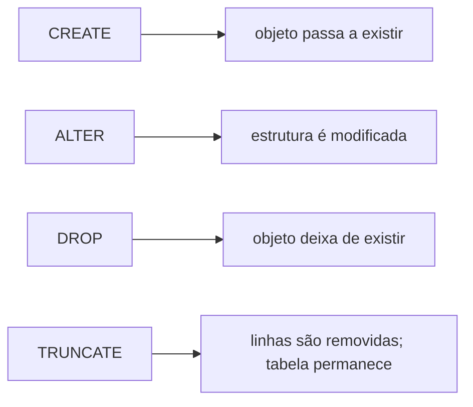
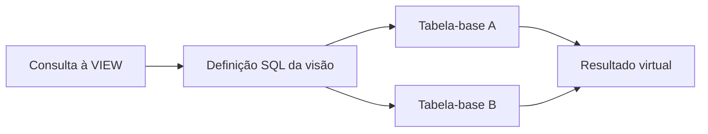
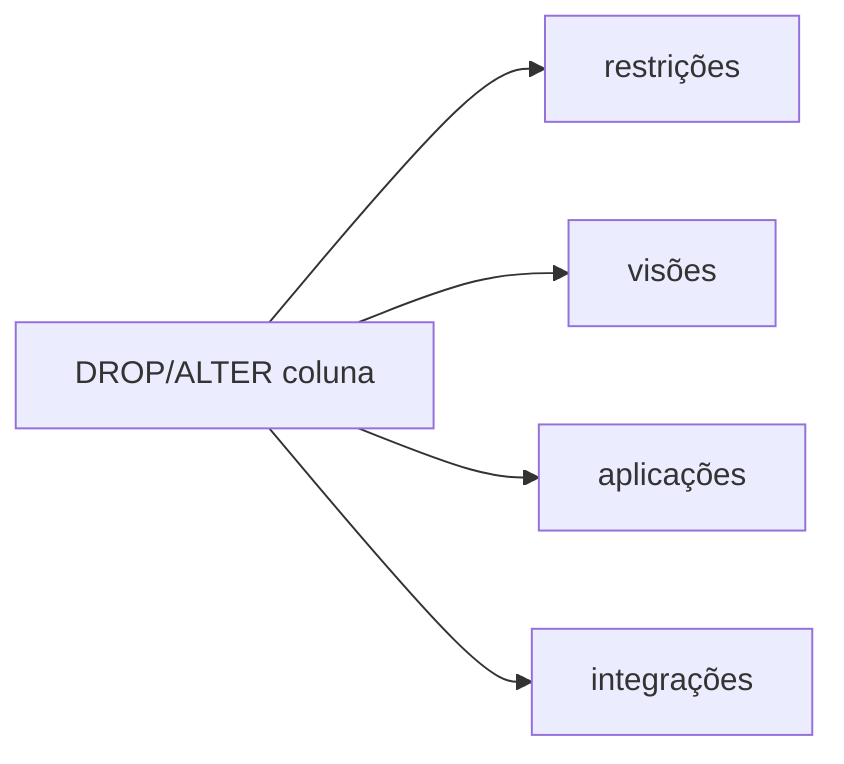

# 1.11 — Linguagem de definição de dados (DDL)

[[1.0 Mapa de estudos — Arquitetura de dados|← Mapa]] · [[1.10 Linguagem de consulta estruturada SQL|← SQL]] · [[1.12 Linguagem de manipulação de dados DML|DML →]] · [[Banco de questões — Arquitetura de dados|Questões]]

> [!important] Prioridade CESGRANRIO: **ALTA**
> A matriz registra cobrança de `CREATE TABLE`, PK e FK em prova anterior. Espere trechos de DDL para identificar quais dados são aceitos, qual cardinalidade foi implementada ou qual alteração preserva a estrutura pretendida.

## O que você DEVE MANTER e REVISAR — o “coração” da CESGRANRIO

A CESGRANRIO concentra suas questões de DDL em seis pilares:

1. **`CREATE TABLE` (Seções 3 e 4):** associe cada coluna a tipo, nulabilidade, valor padrão e restrições. **Pegadinha:** declarar `PRIMARY KEY` já implica unicidade e proibição de `NULL`.

2. **Restrições (_constraints_) (Seções 5 a 9):** `NOT NULL` controla ausência; `UNIQUE`, unicidade; `PRIMARY KEY`, identidade; `FOREIGN KEY`, referência; `CHECK`, predicado sobre valores. Uma tabela possui uma PK, que pode ser composta.

3. **FK e ordem de criação (Seções 9 e 10):** a tabela referenciada precisa existir antes da criação da FK, salvo criação posterior por `ALTER TABLE`. A FK pode apontar para uma chave candidata, não exclusivamente para a PK.

4. **`ALTER TABLE` (Seção 12):** adiciona, altera ou remove colunas e restrições. Antes de tornar coluna `NOT NULL`, criar `UNIQUE` ou adicionar FK, os dados existentes precisam satisfazer a nova regra.

5. **`DELETE` × `TRUNCATE` × `DROP` (Seção 15):** `DELETE` remove linhas e é DML; `TRUNCATE` remove todas as linhas mantendo a tabela; `DROP` remove o objeto. **Pegadinha:** efeitos transacionais, identidade e cascata variam entre SGBDs.

6. **Visões e atualizabilidade (Seção 13.2):** uma visão comum é uma tabela virtual definida por consulta. Visões simples podem ser atualizáveis; `JOIN`, agregações e outras operações podem impedir ou tornar ambígua a propagação das alterações às tabelas-base. Tema cobrado pela CESGRANRIO em 2025.

> [!note] Limite deste módulo
> Inserção, atualização e exclusão detalhadas serão estudadas em 1.12. ACID e controle transacional aparecem em 1.14 e 1.16; índices e desempenho, em 1.17. Aqui esses assuntos serão citados apenas para distinguir comandos.

## Objetivos de aprendizagem

Ao final deste módulo, você deverá conseguir:

1. definir DDL e reconhecer seus principais comandos;
2. criar tabelas com tipos, valores padrão e restrições;
3. diferenciar restrições em nível de coluna e de tabela;
4. implementar PKs e FKs simples e compostas;
5. interpretar alterações estruturais;
6. distinguir `DELETE`, `TRUNCATE` e `DROP`;
7. reconhecer dependências e riscos de mudanças no esquema;
8. evitar as principais pegadinhas da CESGRANRIO.

## 1. O que é DDL

**DDL — Data Definition Language** é o subconjunto da SQL usado para definir, alterar e remover estruturas e outros objetos do banco de dados.

Comandos típicos:

```text
CREATE
ALTER
DROP
TRUNCATE
RENAME
COMMENT
```

Objetos comuns:

- schemas;
- tabelas;
- colunas;
- restrições;
- visões;
- sequências;
- domínios;
- índices, conforme a classificação adotada pelo SGBD.



> [!warning] Pegadinha CESGRANRIO
> DDL atua principalmente na **definição do esquema**, mas alguns comandos também afetam dados. `TRUNCATE`, por exemplo, remove linhas embora seja usualmente classificado como DDL.

## 2. DDL × DML × DCL × TCL

| Categoria | Finalidade | Comandos típicos |
|---|---|---|
| DDL | definir estruturas | `CREATE`, `ALTER`, `DROP`, `TRUNCATE` |
| DML | manipular linhas | `INSERT`, `UPDATE`, `DELETE`, `MERGE` |
| DQL | consultar | `SELECT` |
| DCL | controlar privilégios | `GRANT`, `REVOKE` |
| TCL | controlar transações | `COMMIT`, `ROLLBACK`, `SAVEPOINT` |

As classificações variam em parte da literatura. Para prova, a separação mais cobrada é:

```text
ALTER = muda estrutura
UPDATE = muda dados

DROP = remove objeto
DELETE = remove linhas
```

## 3. Estrutura de `CREATE TABLE`

Forma geral:

```sql
CREATE TABLE nome_tabela (
    coluna_1 tipo [restrições],
    coluna_2 tipo [restrições],
    ...,
    [restrições de tabela]
);
```

Exemplo:

```sql
CREATE TABLE departamento (
    cod_departamento INTEGER,
    sigla            VARCHAR(10) NOT NULL,
    nome             VARCHAR(100) NOT NULL,
    ativo            CHAR(1) DEFAULT 'S' NOT NULL,
    CONSTRAINT pk_departamento
        PRIMARY KEY (cod_departamento),
    CONSTRAINT uq_departamento_sigla
        UNIQUE (sigla),
    CONSTRAINT ck_departamento_ativo
        CHECK (ativo IN ('S', 'N'))
);
```

O comando define:

- nomes das colunas;
- tipos e tamanhos;
- obrigatoriedade;
- valor padrão;
- identidade e unicidade;
- domínio permitido.

## 4. Tipos de dados — visão necessária

Tipos comuns:

| Família         | Exemplos                            | Uso geral                             |
| --------------- | ----------------------------------- | ------------------------------------- |
| inteiros        | `SMALLINT`, `INTEGER`, `BIGINT`     | contagens e identificadores numéricos |
| exatos          | `DECIMAL(p,s)`, `NUMERIC(p,s)`      | valores que exigem precisão decimal   |
| aproximados     | `REAL`, `FLOAT`, `DOUBLE PRECISION` | medições aproximadas                  |
| caracteres      | `CHAR(n)`, `VARCHAR(n)`             | códigos e textos                      |
| temporais       | `DATE`, `TIME`, `TIMESTAMP`         | datas e horários                      |
| booleanos       | `BOOLEAN`                           | verdadeiro/falso, quando suportado    |
| binários        | `BINARY`, `VARBINARY`, `BLOB`       | conteúdo binário                      |
| textos extensos | `CLOB`, tipos textuais próprios     | documentos textuais extensos          |

### 4.1 `CHAR` × `VARCHAR`

- `CHAR(n)`: comprimento fixo segundo a semântica do produto;
- `VARCHAR(n)`: comprimento variável até o limite.

### 4.2 `DECIMAL(p,s)`

- `p` é a precisão: total de dígitos;
- `s` é a escala: dígitos após a separação decimal.

```text
DECIMAL(7,2) → até 7 dígitos no total, 2 após a parte decimal
Exemplo válido de magnitude: 99999,99
```

### 4.3 Tipo adequado ao significado

- CPF não é medida numérica; pode começar com zero e não sofre soma;
- dinheiro exige normalmente tipo decimal exato;
- data não deve ser texto livre;
- códigos controlados podem exigir `CHECK` ou tabela de referência.

> [!warning] Pegadinha CESGRANRIO
> Um atributo formado apenas por algarismos não precisa ser numérico. CPF, telefone e CEP são identificadores, não quantidades.

## 5. Restrições em coluna e tabela

### 5.1 Nível de coluna

Declarada junto à coluna:

```sql
cpf CHAR(11) NOT NULL UNIQUE
```

Adequada para restrições simples sobre uma coluna.

### 5.2 Nível de tabela

Declarada separadamente:

```sql
CONSTRAINT pk_alocacao
    PRIMARY KEY (matricula, cod_projeto)
```

É necessária para restrições compostas e facilita nomear e administrar a regra.

### 5.3 Nome da restrição

```sql
CONSTRAINT uq_empregado_cpf UNIQUE (cpf)
```

Nomear explicitamente ajuda em:

- mensagens de erro;
- documentação;
- remoção ou alteração posterior;
- padronização.

Se o nome for omitido, o SGBD pode gerar um identificador automaticamente.

## 6. `NOT NULL`

Impede ausência de valor na coluna:

```sql
nome VARCHAR(120) NOT NULL
```

Não impede, por si só:

- cadeia vazia, dependendo do SGBD;
- espaços em branco;
- duplicatas;
- valor semanticamente inválido.

```text
NOT NULL ≠ UNIQUE
NOT NULL ≠ CHECK completo do domínio
```

> [!warning] Pegadinha CESGRANRIO
> `NOT NULL` exige presença, mas não garante unicidade nem validade semântica.

## 7. `DEFAULT`

Fornece um valor quando a instrução não informa explicitamente a coluna:

```sql
ativo CHAR(1) DEFAULT 'S'
```

O padrão não substitui toda ocorrência de `NULL` automaticamente. Se a inserção fornecer explicitamente `NULL` e a coluna permitir, o resultado pode continuar nulo.

```text
coluna omitida → DEFAULT pode ser aplicado
NULL explícito  → é NULL, se permitido
```

O valor padrão ainda precisa satisfazer tipo, `CHECK`, `NOT NULL` e demais restrições.

## 8. `UNIQUE` e `PRIMARY KEY`

### 8.1 `UNIQUE`

Define unicidade de uma coluna ou combinação:

```sql
CONSTRAINT uq_empregado_cpf
    UNIQUE (cpf)
```

Uma tabela pode possuir várias restrições `UNIQUE`, representando chaves candidatas alternativas ou outras regras de unicidade.

### 8.2 `PRIMARY KEY`

Escolhe a principal chave candidata:

```sql
CONSTRAINT pk_empregado
    PRIMARY KEY (matricula)
```

Propriedades:

- única por tabela;
- pode conter uma ou várias colunas;
- impõe unicidade;
- proíbe `NULL` em todos os componentes.

### 8.3 Chave composta

```sql
CREATE TABLE alocacao (
    matricula   BIGINT,
    cod_projeto BIGINT,
    horas       DECIMAL(5,2),
    CONSTRAINT pk_alocacao
        PRIMARY KEY (matricula, cod_projeto)
);
```

A combinação deve ser única:

```text
(10, P1) válido
(10, P2) válido
(20, P1) válido
(10, P1) repetido → inválido
```

### 8.4 PK substituta e chave natural

```sql
CREATE TABLE empregado (
    id_empregado BIGINT PRIMARY KEY,
    cpf          CHAR(11) NOT NULL,
    nome         VARCHAR(120) NOT NULL,
    CONSTRAINT uq_empregado_cpf UNIQUE (cpf)
);
```

A PK substituta não elimina a unicidade natural do CPF.

> [!warning] Pegadinhas CESGRANRIO
>
> - uma tabela possui uma PK, ainda que composta;
> - pode possuir várias restrições `UNIQUE`;
> - `UNIQUE` e tratamento de `NULL` possuem detalhes dependentes do SGBD;
> - PK implica `UNIQUE` e `NOT NULL`;
> - criar identificador artificial não elimina regras de unicidade do negócio.

## 9. `FOREIGN KEY`

A FK garante correspondência com uma chave candidata da tabela referenciada.

```sql
CREATE TABLE empregado (
    matricula        BIGINT PRIMARY KEY,
    nome             VARCHAR(120) NOT NULL,
    cod_departamento INTEGER,
    CONSTRAINT fk_empregado_departamento
        FOREIGN KEY (cod_departamento)
        REFERENCES departamento (cod_departamento)
);
```

### 9.1 FK composta

```sql
CREATE TABLE contrato (
    id_empresa INTEGER,
    numero     INTEGER,
    descricao VARCHAR(200),
    PRIMARY KEY (id_empresa, numero)
);

CREATE TABLE medicao (
    id_medicao      BIGINT PRIMARY KEY,
    id_empresa      INTEGER,
    numero_contrato INTEGER,
    CONSTRAINT fk_medicao_contrato
        FOREIGN KEY (id_empresa, numero_contrato)
        REFERENCES contrato (id_empresa, numero)
);
```

Quantidade, ordem e domínios correspondentes precisam ser compatíveis.

### 9.2 Ações referenciais

```sql
FOREIGN KEY (cod_departamento)
REFERENCES departamento(cod_departamento)
ON UPDATE CASCADE
ON DELETE SET NULL
```

Revisão:

- `RESTRICT`/`NO ACTION`: impedem a operação se a violação persistir;
- `CASCADE`: propaga;
- `SET NULL`: atribui nulo, exigindo coluna anulável;
- `SET DEFAULT`: aplica padrão referencialmente válido.

### 9.3 FK para chave alternativa

```sql
FOREIGN KEY (sigla_departamento)
REFERENCES departamento(sigla)
```

É possível quando `departamento.sigla` possui unicidade adequada.

> [!warning] Pegadinha CESGRANRIO
> FK pode repetir, aceitar `NULL` e apontar para chave candidata alternativa. Ela não precisa ter o mesmo nome da coluna referenciada.

## 10. Ordem de criação e referências

Se `EMPREGADO` referencia `DEPARTAMENTO`, a sequência natural é:


Alternativamente:

1. criar ambas as tabelas sem a FK;
2. adicionar a FK posteriormente com `ALTER TABLE`.

```sql
ALTER TABLE empregado
ADD CONSTRAINT fk_empregado_departamento
FOREIGN KEY (cod_departamento)
REFERENCES departamento (cod_departamento);
```

Essa alternativa é útil em dependências cíclicas ou geração de scripts, mas os dados existentes precisam ser válidos.

## 11. `CHECK`

Impõe predicado sobre os valores de uma linha:

```sql
salario DECIMAL(12,2)
    CHECK (salario > 0)
```

```sql
CONSTRAINT ck_periodo
CHECK (data_fim IS NULL OR data_fim >= data_inicio)
```

### 11.1 Lógica de três valores

Em SQL, uma condição `CHECK` é violada quando resulta em `FALSE`; `UNKNOWN`, frequentemente causado por `NULL`, não equivale a `FALSE`.

```sql
idade INTEGER CHECK (idade >= 18)
```

Se `idade` for `NULL`, o predicado é `UNKNOWN` e pode não violar o `CHECK`. Para obrigatoriedade:

```sql
idade INTEGER NOT NULL CHECK (idade >= 18)
```

### 11.2 Limites

`CHECK` é adequado para regras da própria linha. Regras que exigem consultar outras linhas ou tabelas não são portavelmente expressas por um `CHECK` comum.

> [!warning] Pegadinha CESGRANRIO
> `CHECK (salario > 0)` não implica `NOT NULL`. Use as duas restrições quando presença e faixa forem obrigatórias.

## 12. `ALTER TABLE`

Altera a definição de uma tabela existente. A sintaxe exata varia entre SGBDs.

### 12.1 Adicionar coluna

```sql
ALTER TABLE empregado
ADD email VARCHAR(254);
```

Adicionar imediatamente uma coluna `NOT NULL` a uma tabela preenchida exige estratégia para as linhas existentes, como valor padrão compatível ou preenchimento prévio.

### 12.2 Adicionar restrição

```sql
ALTER TABLE empregado
ADD CONSTRAINT uq_empregado_email
UNIQUE (email);
```

Duplicatas existentes impedem a criação da unicidade.

### 12.3 Alterar tipo ou nulabilidade

Exemplo conceitual:

```sql
ALTER TABLE empregado
ALTER COLUMN nome TYPE VARCHAR(200);
```

Sintaxe e conversões permitidas variam. Reduzir tamanho ou mudar domínio pode causar rejeição ou perda, dependendo da operação e do SGBD.

### 12.4 Remover coluna

```sql
ALTER TABLE empregado
DROP COLUMN apelido;
```

É potencialmente destrutivo: remove valores e pode afetar visões, restrições, aplicações e relatórios.

### 12.5 Remover restrição

```sql
ALTER TABLE empregado
DROP CONSTRAINT uq_empregado_email;
```

Remove a regra, não necessariamente a coluna.

### 12.6 Renomear

Exemplo genérico, com variação de sintaxe:

```sql
ALTER TABLE empregado
RENAME COLUMN nm_emp TO nome;
```

> [!warning] Pegadinhas CESGRANRIO
>
> - nova restrição também é validada contra dados existentes;
> - remover constraint não significa remover coluna;
> - renomear preserva conceitualmente o objeto; remover e recriar pode perder dados e dependências;
> - a sintaxe de alteração é menos portátil que o `SELECT` básico.

## 13. `CREATE SCHEMA`, `VIEW` e outros objetos

### 13.1 Schema

Agrupa e cria namespace para objetos:

```sql
CREATE SCHEMA rh;
```

```text
rh.empregado
projetos.empregado_projeto
```

Schema não é sinônimo universal de banco de dados; a hierarquia e terminologia variam por produto.

### 13.2 View

Define consulta nomeada:

```sql
CREATE VIEW vw_empregado_ativo AS
SELECT matricula, nome, cod_departamento
FROM empregado
WHERE ativo = 'S';
```

Uma visão comum armazena sua definição, não necessariamente uma cópia independente dos dados. Visão materializada é conceito diferente e dependente de recursos do produto.

#### 13.2.1 Visão comum ou virtual

Uma `VIEW` comum funciona como uma **tabela virtual**: o SGBD armazena sua definição SQL e, quando ela é consultada, obtém o resultado a partir das tabelas-base.



Ela serve para:

- simplificar consultas complexas;
- fornecer abstração lógica;
- restringir linhas e colunas expostas;
- estabilizar uma interface de consulta;
- apresentar dados derivados ou combinados.

> [!warning] Pegadinha CESGRANRIO
> Virtual não significa inexistente ou inútil. A visão existe como objeto do esquema, mas normalmente não mantém uma cópia independente de todas as linhas resultantes.

#### 13.2.2 Visão simples e potencialmente atualizável

Uma visão simples sobre uma única tabela pode permitir `INSERT`, `UPDATE` ou `DELETE` quando o SGBD consegue identificar, sem ambiguidade, a linha e a coluna da tabela-base que devem ser modificadas.

```sql
CREATE VIEW vw_empregado_publico AS
SELECT matricula, nome, cod_departamento
FROM empregado
WHERE ativo = 'S';

UPDATE vw_empregado_publico
SET nome = 'Ana Lima'
WHERE matricula = 10;
```

Condições que geralmente favorecem a atualizabilidade:

- uma única tabela-base;
- identificação preservada das linhas;
- colunas diretamente correspondentes às colunas da base;
- ausência de agregação, agrupamento e eliminação de duplicatas;
- ausência de cálculos que tornem a coluna derivada.

As regras exatas variam entre SGBDs e conforme o padrão implementado.

#### 13.2.3 Operações que dificultam ou impedem atualizações

Uma visão tende a ser não atualizável, parcialmente atualizável ou dependente de regras específicas quando contém:

- `JOIN` entre tabelas;
- `GROUP BY`;
- funções agregadas como `SUM`, `AVG` e `COUNT`;
- `DISTINCT`;
- operações de conjunto, como `UNION`;
- colunas calculadas;
- subconsultas ou construções complexas, conforme o SGBD.

Exemplo com junção:

```sql
CREATE VIEW vw_empregado_departamento AS
SELECT
    e.matricula,
    e.nome,
    d.nome AS departamento
FROM empregado e
JOIN departamento d
  ON d.cod_departamento = e.cod_departamento;
```

Considere:

```sql
UPDATE vw_empregado_departamento
SET departamento = 'Engenharia'
WHERE matricula = 10;
```

O comando pode ser ambíguo:

- deve alterar o nome do departamento já existente?
- deve transferir o empregado para outro departamento?
- deve criar um novo departamento?
- a mudança afetaria outros empregados ligados ao mesmo departamento?

Por isso, o SGBD pode rejeitar a atualização. Alguns produtos permitem atualizações limitadas em visões com `JOIN` quando a tabela afetada e a correspondência são determináveis; outros oferecem mecanismos como triggers `INSTEAD OF`.

#### 13.2.4 Não faça generalizações absolutas

| Afirmação | Julgamento |
|---|---|
| “Toda visão é atualizável.” | **Falsa** |
| “Nenhuma visão com `JOIN` pode ser atualizada em qualquer SGBD.” | **Falsa como regra universal** |
| “Uma visão com `JOIN` pode gerar ambiguidade de atualização.” | **Verdadeira** |
| “Ao receber `UPDATE`, a visão vira tabela materializada.” | **Falsa** |
| “A visão deixa de existir por conter `JOIN`.” | **Falsa** |
| “O SGBD sempre resolve automaticamente qualquer ambiguidade.” | **Falsa** |

> [!warning] Pegadinha de redação
> A alternativa correta usa **“podem resultar em ambiguidades”**, e não “toda visão com `JOIN` é absolutamente não atualizável”. O comportamento concreto depende da visão e do SGBD.

#### 13.2.5 `WITH CHECK OPTION`

Em uma visão atualizável com filtro, `WITH CHECK OPTION` exige que linhas inseridas ou alteradas por meio da visão continuem visíveis nela, isto é, satisfaçam seu predicado.

```sql
CREATE VIEW vw_empregado_ativo AS
SELECT matricula, nome, ativo
FROM empregado
WHERE ativo = 'S'
WITH CHECK OPTION;
```

Uma tentativa de alterar `ativo` para `'N'` por meio dessa visão tende a ser rejeitada, pois a linha deixaria de satisfazer `ativo = 'S'`.

> [!warning] Pegadinha CESGRANRIO
> `WITH CHECK OPTION` controla modificações realizadas **por meio da visão** para que respeitem seu filtro; não transforma a visão em tabela nem cria cópia dos dados.

#### 13.2.6 Visão materializada

Uma visão materializada mantém fisicamente o resultado da consulta e precisa ser atualizada por mecanismo de **refresh**, automático ou programado conforme o produto.

| Visão comum | Visão materializada |
|---|---|
| Armazena principalmente a definição | Armazena o resultado fisicamente |
| Reflete a base quando a consulta é executada | Pode ficar desatualizada entre refreshes |
| Não é convertida automaticamente por conter `JOIN` | É criada explicitamente com recurso próprio |
| Economiza armazenamento do resultado | Pode acelerar consultas ao custo de espaço e manutenção |

> [!warning] Pegadinha CESGRANRIO
> Uma visão comum com `JOIN` **não é convertida automaticamente** em visão materializada. São objetos e decisões arquiteturais diferentes.

### 13.3 Índice

```sql
CREATE INDEX ix_empregado_departamento
ON empregado (cod_departamento);
```

Índice é estrutura física de acesso e será aprofundado em 1.17. Neste ponto, retenha que:

- não substitui PK, `UNIQUE` ou FK;
- pode ser criado para apoiar acesso;
- possui custo de armazenamento e manutenção;
- criação automática associada a constraints depende do SGBD.

### 13.4 Sequência e identidade

SGBDs oferecem mecanismos para gerar valores, como sequências e colunas de identidade. Sintaxe e comportamento variam.

```sql
CREATE SEQUENCE seq_empregado;
```

Gerar um valor não garante sozinho a semântica da entidade; a PK continua sendo a restrição de identidade.
#### 13.5 DOMINIO 
Criar uma restrição ao tipo de dado que eu posso colocar dentro de um atributo ou relação. Caso tenha uma violação, o SGBD rejeita a query e irá lançar um erro;
```sql
CREATE DOMAIN TIPO_ID AS CHAR(4); -- O atributo que estiver com esse dominio só poderá ter 4 caracters

CREATE DOMAIN D_NUM AS INTEGER CHECK (VALUE > 0 AND VALUE < 21); --  O atributo será do tipo inteiro e ele fará uma checagem se esta no intervalo entre 0 e 21.

-- Uso dos dominios
CREATE TABLE departamento (
	id TIPO_ID NOT NULL,
	numero D_NUM
);
```

#### 13.6 Asserção
Uma **asserção** é uma regra de integridade declarativa criada como um objeto independente no banco de dados para garantir validações de negócio complexas que **envolvem duas ou mais tabelas ao mesmo tempo**.
* **Diferença para o `CHECK`:** O comando `CHECK` fica atrelado à definição de **uma única tabela ou coluna**. Se você precisa garantir uma condição que cruza dados de tabelas diferentes, o padrão ANSI SQL exige o uso de uma **Asserção**.
* **Como funciona:** O SGBD avalia a condição do `CHECK` dentro da asserção a cada operação DML (`INSERT`, `UPDATE`, `DELETE`). Se a condição for avaliada como `FALSE`, a transação é cancelada e o banco faz *rollback*.
##### Sintaxe no SQL Padrão (ANSI)

```sql
CREATE ASSERTION nome_da_assercao
CHECK ( condicao_logica );

```
##### Exemplo Prático de Concurso
**Cenário:** O banco possui duas tabelas: `projeto` e `funcionario`. O departamento exige a seguinte regra de negócio: *"O custo total acumulado dos projetos não pode ser maior do que a soma do orçamento da empresa disponível na tabela de configurações"*.
**Código da Asserção:**
```sql
CREATE ASSERTION chk_orcamento_projeto
CHECK (
    (SELECT SUM(custo) FROM projeto) <= (SELECT orcamento_total FROM configuracao)
);

```
#### 13.7 Gatilhos (`CREATE TRIGGER`)

Um **Trigger** é um procedimento armazenado (*stored procedure*) especial que é **disparado automaticamente** pelo SGBD quando um evento específico de modificação de dados (DML: `INSERT`, `UPDATE` ou `DELETE`) ocorre em uma tabela.

##### Principais Objetivos de Uso
* **Garantir Regras de Negócio Complexas:** Validar dados cruzando múltiplas tabelas (substituindo a `ASSERTION` na prática).
* **Auditoria de Dados:** Registrar o histórico de alterações (quem alterou, quando e qual era o valor antigo).
* **Integridade Referencial Customizada:** Executar atualizações ou exclusões em cascata personalizadas.
* **Campos Calculados e Derivados:** Atualizar o estoque de um produto automaticamente após a inserção de uma venda.

##### Estrutura e Componentes de um Trigger

A definição de um gatilho exige três especificações principais:

1. **Momento do Disparo (*Timing*):**
* **`BEFORE`:** Executado *antes* que a alteração seja gravada no banco (usado para validações e formatação de dados).
* **`AFTER`:** Executado *depois* que a alteração foi aplicada na tabela (usado para auditoria e sincronização com outras tabelas).
* **`INSTEAD OF`:** Executado *em vez do* comando DML original (muito utilizado em **Views** não atualizáveis).

2. **Evento Desencadeador (*Event*):**
* `INSERT`, `UPDATE` ou `DELETE` (ou combinações destes).

3. **Nível de Execução (*Granularity*):**
* **`FOR EACH ROW` (Nível de Linha):** O gatilho roda **uma vez para cada linha** afetada pelo comando SQL.
* **`FOR EACH STATEMENT` (Nível de Instrução):** O gatilho roda **apenas uma vez** para todo o comando SQL, independentemente de quantas linhas foram modificadas.

##### Variáveis Especiais: `OLD` e `NEW`
Triggers de nível de linha (`FOR EACH ROW`) possuem acesso a duas tabelas/variáveis pseudônimas na memória para comparar o estado do dado:

| Operação DML | Variável `OLD`                          | Variável `NEW`                                 |
| ------------ | --------------------------------------- | ---------------------------------------------- |
| **`INSERT`** | *Nulo* (`NULL`)                         | Contém os dados que **estão sendo inseridos**. |
| **`UPDATE`** | Contém os dados **antes da alteração**. | Contém os dados **novos após a alteração**.    |
| **`DELETE`** | Contém os dados que **foram apagados**. | *Nulo* (`NULL`) |

##### Sintaxe Básica em SQL Padrão

```sql
CREATE TRIGGER nome_do_trigger
AFTER UPDATE ON funcionario
FOR EACH ROW
WHEN (NEW.salario <> OLD.salario) -- (Opcional) Condição de disparo
BEGIN
    -- Código de auditoria armazenando o valor antigo na tabela de histórico
    INSERT INTO auditoria_salario(matricula, salario_antigo, data_alteracao)
    VALUES (OLD.matricula, OLD.salario, CURRENT_DATE);
END;

```

## 14. `DROP`

Remove um objeto do esquema:

```sql
DROP TABLE empregado;
```

Efeitos:

- a definição da tabela é removida;
- seus dados são removidos;
- objetos dependentes podem bloquear a operação ou ser afetados;
- recuperação depende de transação, backup e recursos do produto.

### 14.1 `RESTRICT` e `CASCADE`

Em comandos e SGBDs que oferecem essas opções:

- `RESTRICT`: impede remoção se houver dependências;
- `CASCADE`: remove também objetos dependentes alcançados pela operação.

```sql
DROP TABLE departamento CASCADE;
```

`CASCADE` exige cuidado porque pode alcançar várias dependências.

> [!warning] Pegadinha CESGRANRIO
> `DROP ... CASCADE` sobre objetos não é a mesma coisa que `ON DELETE CASCADE` de uma FK. O primeiro remove objetos dependentes; o segundo propaga exclusão de linhas relacionadas.

## 15. `DELETE` × `TRUNCATE` × `DROP`

| Característica | `DELETE` | `TRUNCATE` | `DROP` |
|---|---|---|---|
| classificação usual | DML | DDL | DDL |
| remove | linhas selecionadas ou todas | todas as linhas | objeto, definição e dados |
| aceita `WHERE` | sim | não | não |
| tabela permanece | sim | sim | não |
| estrutura permanece | sim | sim | não |
| comportamento linha a linha | sim, conceitualmente | normalmente não | não se aplica |

Exemplos:

```sql
DELETE FROM empregado
WHERE ativo = 'N';
```

```sql
TRUNCATE TABLE empregado;
```

```sql
DROP TABLE empregado;
```

### 15.1 O que varia entre SGBDs

Não memorize como regra universal:

- se `TRUNCATE` pode sofrer `ROLLBACK`;
- se causa confirmação implícita;
- se reinicia identidade/sequência;
- quais gatilhos são disparados;
- como trata tabelas referenciadas;
- quais opções de cascata oferece.

> [!important] Núcleo seguro para prova
> `DELETE` pode filtrar linhas; `TRUNCATE` esvazia a tabela mantendo sua definição; `DROP` remove a tabela como objeto.

## 16. Dependências e mudanças destrutivas

Uma alteração estrutural pode afetar:

- FKs;
- visões;
- aplicações;
- relatórios;
- integrações;
- procedimentos;
- dados existentes.



Perguntas antes da mudança:

1. existem dados incompatíveis?
2. algum objeto referencia a coluna?
3. há consumidores externos?
4. a operação é reversível?
5. é possível executar em etapas?

O processo detalhado de migração pertence a criação/alteração de modelos e aos tópicos posteriores; aqui importa reconhecer que DDL pode ser destrutiva.

## 17. Exemplo integrado

```sql
CREATE TABLE departamento (
    cod_departamento INTEGER,
    sigla            VARCHAR(10) NOT NULL,
    nome             VARCHAR(100) NOT NULL,
    ativo            CHAR(1) DEFAULT 'S' NOT NULL,
    CONSTRAINT pk_departamento
        PRIMARY KEY (cod_departamento),
    CONSTRAINT uq_departamento_sigla
        UNIQUE (sigla),
    CONSTRAINT ck_departamento_ativo
        CHECK (ativo IN ('S', 'N'))
);

CREATE TABLE empregado (
    matricula        BIGINT,
    cpf              CHAR(11) NOT NULL,
    nome             VARCHAR(120) NOT NULL,
    salario          DECIMAL(12,2),
    cod_departamento INTEGER,
    CONSTRAINT pk_empregado
        PRIMARY KEY (matricula),
    CONSTRAINT uq_empregado_cpf
        UNIQUE (cpf),
    CONSTRAINT ck_empregado_salario
        CHECK (salario > 0),
    CONSTRAINT fk_empregado_departamento
        FOREIGN KEY (cod_departamento)
        REFERENCES departamento (cod_departamento)
        ON DELETE SET NULL
);
```

### 17.1 Deduções de prova

- `matricula` não pode repetir nem ser nula;
- `cpf` não pode repetir e foi explicitamente declarado não nulo;
- `nome` é obrigatório, mas pode repetir;
- `salario` positivo é exigido quando informado, porém `NULL` é permitido;
- `cod_departamento` pode ser nulo;
- FK não nula deve encontrar departamento existente;
- ao excluir o departamento, a FK dos empregados correspondentes será anulada;
- `sigla` é uma chave alternativa obrigatória;
- `ativo` omitido recebe `'S'`, mas só admite `'S'` ou `'N'` quando não nulo — e `NOT NULL` proíbe nulo.

## 18. Erros frequentes

### 18.1 Declarar duas PKs

```sql
-- incorreto: duas restrições PRIMARY KEY
id BIGINT PRIMARY KEY,
cpf CHAR(11) PRIMARY KEY
```

Use uma PK e, se necessário, `UNIQUE` na candidata alternativa.

### 18.2 Criar FK incompatível

Quantidade, ordem ou domínios não correspondem à chave alvo.

### 18.3 Achar que `CHECK` proíbe `NULL`

Combine com `NOT NULL` quando necessário.

### 18.4 Achar que `DEFAULT` substitui qualquer nulo

Padrão atua normalmente quando a coluna é omitida ou quando `DEFAULT` é solicitado.

### 18.5 Adicionar regra ignorando dados existentes

Duplicatas impedem `UNIQUE`; órfãos impedem FK; nulos impedem `NOT NULL`.

### 18.6 Confundir remoções

```text
DELETE = linhas
TRUNCATE = todas as linhas, tabela permanece
DROP = objeto
```

## 19. O que não aprofundar neste tópico

| Assunto apenas mencionado | Tópico posterior |
|---|---|
| `INSERT`, `UPDATE`, `DELETE` e `MERGE` | 1.12 DML |
| arquitetura interna e catálogo do gerenciador | 1.13 SGBD |
| efeitos ACID e confirmação | 1.14 e 1.16 |
| índices, planos e tuning | 1.17 Performance |
| estruturas e comandos NoSQL | 1.18 e 1.23 |

## 20. Priorização para a CESGRANRIO

### 20.1 Alta frequência / alto retorno

- `CREATE TABLE`;
- tipos básicos e `DECIMAL(p,s)`;
- `NOT NULL`, `UNIQUE`, `PRIMARY KEY` e `FOREIGN KEY`;
- PK simples e composta;
- FK e ordem de criação;
- `CHECK` e interação com `NULL`;
- `ALTER TABLE` para coluna e constraint;
- `DELETE` versus `TRUNCATE` versus `DROP`;
- visão virtual, atualizabilidade e ambiguidades em `JOIN`;
- interpretação de DDL fornecido.

### 20.2 Chance média / diferenciação

- `DEFAULT` versus `NULL` explícito;
- FK para chave alternativa;
- ações referenciais;
- dependências no `DROP`;
- restrições em nível de coluna e tabela;
- nomeação de constraints;
- schemas;
- mudanças sobre tabelas preenchidas.

### 20.3 Baixo retorno neste momento

- sintaxe proprietária de alteração de tipos;
- tabelas temporárias;
- domínios criados pelo usuário;
- opções físicas de armazenamento;
- detalhes de sequências e identidades;
- visões materializadas;
- transacionalidade específica de DDL por produto.

## 21. Checklist de pegadinhas

- [ ] DDL define estruturas; DML manipula linhas.
- [ ] `ALTER` muda estrutura; `UPDATE` muda valores.
- [ ] Uma tabela possui uma PK, possivelmente composta.
- [ ] PK implica unicidade e ausência de `NULL`.
- [ ] Uma tabela pode possuir várias constraints `UNIQUE`.
- [ ] Chave substituta não elimina a unicidade natural.
- [ ] FK pode referenciar chave candidata alternativa.
- [ ] FK composta exige quantidade, ordem e domínios compatíveis.
- [ ] `NOT NULL` não implica `UNIQUE`.
- [ ] `CHECK` verdadeiro/desconhecido não é o mesmo que `NOT NULL`.
- [ ] `DEFAULT` não substitui universalmente `NULL` explícito.
- [ ] Dados existentes precisam satisfazer nova constraint.
- [ ] `TRUNCATE` mantém a tabela; `DROP` remove o objeto.
- [ ] Rollback, identidade e commit de DDL variam por SGBD.
- [ ] Visão comum armazena a definição e funciona como tabela virtual.
- [ ] Visão simples pode ser atualizável quando a linha-base é identificável.
- [ ] `JOIN` pode criar ambiguidade sobre qual tabela-base atualizar.
- [ ] Visão com `JOIN` não vira automaticamente visão materializada.
- [ ] `WITH CHECK OPTION` preserva o predicado nas alterações feitas pela visão.

## 22. Questões inéditas — estilo CESGRANRIO

### 22.1 Questão 1

Considere a definição:

```sql
CREATE TABLE ALOCACAO (
    MATRICULA   INTEGER,
    COD_PROJETO INTEGER,
    HORAS       DECIMAL(5,2) CHECK (HORAS > 0),
    CONSTRAINT PK_ALOCACAO
        PRIMARY KEY (MATRICULA, COD_PROJETO)
);
```

Com base exclusivamente nessa definição, é correto afirmar que

A) `MATRICULA` não pode se repetir isoladamente.  
B) `COD_PROJETO` não pode se repetir isoladamente.  
C) a combinação `(MATRICULA, COD_PROJETO)` não pode repetir nem conter `NULL`.  
D) `HORAS` é obrigatória porque possui `CHECK`.  
E) a tabela possui duas chaves primárias.

> [!success]- Gabarito comentado
> **Resposta: C.** A PK é única e composta pelas duas colunas; a combinação não pode repetir e nenhum componente pode ser nulo. Cada componente pode repetir isoladamente. `CHECK (HORAS > 0)` não equivale a `NOT NULL`: com `HORAS = NULL`, a comparação resulta em `UNKNOWN` e não necessariamente viola o `CHECK`.

### 22.2 Questão 2

Uma tabela `EMPREGADO` já contém linhas com valores duplicados em `CPF` e algumas referências a departamentos inexistentes. Pretende-se executar:

```sql
ALTER TABLE EMPREGADO
ADD CONSTRAINT UQ_EMPREGADO_CPF UNIQUE (CPF);

ALTER TABLE EMPREGADO
ADD CONSTRAINT FK_EMPREGADO_DEP
FOREIGN KEY (COD_DEPARTAMENTO)
REFERENCES DEPARTAMENTO(COD_DEPARTAMENTO);
```

O resultado esperado, sem opções específicas que adiem a validação, é que

A) as constraints sejam criadas e corrijam automaticamente duplicatas e órfãos.  
B) apenas os novos dados sejam verificados, mantendo-se os antigos como estão.  
C) as alterações possam ser rejeitadas porque os dados existentes violam as novas regras.  
D) `UNIQUE` transforme `CPF` em segunda chave primária.  
E) a FK crie automaticamente os departamentos ausentes.

> [!success]- Gabarito comentado
> **Resposta: C.** Ao adicionar uma constraint, o SGBD normalmente valida os dados existentes. Duplicatas impedem `UNIQUE`, e referências órfãs impedem a FK. As restrições não saneiam automaticamente os dados nem criam linhas pais.

## 23. Resumo de véspera

```text
DDL = define e altera estruturas
CREATE = cria; ALTER = modifica; DROP = remove objeto
NOT NULL = presença
UNIQUE = unicidade
PK = candidata escolhida + UNIQUE + NOT NULL
FK = referência a chave candidata
CHECK = predicado; não substitui NOT NULL
DEFAULT = valor quando omitido; não é correção automática de NULL
PK composta = uma chave formada por várias colunas
ALTER nova constraint = dados antigos também precisam ser válidos
DELETE = remove linhas e aceita WHERE
TRUNCATE = remove todas as linhas e mantém tabela
DROP = remove dados e definição do objeto
VIEW comum = tabela virtual definida por consulta
VIEW simples pode ser atualizável
JOIN/agregação/DISTINCT podem impedir ou tornar ambígua a atualização
WITH CHECK OPTION = alteração pela visão deve continuar satisfazendo o filtro
VIEW MATERIALIZADA = resultado armazenado; exige refresh conforme o produto
VIEW com JOIN ≠ conversão automática em materializada
efeitos transacionais e identidade variam entre SGBDs
```
