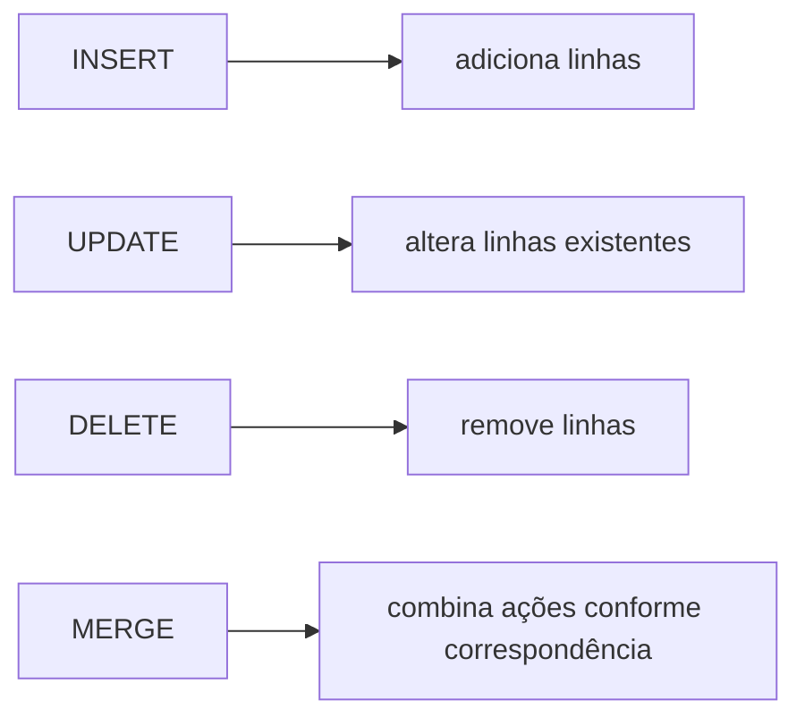

# 1.12 — Linguagem de manipulação de dados (DML)

[[1.0 Mapa de estudos — Arquitetura de dados|← Mapa]] · [[1.11 Linguagem de definição de dados DDL|← DDL]] · [[1.13 Sistema Gerenciador de Banco de Dados SGBD|SGBD →]] · [[Banco de questões — Arquitetura de dados|Questões]]

> [!important] Prioridade CESGRANRIO: **ALTA**
> A matriz registra cobrança aplicada de SQL. Para DML, a banca pode fornecer o estado inicial das tabelas e uma instrução para perguntar o estado final, a quantidade de linhas afetadas ou a restrição violada. Atenção máxima ao `WHERE` e às constraints.

## O que você DEVE MANTER e REVISAR — o “coração” da CESGRANRIO

A CESGRANRIO tende a concentrar suas questões de DML em cinco pilares:

1. **`INSERT` e correspondência de colunas (Seções 4 e 5):** valores seguem a ordem da lista de colunas. Coluna omitida recebe `DEFAULT` quando definido ou `NULL` quando permitido. **Pegadinha:** omitir a lista vincula os valores à ordem física declarada da tabela.

2. **`UPDATE` e alcance do `WHERE` (Seções 7 e 8):** todas as linhas que satisfazem o predicado são alteradas; sem `WHERE`, todas são alcançadas. As expressões usam os valores anteriores da linha segundo a semântica do comando.

3. **`DELETE` e integridade referencial (Seções 9 e 10):** `DELETE` remove linhas, aceita `WHERE` e pode ser bloqueado ou propagado pela FK. **Pegadinha:** `ON DELETE CASCADE` é definido na FK, não na instrução `DELETE` comum.

4. **Constraints durante a DML (Seção 12):** PK/`UNIQUE` impedem duplicidade; `NOT NULL`, ausência; `CHECK`, valores inválidos; FK, referências órfãs. A instrução não corrige automaticamente dados incompatíveis.

5. **`MERGE` (Seção 11):** combina origem e destino e executa ações conforme correspondência, normalmente atualização quando encontra e inserção quando não encontra. Sintaxe e detalhes variam por SGBD.

> [!note] Limite deste módulo
> `SELECT`, `JOIN` e agregação foram aprofundados em 1.10. Confirmação, rollback, isolamento e concorrência serão estudados em 1.14 e 1.16; planos e desempenho, em 1.17.

## Objetivos de aprendizagem

Ao final deste módulo, você deverá conseguir:

1. definir DML e reconhecer seus comandos;
2. inserir uma ou várias linhas corretamente;
3. usar valores literais, `NULL`, `DEFAULT` e resultados de consultas;
4. atualizar apenas as linhas pretendidas;
5. excluir linhas considerando integridade referencial;
6. interpretar a finalidade do `MERGE`;
7. prever violações de constraints;
8. evitar as principais pegadinhas da CESGRANRIO.

## 1. O que é DML

**DML — Data Manipulation Language** é o subconjunto da SQL usado para inserir, alterar e excluir dados armazenados.

Comandos principais:

```text
INSERT
UPDATE
DELETE
MERGE
```

Em algumas classificações, `SELECT` também integra a DML; na classificação didática que separa DQL, `SELECT` pertence à linguagem de consulta.



> [!warning] Pegadinha CESGRANRIO
> `UPDATE` altera dados; `ALTER` altera a estrutura. `DELETE` remove linhas; `DROP` remove o objeto.

## 2. DML é orientada a conjuntos

Uma instrução atua sobre todas as linhas que satisfazem sua condição:

```sql
UPDATE empregado
SET salario = salario * 1.05
WHERE cod_departamento = 10;
```

O comando não significa “alterar um empregado”. Ele altera **todos** os empregados do departamento 10.

Sem filtro:

```sql
UPDATE empregado
SET salario = salario * 1.05;
```

Todos os empregados são alcançados.

```sql
DELETE FROM empregado;
```

Todas as linhas são removidas, mas a tabela permanece.

> [!warning] Pegadinha CESGRANRIO
> Ausência de `WHERE` em `UPDATE` ou `DELETE` não é erro sintático. É um comando válido e normalmente afeta todas as linhas.

## 3. Estado usado nos exemplos

```text
DEPARTAMENTO
cod_departamento | nome       | ativo
10               | Operações  | S
20               | TI         | S
30               | Jurídico   | N

EMPREGADO
matricula | nome  | salario | cod_departamento | ativo
1         | Ana   | 10000   | 10               | S
2         | Beto  | 8000    | 10               | S
3         | Caio  | 9000    | 20               | S
4         | Diana | NULL    | NULL             | N
```

Restrições relevantes:

```text
DEPARTAMENTO.cod_departamento = PK
EMPREGADO.matricula           = PK
EMPREGADO.nome                = NOT NULL
EMPREGADO.salario             = CHECK (salario > 0), NULL permitido
EMPREGADO.cod_departamento    = FK anulável para DEPARTAMENTO
EMPREGADO.ativo               = DEFAULT 'S', CHECK ('S' ou 'N'), NOT NULL
```

## 4. `INSERT ... VALUES`

### 4.1 Inserção com lista de colunas

```sql
INSERT INTO empregado
    (matricula, nome, salario, cod_departamento, ativo)
VALUES
    (5, 'Eva', 7500, 20, 'S');
```

A correspondência é posicional dentro das listas:

```text
matricula        ← 5
nome             ← 'Eva'
salario          ← 7500
cod_departamento ← 20
ativo            ← 'S'
```

### 4.2 Inserção sem lista de colunas

```sql
INSERT INTO empregado
VALUES (5, 'Eva', 7500, 20, 'S');
```

Exige valores na ordem e quantidade esperadas pela definição da tabela. É menos robusta diante de alterações no esquema.

### 4.3 Inserção de várias linhas

Forma amplamente utilizada:

```sql
INSERT INTO empregado
    (matricula, nome, salario, cod_departamento, ativo)
VALUES
    (5, 'Eva', 7500, 20, 'S'),
    (6, 'Fábio', 7200, 10, 'S');
```

O suporte e detalhes podem variar em versões ou produtos mais antigos.

> [!warning] Pegadinhas CESGRANRIO
>
> - valores correspondem às colunas pela posição, não pelo nome do valor;
> - texto usa aspas simples: `'Eva'`;
> - lista explícita de colunas reduz dependência da ordem declarada da tabela;
> - todas as linhas precisam obedecer às constraints.

## 5. Colunas omitidas, `DEFAULT` e `NULL`

Considere `ativo CHAR(1) DEFAULT 'S' NOT NULL`.

### 5.1 Coluna omitida

```sql
INSERT INTO empregado
    (matricula, nome, salario, cod_departamento)
VALUES
    (5, 'Eva', 7500, 20);
```

`ativo` recebe o padrão `'S'`.

### 5.2 Palavra-chave `DEFAULT`

```sql
INSERT INTO empregado
    (matricula, nome, salario, cod_departamento, ativo)
VALUES
    (5, 'Eva', 7500, 20, DEFAULT);
```

### 5.3 `NULL` explícito

```sql
INSERT INTO empregado
    (matricula, nome, salario, cod_departamento, ativo)
VALUES
    (5, 'Eva', 7500, 20, NULL);
```

A inserção viola `NOT NULL`. O SGBD não troca necessariamente o `NULL` explícito pelo padrão.

### 5.4 Coluna omitida sem padrão

O valor torna-se `NULL` quando a coluna admite nulo. Se ela for `NOT NULL` e não houver geração/padrão aplicável, a inserção falha.

> [!warning] Pegadinha CESGRANRIO
> `DEFAULT` não significa “substituir todo `NULL`”. O padrão normalmente é aplicado quando a coluna é omitida ou quando a palavra `DEFAULT` é usada.

## 6. `INSERT ... SELECT`

Insere o resultado de uma consulta:

```sql
INSERT INTO empregado_inativo
    (matricula, nome, cod_departamento)
SELECT matricula, nome, cod_departamento
FROM empregado
WHERE ativo = 'N';
```

É necessário compatibilizar:

- quantidade de colunas;
- ordem;
- tipos/domínios;
- constraints do destino.

A consulta pode retornar zero, uma ou várias linhas.

> [!warning] Pegadinha CESGRANRIO
> A ordem das colunas no `SELECT` corresponde à ordem da lista do `INSERT`, independentemente de seus nomes ou da ordem na tabela de origem.

## 7. `UPDATE`

Forma geral:

```sql
UPDATE tabela
SET coluna_1 = expressão_1,
    coluna_2 = expressão_2
WHERE predicado;
```

### 7.1 Atualização com expressão

```sql
UPDATE empregado
SET salario = salario * 1.10
WHERE cod_departamento = 10;
```

Ana passa de 10000 para 11000; Beto, de 8000 para 8800.

### 7.2 Várias colunas

```sql
UPDATE empregado
SET cod_departamento = 20,
    ativo = 'S'
WHERE matricula = 4;
```

### 7.3 Atribuição de `NULL`

```sql
UPDATE empregado
SET cod_departamento = NULL
WHERE matricula = 1;
```

É válida somente se a coluna admitir nulo.

### 7.4 Atualização para o mesmo valor

Uma linha que satisfaz o `WHERE` pode ser considerada alcançada mesmo quando o novo valor é igual ao antigo. Contagens exatas reportadas e efeitos acessórios podem variar por SGBD.

## 8. Cuidados com `UPDATE`

### 8.1 Ausência de `WHERE`

```sql
UPDATE empregado
SET ativo = 'N';
```

Alcança todas as linhas.

### 8.2 `NULL` em expressões

```sql
UPDATE empregado
SET salario = salario * 1.10;
```

Se `salario` for `NULL`, o resultado permanece `NULL`.

Para substituir nulo por zero antes do cálculo:

```sql
UPDATE empregado
SET salario = COALESCE(salario, 0) * 1.10;
```

Isso só deve ser feito se zero possuir o significado correto no negócio.

### 8.3 Atualização baseada em subconsulta

```sql
UPDATE empregado
SET ativo = 'N'
WHERE cod_departamento IN (
    SELECT cod_departamento
    FROM departamento
    WHERE ativo = 'N'
);
```

### 8.4 Violação de unicidade

```sql
UPDATE empregado
SET matricula = 1
WHERE matricula = 2;
```

Falha porque a matrícula 1 já existe.

### 8.5 Violação referencial

```sql
UPDATE empregado
SET cod_departamento = 99
WHERE matricula = 1;
```

Falha se o departamento 99 não existir.

> [!warning] Pegadinhas CESGRANRIO
>
> - `UPDATE` sem `WHERE` é válido e amplo;
> - aritmética com `NULL` normalmente resulta em `NULL`;
> - o novo estado precisa satisfazer todas as constraints;
> - usar subconsulta não transforma o comando em `SELECT`: a instrução externa continua sendo DML de atualização.

## 9. `DELETE`

Forma geral:

```sql
DELETE FROM tabela
WHERE predicado;
```

### 9.1 Exclusão seletiva

```sql
DELETE FROM empregado
WHERE ativo = 'N';
```

Remove somente os empregados inativos.

### 9.2 Exclusão de todas as linhas

```sql
DELETE FROM empregado;
```

Remove todas as linhas e mantém a definição da tabela.

### 9.3 Exclusão baseada em subconsulta

```sql
DELETE FROM empregado
WHERE cod_departamento IN (
    SELECT cod_departamento
    FROM departamento
    WHERE ativo = 'N'
);
```

### 9.4 `DELETE` com predicado desconhecido

```sql
DELETE FROM empregado
WHERE cod_departamento = NULL;
```

Não seleciona as linhas nulas, porque a comparação resulta em `UNKNOWN`. Use:

```sql
DELETE FROM empregado
WHERE cod_departamento IS NULL;
```

## 10. `DELETE` e integridade referencial

Considere `EMPREGADO.cod_departamento` referenciando `DEPARTAMENTO`.

```sql
DELETE FROM departamento
WHERE cod_departamento = 10;
```

O efeito depende da FK:

| Ação referencial | Resultado provável |
|---|---|
| `RESTRICT`/`NO ACTION` | exclusão bloqueada enquanto houver empregados |
| `ON DELETE CASCADE` | empregados correspondentes também são excluídos |
| `ON DELETE SET NULL` | FKs dos empregados tornam-se nulas |
| `ON DELETE SET DEFAULT` | FKs recebem o padrão válido |

A ação é declarada na constraint:

```sql
FOREIGN KEY (cod_departamento)
REFERENCES departamento(cod_departamento)
ON DELETE SET NULL
```

> [!warning] Pegadinha CESGRANRIO
> `CASCADE` não é escrito normalmente no `DELETE FROM ...`; ele já está definido na FK e é acionado pela exclusão da linha pai.

## 11. `MERGE`

`MERGE` compara uma fonte com um destino e executa ações conforme a existência ou não de correspondência.

Uso típico:

```text
se encontrou no destino → atualizar
se não encontrou        → inserir
```

Exemplo conceitual baseado em sintaxe comum:

```sql
MERGE INTO departamento AS d
USING departamento_carga AS c
   ON d.cod_departamento = c.cod_departamento
WHEN MATCHED THEN
    UPDATE SET nome = c.nome,
               ativo = c.ativo
WHEN NOT MATCHED THEN
    INSERT (cod_departamento, nome, ativo)
    VALUES (c.cod_departamento, c.nome, c.ativo);
```

Esse padrão é chamado informalmente de **upsert**: atualizar ou inserir.

### 11.1 Cuidados

- a condição `ON` define a correspondência;
- a fonte não deve produzir múltiplas correspondências ambíguas para a mesma linha alvo;
- constraints continuam válidas;
- sintaxe e ações disponíveis variam por SGBD;
- algumas implementações permitem exclusão ou condições adicionais.

> [!warning] Pegadinha CESGRANRIO
> `MERGE` não é simples sinônimo de `UPDATE`. Ele decide entre ações com base na correspondência entre origem e destino.

## 12. DML e constraints

Toda alteração precisa deixar o banco em estado compatível com as restrições verificadas.

### 12.1 `PRIMARY KEY`

```sql
INSERT INTO empregado (matricula, nome)
VALUES (1, 'Outro empregado');
```

Falha se matrícula 1 já existir.

### 12.2 `UNIQUE`

CPF ou e-mail duplicado pode impedir `INSERT` ou `UPDATE`.

### 12.3 `NOT NULL`

```sql
UPDATE empregado
SET nome = NULL
WHERE matricula = 1;
```

Falha se `nome` for obrigatório.

### 12.4 `CHECK`

```sql
UPDATE empregado
SET salario = -100
WHERE matricula = 1;
```

Falha sob `CHECK (salario > 0)`.

### 12.5 `FOREIGN KEY`

Inserir filho sem pai ou excluir pai referenciado pode falhar, conforme a ação referencial.

### 12.6 Atomicidade da instrução — antecipação mínima

Em condições normais, se uma instrução que altera várias linhas encontra violação e falha, seus efeitos não devem permanecer parcialmente aplicados. Esse ponto decorre da atomicidade e será aprofundado em 1.14 e 1.16.

> [!warning] Pegadinha CESGRANRIO
> Operar sobre várias linhas não significa aceitar algumas e rejeitar outras arbitrariamente dentro da mesma instrução comum. A instrução deve respeitar a atomicidade, ressalvados mecanismos específicos explicitamente mencionados.

## 13. DML e `NULL`

### 13.1 Comparação

```sql
WHERE salario IS NULL
WHERE salario IS NOT NULL
```

### 13.2 Aritmética

```text
NULL + 100  → NULL
NULL * 1.10 → NULL
```

### 13.3 Concatenação e funções

O tratamento pode variar por operador e SGBD; não presuma que nulo equivale a cadeia vazia.

### 13.4 `IN` e `NOT IN`

`NOT IN` combinado com `NULL` pode gerar `UNKNOWN` e resultado inesperado. Para ausência de correspondência, `NOT EXISTS` costuma expressar melhor a intenção.

### 13.5 Atualização condicional com `CASE`

```sql
UPDATE empregado
SET faixa = CASE
    WHEN salario IS NULL THEN 'NÃO INFORMADA'
    WHEN salario >= 10000 THEN 'A'
    ELSE 'B'
END;
```

`CASE` escolhe o primeiro ramo verdadeiro; a ausência de `ELSE` produz `NULL` quando nenhum ramo é satisfeito.

## 14. Subconsultas em DML

### 14.1 Filtrar com `EXISTS`

```sql
UPDATE departamento AS d
SET ativo = 'N'
WHERE NOT EXISTS (
    SELECT 1
    FROM empregado AS e
    WHERE e.cod_departamento = d.cod_departamento
);
```

### 14.2 Inserir de uma consulta

```sql
INSERT INTO empregado_historico
    (matricula, nome, data_copia)
SELECT matricula, nome, CURRENT_DATE
FROM empregado
WHERE ativo = 'N';
```

### 14.3 Subconsulta escalar

Exemplo conceitual:

```sql
UPDATE empregado
SET salario = (
    SELECT AVG(e2.salario)
    FROM empregado AS e2
)
WHERE salario IS NULL;
```

A subconsulta usada como valor escalar deve produzir no máximo uma linha e uma coluna. Se retornar zero linhas, o resultado escalar costuma ser `NULL`; se retornar mais de uma, ocorre erro.

## 15. `DELETE` × `TRUNCATE` × `DROP`

| Comando | Categoria usual | Efeito | `WHERE` | Tabela permanece |
|---|---|---|:---:|:---:|
| `DELETE` | DML | remove linhas selecionadas ou todas | sim | sim |
| `TRUNCATE` | DDL | remove todas as linhas | não | sim |
| `DROP` | DDL | remove objeto, definição e dados | não | não |

O núcleo seguro:

```text
DELETE FROM empregado WHERE ativo = 'N';
→ exclusão seletiva

DELETE FROM empregado;
→ todas as linhas; tabela permanece

TRUNCATE TABLE empregado;
→ todas as linhas; tabela permanece

DROP TABLE empregado;
→ tabela deixa de existir
```

Rollback, reinício de identidade, gatilhos e confirmação implícita de `TRUNCATE` variam por SGBD.

## 16. Linhas afetadas e estado final

Em questões, use este procedimento:

1. determine as linhas cujo `WHERE` resulta em `TRUE`;
2. ignore as linhas cujo resultado seja `FALSE` ou `UNKNOWN`;
3. calcule os novos valores para `UPDATE`;
4. verifique constraints;
5. considere ações referenciais;
6. produza o estado final.

### 16.1 Exemplo

Estado:

```text
matricula | salario | ativo
1         | 1000    | S
2         | 2000    | S
3         | NULL    | S
4         | 3000    | N
```

Comando:

```sql
UPDATE empregado
SET salario = salario + 500
WHERE ativo = 'S'
  AND salario < 2000;
```

Avaliação:

| Matrícula | Predicado | Efeito |
|---:|---|---|
| 1 | `TRUE AND TRUE` | salário passa a 1500 |
| 2 | `TRUE AND FALSE` | sem alteração |
| 3 | `TRUE AND UNKNOWN` | sem alteração |
| 4 | `FALSE AND FALSE` | sem alteração |

Apenas uma linha é atualizada.

> [!warning] Pegadinha CESGRANRIO
> O `WHERE` não mantém `UNKNOWN`. Por isso, a linha com salário nulo não satisfaz `salario < 2000`.

## 17. Segurança operacional da DML — visão conceitual

Antes de uma alteração ampla:

- confirme o predicado com uma consulta equivalente;
- verifique a quantidade esperada de linhas;
- considere constraints e cascatas;
- use transação quando apropriado;
- avalie possibilidade de desfazer;
- evite depender de ordem não garantida.

```sql
-- conferir o conjunto-alvo
SELECT *
FROM empregado
WHERE ativo = 'N';

-- aplicar ao mesmo conjunto
DELETE FROM empregado
WHERE ativo = 'N';
```

Isso é prática de segurança, não garantia formal de que o estado permaneceu igual entre comandos concorrentes. Concorrência será estudada posteriormente.

## 18. Erros frequentes

### 18.1 Esquecer o `WHERE`

Altera ou exclui todas as linhas.

### 18.2 Usar `= NULL`

Use `IS NULL`.

### 18.3 Confundir coluna omitida e `NULL`

Coluna omitida pode receber `DEFAULT`; `NULL` explícito continua nulo quando permitido.

### 18.4 Inverter a ordem no `INSERT`

A correspondência segue a lista de colunas.

### 18.5 Ignorar constraints

A linha pode satisfazer o `WHERE` e ainda assim a mudança ser rejeitada.

### 18.6 Confundir `DELETE` e `DROP`

O primeiro remove linhas; o segundo remove o objeto.

### 18.7 Confundir `MERGE` e `UPDATE`

`MERGE` escolhe ações conforme correspondência entre origem e destino.

## 19. O que não aprofundar neste tópico

| Assunto apenas mencionado | Tópico posterior |
|---|---|
| arquitetura, catálogo e recursos do gerenciador | 1.13 SGBD |
| atomicidade, consistência, isolamento e durabilidade | 1.14 ACID |
| `COMMIT`, `ROLLBACK`, concorrência e bloqueios | 1.16 Transações |
| planos, índices e operações em massa | 1.17 Performance |
| comandos de bancos não relacionais | 1.18 e 1.23 |

## 20. Priorização para a CESGRANRIO

### 20.1 Alta frequência / alto retorno

- `INSERT` com lista de colunas;
- `DEFAULT`, coluna omitida e `NULL`;
- `INSERT ... SELECT`;
- `UPDATE` com e sem `WHERE`;
- `DELETE` com e sem `WHERE`;
- constraints durante DML;
- FK e ações referenciais;
- comparação com `NULL`;
- previsão de linhas afetadas;
- `DELETE` versus `TRUNCATE` versus `DROP`.

### 20.2 Chance média / diferenciação

- inserção de múltiplas linhas;
- subconsultas em DML;
- `EXISTS`/`NOT EXISTS`;
- `CASE` em atualização;
- `COALESCE`;
- `MERGE`/upsert;
- subconsulta escalar;
- lógica de três valores no `WHERE`.

### 20.3 Baixo retorno neste momento

- sintaxes proprietárias de `UPDATE ... JOIN`;
- cláusulas de retorno de linhas alteradas;
- _bulk load_ e carregadores específicos;
- dicas de bloqueio;
- tratamento procedural de erros;
- otimização de operações em massa.

## 21. Checklist de pegadinhas

- [ ] DML manipula dados, não a definição da tabela.
- [ ] `UPDATE` e `DELETE` sem `WHERE` alcançam todas as linhas.
- [ ] `INSERT` associa valores às colunas pela posição.
- [ ] Coluna omitida e `NULL` explícito não são equivalentes.
- [ ] `DEFAULT` não substitui automaticamente todo nulo.
- [ ] `NULL` em aritmética normalmente gera `NULL`.
- [ ] O `WHERE` mantém apenas `TRUE`, não `UNKNOWN`.
- [ ] DML precisa respeitar PK, FK, `UNIQUE`, `CHECK` e `NOT NULL`.
- [ ] Ação `ON DELETE` fica definida na FK.
- [ ] `MERGE` pode atualizar ou inserir conforme correspondência.
- [ ] `DELETE` mantém a tabela.
- [ ] `TRUNCATE` não aceita `WHERE`.
- [ ] `DROP` remove o objeto.
- [ ] Sintaxe de `MERGE` e detalhes transacionais variam por SGBD.

## 22. Questões inéditas — estilo CESGRANRIO

### 22.1 Questão 1

Considere a coluna `ATIVO CHAR(1) DEFAULT 'S' NOT NULL` da tabela `EMPREGADO`. Analise os comandos, desconsiderando outras restrições:

```sql
-- I
INSERT INTO EMPREGADO (MATRICULA, NOME)
VALUES (10, 'Ana');

-- II
INSERT INTO EMPREGADO (MATRICULA, NOME, ATIVO)
VALUES (20, 'Beto', NULL);
```

É correto afirmar que

A) ambos inserem `'S'` em `ATIVO`.  
B) I usa o valor padrão, enquanto II viola `NOT NULL`.  
C) I viola `NOT NULL`, pois a coluna não foi listada.  
D) II usa o padrão porque `NULL` e `DEFAULT` são sinônimos.  
E) ambos falham porque valores padrão só atuam em `UPDATE`.

> [!success]- Gabarito comentado
> **Resposta: B.** Em I, a coluna omitida recebe o `DEFAULT 'S'`. Em II, foi fornecido `NULL` explicitamente, o que não é automaticamente convertido no padrão e viola `NOT NULL`. A pegadinha é tratar omissão, `DEFAULT` e `NULL` como equivalentes.

### 22.2 Questão 2

Considere o estado:

```text
matricula | salario | ativo
1         | 1000    | S
2         | 2000    | S
3         | NULL    | S
4         | 1000    | N
```

e o comando:

```sql
UPDATE empregado
SET salario = salario + 200
WHERE ativo = 'S'
  AND salario < 2000;
```

Após a execução bem-sucedida, o número de linhas atualizadas e o novo salário da matrícula 3 são, respectivamente,

A) 1 e `NULL`.  
B) 2 e 200.  
C) 2 e `NULL`.  
D) 3 e 200.  
E) 4 e `NULL`.

> [!success]- Gabarito comentado
> **Resposta: A.** Apenas a matrícula 1 satisfaz as duas condições. A matrícula 2 não possui salário menor que 2000; para a matrícula 3, `NULL < 2000` resulta em `UNKNOWN`, que não passa pelo `WHERE`; a matrícula 4 está inativa. Além disso, aritmética comum com `NULL` manteria o resultado nulo.

## 23. Resumo de véspera

```text
DML = INSERT + UPDATE + DELETE + MERGE
INSERT = adiciona linhas
UPDATE = altera todas as linhas cujo WHERE seja TRUE
DELETE = remove todas as linhas cujo WHERE seja TRUE
MERGE = escolhe ações conforme correspondência origem/destino
SEM WHERE = todas as linhas são alcançadas
COLUNA OMITIDA = DEFAULT ou NULL, conforme definição
NULL EXPLÍCITO ≠ DEFAULT
INSERT ... SELECT = quantidade, ordem e tipos compatíveis
WHERE mantém TRUE; rejeita FALSE e UNKNOWN
NULL em aritmética normalmente permanece NULL
DML respeita PK, FK, UNIQUE, CHECK e NOT NULL
DELETE = linhas; TRUNCATE = esvazia; DROP = remove objeto
```
