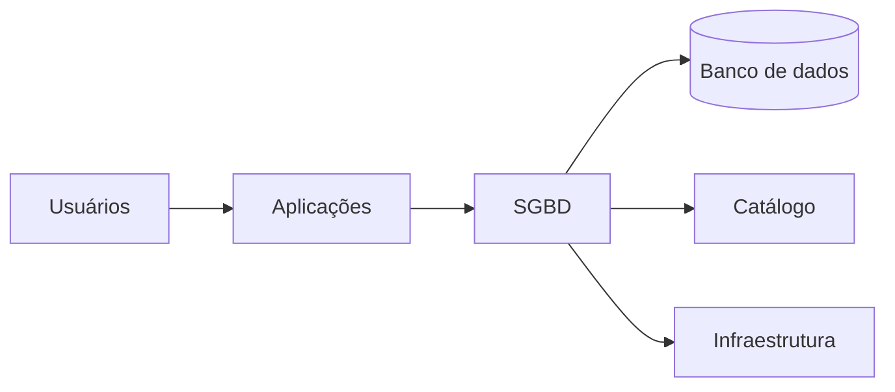
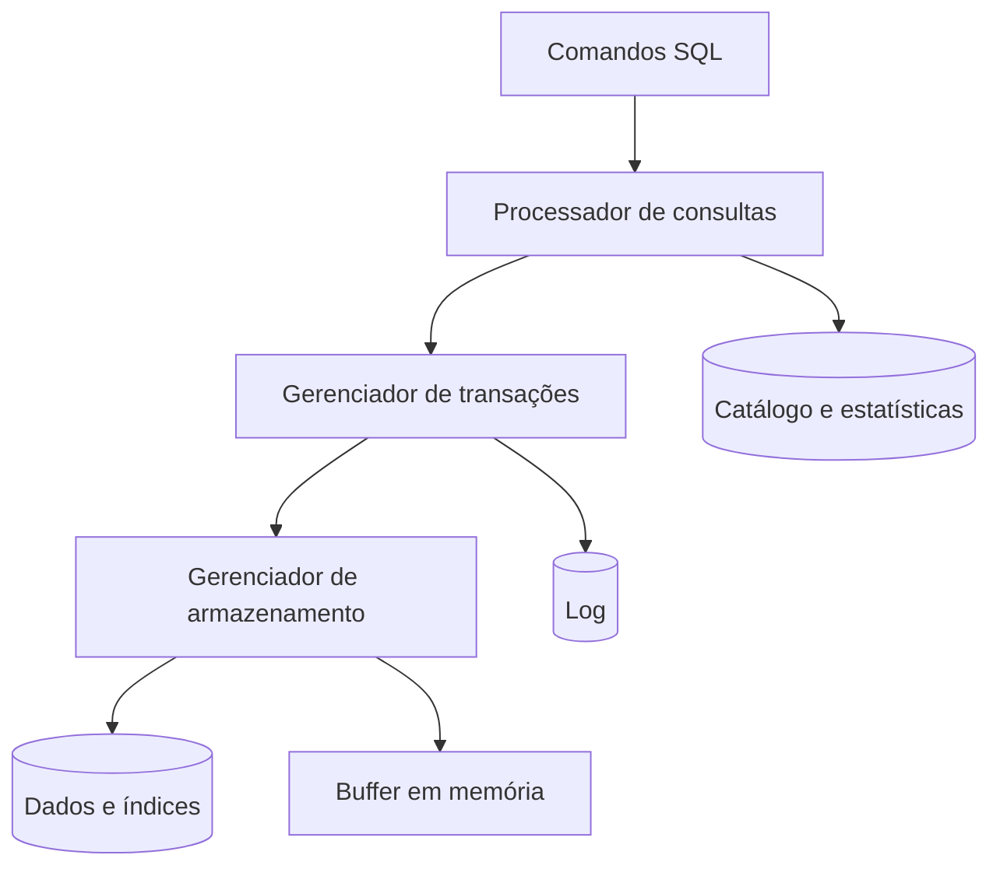

# 1.13 — Sistema Gerenciador de Banco de Dados (SGBD)

[[1.0 Mapa de estudos — Arquitetura de dados|← Mapa]] · [[1.12 Linguagem de manipulação de dados DML|← DML]] · [[1.14 Propriedades ACID|ACID →]] · [[Banco de questões — Arquitetura de dados|Questões]]

> [!important] Prioridade CESGRANRIO: **ALTA**
> A matriz aponta conceitos transversais e componentes internos. A cobrança mais provável associa um componente — catálogo, otimizador, gerenciador de armazenamento, transações, concorrência ou recuperação — à sua responsabilidade.

## O que você DEVE MANTER e REVISAR — o “coração” da CESGRANRIO

1. **Banco × SGBD × sistema de banco de dados (Seção 1):** banco é o conjunto organizado de dados; SGBD é o software que os gerencia; sistema de banco de dados inclui dados, SGBD, aplicações, usuários e infraestrutura.

2. **Funções do SGBD (Seção 2):** definição, consulta, manipulação, integridade, segurança, concorrência, recuperação e metadados. **Pegadinha:** SGBD não é apenas repositório de arquivos.

3. **Processamento de consultas (Seção 4):** _parser_ verifica e interpreta; otimizador escolhe plano; executor realiza operações. O otimizador não altera o resultado lógico correto.

4. **Armazenamento e memória (Seção 5):** gerenciador de arquivos/páginas organiza dados persistentes; gerenciador de _buffer_ movimenta páginas entre armazenamento e memória.

5. **Transações, concorrência e recuperação (Seção 6):** componentes coordenam operações simultâneas e falhas para preservar ACID. **Pegadinha:** backup ajuda em recuperação, mas não é sinônimo de durabilidade ou de log transacional.

> [!note] Limite deste módulo
> Independência de dados, ACID, transações e performance serão aprofundados em 1.14–1.17. Aqui importa reconhecer a arquitetura e as responsabilidades gerais.

## Objetivos de aprendizagem

1. diferenciar banco de dados, SGBD e sistema de banco de dados;
2. reconhecer as funções essenciais do SGBD;
3. associar componentes internos às respectivas responsabilidades;
4. explicar catálogo, processamento de consultas e armazenamento;
5. reconhecer controle de concorrência e recuperação em nível introdutório;
6. distinguir vantagens, custos e papéis de usuários;
7. evitar pegadinhas da CESGRANRIO.

## 1. Conceitos fundamentais

### 1.1 Banco de dados

Coleção organizada de dados relacionados, persistentes e destinados a determinado domínio.

### 1.2 SGBD

Software que permite definir, armazenar, consultar, alterar, proteger e recuperar bancos de dados.

Exemplos conhecidos incluem PostgreSQL, Oracle Database, SQL Server e MySQL. O conceito não se restringe a SGBDs relacionais.

### 1.3 Sistema de banco de dados



É o ambiente completo: banco, SGBD, aplicações, pessoas, procedimentos e infraestrutura.

> [!warning] Pegadinha CESGRANRIO
> Banco de dados é o conteúdo organizado; SGBD é o software. Oracle/PostgreSQL não são “o banco” em sentido conceitual, embora a linguagem cotidiana misture os termos.

## 2. Funções de um SGBD

| Função | Finalidade |
|---|---|
| definição | criar schemas, tabelas, tipos e restrições |
| manipulação | inserir, alterar e excluir dados |
| consulta | recuperar e combinar dados |
| integridade | aplicar PK, FK, `UNIQUE`, `CHECK` e outras regras |
| segurança | autenticar, autorizar e auditar |
| transações | agrupar operações em unidades lógicas |
| concorrência | coordenar acessos simultâneos |
| recuperação | restaurar estado consistente após falhas |
| metadados | manter catálogo/dicionário do sistema |
| abstração | ocultar detalhes físicos dos usuários |

Um sistema de arquivos, isoladamente, não fornece necessariamente esse conjunto coordenado de serviços.

## 3. Visão simplificada da arquitetura



![[Pasted image 20260905172956.png]]
Os nomes e divisões exatos variam, mas as responsabilidades conceituais permanecem.

## 4. Processador de consultas

1. Consulta em uma linguagem de alto nível, como SQL, em que o humano entende
2. Essa consulta para por um compilador e tradutor, que vai olher o contexto léxico, sintático e semântico da consulta, se tudo estiver bem ele transforma em Expressão algébrica relacional ou alguma outra linguagem que permita avançar para os Proximos passos
3. Depois ele executa o otimizador, que vai utilizar consultar metadados, diante das informações do metadados, vai criar um plano de execução com a melhor estratégia de busca de informações daquele momento 
4. Avaliador: É quem vai buscar de fato os dados a partir do plan o de execução  e entregar

> [!warning] Pegadinha CESGRANRIO
> O usuário escreve uma consulta declarativa; o otimizador escolhe **como** executá-la. Ele busca plano de menor custo estimado, não prova antecipadamente qual terá menor tempo real em toda situação.

## 5. Gerenciamento de armazenamento

### 5.1 Arquivos, páginas e registros

O gerenciador de armazenamento organiza a representação persistente em estruturas físicas. Uma página/bloco é unidade comum de transferência entre disco e memória.

### 5.2 Gerenciador de _buffer_

Mantém páginas em memória para reduzir acessos ao armazenamento:

```text
solicitação de página
→ está no buffer? usa em memória
→ não está? carrega do armazenamento
```

Uma página alterada em memória é chamada frequentemente de página “suja” até ser persistida.

### 5.3 Gerenciador de índices

Administra estruturas auxiliares de acesso. Índices aceleram certas leituras, mas ocupam espaço e precisam ser mantidos em escritas. O aprofundamento fica para 1.17.

> [!warning] Pegadinha CESGRANRIO
> _Buffer_ não é armazenamento permanente. Ele mantém cópias temporárias de páginas; durabilidade exige mecanismos de persistência e recuperação.

## 6. Transações, concorrência e recuperação

### 6.1 Gerenciador de transações

Coordena unidades lógicas de trabalho e sua confirmação ou cancelamento.

### 6.2 Controle de concorrência

Evita que execuções simultâneas produzam resultados incompatíveis com o nível de isolamento adotado. Pode empregar bloqueios, versões ou outros mecanismos.

### 6.3 Gerenciador de recuperação

Usa informações persistentes, como log, para desfazer efeitos não confirmados e refazer efeitos confirmados quando necessário.

### 6.4 Log de transações

Registra informações que apoiam atomicidade e durabilidade. Em técnicas como _write-ahead logging_, registros necessários do log são persistidos antes das páginas de dados correspondentes.

### 6.5 _Checkpoint_

Marca pontos que reduzem o trabalho necessário durante recuperação. Não substitui o log nem significa necessariamente copiar todo o banco.

> [!warning] Pegadinhas CESGRANRIO
>
> - concorrência não significa executar tudo sem coordenação;
> - recuperação não se limita a restaurar backup;
> - _checkpoint_ não é sinônimo de `COMMIT`;
> - log não é o próprio arquivo principal de dados.

## 7. Catálogo e metadados

O catálogo armazena descrições dos objetos:

- tabelas e colunas;
- tipos e domínios;
- constraints;
- visões e índices;
- usuários e privilégios;
- estatísticas do otimizador.

É consultado pelo SGBD, administradores e ferramentas. Metadados foram aprofundados em [[1.6 - Metadados]].

> [!warning] Pegadinha CESGRANRIO
> Estatísticas do catálogo descrevem distribuição e volume estimado; não são os dados de negócio e podem ficar desatualizadas.

## 8. Segurança e integridade

### 8.1 Autenticação

Verifica quem é o usuário ou sistema.

### 8.2 Autorização

Define quais operações a identidade pode realizar.

### 8.3 Auditoria

Registra eventos relevantes para rastreabilidade.

### 8.4 Integridade

O SGBD aplica restrições de domínio, chave, entidade e referência.

```text
autenticação = quem é?
autorização  = o que pode fazer?
auditoria    = o que fez?
```

## 9. Papéis comuns

| Papel                  | Responsabilidade típica                                          |
| ---------------------- | ---------------------------------------------------------------- |
| DBA                    | disponibilidade, segurança, configuração, recuperação e operação |
| projetista/modelador   | modelos, chaves, relacionamentos e restrições                    |
| desenvolvedor          | aplicações, consultas e acesso aos dados                         |
| analista de dados      | consulta e interpretação analítica                               |
| administrador de dados | políticas, definições e governança corporativa                   |
| usuário final          | utiliza aplicações ou consultas autorizadas                      |

As fronteiras variam entre organizações.

## 10. Vantagens e custos

### Vantagens

- compartilhamento controlado;
- redução de redundância inadequada;
- integridade centralizada;
- concorrência coordenada;
- segurança e auditoria;
- recuperação de falhas;
- abstração e independência;
- consultas declarativas.

### Custos

- complexidade operacional;
- consumo de recursos;
- administração especializada;
- licenciamento em alguns produtos;
- centralização de riscos se mal arquitetado.

> [!warning] Pegadinha CESGRANRIO
> SGBD reduz e controla redundância, mas não elimina toda redundância. Índices, réplicas e modelos dimensionais podem mantê-la deliberadamente.

## 11. Tipos de SGBD — reconhecimento

| Modelo | Organização predominante |
|---|---|
| relacional | relações, chaves e SQL |
| documentos | documentos semiestruturados |
| grafos | vértices, arestas e propriedades |
| chave-valor | pares chave–valor |
| colunar/família de colunas | organização por colunas ou famílias |

As diferenças serão aprofundadas em 1.18 e 1.23.

## 12. Priorização para a CESGRANRIO

### 12.1 Alta frequência / alto retorno

- banco × SGBD × sistema de banco;
- funções do SGBD;
- catálogo e metadados;
- processador e otimizador de consultas;
- armazenamento e _buffer_;
- transações, concorrência e recuperação;
- integridade e segurança.

### 12.2 Chance média

- log e _checkpoint_;
- estatísticas;
- papéis de usuários;
- vantagens sobre arquivos;
- tipos de SGBD;
- componentes do executor.

### 12.3 Baixo retorno agora

- algoritmos internos específicos;
- parâmetros proprietários;
- formatos físicos de páginas;
- configuração de produtos;
- detalhes de índices e isolamento.

## 13. Checklist de pegadinhas

- [ ] Banco é dado; SGBD é software; sistema é o conjunto.
- [ ] SQL declarativa informa o resultado, não o plano físico.
- [ ] _Parser_, otimizador e executor têm papéis diferentes.
- [ ] Otimizador usa custos estimados e estatísticas.
- [ ] _Buffer_ é memória temporária, não persistência.
- [ ] Catálogo guarda metadados.
- [ ] Log apoia recuperação; não é backup.
- [ ] _Checkpoint_ não é `COMMIT`.
- [ ] Autenticação, autorização e auditoria são diferentes.
- [ ] SGBD controla, mas não elimina toda redundância.

## 14. Questões inéditas — estilo CESGRANRIO

### 14.1 Questão 1

O componente de um SGBD responsável por comparar estratégias equivalentes e selecionar, com base em custos estimados e estatísticas, uma forma de executar uma consulta é o

A) catálogo de dados.  
B) otimizador de consultas.  
C) gerenciador de autorização.  
D) gerenciador de backup.  
E) dicionário de domínio.

> [!success]- Gabarito comentado
> **Resposta: B.** O otimizador escolhe o plano físico com base em estimativas. O catálogo fornece metadados e estatísticas usados nessa decisão, mas não é o componente que executa a escolha. A pegadinha é confundir a fonte das informações com quem as utiliza.

### 14.2 Questão 2

Em relação aos componentes de um SGBD, é correto afirmar que

A) o gerenciador de _buffer_ garante armazenamento permanente apenas mantendo páginas na RAM.  
B) o catálogo contém exclusivamente as linhas de negócio das tabelas.  
C) o _checkpoint_ confirma todas as transações existentes.  
D) o gerenciador de recuperação usa informações como o log para tratar falhas.  
E) o otimizador define o significado lógico solicitado pelo usuário.

> [!success]- Gabarito comentado
> **Resposta: D.** O log registra informações necessárias para desfazer ou refazer efeitos. RAM não garante persistência; catálogo contém metadados; _checkpoint_ e `COMMIT` não são sinônimos; o otimizador deve preservar a semântica lógica da consulta.

## 15. Resumo de véspera

```text
BANCO = dados organizados
SGBD = software gerenciador
SISTEMA = banco + SGBD + aplicações + pessoas + infraestrutura
PARSER = interpreta e verifica
OTIMIZADOR = escolhe plano físico
EXECUTOR = realiza o plano
BUFFER = páginas temporariamente em memória
CATÁLOGO = metadados e estatísticas
TRANSAÇÕES = unidades lógicas de trabalho
CONCORRÊNCIA = coordena execuções simultâneas
RECUPERAÇÃO = trata falhas com log e outros mecanismos
```
