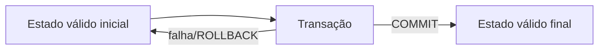
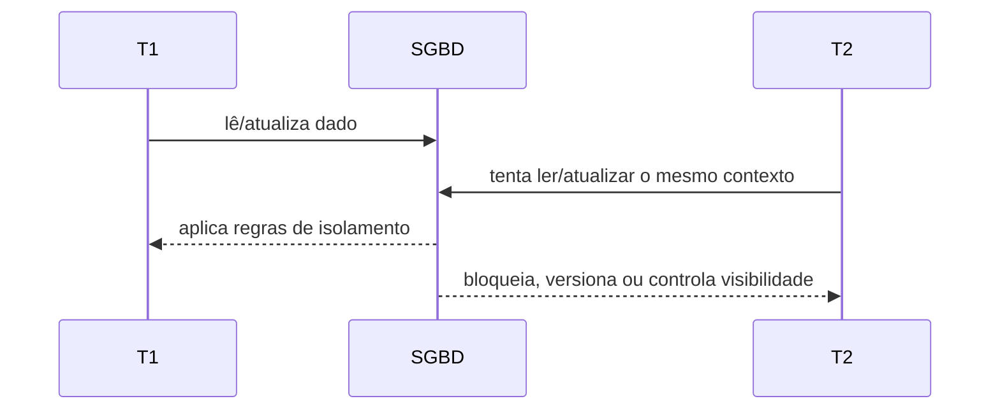

# 1.14 — Atomicidade, consistência, isolamento e durabilidade (ACID)

[[1.0 Mapa de estudos — Arquitetura de dados|← Mapa]] · [[1.13 Sistema Gerenciador de Banco de Dados SGBD|← SGBD]] · [[1.15 Independência de dados|Independência de dados →]] · [[Banco de questões — Arquitetura de dados|Questões]]

> [!important] Prioridade CESGRANRIO: **ALTA**
> A matriz registra questão direta em 2023. A forma mais comum de cobrança é trocar as definições: “tudo ou nada” é atomicidade; estado válido é consistência; aparência de execução separada é isolamento; sobrevivência após confirmação é durabilidade.

## O que você DEVE MANTER e REVISAR — o “coração” da CESGRANRIO

1. **Atomicidade (Seção 3):** todas as operações da transação produzem efeito ou nenhuma produz. **Pegadinha:** não significa execução instantânea ou indivisível no tempo.

2. **Consistência (Seção 4):** a transação correta leva o banco de um estado válido a outro, respeitando invariantes e constraints. Não significa que todas as réplicas estejam imediatamente iguais.

3. **Isolamento (Seção 5):** transações concorrentes não devem observar interferências proibidas pelo nível adotado; o efeito deve ser compatível com a garantia oferecida. Não significa necessariamente bloquear tudo.

4. **Durabilidade (Seção 6):** após `COMMIT`, os efeitos sobrevivem a falhas previstas pelo sistema. **Pegadinha:** durabilidade não significa retenção eterna nem dispensa backup.

5. **Mecanismos associados (Seção 8):** rollback/log apoiam atomicidade; constraints e lógica correta, consistência; bloqueios/MVCC, isolamento; log persistente e recuperação, durabilidade.

> [!note] Limite deste módulo
> Aqui o foco são as quatro garantias. Estados da transação, `COMMIT`, `ROLLBACK`, anomalias, níveis de isolamento e concorrência serão aprofundados em 1.16.

## Objetivos de aprendizagem

1. definir transação em nível necessário ao ACID;
2. distinguir corretamente as quatro propriedades;
3. aplicar cada propriedade a cenários;
4. relacionar propriedades a mecanismos do SGBD sem confundi-los;
5. reconhecer limites das garantias;
6. evitar pegadinhas da CESGRANRIO.

## 1. Transação: unidade lógica

Uma **transação** é uma sequência de operações tratada como unidade lógica de trabalho.

Exemplo de transferência de R$ 100:

```sql
BEGIN;

UPDATE conta
SET saldo = saldo - 100
WHERE numero = 1;

UPDATE conta
SET saldo = saldo + 100
WHERE numero = 2;

COMMIT;
```

Regra desejada:

```text
debitar conta 1 E creditar conta 2
ou
não efetivar nenhuma das duas operações
```



## 2. Visão geral do ACID

| Letra | Propriedade | Pergunta principal |
|---|---|---|
| A | Atomicidade | a unidade foi aplicada inteira? |
| C | Consistência | as regras permanecem satisfeitas? |
| I | Isolamento | a concorrência expôs interferência indevida? |
| D | Durabilidade | o confirmado sobrevive à falha? |

Mnemônico:

```text
A = All or nothing
C = Constraints e invariantes
I = Interferência controlada
D = Dados confirmados duram
```

## 3. Atomicidade
A **Atomicidade** determina que a transação é uma unidade indivisível de trabalho. Todas as operações contidas na transação devem ser executadas com sucesso por completo ou, caso ocorra qualquer erro, o banco de dados deve ser revertido inteiramente ao estado anterior à execução.
* **Mecanismo de Controle:** Garantido pelo **Gerenciador de Transações** e pelo **Log de Transações** (como o *Write-Ahead Logging* - WAL).
* **Operações Principais:**
* `COMMIT`: Confirma todas as modificações da transação de forma definitiva.
* `ROLLBACK`: Cancela a transação e utiliza os dados do log de desfazer (*Undo Log*) para reverter o banco ao estado original.
* **Exemplo Prático:** Uma transferência bancária de R$ 100 de *A* para *B* envolve duas operações: `UPDATE A SET saldo = saldo - 100` e `UPDATE B SET saldo = saldo + 100`. Se o sistema falhar após o débito em *A*, a atomicidade garante que o débito seja desfeito via `ROLLBACK`, impedindo o descarte ou a "perda" do dinheiro.

## 4. Consistência (Preservação das Regras)
A **Consistência** assegura que a execução de uma transação leva o banco de dados de um **estado válido para outro estado válido**. A transação não pode violar nenhuma regra de integridade, restrição de esquema ou invariante do sistema.
* **Mecanismo de Controle:** Garantido pelas **restrições de integridade do SGBD** (*Constraints* como `PRIMARY KEY`, `FOREIGN KEY`, `UNIQUE`, `CHECK`, `NOT NULL`) e reforçado pela validação lógica da aplicação.
* **Comportamento diante de violação:** Se uma instrução tentar violar uma regra, como `CHECK (salario > 0)`, ela será rejeitada. O desfazimento de toda a transação, apenas da instrução ou até um ponto de salvamento depende do SGBD, da configuração e do tratamento do erro; não se deve afirmar genericamente que toda violação provoca `ROLLBACK` integral automático.
## 5. Isolamento (Execução Concorrente Independente)
O **Isolamento** garante que a execução simultânea de múltiplas transações concorrentes produza um resultado equivalente ao qu'e seria obtido se elas fossem executadas de maneira sequencial (uma após a outra). Uma transação em andamento não deve sofrer interferência direta de dados incompletos ou intermediários gerados por outras transações.
* **Anomalias de Concorrência (Problemas Evitados pelo Isolamento):**
1. **Leitura Suja (*Dirty Read*):** Ocorre quando a Transação A lê dados alterados pela Transação B que ainda não foram confirmados (`COMMIT`). Se B der `ROLLBACK`, A terá lido um dado inválido.
2. **Leitura Não-Repetível (*Non-Repeatable Read*):** A Transação A lê a mesma linha duas vezes, mas a Transação B altera/deleta a linha e faz `COMMIT` entre as duas leituras de A, gerando resultados diferentes.
3. **Leitura Fantasma (*Phantom Read*):** A Transação A executa uma consulta com filtro (ex: `WHERE valor > 100`) duas vezes. Entre as leituras, a Transação B insere novas linhas que atendem ao filtro e faz `COMMIT`, fazendo surgir linhas "fantasmas" na segunda leitura de A.
* **Níveis de Isolamento Padrão (ANSI SQL):**
Ajustam o equilíbrio (*trade-off*) entre a **consistência rigorosa** e o **desempenho/concorrência**:

| Nível de Isolamento  | Permite Leitura Suja? | Permite Leitura Não-Repetível? | Permite Leitura Fantasma? | Mecanismo Principal                            |
| -------------------- | --------------------- | ------------------------------ | ------------------------- | ---------------------------------------------- |
| **READ UNCOMMITTED** | **Sim**               | **Sim**                        | **Sim**                   | Nenhum bloqueio de leitura.                    |
| **READ COMMITTED**   | Não                   | **Sim**                        | **Sim**                   | Bloqueios de leitura efêmeros / MVCC.          |
| **REPEATABLE READ**  | Não                   | Não                            | **Sim**                   | Bloqueios de linha até o fim da transação.     |
| **SERIALIZABLE**     | Não                   | Não                            | Não                       | Bloqueios de intervalo (*Range Locks*) ou SSI. |
* **Mecanismos de Implementação:** Bloqueios de concorrência (*Locks* pessimistas em nível de linha/tabela) ou Controle de Concorrência Multiversão (*MVCC* - otimista), que gera *snapshots* de leitura para transações paralelas sem travar escritas.


## 6. Durabilidade (Persistência Definitiva)
A **Durabilidade** garante que, uma vez confirmada (`COMMIT`), a transação sobreviva às falhas contempladas pelo modelo de recuperação do sistema. WAL, armazenamento estável, replicação e cópias de segurança reduzem riscos distintos; a propriedade não autoriza prometer sobrevivência a qualquer desastre físico imaginável.
* **Mecanismo de Controle:** Garantido pelo **Gerenciador de Recuperação (*Recovery Manager*)** do SGBD e pela escrita sequencial em armazenamento não-volátil (disco rígido/SSD).
* **Implementação Técnica:**
* **Write-Ahead Logging (WAL) / Redo Log:** Antes de gravar as alterações na tabela real em disco, o SGBD escreve a alteração no arquivo de log sequencial em disco.
* **Redo Operation:** Durante o processo de inicialização após uma queda repentina do servidor, o SGBD lê o arquivo de log e refaz (*Redo*) todas as transações confirmadas que não deu tempo de atualizar nos arquivos de dados principais.
## 7. Um cenário, quatro propriedades

Transferência de R$ 100 entre contas:

| Propriedade  | Garantia no cenário                                   |
| ------------ | ----------------------------------------------------- |
| atomicidade  | débito e crédito permanecem juntos ou são desfeitos   |
| consistência | regras e total monetário aplicável permanecem válidos |
| isolamento   | outras transações não observam interferência proibida |
| durabilidade | após confirmação, a transferência sobrevive a falha   |

```text
A: aplicou tudo?
C: continuou válido?
I: concorrência interferiu?
D: sobreviveu após confirmar?
```

## 8. Propriedades e mecanismos: associação cuidadosa

| Mecanismo | Propriedade mais diretamente apoiada | Observação |
|---|---|---|
| _undo_/rollback | atomicidade | desfaz efeitos incompletos |
| constraints | consistência | cobrem regras declaradas |
| bloqueios/MVCC | isolamento | controlam visibilidade e conflitos |
| log persistente/_redo_ | durabilidade | recupera efeitos confirmados |
| log transacional | atomicidade e durabilidade | pode apoiar desfazer e refazer |

> [!warning] Pegadinha CESGRANRIO
> A relação não é exclusiva: um mecanismo pode apoiar mais de uma propriedade. O log, por exemplo, pode conter informações de _undo_ e _redo_.

## 9. Falhas e propriedade predominante

### 9.1 Falha durante a transação

O SGBD desfaz efeitos incompletos: **atomicidade**.

### 9.2 Violação de `CHECK` ou FK

A operação é rejeitada para preservar estado válido: **consistência**.

### 9.3 Leitura de valor não confirmado

Problema de visibilidade concorrente: **isolamento**.

### 9.4 Falha após confirmação

O sistema recupera o efeito confirmado: **durabilidade**.

## 10. ACID não elimina erros de negócio

Considere uma transferência confirmada para a conta errada:

- pode ser atômica;
- pode respeitar todas as constraints;
- pode ser isolada;
- pode ser durável;
- e ainda assim estar semanticamente errada.

ACID protege propriedades do processamento transacional, não garante que o usuário escolheu a conta correta ou que todos os requisitos foram bem modelados.

## 11. ACID e desempenho — visão curta

Garantias possuem custos:

- persistir log exige E/S;
- isolamento pode causar espera ou abortos;
- validação de constraints consome recursos;
- recuperação exige metadados e registros adicionais.

Isso não significa que ACID “torna o banco lento” de forma absoluta. SGBDs usam buffers, grupos de confirmação, MVCC e outras técnicas. O aprofundamento fica para 1.17.

## 12. Priorização para a CESGRANRIO

### 12.1 Alta frequência / alto retorno

- associação correta de cada letra;
- “tudo ou nada”;
- estado válido e constraints;
- concorrência e visibilidade;
- sobrevivência após `COMMIT`;
- transferência bancária como exemplo;
- diferença entre atomicidade e durabilidade.

### 12.2 Chance média

- leitura suja, não repetível e fantasma;
- serialização conceitual;
- rollback, _undo_, _redo_ e log;
- consistência ACID versus distribuída;
- durabilidade versus backup;
- responsabilidade compartilhada pela consistência.

### 12.3 Baixo retorno agora

- algoritmos de bloqueio;
- matrizes detalhadas de níveis de isolamento;
- protocolos distribuídos;
- configuração de log;
- detalhes de _checkpoint_.

## 13. Checklist de pegadinhas

- [ ] Atomicidade = tudo ou nada.
- [ ] Consistência = invariantes e estado válido.
- [ ] Isolamento = interferência/visibilidade concorrente.
- [ ] Durabilidade = efeitos confirmados sobrevivem.
- [ ] Atomicidade não significa ausência de concorrência.
- [ ] Consistência não significa réplicas imediatamente iguais.
- [ ] Isolamento não exige bloqueio global.
- [ ] Durabilidade não substitui backup.
- [ ] Log pode apoiar atomicidade e durabilidade.
- [ ] ACID não corrige erro semântico do usuário.

## 14. Questões inéditas — estilo CESGRANRIO

### 14.1 Questão 1

Durante uma transferência, o débito foi executado, mas uma falha ocorreu antes do crédito. O SGBD desfez o débito para que nenhum efeito parcial permanecesse. A propriedade diretamente exemplificada é

A) consistência.  
B) isolamento.  
C) durabilidade.  
D) atomicidade.  
E) disponibilidade.

> [!success]- Gabarito comentado
> **Resposta: D.** Atomicidade trata a transação como “tudo ou nada”. Consistência relaciona-se ao estado válido; isolamento, à concorrência; durabilidade, à permanência após confirmação.

### 14.2 Questão 2

Após o SGBD informar sucesso no `COMMIT`, ocorreu reinicialização do servidor. Durante a recuperação, os efeitos confirmados foram refeitos a partir do log. Esse comportamento evidencia principalmente

A) durabilidade.  
B) isolamento.  
C) normalização.  
D) independência lógica.  
E) atomicidade de atributo.

> [!success]- Gabarito comentado
> **Resposta: A.** Durabilidade garante que efeitos confirmados sobrevivam às falhas cobertas pelo sistema. O _redo_ do log é um mecanismo associado. A menção a `COMMIT` seguido de falha é o sinal clássico dessa propriedade.

## 15. Resumo de véspera

```text
A — ATOMICIDADE: tudo ou nada; undo/rollback
C — CONSISTÊNCIA: estado válido; invariantes/constraints
I — ISOLAMENTO: concorrência sem interferência proibida
D — DURABILIDADE: confirmado sobrevive; log/redo

falhou no meio e desfez       → A
regra permaneceu satisfeita   → C
transação concorrente isolada → I
falhou após COMMIT e recuperou → D
```
