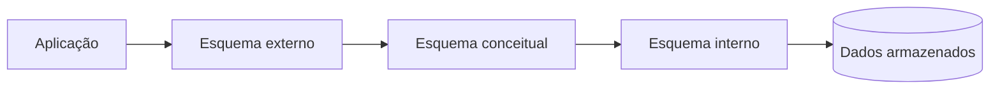
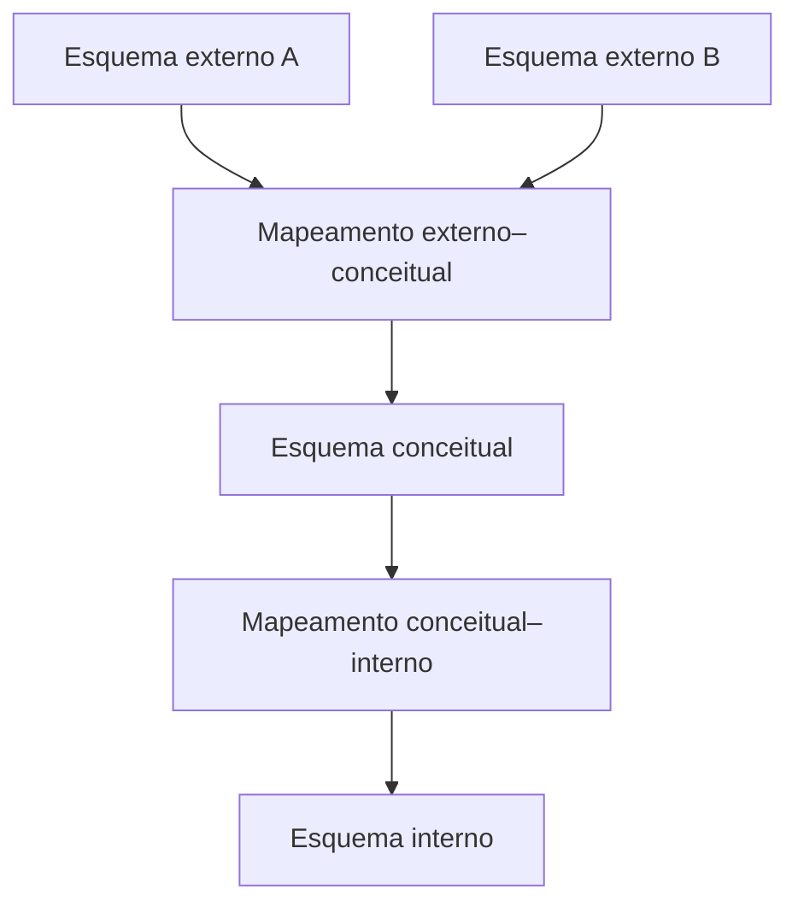

# 1.15 — Independência de dados

[[1.0 Mapa de estudos — Arquitetura de dados|← Mapa]] · [[1.14 Propriedades ACID|← ACID]] · [[1.16 Transações de bancos de dados|Transações →]] · [[Banco de questões — Arquitetura de dados|Questões]]

> [!important] Prioridade CESGRANRIO: **MÉDIA**
> É um tema clássico da teoria de bancos de dados, mas sem questão isolada recente no corpus analisado. A cobrança mais provável pede diferenciar **independência física e lógica** a partir de exemplos de mudanças.

## O que você DEVE MANTER e REVISAR — o “coração” da CESGRANRIO

Se este subtema aparecer, a questão tende a concentrar-se em cinco pilares:

1. **Arquitetura de três esquemas (Seção 3):** externo representa visões dos usuários; conceitual representa a estrutura lógica global; interno representa armazenamento. **Pegadinha:** podem existir várias visões externas, mas há um esquema conceitual global.

2. **Independência física (Seção 5):** alterações internas não exigem mudança no esquema conceitual nem nas aplicações. Criar índice, particionar, comprimir ou reorganizar arquivos são exemplos clássicos.

3. **Independência lógica (Seção 6):** mudanças no esquema conceitual não exigem alterações nas visões externas ou aplicações não afetadas. Adicionar atributo ou decompor tabela mantendo uma visão compatível são exemplos.

4. **Física × lógica (Seção 7):** física protege contra mudanças de armazenamento; lógica protege contra mudanças na estrutura lógica. A independência lógica é geralmente mais difícil de alcançar.

5. **Mapeamentos (Seção 4):** externo–conceitual protege visões diante de mudanças lógicas; conceitual–interno protege o modelo lógico diante de mudanças físicas.

> [!note] Limite deste módulo
> Índices e particionamento aparecem apenas como exemplos; serão aprofundados em 1.17. Transações, concorrência e recuperação pertencem ao tópico 1.16.

## Objetivos de aprendizagem

1. definir independência de dados;
2. explicar a arquitetura de três esquemas;
3. distinguir níveis externo, conceitual e interno;
4. diferenciar independência física e lógica;
5. classificar exemplos de alterações;
6. explicar o papel dos mapeamentos e visões;
7. evitar as principais pegadinhas da CESGRANRIO.

## 1. Conceito

**Independência de dados** é a capacidade de alterar o esquema em determinado nível da arquitetura sem exigir alterações no nível imediatamente superior e, idealmente, nas aplicações que dependem dele.

```text
mudar a forma de armazenamento
sem mudar a estrutura lógica percebida

ou

mudar a estrutura lógica global
sem mudar as visões e aplicações não afetadas
```

Ela reduz o acoplamento entre:

- dados e programas;
- armazenamento e estrutura lógica;
- estrutura global e visões dos usuários.

> [!warning] Pegadinha CESGRANRIO
> Independência não significa que os níveis sejam desconectados. Eles permanecem ligados por **mapeamentos**, que absorvem ou traduzem as mudanças.

## 2. Dependência programa–dados

Em sistemas baseados apenas em arquivos, detalhes como formato, posição e organização dos registros podem estar embutidos no código.

```text
programa conhece:
- arquivo exato
- posição de cada campo
- formato do registro
- método de acesso
```

Se o arquivo muda, vários programas precisam ser modificados. Isso caracteriza forte **dependência programa–dados**.

Um SGBD introduz catálogos, modelos, linguagens e camadas de abstração para reduzir esse acoplamento.



## 3. Arquitetura ANSI/SPARC de três esquemas

### 3.1 Nível externo

Representa as visões particulares de usuários, grupos ou aplicações.

Exemplo:

```text
VISÃO_RH(matricula, nome, cargo, salario)
VISÃO_PROJETOS(matricula, nome, projeto, horas)
```

Características:

- pode haver vários esquemas externos;
- cada um apresenta apenas dados relevantes;
- pode ocultar colunas ou reorganizar a apresentação;
- ajuda segurança, simplicidade e estabilidade das interfaces.

### 3.2 Nível conceitual

Representa a estrutura lógica global do banco para a comunidade de usuários.

Contém, por exemplo:

- entidades/relações;
- atributos;
- relacionamentos;
- chaves;
- restrições;
- domínios.

Não descreve onde cada página está armazenada.

### 3.3 Nível interno

Representa como os dados são fisicamente armazenados e acessados.

Exemplos:

- arquivos e páginas;
- índices;
- organização de registros;
- particionamento;
- compressão;
- métodos de acesso;
- localização física.

### 3.4 Quadro comparativo

| Nível | Perspectiva | Elementos típicos |
|---|---|---|
| externo | usuários e aplicações | visões e formatos particulares |
| conceitual | estrutura lógica global | relações, atributos, chaves e restrições |
| interno | armazenamento | arquivos, páginas, índices e partições |

> [!warning] Pegadinha CESGRANRIO
> O “esquema conceitual” da arquitetura ANSI/SPARC é a descrição lógica global do banco. Essa terminologia não corresponde perfeitamente à divisão didática entre modelo conceitual ER, modelo lógico relacional e modelo físico; observe o contexto da questão.

## 4. Mapeamentos entre os níveis



### 4.1 Mapeamento externo–conceitual

Relaciona cada visão externa ao esquema conceitual global. Pode permitir que a visão permaneça estável mesmo quando a estrutura lógica muda.

### 4.2 Mapeamento conceitual–interno

Relaciona a estrutura lógica ao armazenamento. Pode ser atualizado após reorganização física sem alterar o esquema conceitual.

### 4.3 Transformação de consultas

Quando uma aplicação consulta uma visão externa, o SGBD traduz a solicitação pelos mapeamentos até as estruturas internas e transforma os resultados de volta.

> [!warning] Pegadinha CESGRANRIO
> O mapeamento conceitual–interno está diretamente associado à independência **física**; o externo–conceitual, à independência **lógica**.

## 5. Independência física de dados

### 5.1 Definição

É a capacidade de alterar o esquema interno sem alterar o esquema conceitual ou as aplicações externas.


### 5.2 Exemplos

- criar ou remover índice;
- alterar organização de arquivos;
- particionar uma tabela;
- mover dados para outro dispositivo;
- alterar compressão;
- modificar tamanho de páginas/blocos;
- trocar método de acesso;
- reorganizar registros físicos.

Exemplo:

```text
Antes: EMPREGADO armazenado sem índice por CPF
Depois: índice criado sobre CPF

Consulta da aplicação: permanece a mesma
Modelo lógico: permanece o mesmo
Plano/acesso físico: pode mudar
```

### 5.3 Por que costuma ser mais fácil

O SGBD já oculta naturalmente muitos detalhes de armazenamento. Aplicações consultam tabelas e colunas, não posições físicas de páginas.

> [!warning] Pegadinha CESGRANRIO
> Criar índice não adiciona atributo nem muda a semântica da entidade. É alteração interna/física.

## 6. Independência lógica de dados

### 6.1 Definição

É a capacidade de alterar o esquema conceitual sem exigir mudanças nos esquemas externos ou nas aplicações que não precisam perceber a alteração.


### 6.2 Exemplos

- adicionar atributo que aplicações antigas não utilizam;
- adicionar nova relação;
- dividir uma relação e manter uma visão compatível;
- combinar relações preservando interface externa;
- alterar relacionamento sem afetar determinada visão;
- introduzir nova entidade ou restrição compatível.

### 6.3 Exemplo com decomposição

Antes:

```text
EMPREGADO(matricula, nome, cod_departamento, nome_departamento)
```

Depois:

```text
EMPREGADO(matricula, nome, cod_departamento)
DEPARTAMENTO(cod_departamento, nome_departamento)
```

Uma visão pode preservar a interface antiga:

```sql
CREATE VIEW vw_empregado_antiga AS
SELECT e.matricula,
       e.nome,
       e.cod_departamento,
       d.nome_departamento
FROM empregado AS e
JOIN departamento AS d
  ON d.cod_departamento = e.cod_departamento;
```

A aplicação que apenas consulta a visão pode continuar funcionando.

### 6.4 Por que costuma ser mais difícil

Aplicações dependem diretamente de tabelas, colunas, tipos, restrições e significados. Remover ou alterar um atributo consumido pode não ser ocultável sem perda de semântica.

> [!warning] Pegadinha CESGRANRIO
> Independência lógica não promete que qualquer mudança seja invisível. Se a informação exigida pela aplicação deixa de existir, nenhum mapeamento consegue recuperá-la corretamente.

## 7. Física × lógica

| Aspecto                      | Independência física | Independência lógica      |
| ---------------------------- | -------------------- | ------------------------- |
| nível alterado               | interno              | conceitual                |
| nível preservado diretamente | conceitual           | externo                   |
| exemplo clássico             | criar índice         | adicionar atributo/tabela |
| outro exemplo                | particionar          | decompor mantendo visão   |
| dificuldade típica           | menor                | maior                     |
| mapeamento                   | conceitual–interno   | externo–conceitual        |

### Regra de bolso

```text
índice, arquivo, página, partição, compressão → FÍSICA
tabela, coluna, relacionamento, estrutura lógica → LÓGICA
```

## 8. Abstração × independência

### Abstração de dados

Oculta detalhes desnecessários por meio de níveis e interfaces.

### Independência de dados

Permite alterar um nível sem exigir alterações no nível superior.

```text
abstração = esconder detalhes
independência = absorver mudanças
```

Os conceitos estão relacionados, mas não são sinônimos.

## 9. Esquema × instância

- **esquema:** definição relativamente estável da estrutura;
- **instância/estado:** conteúdo armazenado em determinado instante.

Inserir uma linha muda o estado, não o esquema. Criar uma coluna muda o esquema conceitual/lógico. Criar um índice muda o esquema interno/físico.

> [!warning] Pegadinha CESGRANRIO
> Alterar valores por `UPDATE` não é exemplo de independência lógica. É mudança de estado, não mudança da estrutura lógica.

## 10. Visões externas

Visões ajudam a:

- ocultar complexidade;
- apresentar subconjuntos;
- renomear elementos;
- preservar interfaces após certas mudanças;
- restringir exposição;
- oferecer perspectivas diferentes.

Mas não garantem independência total. Mudanças incompatíveis podem impedir a atualização ou até a consulta correta da visão.

## 11. Catálogo e independência

O catálogo guarda metadados dos níveis e objetos. Como as definições não precisam ficar embutidas em cada programa, o SGBD pode consultar o catálogo e aplicar os mapeamentos.

```text
catálogo = descreve estruturas
mapeamento = relaciona níveis
independência = permite absorver mudanças
```

## 12. Exemplos classificados

| Alteração                                     | Classificação principal                                 |
| --------------------------------------------- | ------------------------------------------------------- |
| inserir empregado                             | mudança de estado, não de independência                 |
| aumentar salário                              | mudança de estado                                       |
| criar índice sobre CPF                        | independência física                                    |
| particionar tabela por data                   | independência física                                    |
| mover arquivos para SSD                       | independência física                                    |
| adicionar coluna `email`                      | independência lógica, se aplicações antigas não mudarem |
| dividir tabela e manter visão compatível      | independência lógica                                    |
| remover coluna usada pela aplicação           | independência lógica não preservada                     |
| renomear coluna sem camada de compatibilidade | pode quebrar independência lógica                       |

## 13. Benefícios e limites

### Benefícios

- menor acoplamento;
- manutenção mais simples;
- evolução gradual;
- portabilidade das aplicações;
- reorganização física transparente;
- múltiplas visões para públicos diferentes;
- maior longevidade dos sistemas.

### Limites

- independência é uma propriedade em graus, não magia;
- mudanças semânticas profundas alcançam aplicações;
- extensões proprietárias aumentam acoplamento;
- consultas dependentes de detalhes físicos reduzem transparência;
- visões e mapeamentos também exigem manutenção.

## 14. Priorização para a CESGRANRIO

### 14.1 Chance média / alto retorno dentro do subtema

- arquitetura externo–conceitual–interno;
- independência física versus lógica;
- exemplos de cada tipo;
- mapeamentos entre níveis;
- independência lógica ser mais difícil;
- esquema versus instância.

### 14.2 Chance baixa / diferenciação

- dependência programa–dados;
- papel das visões;
- abstração versus independência;
- catálogo e mapeamentos;
- limites da independência.

### 14.3 Baixo retorno

- detalhes históricos do comitê ANSI/SPARC;
- algoritmos internos de tradução;
- implementação proprietária de mapeamentos;
- sintaxe específica para armazenamento.

## 15. Checklist de pegadinhas

- [ ] Externo = visões; conceitual = lógica global; interno = físico.
- [ ] Pode haver vários esquemas externos.
- [ ] Índice e partição são mudanças físicas.
- [ ] Relação, atributo e relacionamento são mudanças lógicas.
- [ ] Física preserva o conceitual.
- [ ] Lógica preserva visões externas/aplicações.
- [ ] Independência lógica costuma ser mais difícil.
- [ ] Mapeamentos conectam os níveis.
- [ ] Abstração e independência não são sinônimos.
- [ ] `INSERT`/`UPDATE` mudam estado, não esquema.
- [ ] Visões ajudam, mas não tornam qualquer mudança invisível.

## 16. Questões inéditas — estilo CESGRANRIO

### 16.1 Questão 1

Um administrador cria um índice sobre `EMPREGADO.cpf` e move as páginas da tabela para outro dispositivo, sem alterar as consultas nem o esquema lógico percebido pelas aplicações. Esse cenário exemplifica independência

A) lógica, porque uma coluna foi consultada.  
B) física, porque ocorreram mudanças no nível interno.  
C) externa, porque uma nova visão foi criada.  
D) transacional, porque índices garantem atomicidade.  
E) conceitual, porque o CPF passou a ser chave primária.

> [!success]- Gabarito comentado
> **Resposta: B.** Índice, páginas e dispositivo pertencem ao nível interno. O esquema conceitual e as aplicações permaneceram estáveis, caracterizando independência física. Criar índice não transforma a coluna em PK.

### 16.2 Questão 2

Uma relação foi decomposta em duas para reduzir redundância, mas uma visão passou a reconstruir a interface antiga utilizada pelas aplicações. Se essas aplicações continuaram inalteradas, ocorreu independência

A) física, pois toda decomposição altera arquivos.  
B) lógica, pois o esquema conceitual mudou e a visão externa foi preservada.  
C) de estado, pois apenas linhas foram modificadas.  
D) de durabilidade, pois a visão sobrevive ao `COMMIT`.  
E) de isolamento, pois duas tabelas passaram a existir.

> [!success]- Gabarito comentado
> **Resposta: B.** A decomposição altera a estrutura lógica, enquanto a visão mantém a interface externa. Esse é o exemplo clássico de independência lógica. A pegadinha é classificar qualquer alteração implementada fisicamente como independência física.

## 17. Resumo de véspera

```text
EXTERNO = visões de usuários/aplicações
CONCEITUAL = estrutura lógica global
INTERNO = armazenamento físico

FÍSICA:
interno muda → conceitual permanece
índice, arquivo, partição, compressão

LÓGICA:
conceitual muda → externo permanece
tabela, coluna, relacionamento, decomposição com visão

FÍSICA costuma ser mais fácil que LÓGICA
ABSTRAÇÃO esconde; INDEPENDÊNCIA absorve mudanças
INSERT/UPDATE mudam ESTADO, não ESQUEMA
```
