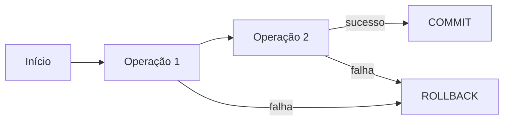
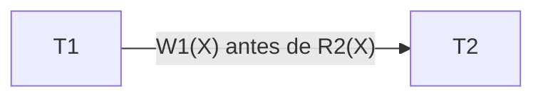
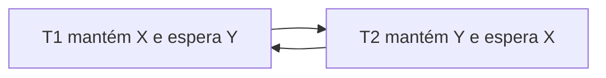
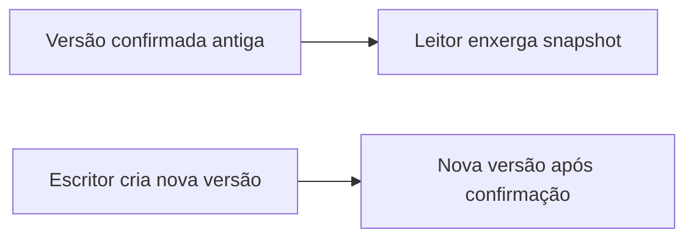
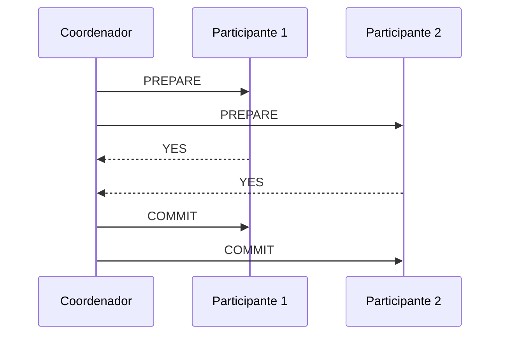

# 1.16 — Transações de bancos de dados

[[1.0 Mapa de estudos — Arquitetura de dados|← Mapa]] · [[1.15 Independência de dados|← Independência de dados]] · [[1.17 Melhoria de performance de banco de dados|Performance →]] · [[Banco de questões — Arquitetura de dados|Questões]]

> [!important] Prioridade CESGRANRIO: **ALTA**
> A matriz recomenda estudar transações junto com ACID, concorrência e recuperação. A banca pode apresentar duas transações intercaladas para perguntar qual anomalia ocorreu, qual nível de isolamento a evita ou se o escalonamento equivale a uma execução serial.

## O que você DEVE MANTER e REVISAR — o “coração” da CESGRANRIO

1. **Controle da transação (Seções 2 e 3):** `COMMIT` confirma; `ROLLBACK` desfaz a transação não confirmada; `SAVEPOINT` cria ponto intermediário. **Pegadinha:** voltar a um savepoint não é confirmar a transação.

2. **Serial × serializável (Seções 5 e 6):** serial não intercala transações; serializável pode intercalar, mas seu efeito equivale a alguma ordem serial. Todo serial é serializável, mas nem todo serializável é serial.

3. **Anomalias de concorrência (Seção 7):** leitura suja lê dado não confirmado; leitura não repetível muda a mesma linha; fantasma muda o conjunto de linhas; atualização perdida sobrescreve uma escrita.

4. **Níveis de isolamento (Seção 8):** `READ UNCOMMITTED`, `READ COMMITTED`, `REPEATABLE READ` e `SERIALIZABLE` oferecem proteção crescente em termos conceituais. Maior isolamento costuma reduzir concorrência ou aumentar conflitos.

5. **Bloqueios, MVCC e deadlock (Seções 9 a 11):** bloqueios e versões controlam visibilidade; deadlock é espera circular. **Pegadinha:** deadlock não é simples demora — o SGBD precisa detectar/prevenir e abortar alguma transação.

> [!note] Limite deste módulo
> As propriedades ACID foram aprofundadas em 1.14. Aqui elas serão aplicadas à execução concorrente e à recuperação. Índices, planos e tuning pertencem ao tópico 1.17.

## Objetivos de aprendizagem

1. definir transação e unidade lógica de trabalho;
2. interpretar `BEGIN`, `COMMIT`, `ROLLBACK` e `SAVEPOINT`;
3. reconhecer estados de uma transação;
4. distinguir escalonamento serial e serializável;
5. identificar anomalias de concorrência;
6. comparar níveis de isolamento;
7. explicar bloqueios, protocolo 2PL, MVCC e deadlocks;
8. relacionar log, _undo_, _redo_ e recuperação;
9. evitar as principais pegadinhas da CESGRANRIO.

## 1. Conceito

Uma **transação** é uma sequência de operações tratada como uma unidade lógica de trabalho.

Exemplo clássico: transferência de R$ 100 da conta A para a B.

```sql
BEGIN;

UPDATE conta
SET saldo = saldo - 100
WHERE numero = 'A';

UPDATE conta
SET saldo = saldo + 100
WHERE numero = 'B';

COMMIT;
```

O objetivo é que as duas alterações sejam confirmadas juntas ou que nenhuma permaneça.



Transações podem conter:

- leituras;
- inserções;
- atualizações;
- exclusões;
- verificações de regras;
- chamadas a procedimentos, conforme o sistema.

## 2. Comandos de controle

### 2.1 Início

Sintaxes como `BEGIN`, `BEGIN TRANSACTION` ou `START TRANSACTION` delimitam explicitamente o início, dependendo do SGBD.

### 2.2 `COMMIT`

Confirma a transação:

```sql
COMMIT;
```

Após a confirmação bem-sucedida, os efeitos tornam-se duráveis segundo as garantias do SGBD.

### 2.3 `ROLLBACK`

Cancela a transação ainda não confirmada:

```sql
ROLLBACK;
```

Restaura logicamente o estado anterior ao início da unidade, ressalvadas particularidades de comandos e produtos.

### 2.4 `SAVEPOINT`

Cria um ponto intermediário:

```sql
SAVEPOINT depois_do_debito;
```

Retorno parcial:

```sql
ROLLBACK TO SAVEPOINT depois_do_debito;
```

Isso desfaz operações posteriores ao ponto e mantém a transação aberta.

### 2.5 `RELEASE SAVEPOINT`

Remove o ponto de salvamento quando suportado:

```sql
RELEASE SAVEPOINT depois_do_debito;
```

> [!warning] Pegadinhas CESGRANRIO
>
> - `COMMIT` confirma; `ROLLBACK` desfaz o não confirmado;
> - `SAVEPOINT` não confirma parte da transação;
> - `ROLLBACK TO SAVEPOINT` não encerra necessariamente a transação;
> - depois de `COMMIT`, um `ROLLBACK` comum não desfaz a transação já confirmada.

## 3. Autocommit e delimitação implícita

Em modo **autocommit**, cada instrução bem-sucedida pode constituir e confirmar sua própria transação.

```text
UPDATE 1 → confirmação automática
UPDATE 2 → outra transação
```

Para tratar várias instruções como uma unidade, é necessário controlar explicitamente a transação ou configurar o ambiente corretamente.

O comportamento padrão e a forma de configurar variam entre ferramentas, drivers e SGBDs.

> [!warning] Pegadinha CESGRANRIO
> Executar dois `UPDATE`s consecutivos não garante que pertençam à mesma transação. Isso depende da delimitação e do autocommit.

## 4. Estados de uma transação

Uma representação clássica inclui:

```text
    ┌────────────┐
    │  Ativa     │
    └─────┬──────┘
          │
          ├─────────────────────────────┐
          ▼                             ▼
    ┌────────────┐               ┌────────────┐
    │ Parcial-   │               │   Falha    │
    │ mente      │               └─────┬──────┘
    │ Confirmada │                     │
    └─────┬──────┘                     │
          │                            │
          ▼                            ▼
    ┌────────────┐               ┌────────────┐
    │ Confirmada │               │ Cancelada  │
    │ (Committed)│               │ (Aborted)  │
    └────────────┘               └────────────┘
```

- **ativa:** executando operações;
- **parcialmente confirmada:** última instrução executada, mas confirmação ainda não está garantida;
- **falha:** não pode prosseguir normalmente;
- **abortada:** efeitos desfeitos;
- **confirmada:** `COMMIT` concluído com sucesso.

Os nomes podem variar na literatura, mas a distinção central é entre executar, falhar, desfazer e confirmar.

## 5. Escalonamentos

Um **escalonamento** (_schedule_) representa a ordem em que operações de uma ou mais transações são executadas, preservando a ordem interna de cada transação.

Considere:

```text
T1: R1(X), W1(X)
T2: R2(Y), W2(Y)
```

### 5.1 Escalonamento serial

Uma transação termina antes da outra começar:

```text
R1(X), W1(X), COMMIT1,
R2(Y), W2(Y), COMMIT2
```

Não há intercalação.

### 5.2 Escalonamento concorrente

Operações são intercaladas:

```text
R1(X), R2(Y), W1(X), W2(Y), COMMIT1, COMMIT2
```

Intercalação pode aumentar utilização de recursos e vazão, desde que a correção seja preservada.

### 5.3 Operações conflitantes

Duas operações de transações diferentes conflitam quando:

1. acessam o mesmo item; e
2. pelo menos uma é escrita.

| Par               | Conflita? |
| ----------------- | :-------: |
| `R1(X)` e `R2(X)` |    não    |
| `R1(X)` e `W2(X)` |    sim    |
| `W1(X)` e `R2(X)` |    sim    |
| `W1(X)` e `W2(X)` |    sim    |
| `W1(X)` e `W2(Y)` |    não    |

## 6. Serializabilidade

Um escalonamento é **serializável** quando seu efeito é equivalente ao de algum escalonamento serial das mesmas transações.

```text
serial       → sem intercalação
serializável → pode intercalar, mas equivale a uma ordem serial
```

### 6.1 Serializabilidade por conflito

Um escalonamento é serializável por conflito se puder ser transformado em serial trocando a ordem de operações não conflitantes.

### 6.2 Grafo de precedência

Procedimento:

1. crie um nó para cada transação;
2. para cada par conflitante, crie aresta da que opera primeiro para a que opera depois;
3. se o grafo é acíclico, o escalonamento é serializável por conflito;
4. uma ordenação topológica fornece ordem serial equivalente.



Se houver também `T2 → T1`, forma-se ciclo e o escalonamento não é serializável por conflito.

> [!warning] Pegadinha CESGRANRIO
> Todo escalonamento serial é serializável. O inverso é falso: um escalonamento pode ser intercalado e ainda ser serializável.

## 7. Anomalias de concorrência

### 7.1 Leitura suja (_dirty read_)

T2 lê alteração de T1 ainda não confirmada; depois T1 desfaz.

```text
T1: W(X=200)
T2: R(X=200)
T1: ROLLBACK
```

T2 utilizou valor que nunca se tornou confirmado.

### 7.2 Leitura não repetível

T1 lê a mesma linha duas vezes e obtém valores diferentes porque T2 alterou e confirmou entre as leituras.

```text
T1: R(X=100)
T2: W(X=200), COMMIT
T1: R(X=200)
```

### 7.3 Leitura fantasma

T1 repete uma consulta por predicado e encontra conjunto diferente porque T2 inseriu ou removeu linhas que satisfazem o predicado.

```text
T1: SELECT ... WHERE salario > 10000 → 5 linhas
T2: INSERT nova linha com salario 12000, COMMIT
T1: repete consulta → 6 linhas
```

### 7.4 Atualização perdida

Duas transações leem o mesmo valor e escrevem resultados; uma escrita sobrescreve a outra.

```text
saldo inicial = 100
T1 lê 100 e calcula 110
T2 lê 100 e calcula 120
T1 grava 110
T2 grava 120
```

O efeito de T1 foi perdido.

### 7.5 Leitura inconsistente (_incorrect summary_)

Uma agregação percorre dados enquanto outra transação transfere valores entre registros, podendo observar parte antes e parte depois da mudança.

> [!warning] Pegadinhas CESGRANRIO
>
> - suja = dado **não confirmado**;
> - não repetível = mesma **linha** muda;
> - fantasma = conjunto do **predicado** muda;
> - perdida = uma **escrita** sobrescreve outra.

## 8. Níveis de isolamento

Modelo conceitual clássico do padrão SQL:

| Nível              | Leitura suja | Leitura não repetível |            Fantasma             |
| ------------------ | :----------: | :-------------------: | :-----------------------------: |
| `READ UNCOMMITTED` | pode ocorrer |     pode ocorrer      |          pode ocorrer           |
| `READ COMMITTED`   |   impedida   |     pode ocorrer      |          pode ocorrer           |
| `REPEATABLE READ`  |   impedida   |       impedida        | pode ocorrer no modelo clássico |
| `SERIALIZABLE`     |   impedida   |       impedida        |            impedida             |

### 8.1 `READ UNCOMMITTED`

Oferece proteção mínima e pode admitir leitura suja.

### 8.2 `READ COMMITTED`

Cada leitura vê apenas dados confirmados, mas duas leituras na mesma transação podem ver versões confirmadas diferentes.

### 8.3 `REPEATABLE READ`

Protege releituras das linhas observadas; o tratamento exato de fantasmas depende da implementação.

### 8.4 `SERIALIZABLE`

Busca efeito equivalente a execução serial, oferecendo a garantia mais forte desse conjunto clássico.

### 8.5 Variações reais

SGBDs implementam níveis com bloqueios, MVCC e semânticas próprias. Níveis como _snapshot isolation_ não se encaixam perfeitamente na tabela clássica.

> [!warning] Pegadinha CESGRANRIO
> A tabela representa o modelo conceitual clássico. Em pergunta sobre produto específico, vale a documentação do SGBD. Maior isolamento não significa necessariamente bloquear todas as leituras.

## 9. Bloqueios

### 9.1 Bloqueio compartilhado — `S`

Usado para leitura. Vários bloqueios compartilhados podem coexistir no mesmo item.

### 9.2 Bloqueio exclusivo — `X`

Usado para escrita. É incompatível com outros bloqueios compartilhados ou exclusivos conflitantes no mesmo item.

| Solicitado/existente | `S` | `X` |
|---|:---:|:---:|
| `S` | compatível | incompatível |
| `X` | incompatível | incompatível |

### 9.3 Granularidade

Bloqueios podem atuar em:

- linha;
- página;
- tabela;
- partição;
- outros recursos.

Granularidade fina favorece concorrência, mas aumenta quantidade e custo de gerenciamento. Granularidade grossa reduz esse custo, mas aumenta contenção.

## 10. Protocolo de bloqueio em duas fases — 2PL

O **Two-Phase Locking** divide a transação em:

1. fase de crescimento: adquire bloqueios e não libera;
2. fase de encolhimento: libera bloqueios e não adquire novos.


O 2PL básico assegura serializabilidade por conflito, mas pode permitir deadlocks.

### 10.1 2PL estrito

Mantém pelo menos os bloqueios exclusivos até `COMMIT` ou `ROLLBACK`, evitando que outras transações leiam/escrevam valores não confirmados e simplificando recuperação.

> [!warning] Pegadinha CESGRANRIO
> “Duas fases” não são duas transações nem duas confirmações. São uma fase de aquisição e outra de liberação de bloqueios.

## 11. Deadlock

Ocorre quando transações formam espera circular.



### 11.1 Tratamentos

- **prevenção:** regras impedem a formação do ciclo;
- **detecção:** grafo de espera identifica ciclo;
- **resolução:** uma transação é escolhida como vítima e abortada;
- **timeout:** espera excessiva pode provocar cancelamento, embora não prove por si só um ciclo.

### 11.2 Deadlock × starvation

- deadlock: espera circular; participantes não avançam;
- _starvation_: uma transação é repetidamente preterida e pode nunca obter o recurso, mesmo sem ciclo permanente.

> [!warning] Pegadinha CESGRANRIO
> 2PL pode garantir serializabilidade por conflito e ainda permitir deadlocks. Serializabilidade e ausência de deadlock são propriedades diferentes.

## 12. MVCC

**Multiversion Concurrency Control** mantém versões de dados para controlar o que cada transação enxerga.

 O SGBD mantém versões de linhas para oferecer *snapshots* consistentes e reduzir conflitos entre leitura e escrita. O instante e o escopo do *snapshot* dependem do nível de isolamento e do produto. MVCC reduz bloqueios, mas não elimina conflitos entre escritores nem torna toda leitura livre de bloqueio.



> [!warning] Pegadinha CESGRANRIO
> MVCC reduz certos bloqueios entre leitores e escritores, mas não elimina conflitos, abortos ou necessidade de controle de concorrência.

## 13. Recuperabilidade dos escalonamentos

### 13.1 Escalonamento recuperável

Se T2 lê valor escrito por T1, T2 só confirma depois de T1 confirmar.

```text
W1(X) → R2(X) → COMMIT1 → COMMIT2
```

### 13.2 Evitar abortos em cascata

Uma transação só lê valores confirmados. Assim, o aborto de uma não obriga outras a desfazer leituras dependentes.

### 13.3 Escalonamento estrito

Nenhuma outra transação lê nem escreve item modificado por uma transação não confirmada.

Relação conceitual:

```text
estrito ⇒ evita abortos em cascata ⇒ recuperável
```

> [!warning] Pegadinha CESGRANRIO
> Recuperável não significa serializável. Um critério trata ordem de confirmação após dependências de leitura; o outro, equivalência do resultado concorrente a uma ordem serial.

## 14. Log, `UNDO`, `REDO` e recuperação

### 14.1 Log

Registra informações sobre operações e transações.

### 14.2 `UNDO`

Desfaz efeitos de transações não confirmadas, apoiando atomicidade.

### 14.3 `REDO`

Refaz efeitos confirmados que ainda não haviam chegado às páginas de dados persistentes, apoiando durabilidade.

### 14.4 _Write-ahead logging_ — WAL

Em termos gerais, as informações necessárias do log são persistidas antes das páginas de dados correspondentes.

### 14.5 _Checkpoint_

Cria ponto de referência que reduz o trecho do log a examinar durante recuperação. Não é sinônimo de `COMMIT` nem de backup.

| Situação após falha | Ação geral |
|---|---|
| transação não confirmada com efeitos presentes | `UNDO` |
| transação confirmada com efeitos ainda não persistidos | `REDO` |

## 15. ACID aplicado às transações

| Propriedade | Aplicação operacional |
|---|---|
| atomicidade | falha não deixa efeitos parciais |
| consistência | regras permanecem válidas |
| isolamento | concorrência respeita garantia adotada |
| durabilidade | `COMMIT` sobrevive às falhas cobertas |

Consulte [[1.14 Propriedades ACID]] para as definições completas.

## 16. Transações distribuídas — visão curta

Uma **transação distribuída** é uma única unidade lógica de trabalho cujas operações alcançam dois ou mais participantes, como bancos, serviços ou nós diferentes.

Exemplo:

```text
confirmar pedido no sistema comercial
+ registrar pagamento no sistema financeiro
+ reduzir estoque em outro banco
```

Mesmo distribuídas, as operações devem produzir um único resultado global:

```text
todos os participantes confirmam
OU
todos abortam
```

Papéis principais:

- **coordenador:** conduz o protocolo e anuncia a decisão global;
- **participantes:** executam operações locais e informam se podem confirmar.

### 16.1 Two-Phase Commit — 2PC

O **2PC** coordena a confirmação atômica em duas fases:

1. **preparação/votação:** o coordenador pergunta se os participantes podem confirmar; cada um responde `YES/READY` ou `NO/ABORT`;
2. **decisão:** se todos votarem positivamente, o coordenador envia `COMMIT`; se algum votar negativamente, envia `ABORT`.



Sua principal limitação é ser **bloqueante**: depois de votar `YES`, um participante pode precisar manter recursos e aguardar a decisão. Se o coordenador falhar nesse momento, o participante pode ficar temporariamente sem saber se deve confirmar ou abortar.

> [!warning] Pegadinha CESGRANRIO
> 2PC busca atomicidade da confirmação distribuída. Ele não garante sozinho isolamento, não elimina deadlocks e não significa executar a transação duas vezes.

### 16.2 Three-Phase Commit — 3PC

O **3PC** acrescenta uma fase intermediária para reduzir o bloqueio do 2PC sob determinadas hipóteses:

```text
1. CanCommit? → votação
2. PreCommit  → participantes ficam preparados para a decisão
3. DoCommit   → confirmação
```

É mais complexo, exige mais mensagens e não resolve de modo geral todos os problemas diante de particionamentos de rede. Para a prova, basta reconhecer a fase `PreCommit` e seu objetivo de reduzir a incerteza/bloqueio.

### 16.3 Não confunda 2PL, 2PC e 3PC

| Protocolo | Finalidade principal |
|---|---|
| **2PL** — Two-Phase Locking | controle de concorrência e serializabilidade |
| **2PC** — Two-Phase Commit | confirmação atômica distribuída em duas fases |
| **3PC** — Three-Phase Commit | acrescenta `PreCommit` para reduzir bloqueio sob hipóteses específicas |

```text
2PL = two-phase locking → controle de concorrência
2PC = two-phase commit  → confirmação distribuída
3PC = three-phase commit → confirmação distribuída com fase intermediária
```

> [!note] Prioridade
> Estude o conceito, os papéis, as duas fases e a natureza bloqueante do **2PC**. Para o **3PC**, apenas reconheça a fase adicional e a finalidade. Detalhes formais são de baixo retorno.

## 17. Procedimento para resolver escalonamentos

1. marque cada leitura e escrita com a transação;
2. identifique o item acessado;
3. encontre pares conflitantes;
4. observe leitura de valores não confirmados;
5. verifique ordem de commits e abortos;
6. procure atualização perdida;
7. monte grafo de precedência se a questão pedir serializabilidade;
8. ciclo implica não serializável por conflito;
9. em bloqueios, procure espera circular.

```text
mesmo item + transações distintas + alguma escrita = conflito
```

## 18. Priorização para a CESGRANRIO

### 18.1 Alta frequência / alto retorno

- unidade lógica de trabalho;
- `COMMIT`, `ROLLBACK` e `SAVEPOINT`;
- autocommit;
- ACID aplicado;
- serial versus serializável;
- leitura suja, não repetível e fantasma;
- atualização perdida;
- níveis de isolamento;
- deadlock.

### 18.2 Chance média / diferenciação

- operações conflitantes;
- grafo de precedência;
- bloqueios S e X;
- 2PL e 2PL estrito;
- MVCC;
- escalonamentos recuperáveis e estritos;
- `UNDO`, `REDO`, WAL e checkpoint.
- transações distribuídas e fases do 2PC.

### 18.3 Baixo retorno

- serializabilidade por visão;
- algoritmos de timestamps;
- prevenção formal de deadlock;
- detalhes de snapshots por produto;
- detalhes formais do 3PC;
- protocolos de consenso e particionamentos;
- configuração física de logs.

## 19. Checklist de pegadinhas

- [ ] `COMMIT` confirma; `ROLLBACK` desfaz o não confirmado.
- [ ] `SAVEPOINT` não confirma parcialmente.
- [ ] Sem transação explícita, autocommit pode separar comandos.
- [ ] Serial não intercala; serializável pode intercalar.
- [ ] Mesmo item e pelo menos uma escrita formam conflito.
- [ ] Suja lê não confirmado.
- [ ] Não repetível muda a mesma linha.
- [ ] Fantasma muda o conjunto de um predicado.
- [ ] Atualização perdida sobrescreve escrita.
- [ ] `SERIALIZABLE` é o nível clássico mais forte.
- [ ] 2PL pode permitir deadlock.
- [ ] Deadlock é espera circular; starvation é preterição contínua.
- [ ] MVCC não elimina todo conflito.
- [ ] Recuperável não é sinônimo de serializável.
- [ ] `UNDO` trata não confirmadas; `REDO`, confirmadas.
- [ ] 2PL e 2PC não são a mesma coisa.
- [ ] 2PC possui preparação/votação e decisão.
- [ ] Um voto negativo no 2PC conduz ao aborto global.
- [ ] 2PC pode ser bloqueante após um participante votar `YES`.
- [ ] 3PC acrescenta `PreCommit`, mas é mais complexo.

## 20. Questões inéditas — estilo CESGRANRIO

### 20.1 Questão 1

T1 lê o saldo de uma conta. Em seguida, T2 altera esse saldo e confirma. Ainda dentro da mesma transação, T1 lê novamente a mesma linha e obtém valor diferente. O fenômeno descrito é

A) leitura suja.  
B) leitura não repetível.  
C) leitura fantasma.  
D) deadlock.  
E) atualização perdida.

> [!success]- Gabarito comentado
> **Resposta: B.** A mesma linha foi lida duas vezes e mudou entre as leituras por confirmação de outra transação. Seria leitura suja se T1 tivesse lido valor ainda não confirmado; fantasma envolve mudança no conjunto de linhas de um predicado.

### 20.2 Questão 2

Sobre escalonamentos e controle de concorrência, é correto afirmar que

A) todo escalonamento serializável é necessariamente serial e sem intercalação.  
B) operações de leitura de transações distintas sempre conflitam entre si.  
C) o protocolo 2PL impede necessariamente qualquer deadlock.  
D) um escalonamento serializável pode ser intercalado e equivaler a uma ordem serial.  
E) `ROLLBACK TO SAVEPOINT` confirma definitivamente as operações anteriores ao ponto.

> [!success]- Gabarito comentado
> **Resposta: D.** Serializabilidade trata equivalência a uma ordem serial, não ausência de intercalação. Duas leituras não conflitam; 2PL pode gerar deadlock; retornar a um savepoint mantém normalmente a transação aberta e não equivale a `COMMIT`.

## 21. Resumo de véspera

```text
COMMIT = confirmar
ROLLBACK = desfazer não confirmado
SAVEPOINT = ponto de retorno, não confirmação
SERIAL = sem intercalação
SERIALIZÁVEL = equivale a alguma ordem serial
CONFLITO = mesmo item + transações diferentes + alguma escrita
SUJA = leu não confirmado
NÃO REPETÍVEL = mesma linha mudou
FANTASMA = conjunto do predicado mudou
PERDIDA = escrita sobrescrita
2PL = adquirir, depois liberar; pode haver deadlock
MVCC = versões e visibilidade; não elimina conflitos
UNDO = não confirmada; REDO = confirmada
2PL = bloqueios/serializabilidade
2PC = PREPARE/votos → COMMIT ou ABORT distribuído
3PC = adiciona PRECOMMIT para reduzir bloqueio
```
