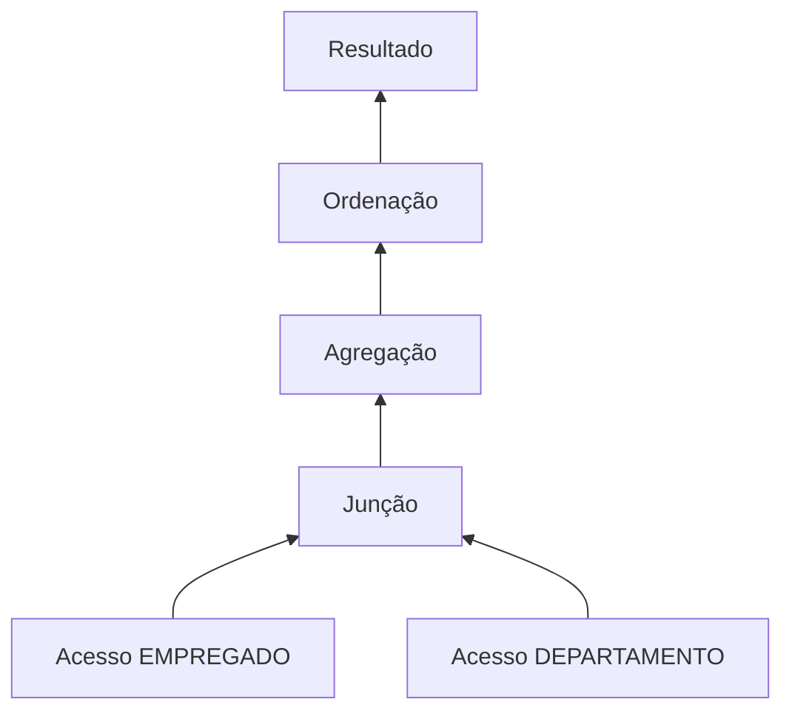

	
# 1.17 — Melhoria de performance de banco de dados

[[1.0 Mapa de estudos — Arquitetura de dados|← Mapa]] · [[1.16 Transações de bancos de dados|← Transações]] · [[1.18 Bancos de dados NoSQL|NoSQL →]] · [[Banco de questões — Arquitetura de dados|Questões]]

> [!important] Prioridade CESGRANRIO: **ALTA**
> A matriz registra questões anteriores sobre atuação do DBA e otimizador. A cobrança mais provável apresenta uma consulta lenta ou ambiente degradado e pergunta qual diagnóstico ou intervenção é tecnicamente adequada.

## O que você DEVE MANTER e REVISAR — o “coração” da CESGRANRIO

1. **Medir antes de otimizar (Seções 2 e 3):** estabeleça linha de base, identifique o gargalo e compare antes/depois. **Pegadinha:** alta CPU, espera de disco ou bloqueio exigem tratamentos diferentes.

2. **Plano de execução e estatísticas (Seções 4 e 5):** o otimizador estima cardinalidades e custos para escolher acessos e junções. Estatísticas inadequadas podem levar a plano ruim; plano estimado não é tempo real garantido.

3. **Índices (Seções 6 a 9):** aceleram certos filtros, junções e ordenações, mas consomem espaço e tornam escritas mais caras. Ordem das colunas, seletividade e padrão de consulta importam.

4. **Consultas sargáveis (Seção 10):** predicados que preservam a coluna pesquisável favorecem índices. **Pegadinha:** aplicar função ou cálculo sobre a coluna pode impedir acesso eficiente.

5. **Otimização sistêmica (Seções 12 a 17):** modelagem, particionamento, materialização, memória, lotes e concorrência também influenciam desempenho. Otimizar apenas o SQL pode não resolver contenção ou falta de recursos.

> [!note] Limite deste módulo
> Bancos NoSQL, integração/ETL e bancos em memória serão aprofundados em 1.18–1.20. Aqui aparecem somente quando necessários para delimitar alternativas arquiteturais.

## Objetivos de aprendizagem

1. diferenciar latência, vazão, consumo e contenção;
2. aplicar um ciclo seguro de diagnóstico e melhoria;
3. interpretar elementos básicos de planos de execução;
4. explicar o papel de estatísticas e estimativas de cardinalidade;
5. selecionar índices coerentes com as consultas;
6. reconhecer predicados sargáveis;
7. avaliar junções, agregações e acesso excessivo a dados;
8. reconhecer particionamento, materialização e desnormalização controlada;
9. evitar as principais pegadinhas da CESGRANRIO.

## 1. O que significa performance

Performance não é uma única medida.

| Métrica | Significado |
|---|---|
| latência/tempo de resposta | duração de uma operação |
| vazão/_throughput_ | operações concluídas por unidade de tempo |
| concorrência | quantidade de trabalhos simultâneos suportados |
| uso de CPU | processamento consumido |
| E/S | leituras e escritas em armazenamento |
| memória | espaço usado por buffers, ordenações e cache |
| espera | tempo aguardando bloqueio, E/S, CPU ou outro recurso |
| estabilidade | previsibilidade sob variações de carga |

Uma mudança pode reduzir a latência de uma consulta e diminuir a vazão global por aumentar contenção. Por isso, é necessário definir o objetivo.

> [!warning] Pegadinha CESGRANRIO
> “Mais rápido” precisa de contexto. Melhorar uma consulta isolada não garante melhorar o sistema inteiro.

## 2. Ciclo de otimização


### 2.1 Definir objetivo

Exemplos:

```text
reduzir p95 da consulta de 4 s para 800 ms
aumentar carga de 10 mil para 50 mil linhas/minuto
reduzir espera por bloqueio em 40%
```

### 2.2 Linha de base

Registre:

- consulta e parâmetros;
- volume e distribuição dos dados;
- duração;
- leituras e escritas;
- CPU e esperas;
- plano utilizado;
- quantidade de execuções;
- horário e concorrência.

### 2.3 Alteração controlada

Mude um conjunto compreensível de fatores, teste em ambiente representativo e mantenha possibilidade de reversão.

> [!important] Princípio
> Sem medição antes e depois, há alteração — não há evidência de otimização.

## 3. Identificação do gargalo

### 3.1 CPU

Possíveis causas:

- cálculos ou funções intensivos;
- grande quantidade de linhas processadas;
- planos inadequados;
- excesso de compilação;
- agregações e ordenações amplas.

### 3.2 E/S

Possíveis causas:

- varreduras extensas;
- baixo aproveitamento de cache;
- leituras aleatórias;
- dados ou índices excessivos;
- armazenamento saturado.

### 3.3 Memória

Memória insuficiente pode provocar:

- baixa permanência de páginas em cache;
- derramamento de ordenações ou _hashes_ para disco;
- paginação pelo sistema operacional;
- pressão entre cargas concorrentes.

### 3.4 Bloqueios e contenção

Possíveis causas:

- transações longas;
- muitas escritas sobre os mesmos dados;
- ordem inconsistente de acesso;
- nível de isolamento superior ao necessário;
- ausência de índice que prolonga buscas e bloqueios.

### 3.5 Rede ou aplicação

Nem toda lentidão está dentro do SGBD:

- excesso de viagens entre aplicação e banco;
- retorno de dados desnecessários;
- conexão criada repetidamente;
- serialização pesada;
- latência de rede.

> [!warning] Pegadinha CESGRANRIO
> Criar índice não corrige automaticamente espera de rede, CPU na aplicação ou deadlock por ordem inconsistente de bloqueios.

## 4. Plano de execução

O plano descreve os operadores físicos escolhidos para executar uma consulta.

Elementos comuns:

- varredura de tabela;
- acesso por índice;
- filtros;
- ordenação;
- agregação;
- junções;
- estimativas de linhas e custo.



### 4.1 Plano estimado × plano real

- **estimado:** produzido sem executar completamente a consulta;
- **real/analisado:** contém métricas observadas da execução, conforme o SGBD.

### 4.2 Custo estimado

É uma unidade interna usada para comparar alternativas dentro do mesmo contexto. Não é necessariamente tempo em milissegundos.

### 4.3 Estimado × observado

Grande diferença entre linhas estimadas e reais pode indicar:

- estatísticas desatualizadas;
- distribuição desigual;
- correlação entre colunas não representada;
- parâmetros atípicos;
- expressão difícil de estimar.

> [!warning] Pegadinha CESGRANRIO
> Varredura completa não é sempre ruim. Para tabela pequena ou consulta que retorna grande parte das linhas, ela pode ser mais barata que muitos acessos por índice.

## 5. Otimizador e estatísticas

O otimizador avalia planos logicamente equivalentes e escolhe aquele de menor custo **estimado**.

Estatísticas podem descrever:

- quantidade de linhas;
- valores distintos;
- distribuição/histogramas;
- fração de nulos;
- tamanho dos objetos;
- correlações suportadas pelo produto.

### 5.1 Cardinalidade

É a estimativa ou quantidade de linhas produzidas por cada operador. Ela influencia:

- ordem de junção;
- método de junção;
- escolha entre índice e varredura;
- memória para agregação e ordenação.

### 5.2 Seletividade

Um predicado seletivo retorna pequena fração das linhas:

```text
cpf = '123...'          → normalmente muito seletivo
ativo = 'S'             → possivelmente pouco seletivo
```

A seletividade real depende da distribuição.

### 5.3 Atualização de estatísticas

Após grandes mudanças de volume ou distribuição, estatísticas antigas podem induzir estimativas ruins. Atualizá-las pode permitir plano melhor sem mudar a consulta.

> [!warning] Pegadinha CESGRANRIO
> Estatística não é índice. Estatística informa o otimizador; índice fornece caminho de acesso. Uma não substitui automaticamente o outro.

## 6. Índices: benefícios e custos

Um índice é estrutura auxiliar que pode reduzir o conjunto de páginas ou linhas examinadas.

### Benefícios possíveis

- filtros seletivos;
- junções por chaves;
- ordenação compatível;
- agrupamento compatível;
- imposição de unicidade;
- acesso mínimo/máximo.

### Custos

- espaço adicional;
- manutenção em `INSERT`, `UPDATE` e `DELETE`;
- maior uso de log;
- tempo de criação e reconstrução;
- possibilidade de planos inadequados se mal projetado;
- cache ocupado por estruturas pouco úteis.

```text
mais índices → potencialmente mais opções de leitura
mais índices → certamente mais estruturas para manter
```

> [!warning] Pegadinha CESGRANRIO
> Índice acelera **determinados padrões de acesso**, não “a tabela inteira” de forma universal.

## 7. Tipos de índice — nível de prova

### 7.1 B-tree/B+tree

Estrutura ordenada adequada a:

- igualdade;
- intervalos;
- prefixos ordenados;
- ordenação compatível;
- mínimo e máximo.

É o tipo geral mais comum em SGBDs relacionais.

### 7.2 Hash

Favorece buscas por igualdade, mas não intervalos nem ordenação natural da chave. Suporte e uso variam.

### 7.3 Bitmap

Usa vetores de bits e pode ser eficaz em cenários analíticos, especialmente para colunas de baixa cardinalidade combinadas em filtros. Atualizações concorrentes frequentes podem torná-lo inadequado, dependendo do produto.

### 7.4 Clusterizado × não clusterizado
- **Índice Clusterizado**
    - **Organização física:** Define a ordem física em que os dados são armazenados no disco. A própria tabela é estruturada com base nessa chave.
    - **Limite:** Permite apenas **um** por tabela, pois as linhas físicas só podem ser ordenadas de uma única forma.
    - **Uso ideal:** Consultas por intervalo de valores (`BETWEEN`, `>`, `<`) e buscas frequentes por chaves primárias.
        
- **Índice Não Clusterizado**
    - **Estrutura independente:** Cria uma estrutura paralela à tabela (como o índice de um livro) contendo as chaves indexadas e ponteiros para as linhas físicas correspondentes.
    - **Limite:** Permite **múltiplos** índices por tabela.
    - **Uso ideal:** Buscas pontuais por colunas secundárias e otimização de filtros (`WHERE`), junções (`JOIN`) e ordenações (`ORDER BY`).

### 7.5 Índice único

Garante unicidade dos valores abrangidos segundo a semântica do produto. Constraints de PK/`UNIQUE` podem usar índices internamente, mas constraint e índice não são conceitos idênticos.

## 8. Índices compostos

```sql
CREATE INDEX ix_empregado_dep_ativo
ON empregado (cod_departamento, ativo);
```

A ordem das colunas importa. Em um B-tree composto, o prefixo inicial é especialmente relevante.

Pode apoiar bem:

```sql
WHERE cod_departamento = 10
```

e:

```sql
WHERE cod_departamento = 10
  AND ativo = 'S'
```

Pode não apoiar da mesma forma uma busca apenas por:

```sql
WHERE ativo = 'S'
```

### 8.1 Regra prática de ordenação

Considere:

- predicados de igualdade;
- intervalos;
- seletividade;
- ordenação e agrupamento;
- consultas realmente frequentes.

Não existe regra universal “coluna mais seletiva sempre primeiro”. O conjunto de consultas determina o projeto.

> [!warning] Pegadinha CESGRANRIO
> Um índice `(A, B)` não é automaticamente equivalente a dois índices `(A)` e `(B)`, nem a `(B, A)`.

## 9. Índice de cobertura e acesso à tabela

Um índice oferece **cobertura** quando contém as informações necessárias para responder à consulta sem buscar outras colunas na tabela, conforme as capacidades do SGBD.

```sql
SELECT nome
FROM empregado
WHERE cpf = '12345678901';
```

Um índice que permita localizar `cpf` e obter `nome` pode evitar acesso adicional.

Custos:

- índice mais largo;
- mais espaço;
- mais manutenção;
- menor quantidade de entradas por página.

Cobertura é específica da consulta; não é propriedade absoluta de um índice.

## 10. Sargabilidade

Um predicado é **sargável** quando pode ser usado eficientemente como argumento de busca por uma estrutura de acesso apropriada.

### 10.1 Evitar função sobre a coluna

Menos favorável a índice comum:

```sql
WHERE EXTRACT(YEAR FROM data_evento) = 2026
```

Forma por intervalo:

```sql
WHERE data_evento >= DATE '2026-01-01'
  AND data_evento <  DATE '2027-01-01'
```

### 10.2 Evitar cálculo sobre a coluna

```sql
-- menos sargável
WHERE salario * 12 > 120000

-- mais sargável
WHERE salario > 10000
```

### 10.3 Conversão de tipo

Conversão implícita sobre a coluna indexada pode prejudicar uso do índice. Compare valores com tipos compatíveis.

### 10.4 `LIKE`

Em índice ordenado comum:

```sql
WHERE nome LIKE 'ANA%'  -- prefixo pode ser aproveitável
WHERE nome LIKE '%ANA'  -- curinga inicial dificulta busca por prefixo
```

Índices funcionais, textuais ou especializados podem mudar o cenário.

> [!warning] Pegadinha CESGRANRIO
> Reescrever para sargabilidade não garante que o índice será usado; apenas torna o acesso possível/mais favorável. O otimizador ainda compara custos.

## 11. Redução do volume processado

### 11.1 Evitar `SELECT *`

Selecione apenas colunas necessárias:

```sql
SELECT matricula, nome
FROM empregado
WHERE cod_departamento = 10;
```

Possíveis benefícios:

- menos dados transferidos;
- menor memória;
- possibilidade de cobertura;
- menor acoplamento a mudanças de esquema.

### 11.2 Filtrar cedo logicamente

Predicados seletivos reduzem linhas processadas, desde que preservem a semântica — principalmente em junções externas.

### 11.3 Paginação

Evita retornar tudo à aplicação, mas grandes deslocamentos podem continuar custosos. Paginação por chave pode ser alternativa quando aplicável.

### 11.4 Processamento em lote

Agrupar operações reduz viagens entre aplicação e banco. Lotes enormes, porém, podem aumentar log, bloqueios e tempo de recuperação.

## 12. Junções

### 12.1 Índices nas colunas de junção

Podem reduzir o custo, especialmente sobre PKs e FKs, conforme direção, volume e plano.

### 12.2 Métodos comuns

| Método | Situação frequentemente favorável |
|---|---|
| _nested loops_ | entrada externa pequena e acesso eficiente à interna |
| _hash join_ | grandes conjuntos e condição de igualdade |
| _merge join_ | entradas ordenadas e condição compatível |

O otimizador decide com base em estimativas e recursos.

### 12.3 Produto cartesiano acidental

Omitir condição de junção pode multiplicar linhas:

```text
10 mil × 5 mil = 50 milhões de combinações
```

### 12.4 Tipos e expressões compatíveis

Junções com conversões ou funções podem dificultar índices e estimativas.

> [!warning] Pegadinha CESGRANRIO
> Não existe método de junção universalmente melhor. _Nested loops_, _hash_ e _merge_ dependem de volume, ordenação, memória, índices e seletividade.

## 13. Agregação, ordenação e operações temporárias

`GROUP BY`, `DISTINCT`, `ORDER BY` e operações de conjunto podem exigir:

- ordenação;
- tabela _hash_;
- memória de trabalho;
- escrita temporária em disco quando a memória é insuficiente.

Medidas possíveis:

- reduzir linhas e colunas antes da operação quando semanticamente correto;
- criar índice compatível com acesso/ordem;
- ajustar memória com visão sistêmica;
- pré-agregar quando o requisito justificar;
- evitar `DISTINCT` usado apenas para mascarar junção incorreta.

> [!warning] Pegadinha CESGRANRIO
> `DISTINCT` não corrige a causa de duplicatas produzidas por uma junção mal modelada; apenas elimina repetições no resultado e pode adicionar custo.

## 14. Particionamento

Divide logicamente uma grande tabela ou índice em partes administráveis.

Estratégias comuns:

- intervalo (_range_), como data;
- lista, como região;
- hash;
- combinações.

### 14.1 Eliminação de partições

Se o predicado contém a chave de particionamento de forma utilizável, o SGBD pode acessar apenas partições relevantes.

```sql
WHERE data_evento >= DATE '2026-01-01'
  AND data_evento <  DATE '2026-02-01'
```

### 14.2 Benefícios possíveis

- poda de dados;
- manutenção por partição;
- carga e descarte por períodos;
- paralelismo;
- administração de tabelas grandes.

### 14.3 Limites

- não reduz custo se todas as partições forem lidas;
- escolha inadequada pode criar desequilíbrio;
- aumenta complexidade;
- não substitui índices e consultas corretas.

## 15. Normalização e desnormalização

### Normalização

Reduz redundância e anomalias, mas certas consultas exigem mais junções.

### Desnormalização controlada

Repete ou pré-calcula dados para reduzir junções e cálculos em caminhos críticos.

Exemplos:

- total armazenado;
- tabela agregada;
- dimensão desnormalizada;
- duplicação controlada de atributo.

Riscos:

- inconsistência;
- maior custo de escrita;
- regras de sincronização;
- armazenamento adicional.

> [!warning] Pegadinha CESGRANRIO
> Desnormalização é decisão consciente baseada em medição, não correção automática para qualquer consulta lenta.

## 16. Views materializadas, cache e dados derivados

### 16.1 View comum

Armazena definição da consulta; normalmente calcula ao ser consultada.

### 16.2 View materializada

Persiste o resultado para acelerar leituras e precisa de atualização/_refresh_.

### 16.3 Cache

Evita recomputar ou reler resultados frequentes. Exige política de:

- validade;
- invalidação;
- capacidade;
- consistência.

Troca central:

```text
leitura mais rápida ↔ dado potencialmente defasado + custo de atualização
```

## 17. Transações, bloqueios e contenção

Melhorias possíveis:

- manter transações curtas;
- acessar recursos em ordem consistente;
- evitar interação humana dentro da transação;
- indexar buscas que localizam linhas a alterar;
- escolher nível de isolamento compatível com o requisito;
- reduzir pontos quentes;
- tratar deadlocks com repetição segura quando apropriado.

> [!warning] Pegadinha CESGRANRIO
> Reduzir isolamento apenas para ganhar velocidade pode permitir anomalias. Correção vem antes da otimização.

## 18. Configuração e infraestrutura — visão de prova

Áreas possíveis:

- tamanho de buffers/cache;
- memória para ordenação e _hash_;
- quantidade de conexões;
- _pool_ de conexões;
- capacidade e latência de armazenamento;
- CPU;
- rede;
- paralelismo;
- frequência de manutenção.

### 18.1 Pool de conexões

Reutiliza conexões e reduz o custo de criá-las repetidamente. Um pool excessivo pode sobrecarregar o banco; mais conexões não significam mais vazão indefinidamente.

### 18.2 Memória

Aumentar parâmetros sem considerar multiplicação por sessões/operadores pode causar pressão global. Ajuste deve ser sistêmico.

### 18.3 Hardware

Adicionar recursos pode aliviar gargalo real, mas também mascarar consultas ou modelos inadequados. Deve seguir medição.

## 19. Manutenção

Conforme o SGBD, podem ser necessárias tarefas como:

- atualizar estatísticas;
- reorganizar/reconstruir índices quando justificado;
- recuperar espaço;
- controlar crescimento de arquivos e logs;
- arquivar dados antigos;
- verificar integridade;
- acompanhar regressões de planos.

Evite manutenção por calendário sem evidência: reconstruir todo índice indiscriminadamente também consome recursos.

## 20. Antipadrões

### 20.1 Criar índice para toda coluna

Aumenta espaço e custo de escrita sem garantir benefício.

### 20.2 Otimizar sem linha de base

Não permite demonstrar melhoria ou regressão.

### 20.3 Usar dica de plano como primeira solução

Pode congelar uma escolha adequada apenas ao volume atual e esconder estatísticas ruins.

### 20.4 Aplicar função em coluna filtrada

Pode tornar o predicado não sargável.

### 20.5 Retornar dados desnecessários

`SELECT *` e ausência de filtros aumentam E/S, memória e rede.

### 20.6 Ignorar distribuição

Mesma consulta e índice podem ter comportamento diferente para valores comuns e raros.

### 20.7 Confundir sintoma com causa

Consulta esperando bloqueio não será corrigida apenas reduzindo seu custo de CPU.

## 21. Procedimento para questões

1. identifique o sintoma e a métrica;
2. localize o recurso limitante;
3. observe plano e cardinalidades;
4. verifique estatísticas;
5. examine filtros e junções;
6. avalie índice por padrão de consulta;
7. considere custo nas escritas;
8. só depois avalie particionamento, materialização ou mudança estrutural;
9. meça novamente.

```text
diagnóstico → hipótese → intervenção → medição
```

## 22. Priorização para a CESGRANRIO

### 22.1 Alta frequência / alto retorno

- função do DBA e otimizador;
- plano de execução;
- custo e cardinalidade estimados;
- estatísticas;
- seletividade;
- benefícios e custos de índices;
- índice composto e ordem das colunas;
- sargabilidade;
- varredura versus índice;
- medir antes e depois.

### 22.2 Chance média / diferenciação

- tipos B-tree, hash e bitmap;
- índice clusterizado e de cobertura;
- métodos de junção;
- partições e poda;
- views materializadas;
- desnormalização controlada;
- bloqueios e contenção;
- pool de conexões;
- manutenção de estatísticas e índices.

### 22.3 Baixo retorno

- fórmulas internas de custo;
- parâmetros proprietários;
- hints específicos;
- algoritmos detalhados de árvores;
- configuração de hardware por produto;
- ferramentas comerciais de monitoração.

## 23. Checklist de pegadinhas

- [ ] Performance envolve latência, vazão, recursos e espera.
- [ ] Medir antes e depois.
- [ ] Custo estimado não é tempo real.
- [ ] Estatística não é índice.
- [ ] Varredura completa não é sempre ruim.
- [ ] Índice melhora certas leituras e piora o custo de escritas.
- [ ] Índice `(A,B)` não equivale a `(B,A)`.
- [ ] Baixa cardinalidade não torna índice sempre inútil ou sempre útil.
- [ ] Função sobre coluna pode prejudicar sargabilidade.
- [ ] `LIKE '%texto'` não aproveita prefixo de B-tree comum.
- [ ] `DISTINCT` pode mascarar junção incorreta.
- [ ] Particionamento só reduz leitura quando há poda.
- [ ] Materialização troca atualização por leitura rápida.
- [ ] Mais conexões não significam vazão infinita.
- [ ] Correção não deve ser sacrificada sem requisito explícito.

## 24. Questões inéditas — estilo CESGRANRIO

### 24.1 Questão 1

Uma tabela possui índice B-tree sobre `data_evento`. Deseja-se consultar apenas os eventos de 2026. Entre as condições abaixo, a que normalmente favorece melhor o uso direto do índice é

A) `EXTRACT(YEAR FROM data_evento) = 2026`.  
B) `CAST(data_evento AS CHAR(4)) = '2026'`.  
C) `data_evento >= DATE '2026-01-01' AND data_evento < DATE '2027-01-01'`.  
D) `data_evento + INTERVAL '0 day' >= DATE '2026-01-01'`.  
E) `COALESCE(data_evento, CURRENT_DATE) BETWEEN DATE '2026-01-01' AND DATE '2026-12-31'`.

> [!success]- Gabarito comentado
> **Resposta: C.** A condição compara a coluna diretamente com limites compatíveis, formando intervalo sargável. As demais aplicam função, conversão ou expressão sobre a coluna, o que pode impedir o uso eficiente de um índice comum. Tornar o predicado sargável não obriga o otimizador a usar o índice; ele ainda compara custos.

### 24.2 Questão 2

Após grande carga, uma consulta passou a apresentar estimativa de 100 linhas e execução real de 2 milhões, levando o otimizador a escolher uma junção inadequada. A primeira ação tecnicamente coerente é

A) criar índices sobre todas as colunas.  
B) remover todas as constraints.  
C) verificar e atualizar as estatísticas relevantes.  
D) substituir o banco relacional por NoSQL.  
E) aumentar indefinidamente o número de conexões.

> [!success]- Gabarito comentado
> **Resposta: C.** A grande divergência entre cardinalidade estimada e observada após mudança de volume sugere estatísticas desatualizadas ou inadequadas. Atualizá-las permite ao otimizador reavaliar planos. Índices e mudanças arquiteturais só devem ser considerados após diagnóstico, não de forma indiscriminada.

## 25. Resumo de véspera

```text
PERFORMANCE = latência + vazão + recursos + esperas
REGRA = medir → diagnosticar → alterar → medir novamente
PLANO = operadores físicos escolhidos
CUSTO = estimativa, não milissegundos
CARDINALIDADE = linhas estimadas/observadas
ESTATÍSTICA informa; ÍNDICE acessa
ÍNDICE melhora certas leituras e custa nas escritas
COMPOSTO (A,B) prioriza prefixo A
SARGÁVEL = coluna pesquisável sem transformação impeditiva
B-TREE = igualdade + intervalo + ordem
HASH = igualdade
PARTIÇÃO só ajuda leitura com poda
MATERIALIZAÇÃO = leitura rápida × atualização/defasagem
```
