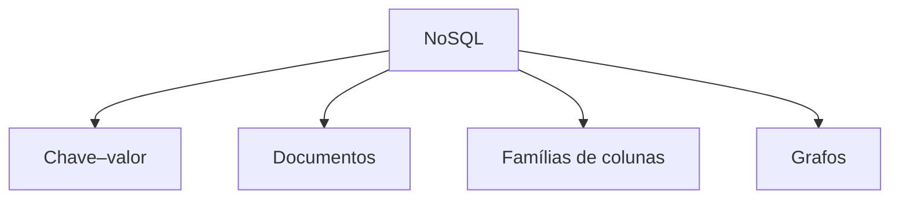
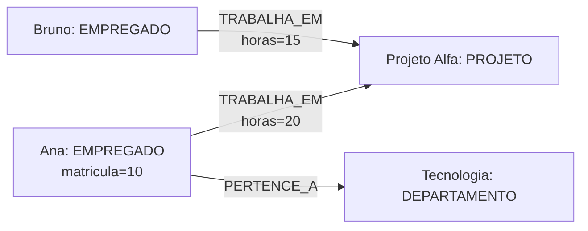
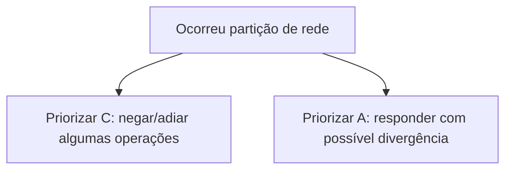
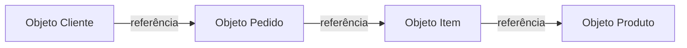

# 1.18 — Bancos de dados NoSQL

[[1.0 Mapa de estudos — Arquitetura de dados|← Mapa]] · [[1.17 Melhoria de performance de banco de dados|← Performance]] · [[1.19 Integração dos dados|Integração →]] · [[Banco de questões — Arquitetura de dados|Questões]]

> [!important] Prioridade CESGRANRIO: **ALTA**
> A matriz registra cobrança direta de bancos de documentos e grafos, além de questões sobre escolha do paradigma e leitura de Cypher. Grafos merecem maior atenção, mas é essencial distinguir também chave–valor, documentos e famílias de colunas.

## O que você DEVE MANTER e REVISAR — o “coração” da CESGRANRIO

1. **NoSQL não significa “sem SQL” (Seções 1 e 2):** significa, de forma usual, _Not Only SQL_. Reúne modelos não relacionais ou não exclusivamente relacionais, frequentemente voltados a flexibilidade e distribuição. **Pegadinha:** NoSQL pode oferecer transações ACID e esquema validado.

2. **Quatro famílias principais (Seções 6 a 9):** chave–valor acessa por chave; documentos armazenam agregados JSON/BSON; famílias de colunas organizam linhas esparsas por chave e famílias; grafos priorizam relacionamentos e travessias.

3. **Modelagem orientada ao acesso (Seção 4):** em muitos NoSQL, dados são agregados e duplicados conforme consultas previstas. **Pegadinha:** desnormalização é deliberada, mas exige estratégia de consistência.

4. **Distribuição, CAP e consistência (Seções 11 a 13):** replicação cria cópias; particionamento distribui dados. Diante de partição de rede, CAP impõe compromisso entre consistência e disponibilidade.

5. **Grafos e Cypher (Seções 9 e 10):** nós representam entidades, arestas representam relações e ambos podem ter propriedades. Cypher descreve padrões: `(a)-[:RELACAO]->(b)`. **Pegadinha:** direção e comprimento do caminho alteram o resultado.

> [!note] Limite deste módulo
> A comparação sistemática entre relacional, multidimensional, documentos e grafos será consolidada em 1.23. Bancos em memória serão aprofundados em 1.20; Data Lakes e Big Data, em 1.22. Aqui o foco é entender como cada família NoSQL funciona.

## Objetivos de aprendizagem

1. definir NoSQL e reconhecer suas características sem generalizações falsas;
2. explicar modelagem por agregados e orientada a consultas;
3. distinguir chave–valor, documentos, famílias de colunas e grafos;
4. escolher uma família para um cenário simples;
5. modelar nós, arestas, rótulos e propriedades;
6. interpretar consultas Cypher básicas;
7. explicar replicação, particionamento, CAP e consistência eventual;
8. diferenciar famílias de colunas de armazenamento colunar analítico;
9. evitar as principais pegadinhas da CESGRANRIO.

## 1. O que é NoSQL

**NoSQL** designa um conjunto de bancos que não adotam exclusivamente o modelo relacional tradicional e que oferecem modelos como:

- chave–valor;
- documentos;
- famílias de colunas;
- grafos.

O termo costuma ser interpretado como **Not Only SQL** — “não somente SQL”. Ele não define uma tecnologia única nem um conjunto obrigatório de propriedades.



Motivações frequentes:

- escalabilidade horizontal;
- alto volume ou velocidade;
- distribuição geográfica;
- estruturas flexíveis ou variáveis;
- relacionamentos altamente conectados;
- baixa latência para padrões específicos;
- desenvolvimento orientado a agregados.

> [!warning] Pegadinha CESGRANRIO
> NoSQL não significa ausência de consulta, estrutura, consistência, transações ou persistência. Cada produto faz escolhas próprias.

## 2. O que não pode ser generalizado

As afirmações abaixo são falsas como regras universais:

```text
“Todo NoSQL não possui esquema.”
“Todo NoSQL é eventualmente consistente.”
“Nenhum NoSQL oferece ACID.”
“Todo NoSQL é mais rápido que relacional.”
“NoSQL elimina a necessidade de modelagem.”
“NoSQL não aceita linguagem declarativa.”
```

Um banco de documentos pode validar esquemas; um banco de grafos pode oferecer transações ACID; um chave–valor pode persistir em disco; diferentes produtos podem priorizar consistência forte ou disponibilidade.

### 2.1 _Schema-less_ × esquema flexível

É mais seguro falar em **esquema flexível** ou aplicado em outras camadas:

- documentos da mesma coleção podem ter campos diferentes;
- a aplicação ainda precisa interpretar campos e tipos;
- validação pode existir no banco;
- contratos de eventos e APIs continuam necessários;
- índices dependem de campos conhecidos.

> [!warning] Pegadinha CESGRANRIO
> Flexibilidade transfere parte da responsabilidade de validação e evolução; não elimina a estrutura semântica dos dados.

## 3. Relacional como ponto de referência

No modelo relacional:

- dados são organizados em tabelas;
- relacionamentos usam chaves;
- junções combinam relações;
- normalização reduz redundância;
- SQL permite consultas declarativas flexíveis.

No NoSQL, a modelagem frequentemente privilegia o acesso esperado:

- incorporar dados consultados juntos;
- duplicar informações controladamente;
- escolher chave de partição;
- representar conexão diretamente por aresta;
- evitar junções distribuídas caras.

Isso não torna um paradigma superior em todos os casos. A escolha depende do problema.

## 4. Modelagem orientada a agregados e consultas

Um **agregado** é um conjunto de dados tratado como unidade de leitura e, frequentemente, de atualização.

Exemplo relacional:

```text
PEDIDO
ITEM_PEDIDO
ENDERECO_ENTREGA
```

Possível documento agregado:

```json
{
  "numero": 5001,
  "clienteId": 42,
  "entrega": {
    "cidade": "Rio de Janeiro",
    "uf": "RJ"
  },
  "itens": [
    {"produtoId": 10, "quantidade": 2, "preco": 50.00},
    {"produtoId": 20, "quantidade": 1, "preco": 80.00}
  ],
  "total": 180.00
}
```

O pedido inteiro pode ser recuperado sem junções, mas produto, endereço ou total podem ficar duplicados em vários documentos.

### 4.1 Perguntas antes de modelar

- qual é a principal unidade de acesso?
- quais dados são lidos e alterados juntos?
- quais consultas são mais frequentes?
- qual campo distribui bem os dados?
- é necessário percorrer conexões?
- qual consistência é exigida?
- quanto de duplicação é aceitável?

> [!warning] Pegadinha CESGRANRIO
> NoSQL costuma trocar flexibilidade e desempenho de um padrão de acesso por maior responsabilidade de modelagem, duplicação e consistência. Não é simplesmente “não normalizar”.

## 5. Visão geral das famílias

| Família | Estrutura central | Acesso típico | Cenário característico |
|---|---|---|---|
| chave–valor | chave única → valor opaco/semiestruturado | buscar pela chave | sessão, cache, carrinho |
| documentos | documento com campos e subdocumentos | chave e campos internos | catálogo, conteúdo, perfil |
| famílias de colunas | linhas por chave, colunas esparsas agrupadas | chave de partição e intervalo | telemetria, eventos em escala |
| grafos | nós, arestas e propriedades | travessias e padrões | fraude, redes, recomendação |

## 6. Banco chave–valor

### 6.1 Funcionamento

Armazena pares:

```text
chave → valor
```

Exemplo:

```text
sessao:8f92 → {usuario: 42, expira: "2026-09-05T18:00:00"}
```

Operações conceituais:

```text
PUT(chave, valor)
GET(chave)
DELETE(chave)
```

A chave funciona como endereço lógico. O valor pode ser texto, binário, coleção ou estrutura, conforme o produto.

### 6.2 Pontos fortes

- acesso direto e simples;
- baixa latência por chave;
- particionamento natural pela chave;
- modelo adequado para valores independentes.

### 6.3 Limitações

- consultas por conteúdo podem ser limitadas;
- relações entre valores ficam na aplicação;
- buscas complexas e agregações podem exigir estruturas adicionais;
- escolha de chave é crítica.

### 6.4 Casos comuns

- sessão de usuário;
- cache;
- carrinho de compras;
- preferências;
- contadores;
- configuração rápida.

> [!warning] Pegadinha CESGRANRIO
> Banco chave–valor é ótimo quando a chave é conhecida. Não é a escolha natural para consultas arbitrárias sobre muitos campos ou travessias de relacionamentos.

## 7. Banco de documentos

### 7.1 Funcionamento

Armazena documentos autocontidos, frequentemente semelhantes a JSON, agrupados em coleções.

```json
{
  "_id": "EMP-10",
  "nome": "Ana",
  "cargo": "Analista",
  "habilidades": ["SQL", "BPMN"],
  "lotacao": {
    "codigo": 20,
    "nome": "Tecnologia"
  }
}
```

Elementos:

- identificador do documento;
- campos escalares;
- arrays;
- subdocumentos;
- campos opcionais;
- índices sobre campos internos, conforme o SGBD.

### 7.2 Incorporação × referência

**Incorporar (_embed_):** guardar dados relacionados dentro do documento.

Use quando:

- são lidos juntos;
- pertencem ao mesmo ciclo de vida;
- quantidade é limitada/previsível;
- atualização conjunta é desejável.

**Referenciar:** guardar identificador de outro documento.

Use quando:

- elemento é compartilhado;
- cresce sem limite razoável;
- possui ciclo de vida próprio;
- duplicação teria custo alto;
- é consultado independentemente.

### 7.3 Pontos fortes

- representa naturalmente agregados e hierarquias;
- campos flexíveis;
- proximidade com objetos da aplicação;
- leitura do agregado sem várias junções;
- índices e consultas sobre campos.

### 7.4 Limitações

- duplicação e atualização em múltiplos documentos;
- documentos grandes ou ilimitados;
- junções e transações entre agregados podem ser mais custosas/limitadas;
- evolução de esquema precisa ser governada.

> [!warning] Pegadinha CESGRANRIO
> Documento não é valor necessariamente opaco: o banco pode consultar e indexar campos internos. Essa é uma diferença importante em relação ao chave–valor mais simples.

## 8. Banco de famílias de colunas

Também chamado _wide-column_ ou, em alguns materiais, colunar distribuído.

### 8.1 Funcionamento

Os dados são organizados por:

- chave de linha/partição;
- famílias de colunas;
- colunas que podem variar por linha;
- ordenação dentro da partição, conforme o modelo.

Exemplo conceitual:

```text
chave da partição: sensor-10

linha/tempo        leituras:temperatura   leituras:pressao
2026-09-05T10:00   72.4                  30.1
2026-09-05T10:01   72.7                  30.3
```

As linhas podem ser esparsas: uma coluna pode existir em uma linha e não em outra.

### 8.2 Chave de partição

Determina onde os dados ficam distribuídos. Uma boa chave:

- distribui carga;
- evita partições muito grandes;
- suporta consultas previstas;
- evita ponto quente.

### 8.3 Modelagem pela consulta

É comum criar tabelas específicas para padrões de acesso e duplicar dados, evitando junções distribuídas.

### 8.4 Pontos fortes

- escrita e leitura em grande escala;
- distribuição horizontal;
- dados esparsos;
- séries de eventos por chave e intervalo;
- alta disponibilidade conforme configuração.

### 8.5 Limitações

- consultas fora da chave prevista podem ser difíceis;
- junções não são o foco;
- duplicação exige coordenação;
- chave ruim causa _hotspot_ e desequilíbrio.

### 8.6 Família de colunas × armazenamento colunar analítico

Não são sinônimos:

| Família de colunas NoSQL | Armazenamento colunar analítico |
|---|---|
| organiza dados por chave e famílias | armazena valores de cada coluna juntos fisicamente |
| orientada a consultas por partição | orientada a varreduras e agregações de colunas |
| linhas podem ter colunas esparsas | esquema tabular costuma ser conhecido |
| exemplo conceitual: Cassandra/HBase | comum em DW e formatos colunares |

> [!warning] Pegadinha CESGRANRIO
> “Família de colunas” não significa apenas transpor uma tabela relacional nem é automaticamente o mesmo que banco analítico column-store.

## 9. Banco de grafos — foco principal

Banco de grafos é projetado para representar e consultar conexões como elementos de primeira classe.

### 9.1 Property graph

Elementos principais:

- **nó/vértice:** entidade;
- **aresta/relacionamento:** conexão;
- **rótulo (_label_):** tipo/categoria do nó;
- **tipo da relação:** significado da aresta;
- **propriedade:** par nome–valor em nó ou aresta.



Representação de padrão:

```text
(Ana:EMPREGADO)-[:TRABALHA_EM {horas: 20}]->(Projeto:PROJETO)
```

### 9.2 Relações têm identidade e direção

Uma relação pode possuir:

- direção;
- tipo;
- propriedades;
- identidade própria, conforme o modelo.

```text
(empregado)-[:GERENCIA]->(projeto)
```

A direção expressa como o vínculo foi armazenado; algumas consultas podem percorrê-lo em qualquer direção.

### 9.3 Travessia

Em vez de juntar tabelas repetidamente, a consulta percorre vizinhanças:

```text
empregado → projeto → empregados relacionados → departamentos
```

Grafos são especialmente adequados quando o valor está nas relações e nos caminhos.

### 9.4 Casos de uso

- detecção de fraude;
- rede social;
- recomendação;
- roteamento e caminhos;
- dependências de sistemas;
- linhagem de dados;
- gestão de identidades e permissões;
- conhecimento conectado.

### 9.5 Consultas típicas

- vizinhos de um nó;
- caminho entre dois nós;
- menor caminho;
- conexões até determinada profundidade;
- padrões de relacionamento;
- centralidade e comunidades, em análise especializada.

### 9.6 Adjacência sem índice — cuidado conceitual

Alguns bancos de grafos nativos usam **index-free adjacency**, em que um nó mantém referências diretas às relações/vizinhos, favorecendo travessias locais.

Isso não significa:

- ausência total de índices;
- que todo banco de grafos usa a mesma implementação;
- que localizar o nó inicial dispensa índice;
- que qualquer consulta em grafo é rápida.

### 9.7 Property graph × RDF — reconhecimento

| Property graph | RDF |
|---|---|
| nós e relações podem ter propriedades | fatos representados como triplas |
| padrão `(n)-[r]->(m)` | sujeito–predicado–objeto |
| Cypher é linguagem conhecida | SPARQL é linguagem conhecida |

Exemplo RDF:

```text
Ana — trabalhaEm — ProjetoAlfa
```

Para a CESGRANRIO neste edital, property graph e Cypher têm maior retorno.

> [!warning] Pegadinhas CESGRANRIO
>
> - aresta não é mero atributo textual: representa conexão navegável;
> - propriedades podem existir em nós **e** arestas;
> - grafo é indicado para relações profundas/dinâmicas, não para toda aplicação;
> - index-free adjacency não significa “banco sem índices”.
### 9.8 LPG x RDF
- **Labeled Property Graph (LPG):** vértices e arestas rotulados, ambos com propriedades; consultas frequentemente usam linguagens de travessia.
- **RDF:** representa fatos como triplas sujeito–predicado–objeto e favorece interoperabilidade semântica; SPARQL é uma linguagem de consulta associada.
## 10. Cypher básico

Cypher é uma linguagem declarativa de padrões de grafos, conhecida pelo uso em property graphs.

### 10.1 Sintaxe visual

```text
(nó)-[relação]->(nó)
```

- parênteses: nó;
- colchetes: relacionamento;
- seta: direção;
- `:ROTULO`: rótulo ou tipo;
- `{chave: valor}`: propriedades.

### 10.2 Criar padrão — apenas para leitura

```cypher
CREATE (a:Empregado {matricula: 10, nome: 'Ana'})
CREATE (p:Projeto {codigo: 'P1', nome: 'Projeto Alfa'})
CREATE (a)-[:TRABALHA_EM {horas: 20}]->(p)
```

### 10.3 Consultar nós

```cypher
MATCH (e:Empregado)
RETURN e.nome
```

### 10.4 Consultar relacionamento

```cypher
MATCH (e:Empregado)-[r:TRABALHA_EM]->(p:Projeto)
RETURN e.nome, p.nome, r.horas
```

### 10.5 Filtrar

```cypher
MATCH (e:Empregado)-[:TRABALHA_EM]->(p:Projeto)
WHERE p.codigo = 'P1'
RETURN e.nome
```

### 10.6 Direção

```cypher
(e)-[:TRABALHA_EM]->(p)
```

Procura direção indicada.

```cypher
(e)-[:TRABALHA_EM]-(p)
```

Procura a relação sem exigir direção na correspondência.

### 10.7 Caminho de tamanho variável

```cypher
MATCH (a:Empregado)-[:CONHECE*1..3]->(b:Empregado)
RETURN b.nome
```

Procura pessoas alcançáveis por um a três relacionamentos `CONHECE`.

### 10.8 `CREATE` × `MERGE`

- `CREATE`: cria o padrão informado;
- `MERGE`: procura o padrão e o cria quando não encontrado, segundo a semântica da linguagem/produto.

`MERGE` não deve ser tratado ingenuamente como garantia universal de unicidade sem constraints apropriadas.

> [!warning] Pegadinhas CESGRANRIO
>
> - `(e)` é nó; `[r]` é relacionamento;
> - `r.horas` lê propriedade da aresta;
> - `MATCH` procura padrão; `RETURN` projeta resultado;
> - `*1..3` representa comprimento do caminho, não multiplicação;
> - direção omitida na correspondência não apaga a direção armazenada.

## 11. Escalabilidade horizontal e particionamento

### 11.1 Escala vertical

Aumenta recursos de um nó:

```text
mais CPU, memória ou armazenamento
```

### 11.2 Escala horizontal

Distribui carga e dados por vários nós:

```text
adicionar servidores/nós
```

### 11.3 Sharding/particionamento

Divide dados entre nós. A chave de partição determina o destino.

Boa chave:

- distribui uniformemente;
- suporta acessos comuns;
- reduz comunicação entre partições;
- evita pontos quentes.

Grafos são desafiadores de particionar quando muitas arestas atravessam partições.

> [!warning] Pegadinha CESGRANRIO
> Escala horizontal não ocorre automaticamente em todo NoSQL, e bancos relacionais também podem usar particionamento e distribuição.

## 12. Replicação

Mantém cópias dos dados para disponibilidade, leitura e recuperação.

Modelos comuns:

- líder–seguidores;
- múltiplos líderes;
- sem líder, com quóruns, conforme o produto.

Trocas possíveis:

- réplica síncrona: maior confirmação/consistência, possível maior latência;
- réplica assíncrona: menor espera, possível defasagem e perda recente em falha.

Replicação não substitui backup: um erro ou exclusão pode ser propagado às réplicas.

## 13. Teorema CAP

Em um sistema distribuído sujeito a **partição de rede**, não é possível garantir simultaneamente consistência e disponibilidade para todas as requisições.

### 13.1 Consistência — C

Cada leitura observa o valor mais recente ou erro, no sentido do modelo CAP.

### 13.2 Disponibilidade — A

Toda requisição recebida por nó operacional obtém resposta não errada, mesmo que ela não contenha o valor mais recente.

### 13.3 Tolerância a partição — P

O sistema continua operando apesar de perda ou atraso arbitrário de mensagens entre partes da rede.

Durante uma partição:

- **CP:** pode rejeitar/adiar operações para preservar consistência;
- **AP:** responde, podendo aceitar temporariamente divergência;
- “CA” só descreve ausência de escolha sob partição; redes distribuídas reais precisam tratar P.



> [!warning] Pegadinhas CESGRANRIO
>
> - CAP trata a escolha **durante partição**, não operação normal sem falhas;
> - consistência de CAP não é a consistência de invariantes do ACID;
> - disponibilidade CAP é definição técnica, não apenas alto percentual de uptime;
> - “escolher duas de três” é simplificação que esconde o papel obrigatório de tratar partições.

## 14. Consistência em sistemas distribuídos

### 14.1 Consistência forte

Leituras observam a escrita mais recente segundo a garantia adotada.

### 14.2 Consistência eventual

Se cessarem novas atualizações, as réplicas convergem com o tempo.

Ela não significa:

- dados aleatórios;
- ausência de regra;
- convergência imediata;
- perda obrigatória de todas as escritas.

### 14.3 Consistência ajustável

Alguns bancos permitem escolher níveis ou quóruns por operação, equilibrando latência, disponibilidade e consistência.

### 14.4 Quórum — visão curta

Com `N` réplicas, pode-se exigir `W` confirmações de escrita e `R` respostas de leitura. Relações como `R + W > N` ajudam a criar sobreposição entre conjuntos, mas detalhes de versão, relógio e implementação continuam relevantes.

## 15. BASE × ACID

**BASE** é uma caracterização frequentemente associada a sistemas distribuídos:

- **Basically Available**;
- **Soft state**;
- **Eventually consistent**.

Não é uma lei que todo NoSQL deva seguir nem o oposto lógico obrigatório de ACID.

```text
ACID → propriedades de transações
BASE → disponibilidade e convergência eventual como orientação arquitetural
```

Muitos bancos combinam transações ACID em determinado escopo com replicação eventualmente consistente em outro.

> [!warning] Pegadinha CESGRANRIO
> NoSQL não implica BASE obrigatório; relacional não implica distribuição sem compromissos. Analise a garantia concreta e seu escopo.

## 16. Outros modelos citados no módulo 1.1

Estes modelos não são automaticamente categorias NoSQL, mas ajudam a situar o assunto.

### 16.1 Multidimensional

Organiza análise por fatos, medidas e dimensões, usando estrela ou floco de neve. Seu foco é agregação analítica, não flexibilidade documental ou travessia de grafos.

### 16.2 Armazenamento colunar analítico

Mantém valores de uma coluna fisicamente próximos, favorecendo compressão e leitura de poucas colunas sobre muitas linhas. É diferente de família de colunas NoSQL.

### 16.3 Orientado a objetos

Um **banco de dados orientado a objetos (OODBMS)** armazena os dados segundo conceitos próximos aos da orientação a objetos. Em vez de decompor obrigatoriamente um objeto em linhas e colunas, ele pode persistir diretamente objetos complexos, suas referências e seus tipos.

```text
Objeto na aplicação                     Objeto persistido
Cliente                                 OID: 8F31
├── nome: "Ana"                         tipo: Cliente
├── enderecos: [Endereco, Endereco]  →   atributos: nome, enderecos
└── pedidos: [Pedido, Pedido]            referências: OID-P10, OID-P11
```

#### 16.3.1 Características principais

| Característica | Significado |
|---|---|
| **Identidade do objeto** | Cada objeto possui identidade própria, normalmente representada por um OID, independente dos valores de seus atributos. |
| **Objetos complexos** | Um objeto pode conter coleções, outros objetos e estruturas aninhadas. |
| **Classes e tipos** | Objetos são instâncias de classes ou tipos definidos. |
| **Encapsulamento** | Estado e, conforme o sistema, comportamento podem ser associados ao objeto. |
| **Herança** | Uma classe pode especializar outra e herdar suas características. |
| **Polimorfismo** | Uma operação pode apresentar comportamentos diferentes conforme o tipo concreto do objeto. |
| **Referências diretas** | Objetos podem manter referências para outros objetos sem a representação explícita de chave estrangeira e `JOIN`. |
| **Persistência** | Objetos sobrevivem ao término da execução da aplicação. |

> [!warning] Pegadinha CESGRANRIO
> **Identidade não é igualdade de valores.** Dois objetos podem possuir os mesmos atributos e continuar sendo objetos distintos, pois possuem OIDs diferentes.

#### 16.3.2 Como funciona

A aplicação cria ou recupera objetos, navega por suas referências e solicita sua persistência. Alguns sistemas aplicam **persistência por alcance**: quando um objeto persistente referencia um novo objeto, este também pode se tornar persistente conforme as regras adotadas.



O acesso pode ocorrer por navegação entre objetos e também por linguagens de consulta. A **OQL (Object Query Language)** é uma linguagem declarativa historicamente associada ao padrão ODMG e possui aparência semelhante à SQL. Para a prova, basta reconhecer o nome; não é necessário aprofundar sua sintaxe.

#### 16.3.3 Vantagens e limitações

| Vantagens | Limitações |
|---|---|
| Representa naturalmente objetos complexos | Menor padronização e adoção que o modelo relacional |
| Reduz conversões entre objetos e tabelas | Ecossistema e profissionais mais restritos |
| Navegação eficiente por referências | Integração com ferramentas SQL/BI pode ser mais difícil |
| Suporta identidade, herança e tipos complexos | Forte dependência do modelo de objetos ou do produto |

É útil em domínios com estruturas complexas, como CAD/CAM, engenharia, simulação, multimídia e aplicações científicas.

#### 16.3.4 Orientado a objetos × documentos × ORM

| Tecnologia | Unidade/ideia central | Ponto distintivo |
|---|---|---|
| **Orientado a objetos** | Objeto com identidade, tipo e referências | Pode preservar herança, encapsulamento e identidade própria |
| **Banco de documentos** | Documento JSON/BSON ou equivalente | Prioriza agregados flexíveis e consulta por campos; não exige semântica completa de OO |
| **Relacional com ORM** | Objetos mapeados para tabelas | O banco continua relacional; o ORM realiza a conversão objeto–relacional |
| **Objeto-relacional** | Relações acrescidas de tipos e recursos complexos | Estende o modelo relacional; não abandona tabelas e SQL |

O descompasso entre o modelo de objetos da aplicação e as tabelas relacionais é chamado **impedância objeto-relacional**. Um OODBMS procura reduzi-lo; um ORM procura administrá-lo por meio de mapeamentos.

> [!warning] Pegadinhas CESGRANRIO
> - Um banco de documentos não se torna orientado a objetos somente porque armazena JSON parecido com os objetos da aplicação.
> - Usar Hibernate, Entity Framework ou outro ORM não transforma o SGBD relacional em orientado a objetos.
> - Banco **objeto-relacional** estende o relacional com tipos complexos; banco **orientado a objetos** adota o objeto como conceito central de persistência.
> - OODBMS não é uma das quatro famílias NoSQL mais cobradas. Alguns autores o aproximam do universo não relacional, mas as classificações não são universalmente idênticas.

### 16.4 Em memória

Mantém conjunto principal de trabalho em RAM para baixa latência, com estratégias próprias de persistência e recuperação. Pode adotar modelo chave–valor, relacional ou outro. Será aprofundado em 1.20.

### 16.5 Relacional

Usa relações, chaves, constraints e junções. Continua adequado quando integridade, consultas flexíveis e transações entre vários dados são centrais.

> [!note] Próximo aprofundamento
> A seleção entre esses paradigmas será tratada em 1.23. Neste momento, retenha apenas como cada um organiza e acessa os dados.

## 17. Persistência poliglota

É o uso consciente de diferentes tecnologias de dados no mesmo sistema, cada uma para o problema em que possui melhor adequação.

Exemplo:

```text
relacional  → contratos e pagamentos
documentos  → catálogo variável
chave–valor → sessões/cache
grafo       → fraude e relacionamentos
colunar     → análise histórica
```

Custos:

- mais tecnologias para operar;
- integração e duplicação;
- consistência entre bancos;
- habilidades diversas;
- observabilidade e segurança mais complexas.

> [!warning] Pegadinha CESGRANRIO
> Persistência poliglota não significa escolher NoSQL para tudo. Significa usar modelos diferentes quando o benefício compensa a complexidade.

## 18. Como escolher a família NoSQL

| Pergunta dominante | Candidato inicial |
|---|---|
| conheço a chave e quero o valor rapidamente | chave–valor |
| quero recuperar um agregado hierárquico | documentos |
| consulto grande volume por chave/intervalo | famílias de colunas |
| quero percorrer relações e caminhos | grafos |

Depois avalie:

- consistência exigida;
- padrão de leitura e escrita;
- escala e distribuição;
- tamanho e crescimento dos agregados;
- necessidade de consultas imprevistas;
- transações entre itens;
- maturidade operacional.

## 19. Antipadrões

### 19.1 Escolher por moda

O paradigma deve derivar de requisitos e padrões de acesso.

### 19.2 Modelar NoSQL como tabelas normalizadas

Pode gerar acessos distribuídos e consultas que o produto não otimiza.

### 19.3 Incorporar coleções ilimitadas

Documento pode crescer indefinidamente e dificultar atualização.

### 19.4 Escolher chave de partição concentradora

Cria hotspot e nó sobrecarregado.

### 19.5 Usar grafo para dado sem conexões relevantes

Adiciona complexidade sem benefício de travessia.

### 19.6 Confundir ausência de FK com ausência de integridade

A integridade pode ser controlada por aplicação, transação ou recursos próprios, mas exige desenho explícito.

## 20. Priorização para a CESGRANRIO

### 20.1 Alta frequência / alto retorno

- características sem generalizações absolutas;
- quatro famílias principais;
- chave–valor versus documentos;
- incorporação versus referência;
- famílias de colunas versus colunar analítico;
- nós, arestas e propriedades;
- padrões básicos de Cypher;
- escolha do paradigma pelo cenário;
- CAP em nível conceitual.

### 20.2 Chance média / diferenciação

- agregados e desnormalização;
- chave de partição;
- replicação e sharding;
- consistência forte e eventual;
- BASE versus ACID;
- index-free adjacency;
- property graph versus RDF;
- persistência poliglota.
- reconhecimento de banco orientado a objetos e sua diferença para documentos, ORM e objeto-relacional.

### 20.3 Baixo retorno agora

- configuração de produtos;
- algoritmos de consenso;
- fórmulas avançadas de quórum;
- linguagens proprietárias além do Cypher básico;
- estruturas físicas internas;
- consultas avançadas de caminhos.

## 21. Checklist de pegadinhas

- [ ] NoSQL significa usualmente “não somente SQL”.
- [ ] NoSQL não elimina esquema, ACID ou modelagem.
- [ ] Chave–valor acessa prioritariamente por chave.
- [ ] Documento permite consultar campos internos.
- [ ] Incorporar favorece leitura conjunta; referenciar favorece compartilhamento.
- [ ] Família de colunas não é sinônimo de column-store analítico.
- [ ] Chave de partição ruim cria hotspot.
- [ ] Nó é entidade; aresta é relação; ambos podem ter propriedades.
- [ ] Cypher: `(nó)-[relação]->(nó)`.
- [ ] `MATCH` procura; `RETURN` projeta.
- [ ] CAP impõe escolha C/A durante partição.
- [ ] Consistência CAP não é consistência ACID.
- [ ] Consistência eventual significa convergência sem novas escritas.
- [ ] Replicação não substitui backup.
- [ ] Persistência poliglota aumenta capacidade e complexidade.
- [ ] OODBMS persiste objetos com identidade, tipos e referências.
- [ ] OID não é a mesma coisa que igualdade dos atributos.
- [ ] ORM não transforma um banco relacional em orientado a objetos.
- [ ] Banco de documentos não oferece necessariamente herança, encapsulamento ou polimorfismo.

## 22. Questões inéditas — estilo CESGRANRIO

### 22.1 Questão 1

Uma empresa deseja detectar cadeias de transações entre contas, percorrer conexões em várias profundidades e identificar contas ligadas indiretamente a fraudadores conhecidos. A família de banco mais diretamente adequada e seus elementos centrais são

A) chave–valor, com chave e valor opaco.  
B) documentos, com linhas e chaves estrangeiras obrigatórias.  
C) grafos, com nós, arestas e propriedades.  
D) famílias de colunas, com fatos e dimensões.  
E) multidimensional, com vértices e caminhos.

> [!success]- Gabarito comentado
> **Resposta: C.** O valor do problema está nas conexões e nos caminhos entre contas, cenário típico de grafo. Contas e transações podem ser nós/arestas conforme a modelagem, com propriedades adicionais. A banca tenta trocar o vocabulário entre paradigmas.

### 22.2 Questão 2

Considere a consulta Cypher:

```cypher
MATCH (e:Empregado)-[r:TRABALHA_EM]->(p:Projeto)
WHERE p.codigo = 'P1'
RETURN e.nome, r.horas
```

Essa consulta retorna

A) projetos criados por empregados, sem examinar relacionamentos.  
B) nomes dos empregados ligados ao projeto P1 e a propriedade `horas` da relação.  
C) somente empregados sem projeto, pois a seta representa ausência.  
D) todas as tabelas relacionais cujo código é P1.  
E) o caminho de um a três níveis entre projetos.

> [!success]- Gabarito comentado
> **Resposta: B.** `MATCH` procura o padrão Empregado–TRABALHA_EM→Projeto; `WHERE` restringe o projeto; `RETURN` projeta o nome do nó `e` e `horas` da aresta `r`. A seta indica direção, e não ausência; não há comprimento variável nessa consulta.

## 23. Resumo de véspera

```text
NoSQL = Not Only SQL; não é uma tecnologia única
CHAVE–VALOR = chave → valor; acesso direto
DOCUMENTO = agregado JSON/BSON; campos consultáveis
FAMÍLIAS DE COLUNAS = chave de partição + linhas/colunas esparsas
GRAFO = nós + arestas + propriedades; foco em travessias
ORIENTADO A OBJETOS = OID + tipos/classes + objetos complexos + referências
OID = identidade independente dos valores dos atributos
OODBMS ≠ banco de documentos ≠ ORM ≠ objeto-relacional
CYPHER = (nó)-[relação]->(nó)
MATCH = encontrar padrão; WHERE = filtrar; RETURN = projetar
EMBED = dados lidos e alterados juntos
REFERÊNCIA = dado compartilhado ou com ciclo próprio
SHARDING = dividir dados
REPLICAÇÃO = manter cópias
CAP = sob partição, compromisso entre C e A
EVENTUAL = converge se cessarem atualizações
FAMÍLIA DE COLUNAS ≠ COLUMN-STORE ANALÍTICO
```
