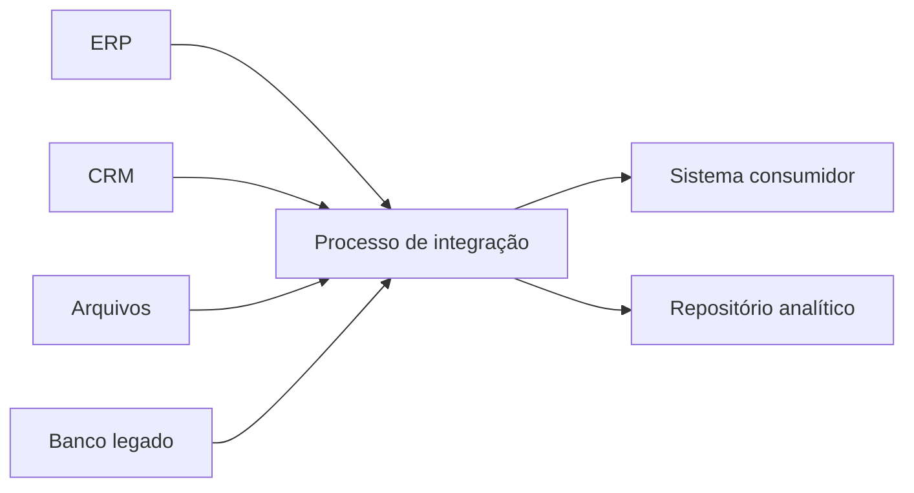
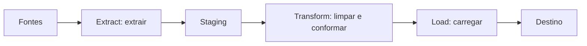
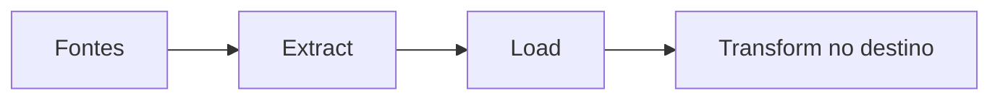
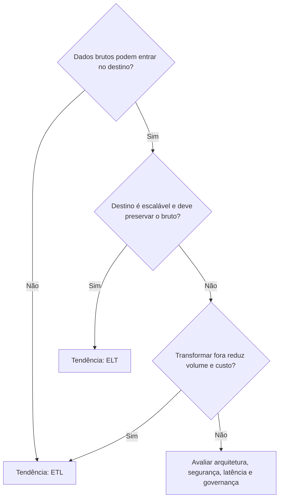
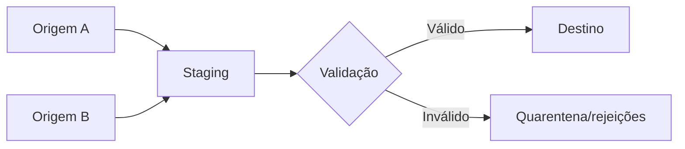
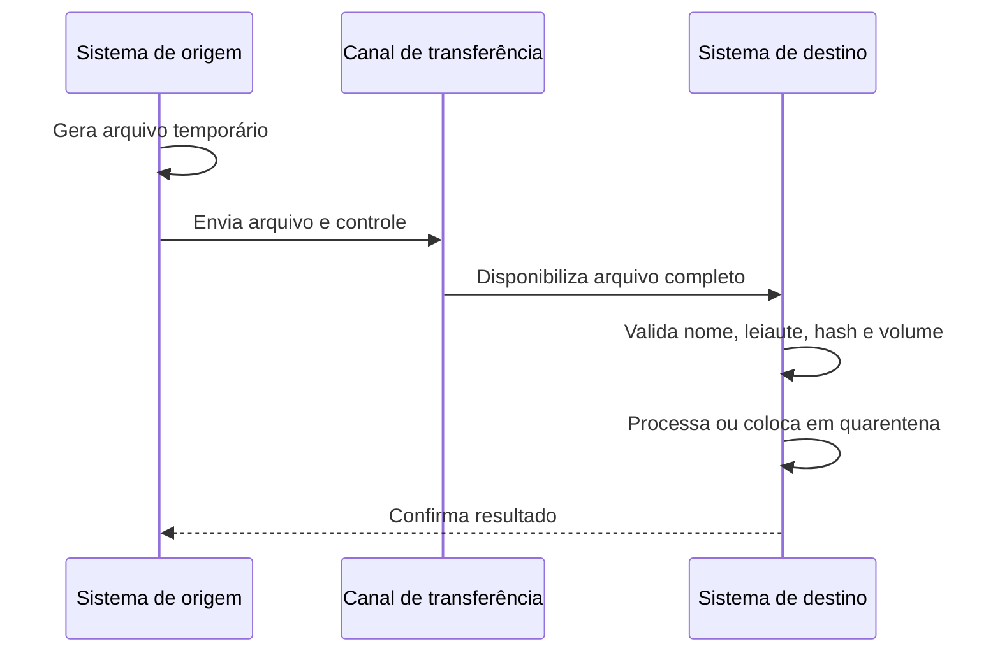

# 1.19 — Integração dos dados

[[1.0 Mapa de estudos — Arquitetura de dados|← Mapa]] · [[1.18 Bancos de dados NoSQL|← NoSQL]] · [[1.20 Banco de dados em memória|Banco em memória →]] · [[Banco de questões — Arquitetura de dados|Questões]]

> [!important] Prioridade CESGRANRIO: **MÉDIA**
> A cobrança isolada deste item tende a ser menor que SQL e modelagem, mas o assunto aparece associado a **Data Warehouse, BI, qualidade de dados e arquitetura**. Priorize ETL × ELT, carga completa × incremental, área de staging e as diferenças entre integração por arquivos e por banco de dados.

## O que você DEVE MANTER e REVISAR — o “coração” da CESGRANRIO

1. **ETL × ELT (Seções 3 e 4):** no ETL, os dados são extraídos, transformados e somente depois carregados no destino. No ELT, são extraídos, carregados e transformados usando o poder computacional do destino. **Pegadinha:** a letra muda a ordem efetiva das operações.

2. **Carga completa × incremental (Seção 6):** a completa recarrega todo o conjunto; a incremental movimenta apenas inclusões e alterações desde o último processamento. A captura incremental pode usar data de modificação, versão, logs ou CDC.

3. **Staging e qualidade (Seções 5 e 8):** staging é uma área intermediária para receber, validar, padronizar e conciliar dados. **Pegadinha:** ela não é necessariamente o repositório analítico final nem deve ser tratada como fonte oficial permanente.

4. **Transferência de arquivos (Seção 10):** integra lotes de maneira simples e desacoplada, mas exige convenções de formato, codificação, leiaute, integridade, segurança, confirmação e reprocessamento. Um arquivo recebido não é automaticamente um arquivo completo e válido.

5. **Integração via base de dados (Seção 11):** pode ocorrer por tabelas de interface/staging, views, replicação, links ou leitura compartilhada. É eficiente, mas aumenta acoplamento e riscos de segurança, concorrência e dependência do esquema. **Pegadinha:** acesso direto às tabelas internas não é sempre a melhor integração.

> [!tip] Regra mental de prova
> **ETL transforma antes de carregar; ELT transforma depois. Full leva tudo; incremental leva a mudança. Arquivo desacopla, mas aumenta latência e controles de lote. Banco reduz etapas, mas aumenta acoplamento.**

> [!note] Limite deste módulo
> Data Lakes e soluções de Big Data serão aprofundados em 1.22. Data Warehouse e OLAP pertencem também à área 7. Aqui o foco é o **processo de integração**, sem aprofundar arquiteturas analíticas futuras.

## Objetivos de aprendizagem

1. definir integração de dados e seus objetivos;
2. explicar todas as etapas de ETL;
3. diferenciar ETL de ELT;
4. distinguir carga completa, incremental e CDC;
5. compreender staging, transformação, validação e reconciliação;
6. comparar integração por arquivo e por banco de dados;
7. reconhecer batch, tempo real e quase tempo real;
8. identificar controles de segurança, qualidade, auditoria e reprocessamento;
9. evitar as principais pegadinhas da CESGRANRIO.

## 1. O que é integração de dados

**Integração de dados** é o conjunto de processos e tecnologias que combinam, movimentam ou disponibilizam dados de diferentes fontes de forma coerente para outro sistema ou finalidade.



Objetivos frequentes:

- consolidar dados dispersos;
- alimentar sistemas operacionais ou analíticos;
- eliminar incompatibilidades de formato e significado;
- reduzir duplicidade e inconsistência;
- permitir visão integrada do negócio;
- sincronizar alterações entre aplicações.

> [!warning] Pegadinha CESGRANRIO
> Integração não é somente transportar bytes. Ela pode exigir **transformação semântica, validação, conciliação, segurança, metadados e controle de qualidade**.

## 2. Dimensões de uma integração

Uma solução deve responder:

| Pergunta | Decisão arquitetural |
|---|---|
| O que será integrado? | Dados, eventos, arquivos ou tabelas |
| De onde e para onde? | Fontes e consumidores |
| Quando? | Lote, quase tempo real ou tempo real |
| Quanto? | Carga completa ou incremental |
| Como transformar? | Regras sintáticas e semânticas |
| Como garantir confiança? | Validação, auditoria, reconciliação e reprocessamento |
| Como proteger? | Criptografia, autenticação, autorização e mascaramento |

### 2.1 Integração em lote, tempo real e quase tempo real

| Modalidade | Funcionamento | Exemplo |
|---|---|---|
| **Batch/lote** | Acumula dados e processa em horários ou janelas definidos | Carga noturna de vendas |
| **Tempo real** | Propaga cada evento com latência muito baixa | Detecção imediata de fraude |
| **Quase tempo real** | Processa em pequenos intervalos ou micro-lotes | Atualização de painel a cada cinco minutos |

> [!warning] Pegadinha CESGRANRIO
> Processamento em lote não é necessariamente manual, e integração automatizada não é necessariamente em tempo real.

## 3. ETL — Extract, Transform, Load

ETL significa **extração, transformação e carga**.



### 3.1 Extract — Extração

Obtém dados das fontes com o menor impacto possível sobre os sistemas produtores.

Pode envolver:

- bancos relacionais e NoSQL;
- arquivos CSV, JSON, XML ou de largura fixa;
- sistemas legados;
- APIs e outros serviços;
- extração total ou somente das mudanças.

Cuidados: janela de extração, impacto de leitura, consistência do recorte, codificação, formato, credenciais e rastreabilidade.

### 3.2 Transform — Transformação

Converte os dados para a estrutura e a semântica esperadas pelo destino.

Operações comuns:

- conversão de tipos e formatos;
- padronização de datas, moedas, unidades e códigos;
- tratamento de valores ausentes;
- validação de domínios;
- deduplicação;
- combinação de fontes;
- cálculo e derivação de atributos;
- aplicação de regras de negócio;
- conformidade de chaves e referências.

### 3.3 Load — Carga

Grava os dados no destino. Pode usar inclusão, atualização, combinação de ambas ou substituição do conjunto.

Cuidados: ordem de carga, integridade referencial, índices, transações, rejeições, auditoria e possibilidade de reexecução.

> [!warning] Pegadinhas CESGRANRIO
> - ETL não significa copiar dados sem mudança.
> - A transformação ocorre **antes da carga no destino final**, embora possa usar uma staging intermediária.
> - Extração deve evitar impacto excessivo no sistema de origem.

## 4. ETL × ELT

No **ELT**, os dados são carregados primeiro e transformados dentro do ambiente de destino.



| Critério | ETL | ELT |
|---|---|---|
| Ordem | Extrair → transformar → carregar | Extrair → carregar → transformar |
| Transformação principal | Motor intermediário | Plataforma de destino |
| Dados brutos no destino | Em geral, menor presença | Frequentemente preservados |
| Poder computacional | Ferramenta de integração | Destino escalável |
| Controle antes da carga | Maior filtragem prévia | Governança precisa controlar dados já carregados |

ELT é comum quando o destino possui alto poder de processamento e armazenamento. Isso não torna ETL obsoleto: a escolha depende de volume, plataforma, governança, segurança e latência.

### 4.1 Quando usar ETL

O **ETL** tende a ser mais adequado quando:

- somente dados já limpos e conformes devem entrar no destino;
- dados sensíveis precisam ser mascarados, filtrados ou descartados **antes** da carga;
- o destino possui capacidade limitada para executar transformações pesadas;
- existe esquema de destino bem definido e relativamente estável;
- deseja-se reduzir o volume carregado, levando apenas os dados necessários;
- as regras são executadas por uma plataforma externa de integração já consolidada.

Exemplo:

```text
ERP e CRM
   → extrair
   → remover registros inválidos
   → mascarar CPF
   → padronizar clientes
   → carregar somente dados tratados no Data Warehouse
```

Nesse caso, o destino recebe dados previamente preparados.

### 4.2 Quando usar ELT

O **ELT** tende a ser mais adequado quando:

- o destino possui grande poder de processamento e armazenamento;
- deseja-se carregar rapidamente dados brutos e transformá-los depois;
- é importante preservar os dados originais para novos usos ou reprocessamentos;
- existem grandes volumes e formatos variados;
- diferentes consumidores precisam criar transformações próprias;
- as regras mudam frequentemente ou ainda estão sendo descobertas.

Exemplo:

```text
ERP, sensores e logs
   → extrair
   → carregar dados brutos na plataforma analítica
   → transformar no próprio destino
   → gerar tabelas tratadas para BI e ciência de dados
```

Nesse caso, o destino precisa de governança para separar dados brutos, tratados e prontos para consumo.

### 4.3 Comparação prática para escolher

| Situação | Tendência de escolha | Motivo |
|---|---|---|
| Dados sensíveis não podem entrar brutos no destino | **ETL** | Mascaramento ou filtragem ocorre antes da carga |
| Destino analítico escalável e grande volume | **ELT** | Usa o processamento do próprio destino |
| Apenas pequeno subconjunto deve ser armazenado | **ETL** | Transforma e filtra antes de carregar |
| Dados brutos devem ser preservados para usos futuros | **ELT** | A carga ocorre antes das transformações de consumo |
| Destino possui pouca capacidade computacional | **ETL** | Processamento fica fora do destino |
| Regras exploratórias e diferentes por consumidor | **ELT** | Permite reinterpretar os dados carregados |



### 4.4 O que NÃO diferencia ETL de ELT

As afirmações abaixo são incorretas como regras gerais:

```text
“ETL é sempre batch e ELT é sempre tempo real.”
“ETL é antigo e ELT sempre o substitui.”
“ELT não realiza transformação.”
“ETL nunca mantém dados brutos.”
“ELT dispensa qualidade e governança.”
“ETL é carga completa e ELT é carga incremental.”
```

ETL e ELT podem operar em lote ou com baixa latência e podem usar carga completa ou incremental. Essas classificações tratam de aspectos diferentes.

> [!warning] Pegadinha CESGRANRIO
> - A diferença essencial é **onde e quando ocorre a transformação principal**, não o simples uso de uma ferramenta específica.
> - No ELT também existe transformação; ela ocorre depois que os dados entram no destino.
> - ETL × ELT não é a mesma comparação que batch × streaming ou full × incremental.
> - Uma arquitetura pode combinar os dois: parte dos dados é tratada antes da carga e outras transformações ocorrem no destino.

## 5. Área de staging

A **staging area** é uma área intermediária e controlada que recebe dados antes do destino final.

Serve para:

- desacoplar a extração da transformação e da carga;
- preservar temporariamente o recorte extraído;
- validar leiautes e tipos;
- cruzar e conciliar fontes;
- registrar rejeições;
- facilitar reinício e reprocessamento;
- reduzir novas consultas à origem.



> [!warning] Pegadinha CESGRANRIO
> Staging é normalmente **temporária e operacional ao processo de integração**. Não se confunde automaticamente com Data Warehouse, Data Mart ou sistema de registro oficial.

## 6. Estratégias de carga

### 6.1 Carga completa — full load

Move todo o conjunto de dados a cada execução.

Vantagens:

- lógica mais simples;
- não depende de detectar alterações individualmente;
- pode reconstruir integralmente o destino.

Desvantagens:

- maior consumo de rede, processamento e janela;
- pode ser inviável para grandes volumes;
- substituição mal planejada pode causar indisponibilidade.

### 6.2 Carga incremental — delta

Move apenas os dados novos ou modificados desde a última execução bem-sucedida.

Pode identificar mudanças por:

- coluna de data/hora da última atualização;
- número de versão ou sequência;
- tabelas de controle;
- triggers — com possível custo e acoplamento;
- leitura do log de transações;
- CDC.

### 6.3 CDC — Change Data Capture

**Captura de Dados Alterados** identifica inserções, atualizações e, idealmente, exclusões ocorridas na origem para propagá-las ao destino.

```text
I = INSERT → incluir no destino
U = UPDATE → atualizar ou versionar
D = DELETE → excluir, inativar ou marcar logicamente
```

CDC pode ser baseado em consultas periódicas, logs, timestamps, triggers ou recursos nativos da plataforma.

> [!warning] Pegadinhas CESGRANRIO
> - Uma coluna `data_atualizacao` pode não capturar **exclusões físicas**.
> - CDC não é sinônimo de replicação: pode alimentar transformações e destinos diferentes.
> - Incremental reduz volume, mas aumenta a complexidade de controle.

## 7. Ordem de carga e integridade

Em um destino relacional com chaves estrangeiras, a ordem importa:

```text
Carga:     tabelas-pai → tabelas-filhas
Exclusão:  tabelas-filhas → tabelas-pai
```

Exemplo:

```sql
-- Primeiro, a entidade referenciada
INSERT INTO cliente (id_cliente, nome)
VALUES (10, 'Ana');

-- Depois, a entidade que contém a chave estrangeira
INSERT INTO pedido (id_pedido, id_cliente, valor)
VALUES (501, 10, 250.00);
```

Em cargas volumosas, desabilitar restrições ou índices pode acelerar operações, mas exige autorização, janela controlada, validação posterior e reconstrução segura. Não é uma regra universal.

## 8. Qualidade, reconciliação e tratamento de erros

Uma integração confiável deve detectar e explicar perdas, duplicações e alterações indevidas.

### 8.1 Controles importantes

| Controle | Finalidade |
|---|---|
| Contagem de registros | Comparar enviados, recebidos, aceitos e rejeitados |
| Total de controle | Comparar soma de valores relevantes |
| Hash/checksum | Detectar corrupção ou alteração de conteúdo |
| Validação de esquema | Conferir colunas, tipos e obrigatoriedade |
| Chave de negócio | Detectar duplicidades |
| Log de execução | Registrar início, fim, status, volume e erro |
| Quarentena | Separar registros inválidos sem perdê-los |
| Reconciliação | Demonstrar que origem e destino são compatíveis |

### 8.2 Idempotência

Uma operação é **idempotente** quando sua repetição, com a mesma entrada, não produz efeitos adicionais indevidos.

Exemplo: reprocessar o mesmo arquivo não deve duplicar todos os pedidos. Podem ser usados identificador de lote, chave única, controle de arquivo e operação de **upsert**.

```sql
-- Sintaxe ilustrativa; varia conforme o SGBD
MERGE INTO cliente d
USING staging_cliente s
   ON (d.id_cliente = s.id_cliente)
WHEN MATCHED THEN
  UPDATE SET d.nome = s.nome
WHEN NOT MATCHED THEN
  INSERT (id_cliente, nome)
  VALUES (s.id_cliente, s.nome);
```

> [!warning] Pegadinha CESGRANRIO
> Reexecutar uma carga sem controle pode produzir duplicidade. **Idempotência não significa que a operação nunca altera dados**; significa que repetir a mesma solicitação não acumula efeitos indevidos.

## 9. Metadados e linhagem

Metadados ajudam a responder:

- qual é a origem do campo;
- qual regra o transformou;
- quando e por qual processo foi carregado;
- qual versão do leiaute foi usada;
- quais registros foram rejeitados;
- quais consumidores serão afetados por uma mudança.

A **linhagem de dados** registra o caminho do dado da origem ao destino e as transformações sofridas.

```text
ERP.valor_item
   → conversão de moeda
   → soma por pedido
   → DW.fato_venda.valor_total
```

Metadados foram estudados em [[1.6 - Metadados|1.6 Metadados]].

## 10. Integração por transferência de arquivos

Os sistemas trocam arquivos por diretório compartilhado, SFTP ou mecanismo equivalente. É comum em processamento em lote e integração com sistemas legados ou organizações diferentes.

### 10.1 Fluxo típico



### 10.2 Formatos comuns

| Formato | Característica |
|---|---|
| CSV/delimitado | Simples, compacto, exige regras para delimitador, aspas e codificação |
| Largura fixa | Posição define cada campo; comum em legados |
| JSON | Hierárquico e autodescritivo, porém mais verboso |
| XML | Estruturado e validável por esquema, mas verboso |
| Binário/colunar | Compacto e eficiente, depende de bibliotecas e esquema compatíveis |

### 10.3 Controles essenciais

- convenção de nome e versão do leiaute;
- arquivo de sinalização ou renomeação atômica após a escrita;
- tamanho, contagem, checksum ou hash;
- criptografia em trânsito e, quando necessário, em repouso;
- autenticação e autorização;
- retenção, arquivamento e descarte;
- prevenção de processamento duplicado;
- confirmação e tratamento de falhas.

### 10.4 Vantagens e desvantagens

| Vantagens | Desvantagens |
|---|---|
| Simplicidade e ampla compatibilidade | Latência normalmente maior |
| Bom desacoplamento temporal | Mudanças de leiaute quebram consumidores |
| Adequado a grandes lotes | Exige controles de completude e duplicidade |
| Facilita retenção e reprocessamento | Menor adequação a interação síncrona |

> [!warning] Pegadinhas CESGRANRIO
> - A extensão `.csv` não garante codificação, delimitador, esquema ou qualidade.
> - O consumidor não deve ler um arquivo ainda em gravação; usa-se sinalização, diretório temporário ou renomeação atômica.
> - Hash verifica integridade, mas não substitui autenticação nem criptografia.

## 11. Integração via base de dados

O consumidor acessa dados disponibilizados em um banco ou recebe alterações propagadas entre bancos.

### 11.1 Formas frequentes

- **tabelas de interface ou staging:** contrato próprio para troca;
- **views:** expõem representação controlada dos dados;
- **stored procedures:** encapsulam operações específicas;
- **replicação:** mantém cópias sincronizadas;
- **database link/federation:** consulta fonte remota;
- **banco compartilhado:** aplicações leem/escrevem o mesmo esquema.

### 11.2 Tabela de interface

```sql
CREATE TABLE integracao_pedido (
    id_evento       BIGINT PRIMARY KEY,
    id_pedido       BIGINT NOT NULL,
    tipo_operacao   CHAR(1) NOT NULL,
    instante_evento TIMESTAMP NOT NULL,
    status          VARCHAR(20) NOT NULL
);
```

Uma tabela dedicada explicita o contrato e reduz a dependência das tabelas internas. Ainda requer controle de acesso, retenção, concorrência e confirmação do processamento.

### 11.3 Vantagens e riscos

| Vantagens | Riscos/desvantagens |
|---|---|
| Acesso eficiente e consultas estruturadas | Acoplamento ao esquema e ao SGBD |
| Uso de transações e restrições | Contenção e impacto na origem |
| Menos manipulação de arquivos | Exposição indevida de dados |
| Atualização com baixa latência | Mudanças internas podem quebrar consumidores |

> [!warning] Pegadinhas CESGRANRIO
> - Compartilhar tabelas internas cria **forte acoplamento**: consumidores dependem do esquema físico.
> - Uma `VIEW` pode reduzir exposição e estabilizar o contrato, mas não elimina todos os problemas de desempenho ou segurança.
> - Replicação aumenta disponibilidade ou escala de leitura, mas não é automaticamente backup nem integração sem conflito.

## 12. Arquivos × base de dados

| Critério | Transferência de arquivos | Integração via base de dados |
|---|---|---|
| Padrão comum | Lote | Lote ou menor latência |
| Acoplamento temporal | Menor | Pode ser maior |
| Acoplamento estrutural | Ao leiaute do arquivo | Ao esquema/interface do banco |
| Grandes volumes | Boa para lotes | Depende de consultas, rede e carga no SGBD |
| Controle de completude | Arquivo de controle, hash, contagem | Transações, marcas e tabelas de controle |
| Reprocessamento | Natural se o arquivo for retido | Exige histórico ou staging adequado |
| Risco principal | Arquivo parcial, duplicado ou incompatível | Concorrência, segurança e quebra de esquema |

Nenhuma modalidade é universalmente superior. A decisão considera volume, frequência, latência, confiabilidade, segurança, governança e capacidade dos sistemas.

## 13. Segurança e privacidade

Uma integração pode ampliar a superfície de exposição dos dados. Controles relevantes:

- privilégio mínimo nas contas técnicas;
- criptografia em trânsito e em repouso;
- gestão segura de credenciais e chaves;
- mascaramento ou pseudonimização quando cabível;
- logs de acesso e trilha de auditoria;
- retenção e descarte conforme a finalidade;
- validação de entrada e arquivos;
- segregação entre desenvolvimento, teste e produção.

> [!warning] Pegadinha CESGRANRIO
> Criptografia protege confidencialidade, mas sozinha não garante qualidade, autenticidade, disponibilidade ou autorização adequada.

## 14. Falhas frequentes e soluções

| Falha | Consequência | Controle |
|---|---|---|
| Carga repetida | Duplicidade | Idempotência e chave de lote |
| Perda do ponto de captura | Lacuna de dados | Watermark/checkpoint e reconciliação |
| Mudança de leiaute | Erros de interpretação | Versionamento e validação de esquema |
| Arquivo parcial | Carga incompleta | Sinalização e renomeação atômica |
| Registro inválido | Interrupção ou dado ruim | Quarentena e regras de rejeição |
| Falha no meio da carga | Estado inconsistente | Transação, checkpoint e reinício controlado |
| Leitura pesada na origem | Degradação operacional | Réplica, janela, CDC ou extração otimizada |
| Exclusão não capturada | Destino desatualizado | Log/CDC ou marcador de exclusão |

## 15. Prioridade de estudo

### Alta importância dentro do tópico

- etapas de ETL;
- ETL × ELT;
- carga completa × incremental;
- CDC e captura de exclusões;
- função da staging;
- arquivos × integração via base;
- idempotência, auditoria e reconciliação.

### Chance média

- batch × tempo real × quase tempo real;
- formatos CSV, JSON, XML e largura fixa;
- views, tabelas de interface e replicação;
- linhagem e metadados de integração;
- ordem de carga por integridade referencial.

### Apenas reconhecimento neste momento

- arquiteturas de Data Lake e Big Data — item 1.22;
- modelagem completa de Data Warehouse — itens 1.7 e 7.6;
- ferramentas ou produtos específicos de integração;
- streaming distribuído em profundidade.

## 16. Checklist de revisão

- [ ] ETL transforma antes da carga final; ELT transforma no destino.
- [ ] Sei explicar extração, transformação e carga.
- [ ] Staging é intermediária e não o destino analítico final por definição.
- [ ] Carga completa leva tudo; incremental leva mudanças.
- [ ] CDC deve considerar inserções, atualizações e exclusões.
- [ ] Timestamp isolado pode não capturar exclusão física.
- [ ] Sei diferenciar batch, tempo real e quase tempo real.
- [ ] Idempotência evita efeitos adicionais em reprocessamentos iguais.
- [ ] Arquivos exigem leiaute, hash, completude e controle de duplicidade.
- [ ] Integração direta pelo banco pode aumentar acoplamento e contenção.
- [ ] Tabelas de interface e views criam contratos mais controlados.
- [ ] Reconciliação compara o que saiu da origem com o que chegou ao destino.

## 17. Questões inéditas — estilo CESGRANRIO

### 17.1 Questão 1

Uma companhia extrai diariamente registros de vendas de diferentes sistemas. Os dados são inicialmente gravados sem alteração em uma plataforma analítica escalável e, nessa própria plataforma, são padronizados, deduplicados e agregados para consumo dos relatórios.

O processo descrito caracteriza predominantemente

A) ETL, porque toda integração que contém extração é necessariamente ETL.  
B) ELT, porque a carga precede a transformação executada no destino.  
C) CDC, porque todos os registros são obrigatoriamente obtidos de logs.  
D) replicação, porque os dados são transformados antes de chegar ao destino.  
E) carga completa, porque deduplicação exige a substituição diária de todos os dados.

> [!success]- Gabarito comentado
> **Resposta: B.** A ordem informada é extrair, **carregar os dados brutos** e transformar na plataforma de destino: ELT. A alternativa A ignora a ordem das etapas. Nada no enunciado garante CDC, replicação ou carga completa.

### 17.2 Questão 2

Para integrar pedidos por arquivos noturnos, uma equipe precisa permitir reprocessamento após falhas sem duplicar pedidos e impedir que o consumidor leia arquivos ainda incompletos.

Uma combinação adequada de controles é

A) remover as chaves de negócio e processar o arquivo enquanto ele é escrito.  
B) usar apenas criptografia, pois ela garante completude e unicidade dos pedidos.  
C) manter identificador único de lote ou registros e sinalizar atomicamente a conclusão do arquivo.  
D) substituir o arquivo por acesso irrestrito às tabelas internas da aplicação.  
E) dispensar logs depois que a transferência for concluída com sucesso.

> [!success]- Gabarito comentado
> **Resposta: C.** Identificadores e controle do lote apoiam a **idempotência**; sinalização ou renomeação atômica impede a leitura prematura. Criptografia não evita duplicidade ou arquivo parcial, e acesso irrestrito cria riscos de segurança e acoplamento.

## 18. Resumo de véspera

```text
INTEGRAÇÃO = transportar + transformar + validar + controlar
ETL = extrair → transformar → carregar
ELT = extrair → carregar → transformar no destino
STAGING = área intermediária para validação, conciliação e reprocessamento
FULL = todo o conjunto
INCREMENTAL/DELTA = apenas mudanças desde o último ponto
CDC = captura INSERT, UPDATE e DELETE
BATCH = processamento em lotes
TEMPO REAL = evento com latência muito baixa
IDEMPOTÊNCIA = repetir a mesma entrada sem efeitos extras indevidos
RECONCILIAÇÃO = comparar origem, processamento e destino
ARQUIVO = simples e desacoplado; controlar leiaute, completude, hash e duplicidade
BASE DE DADOS = eficiente; cuidar de acoplamento, concorrência e segurança
CARGA RELACIONAL = pai antes do filho; exclusão na ordem inversa
```
