---

area: Arquitetura de Dados

topico: "1.2"

assunto: Criação e alteração dos modelos lógico e físico de dados

prioridade: alta

banca: CESGRANRIO

status: em_estudo

tags:

- concurso

- cesgranrio

- arquitetura-de-dados

- modelo-logico

- modelo-fisico

- ddl

- migracao-de-schema

---
> [!important] Prioridade CESGRANRIO: **ALTA**

> A banca raramente cobra apenas “qual é a definição de modelo lógico?”. Ela apresenta uma regra de negócio, um esquema ou comandos DDL e exige reconhecer qual transformação preserva cardinalidade, integridade e dados existentes. As pegadinhas mais fortes envolvem lado da FK, `NULL`, `UNIQUE`, operações destrutivas e confusão entre decisão lógica e física.

## O que você DEVE MANTER e REVISAR — o “coração” da CESGRANRIO

A CESGRANRIO tende a cobrar a transformação prática do modelo em cinco pilares:

1. **Entidade e identificador → tabela e PK (Seção 3.1):** entidade forte gera relação própria; seu identificador gera chave primária. Entidade fraca incorpora a chave do proprietário e seu discriminador.

2. **Mapeamento de cardinalidades (Seção 3.3):** em `1:N`, a FK fica no lado N; em `N:M`, surge tabela associativa; em `1:1`, a FK pode ficar em um dos lados, com `UNIQUE` e obrigatoriedade coerentes. **Pegadinha:** colocar a FK no lado 1 em um relacionamento `1:N`.

3. **Atributos especiais (Seção 3.2):** atributo composto é decomposto quando seus componentes precisam ser manipulados; atributo multivalorado normalmente gera nova relação; atributo derivado exige decisão sobre cálculo ou armazenamento.

4. **Lógico × físico (Seções 4 e 4.1):** tabela, PK, FK e domínio lógico são concretizados por tipos e restrições do SGBD. Índice e particionamento são decisões físicas, não regras conceituais.

5. **Alteração segura do esquema (Seções 4.2 e 4.3):** avaliar `NULL`, `UNIQUE`, FKs e dados existentes antes de aplicar mudanças. **Pegadinha:** presumir que adicionar uma restrição corrige automaticamente valores inválidos já armazenados.

## Objetivos de aprendizagem

Ao final deste módulo, você deverá conseguir:

1. criar um modelo lógico relacional a partir de requisitos e de um DER;
6. transformar relacionamentos, atributos complexos e hierarquias;
3. derivar um modelo físico para um SGBD concreto;
4. alterar esquemas preservando integridade e disponibilidade;
5. avaliar impacto sobre dados, aplicações e desempenho;
6. distinguir evolução lógica de ajuste físico;
7. resolver questões de DDL e migração no padrão CESGRANRIO.
## 1. Mapa mental do processo


O processo não termina no primeiro `CREATE TABLE`. Sistemas mudam, regras evoluem e volumes crescem. Modelagem inclui **evolução controlada**, e não apenas desenho inicial.

## 4. O que pertence ao modelo lógico e ao físico

| Decisão                                        |       Modelo lógico       |            Modelo físico            |
| ---------------------------------------------- | :-----------------------: | :---------------------------------: |
| Criar a relação `CLIENTE`                      |             ✓             |             materializa             |
| Definir chave primária e estrangeira           |             ✓             |             implementa              |
| Definir domínio conceitual de um atributo      |             ✓             |             concretiza              |
| Tornar a participação obrigatória              |             ✓             | implementa com `NOT NULL`/restrição |
| Escolher `VARCHAR(254)` no PostgreSQL          |                           |                  ✓                  |
| Criar índice B-tree                            |                           |                  ✓                  |
| Particionar por intervalo de datas             |                           |                  ✓                  |
| Escolher tablespace, compressão ou fill factor |                           |                  ✓                  |
| Desnormalizar por desempenho                   | altera a estrutura lógica |  também exige implementação física  |

> [!warning] Pegadinha
> Uma restrição pode nascer no nível conceitual/lógico e ser implementada fisicamente. O fato de `NOT NULL` aparecer no DDL não transforma a obrigatoriedade do relacionamento em mera regra física.

## 3. Do modelo conceitual para o lógico
A transição do **Modelo Conceitual** (Diagrama Entidade-Relacionamento — DER) para o **Modelo Lógico Relacional** segue regras estritas de derivação. Abaixo está o mapeamento detalhado de cada componente conceitual para a sua respectiva estrutura no modelo lógico:
### 3.1 Mapeamento de Entidades
- **Entidades Fortes:**
    - Viram uma **Tabela** (Relação) individual.
	    - **Atributo Identificador:** Vira a **Chave Primária (PK)**. Caso tenha mais de um atributo identificador, apenas uma deve formar a chave primária
    - **Atributos Simples:** Viram as **Colunas** da tabela.
    - **Exemplo 1:**
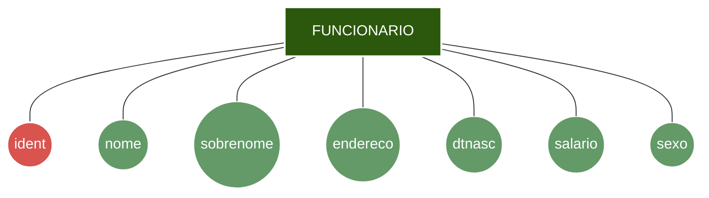

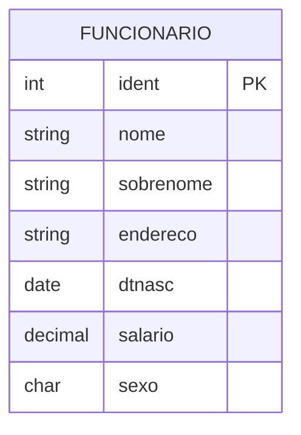

- **Entidades Fracas:**
    - Viram uma **Tabela** própria.
    - **Chave Primária (PK):** Será uma **chave composta** formada pela junção da Chave Primária (PK) da entidade forte proprietária (que   entra como Chave Estrangeira - FK) mais o seu próprio atributo parcial/discriminador.
    - **Exemplo 2:** 
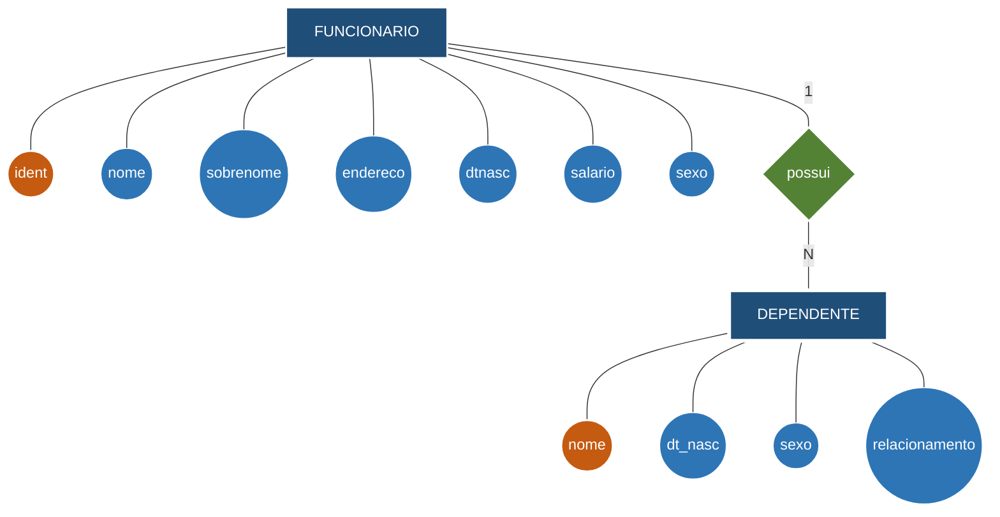

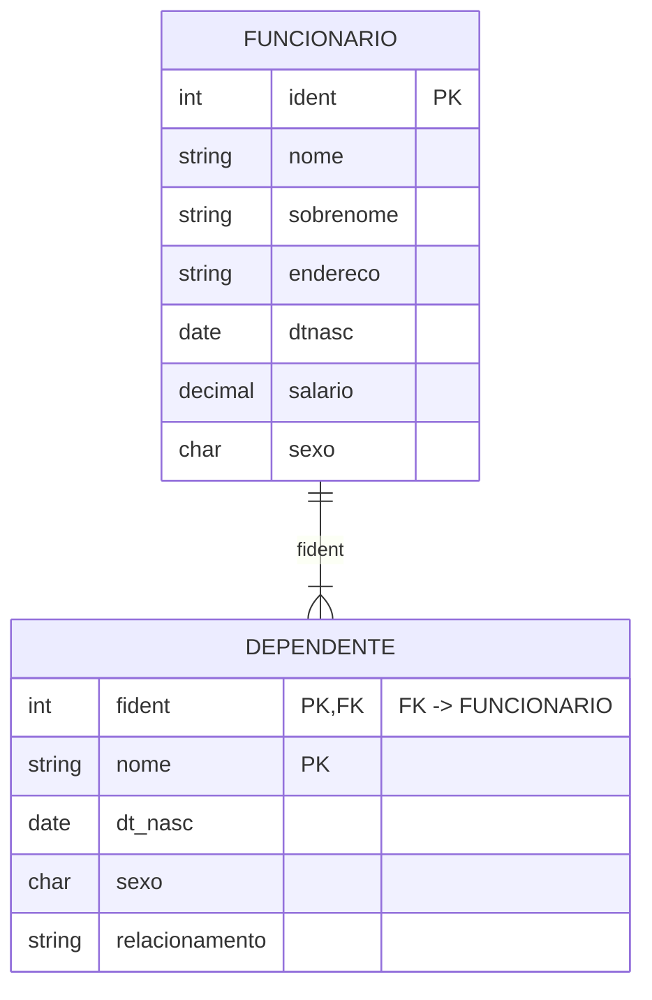
### 3.2 Mapeamento de Atributos Especiais
- **Atributos Multivalorados (ex: Telefone, E-mail):**
    - Não podem permanecer na tabela principal para não violar a Primeira Forma Normal (1FN).
    - **Transformação:** Geram uma **nova tabela dedicada**. A PK dessa nova tabela será composta pela PK da entidade original (como FK) + o próprio valor do atributo.
    - **Exemplo 3:**
      No modelo conceitual, `localizacao` é multivalorado em `DEPARTAMENTO`. No modelo lógico, torna-se a relação `LOCALIZACOES`, identificada por `(dnumero, localizacao)`.

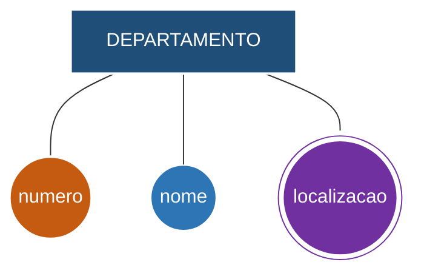

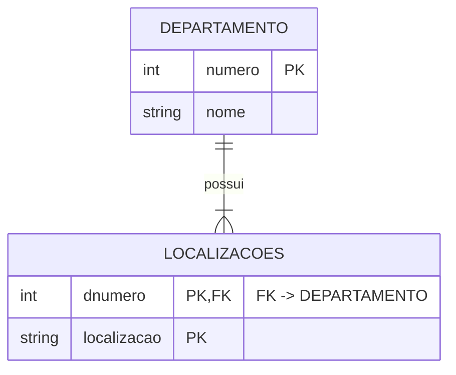

> [!warning] Pegadinha CESGRANRIO
> Não se cria `localizacao1`, `localizacao2` etc. A nova relação elimina o grupo repetitivo, e sua PK composta impede repetir a mesma localização para o mesmo departamento.

- **Atributos Compostos (ex: Endereço formado por Rua, Número, Bairro):**
    - São desmembrados. O atributo genérico/pai desaparece, e suas **partes componentes viram colunas diretas** na tabela principal.
- **Atributos Derivados (ex: Idade calculada pela DataNascimento):**
    -  Em regra, **não viram colunas** na tabela para evitar redundância de dados, sendo calculados via _queries_ (SQL) ou visões (_Views_).
### 3.3 Mapeamento de Relacionamentos
O mapeamento de relacionamentos é determinado pela cardinalidade máxima de cada lado:
- **Relacionamentos 1:1 (Um para Um):**
    - A Chave Primária de uma das tabelas migra como **Chave Estrangeira (FK)** para a outra.
    - **Regra de Migração:** A FK deve ser inserida preferencialmente na tabela cuja participação no relacionamento for **total/obrigatória** (minimizando a presença de valores nulos).
- **Relacionamentos 1:N (Um para Muitos):**
    - A Chave Primária da entidade do lado "1" migra para a tabela da entidade do lado "N" como **Chave Estrangeira (FK)**.
- **Relacionamentos N:M (Muitos para Muitos):**
    -  Deve criar uma nova tabela (Tabela Associativa ou de Junção).
    - **Chaves:** A Chave Primária (PK) da nova tabela será a **combinação das Chaves Primárias das duas tabelas originais** (uma PK composta formada por duas FKs).
    - **Atributos do Relacionamento:** Se o relacionamento conceitual possuir atributos, eles viram colunas nesta nova tabela.
- **Relacionamentos n-ários:** 
	- Para cada relacionamento n-ário, no qual n > 2, criar uma nova relação S para representa-lo
	- Incluir como chaves estrangeiras em S as chaves primárias das relações
	- Incluir como chave primária todas as chaves estrangeiras em S que tenham cardinalidade > 1
	- **Atributos do Relacionamento:** Se o relacionamento conceitual possuir atributos, eles viram colunas nesta nova tabela.
- **Obs.:** Nos relacionamentos 1:1 e 1:N, a **FK** pode ser colocada tanto no relacionamento normal, quanto no auto-relacionamento
- **Exemplo 4:**:
	<a name="exemplo4"></a>
	Relacionamento **1:1** `gerencia`: cada departamento possui exatamente um gerente; um funcionário gerencia no máximo um departamento. A FK migra para `DEPARTAMENTO`, lado de participação total, e recebe `UNIQUE`. O atributo `dtinicio` do relacionamento também migra para essa tabela.

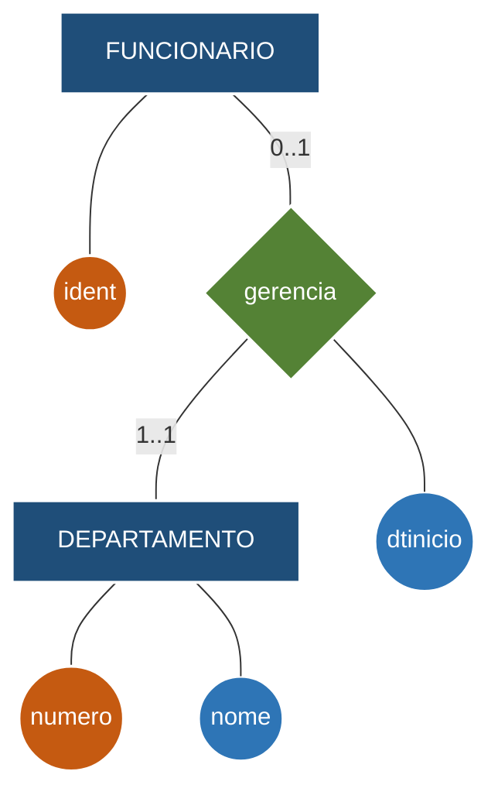

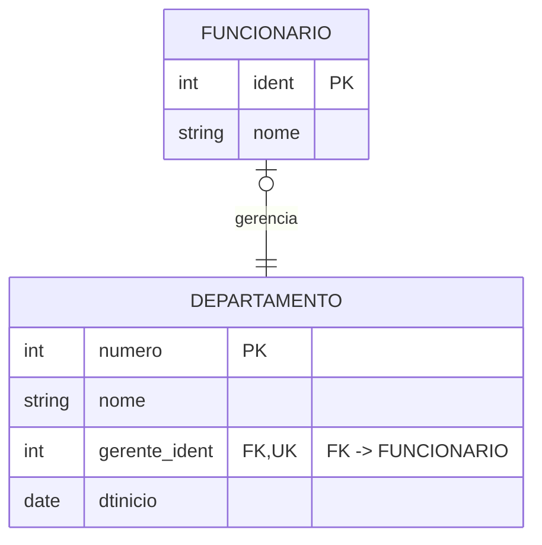

> [!warning] Pegadinha CESGRANRIO
> A FK sozinha implementaria 1:N. A restrição `UNIQUE` sobre `gerente_ident` é o que impede um funcionário de gerenciar vários departamentos.

- **Exemplo 5:**
	<a name="exemplo5"></a>
	Relacionamento **1:N** `pertence`: vários funcionários pertencem a um departamento; a PK do lado 1 migra para o lado N.

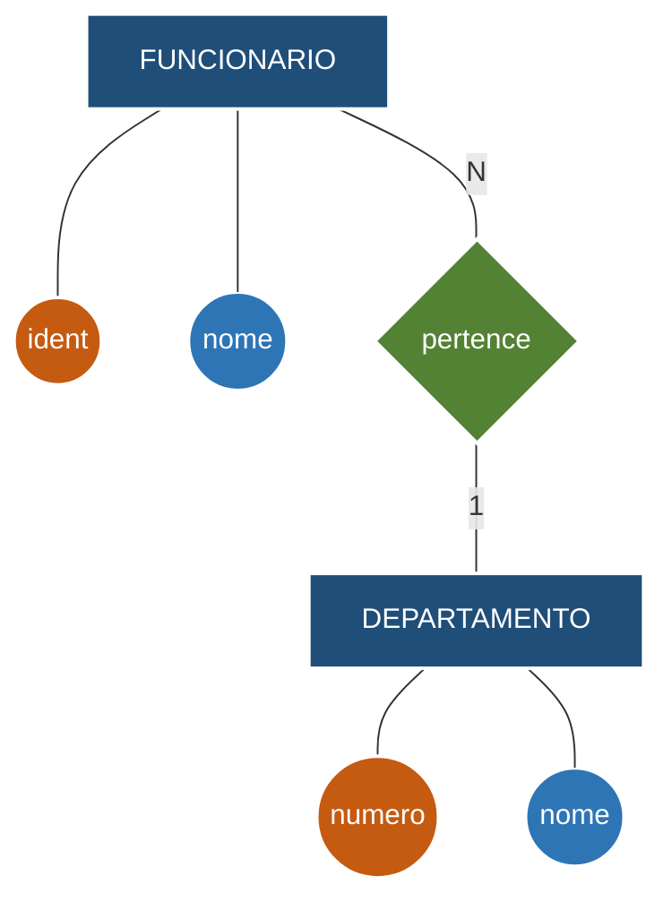

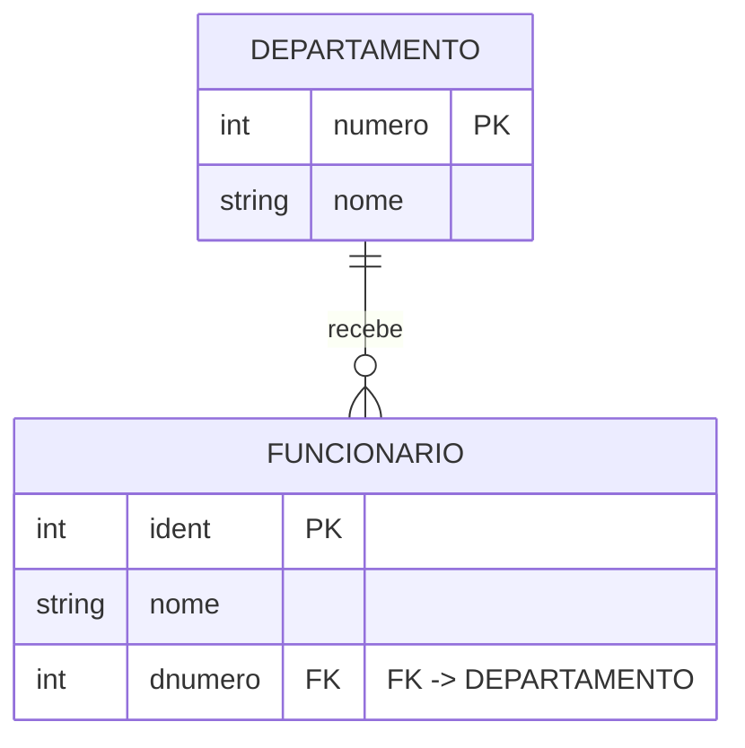

> [!warning] Pegadinha CESGRANRIO
> A chave `DEPARTAMENTO.numero` migra para `FUNCIONARIO`, o lado N. Criar `fident` em `DEPARTAMENTO` inverteria a dependência e não representaria todos os funcionários.

- **Exemplo 6:**
	<a name="exemplo6"></a>
	Relacionamento **N:M** `trabalha_em`, com o atributo próprio `horas`. Ele origina a relação associativa `TRABALHA_EM`.

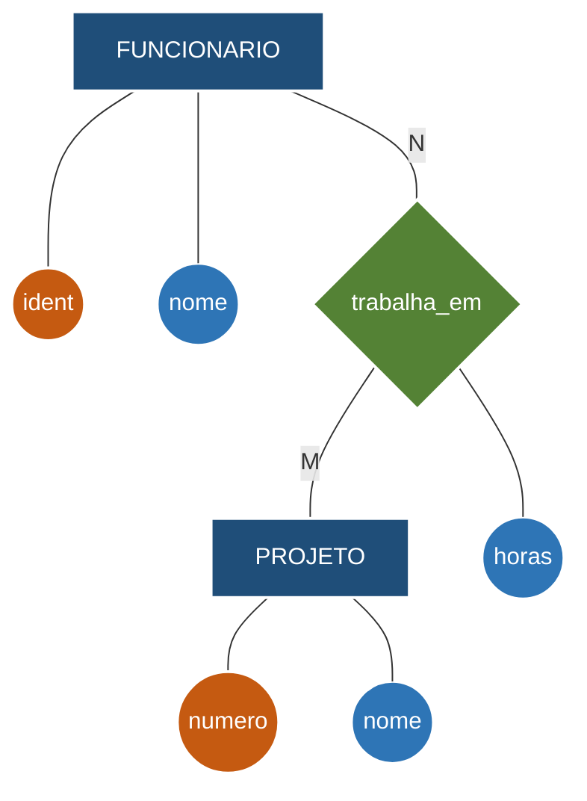

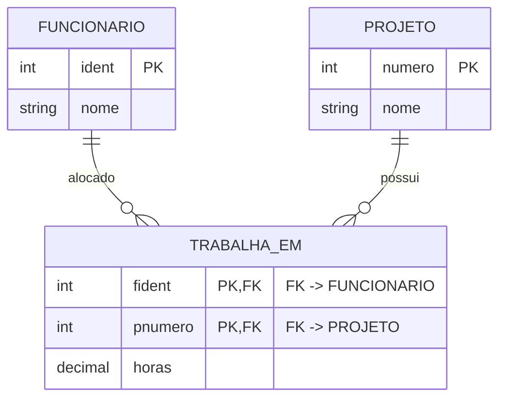

> [!warning] Pegadinha CESGRANRIO
> `horas` depende do par funcionário–projeto; portanto, pertence à tabela associativa, e não isoladamente a `FUNCIONARIO` ou `PROJETO`.
### 3.6 Mapeamento de especializações ou generalizações 
A conversão da hierarquia de especialização para o modelo relacional exige transformar superclasses e subclasses em tabelas. As **4 opções** de mapeamento apresentadas na aula são:
* **Opção 1: Múltiplas Relações (Uma Tabela para a Superclasse e uma para Cada Subclasse)**
	* **Criação de Tabelas:** Cria-se uma tabela para a superclasse (com seus atributos e sua PK) e uma tabela individual para cada subclasse.
	* **Chaves:** Cada tabela de subclasse ganha seus atributos específicos e **herda a chave primária da superclasse**, que atuará como sua **Chave Primária (PK) e Chave Estrangeira (FK)**.
	* **Atributo Discriminador (Opcional):** Pode-se incluir na superclasse um atributo do tipo `tipo` (ex.: `Ftipo`) para indicar diretamente para qual subclasse a entidade será mapeada.
	* **Restrições:** **Funciona em qualquer tipo de especialização** (total ou parcial; com disjunção ou sobreposição).
	* **Exemplo 7:**
		<a name="exemplo7"></a>
		Especialização de `FUNCIONARIO` em `ENGENHEIRO`, `MOTORISTA` e `ADMINISTRATIVO`, mantendo uma tabela para o supertipo e uma para cada subtipo.

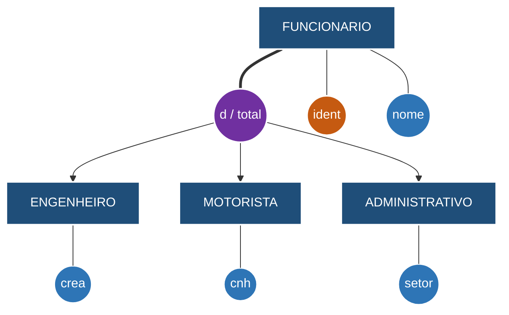

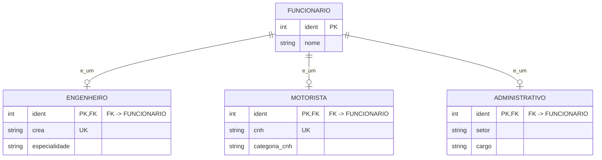

> [!note] Aplicabilidade
> A PK de cada subtipo também é FK para `FUNCIONARIO`. Essa estratégia suporta especialização total ou parcial, disjunta ou sobreposta.

* **Opção 2: Relações Apenas para as Subclasses (Elimina a Tabela da Superclasse)**
	* **Criação de Tabelas:** Não se cria tabela para a superclasse. Cria-se uma tabela apenas para cada subclasse.
	* **Atributos e Chaves:** Cada tabela de subclasse conterá seus atributos específicos **mais todos os atributos da superclasse**, utilizando a chave primária original da superclasse.
	* **Restrições Severas:**
	* **Exige Participação Total:** Só pode ser usada se a especialização for de **participação total** (onde a superclasse precisa obrigatoriamente se especializar em alguma subclasse). Não funciona em parcial porque não haveria onde cadastrar o elemento da superclasse.
	* **Recomendada para Disjunção:** Ideal quando há restrição de **disjunção**. Se for sobreposta, a mesma entidade precisaria duplicar todos os dados da superclasse em tabelas diferentes.
	* **Exemplo 8:**
		<a name="exemplo8"></a>
		A mesma especialização é mapeada sem uma tabela `FUNCIONARIO`; seus atributos são repetidos em cada tabela concreta.


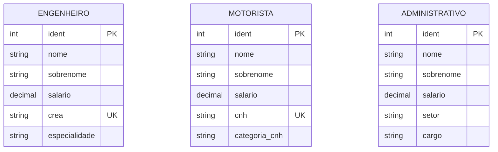

> [!warning] Restrição decisiva
> Sem a tabela do supertipo, uma especialização parcial perderia os funcionários que não pertencem a nenhum subtipo. Em sobreposição, os dados comuns seriam duplicados.

* **Opção 3: Relação Única com Um Único Atributo Tipo (Discriminador Único)**
	* **Criação de Tabelas:** Cria-se apenas **uma única tabela** para representar toda a especialização (superclasse + todas as subclasses).
	* **Atributos:** Contém a união de todos os atributos da superclasse, todos os atributos das subclasses e **um atributo discriminador tipo $T$**.
	* **Comportamento das Colunas:** O atributo $T$ indica a qual subclasse a linha pertence. Os atributos das outras subclasses para as quais o registro não pertence **receberão valor nulo (`NULL`)**.
	* **Restrições:** Adequada para especializações com **restrição de disjunção**
	* **Exemplo 9:**
		<a name="exemplo9"></a>
		Toda a hierarquia é armazenada em `FUNCIONARIO`, e `tipo_funcionario` assume um único valor (`E`, `M` ou `A`).


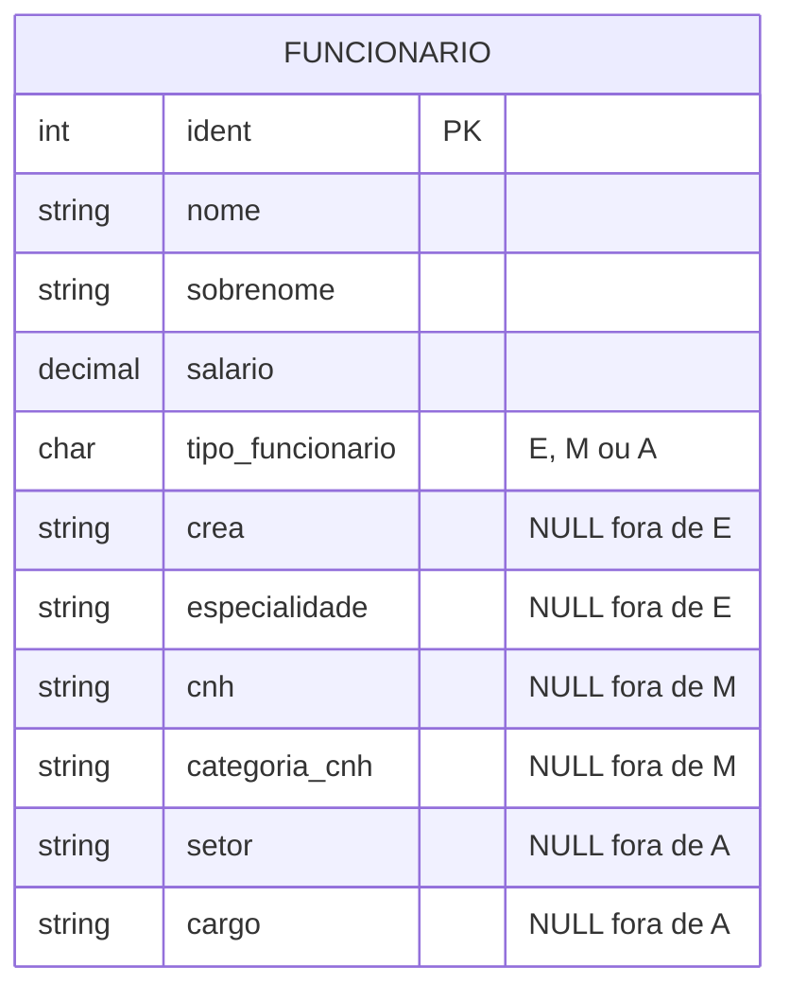

> [!warning] Pegadinha CESGRANRIO
> Um discriminador único representa naturalmente uma especialização **disjunta**. Os atributos exclusivos dos outros subtipos ficam nulos e exigem restrições condicionais para manter consistência.

* **Opção 4: Relação Única com Múltiplos Atributos Tipo (Flags Booleanos)**
	* **Criação de Tabelas:** Cria-se apenas **uma única tabela** para toda a especialização.
	* **Atributos e Flags:** Unifica todos os atributos da superclasse e das subclasses, e adiciona **um conjunto de atributos tipo (flags booleanos $T_1, T_2, \dots, T_m$)**, onde cada flag representa uma subclasse.
	* **Valoração:** Se a entidade pertence a uma subclasse, o flag correspondente recebe valor `1` (verdadeiro); se não pertence, recebe `0` (falso).
	* **Restrições:** É a opção ideal quando é necessário trabalhar com **sobreposição** (onde uma mesma entidade pode pertencer a mais de uma subclasse simultaneamente, ativando múltiplos flags com valor `1`).
	* **Exemplo 10**:
		<a name="exemplo10"></a>
		A hierarquia sobreposta é armazenada em uma única tabela com uma flag por subtipo. Um funcionário pode, por exemplo, ser engenheiro e administrativo simultaneamente.

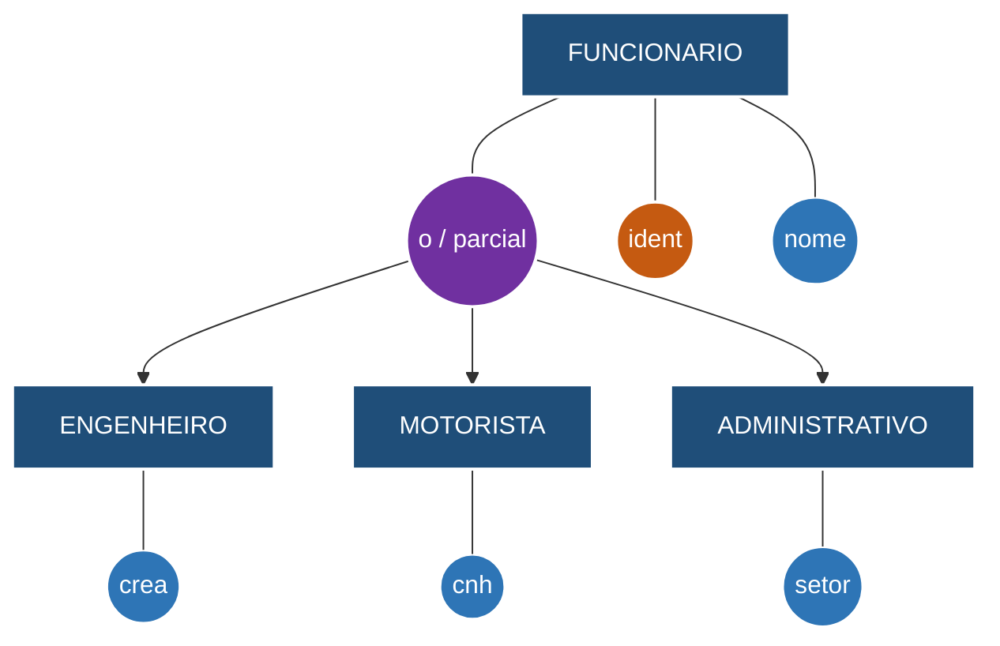

```mermaid
erDiagram
    FUNCIONARIO {
        int ident PK
        string nome
        string sobrenome
        decimal salario
        boolean eh_engenheiro
        boolean eh_motorista
        boolean eh_administrativo
        string crea "NULL se flag falsa"
        string especialidade "NULL se flag falsa"
        string cnh "NULL se flag falsa"
        string categoria_cnh "NULL se flag falsa"
        string setor "NULL se flag falsa"
        string cargo "NULL se flag falsa"
    }
```

> [!note] Sobreposição e totalidade
> As flags permitem múltiplos subtipos ativos. Se a especialização for total, uma restrição deve exigir ao menos uma flag verdadeira; se for parcial, todas podem ser falsas.
### 3.5 Resumo Visual das Regras de Mapeamento

| **Componente Conceitual (DER)** | **Estrutura Lógica Relacional**                      |
| ------------------------------- | ---------------------------------------------------- |
| **Entidade Forte**              | Tabela individual com PK                             |
| **Entidade Fraca**              | Tabela com PK Composta (PK da Forte + Discriminador) |
| **Atributo Simples**            | Coluna na tabela da entidade                         |
| **Atributo Composto**           | Colunas individuais para cada parte do atributo      |
| **Atributo Multivalorado**      | Nova tabela (FK da entidade + Atributo)              |
| **Relacionamento 1:1**          | FK inserida na tabela com participação total         |
| **Relacionamento 1:N**          | FK do lado "1" migra para a tabela do lado "N"       |
| **Relacionamento N:M**          | Nova Tabela Associativa (PK Composta pelas FKs)      |


## 4. Lógico para fisico
A transição do **Modelo Lógico** (Estrutural/Relacional) para o **Modelo Físico** (Código SQL / DDL) representa o momento em que as regras abstratas se transformam em comandos executáveis dentro de um Sistema Gerenciador de Banco de Dados (SGBD).

Abaixo, veja o mapeamento direto de cada elemento do Modelo Lógico para a sua implementação concreta em SQL (padrão ANSI/PostgreSQL):
### 4.1 Mapeamento de Estruturas Principais
- **Tabela (Relação) $\rightarrow$ Comando `CREATE TABLE`**
    - **Modelo Lógico:** Definição da tabela e seu conjunto de colunas/atributos.
    - **Modelo Físico (SQL):** Traduzido pelo comando `CREATE TABLE nome_tabela (...)`.
- **Atributo/Coluna $\rightarrow$ Definição de Coluna com Tipo de Dado Nativo**
    - **Modelo Lógico:** Nome do atributo e domínio genérico (ex: Texto, Número, Data).
    - **Modelo Físico (SQL):** Tipo de dado específico do SGBD (ex: `VARCHAR(100)`, `INT`, `BIGINT`, `NUMERIC(10,2)`, `DATE`, `TIMESTAMP`).
### 4.2 Mapeamento de Chaves e Restrições (Constraints)
- **Chave Primária (PK) $\rightarrow$ Restrição `PRIMARY KEY`**
    - **Modelo Lógico:** Identificador único da linha (pode ser simples ou composto).
    - **Modelo Físico (SQL):** Cláusula `PRIMARY KEY (coluna1, coluna2)` no momento da criação ou alteração da tabela.
- **Chave Estrangeira (FK) $\rightarrow$ Restrição `FOREIGN KEY` + `REFERENCES`**
    - **Modelo Lógico:** Atributo que aponta para a PK de outra tabela mantendo a Integridade Referencial.
    - **Modelo Físico (SQL):** Cláusula `CONSTRAINT fk_nome FOREIGN KEY (coluna) REFERENCES tabela_pai(coluna_pk)`.
    - **Ações de Integridade:** Definição física de regras no DELETE/UPDATE: `ON DELETE CASCADE`, `ON DELETE RESTRICT`, `ON DELETE SET NULL`.
- **Atributo Obrigatório / Não Nulo $\rightarrow$ Restrição `NOT NULL`**
    - **Modelo Lógico:** Indica que a presença do dado é exigida.
    - **Modelo Físico (SQL):** Modificador `NOT NULL` logo após a declaração do tipo de dado da coluna.
- **Chave Candidata / Valor Único $\rightarrow$ Restrição `UNIQUE`**
    - **Modelo Lógico:** Atributo secundário que garante valor único (ex: CPF, E-mail).
    - **Modelo Físico (SQL):** Cláusula `UNIQUE` ou criação de um índice único.
- **Regras de Validação de Domínio $\rightarrow$ Restrição `CHECK`**
    - **Modelo Lógico:** Restrições de valores permitidos (ex: Salário > 0, Idade >= 18).
    - **Modelo Físico (SQL):** Cláusula `CHECK (condição_logica)` (ex: `CHECK (salario > 0)`).
### 4.3 Exemplo Prático de Transformação (Lógico -> Físico SQL)
#### **Modelo Físico (Script SQL / DDL)**
 - **Exemplo Entidade Forte**
```sql
CREATE TABLE funcionario (
	ident INT NOT NULL,
	p_nome VARCHAR(100) NOT NULL,
	sobrenome VARCHAR(100) NOT NULL,
	salario INT NOT NULL,
	dt_nasc DATE NOT NULL,
  	endereco VARCHAR(100) NOT NULL,
	sexo VARCHAR(10) NOT NULL,
	
	CONSTRAINT pk_funcionario PRIMARY KEY (ident)
	CONSTRAINT chk_sexo CHECK (sexo IN ('M', 'F', 'outro'))
);

CREATE TABLE departamento (
	numero INT NOT NULL,
	nome VARCHAR(100) NOT NULL,
	
	CONSTRAINT pk_departamento PRIMARY KEY (numero)
);

CREATE TABLE projeto (
	numero INT NOT NULL,
	nome VARCHAR(100) NOT NULL,
	localizacao VARCHAR(100) NOT NULL,
	
	CONSTRAINT pk_projeto PRIMARY KEY (numero)
);
```
- **Exemplo Entidade fraca**
```sql
CREATE TABLE funcionario (
    ident INT NOT NULL,
    p_nome VARCHAR(100) NOT NULL,
    sobrenome VARCHAR(100) NOT NULL,
    endereco VARCHAR(100) NOT NULL,
    dt_nasc DATE NOT NULL,
    salario INT NOT NULL,
    sexo VARCHAR(10) NOT NULL,
    
    CONSTRAINT pk_funcionario PRIMARY KEY (ident),
    CONSTRAINT chk_sexo CHECK (sexo IN ('M', 'F', 'outro'))
);

CREATE TABLE dependente (
    nome VARCHAR(100) NOT NULL,
    dt_nasc DATE NOT NULL,
    sexo VARCHAR(10) NOT NULL,
	relacionamEnto VARCHAR(100) NOT NULL,
	f_ident INT NOT NULL,
	
	CONSTRAINT chk_sexo CHECK (sexo IN ('M', 'F', 'outro'))

	CONSTRAINT fk_funcionario FOREIGN KEY (f_ident) REFERENCES funcionario(ident),
    CONSTRAINT pk_dependente PRIMARY KEY (f_ident, nome)
);
```
- **Exemplo Multivalorados**
```sql
CREATE TABLE departamento (
	numero INT NOT NULL,
	nome VARCHAR(100) NOT NULL,
	
	CONSTRAINT pk_departamento PRIMARY KEY (numero)
);

CREATE TABLE departamento_localizacoes (
	d_numero INT NOT NULL,
	localizacao VARCHAR(100) NOT NULL,
	
	CONSTRAINT fk_departamento FOREIGN KEY (d_numero) REFERENCES departamento(numero),
	CONSTRAINT pk_departamento_localizacoes PRIMARY KEY (d_numero, localizacao)
);
```
- **Exemplo Relacionamentos**
```sql
CREATE TABLE funcionario (
	ident INT NOT NULL,
	p_nome VARCHAR(100) NOT NULL,
	sobrenome VARCHAR(100) NOT NULL,
	salario INT NOT NULL,
	d_numero INT NOT NULL,
	s_ident INT NOT NULL,

	CONSTRAINT pk_funcionario PRIMARY KEY (ident),
	CONSTRAINT fk_funcionario FOREIGN KEY (s_ident) REFERENCES funcionario(ident)
);
 
CREATE TABLE departamento (
	numero INT NOT NULL,
	nome VARCHAR(100) NOT NULL,
	dt_inicio DATE NOT NULL,
	g_ident INT NOT NULL,
	
	CONSTRAINT pk_departamento PRIMARY KEY (numero),
	CONSTRAINT fk_gerente FOREIGN KEY (g_ident) REFERENCES funcionario(ident)
);

ALTER TABLE funcionario ADD CONSTRAINT fk_departamento FOREIGN KEY (d_numero) REFERENCES departamento(numero);

CREATE TABLE projeto (
	numero INT NOT NULL,
	nome VARCHAR(100) NOT NULL,
	localizacao VARCHAR(100) NOT NULL,
	d_numero INT NOT NULL,

	CONSTRAINT pk_projeto PRIMARY KEY (numero),
	CONSTRAINT fk_departamento FOREIGN KEY (d_numero) REFERENCES departamento(numero)
);

CREATE TABLE trabalha_em (
	p_numero INT NOT NULL,
	f_ident INT NOT NULL,
	horas INT NOT NULL,

	CONSTRAINT pk_trabalha_em PRIMARY KEY (p_numero, f_ident),
	CONSTRAINT fk_funcionario FOREIGN KEY (f_ident) REFERENCES funcionario(ident),
	CONSTRAINT fk_projeto FOREIGN KEY (p_numero) REFERENCES projeto(numero)
);
```

- **Exemplo Relacionamentos n-ários**
```sql
CREATE TABLE fornecedor (
	f_numero INT NOT NULL,
	
	CONSTRAINT pk_fornecedor PRIMARY KEY (f_numero)
);

CREATE TABLE projeto (
	p_numero INT NOT NULL,
	
	CONSTRAINT pk_projeto PRIMARY KEY (p_numero)
);

CREATE TABLE peca (
	peca_numero INT NOT NULL,
	
	CONSTRAINT pk_peca PRIMARY KEY (peca_numero)
);

CREATE TABLE fornece (
	peca_numero INT NOT NULL,
	p_numero INT NOT NULL,
	f_numero INT NOT NULL,
	quantidade INT NOT NULL,

	CONSTRAINT pk_fornece PRIMARY KEY (peca_numero, p_numero, f_numero),
	CONSTRAINT fk_fornecedor FOREIGN KEY (f_numero) REFERENCES fornecedor(f_numero),
	CONSTRAINT fk_projeto FOREIGN KEY (p_numero) REFERENCES projeto(p_numero),
	CONSTRAINT fk_peca FOREIGN KEY (peca_numero) REFERENCES peca(peca_numero)
);
```

- **Exemplo Relacionamentos n-ários**
```sql
CREATE TABLE fornecedor (
	f_numero INT NOT NULL,
	
	CONSTRAINT pk_fornecedor PRIMARY KEY (f_numero)
);

CREATE TABLE projeto (
	p_numero INT NOT NULL,
	
	CONSTRAINT pk_projeto PRIMARY KEY (p_numero)
);

CREATE TABLE peca (
	peca_numero INT NOT NULL,
	
	CONSTRAINT pk_peca PRIMARY KEY (peca_numero)
);

CREATE TABLE fornece (
	peca_numero INT NOT NULL,
	p_numero INT NOT NULL,
	f_numero INT NOT NULL,
	quantidade INT NOT NULL,

	CONSTRAINT pk_fornece PRIMARY KEY (peca_numero, p_numero),
	CONSTRAINT fk_fornecedor FOREIGN KEY (f_numero) REFERENCES fornecedor(f_numero),
	CONSTRAINT fk_projeto FOREIGN KEY (p_numero) REFERENCES projeto(p_numero),
	CONSTRAINT fk_peca FOREIGN KEY (peca_numero) REFERENCES peca(peca_numero)
);
```

### 4.4 Resumo Visual da Transformação (Lógico -> Físico SQL)

| **Elemento Lógico**         | **Elemento Físico (SQL DDL)**                           |
| --------------------------- | ------------------------------------------------------- |
| **Tabela / Relação**        | `CREATE TABLE nome_tabela (...)`                        |
| **Atributo**                | `nome_coluna TIPO_DADO` (ex: `VARCHAR`, `INT`)          |
| **Chave Primária (PK)**     | `PRIMARY KEY (coluna)`                                  |
| **Chave Estrangeira (FK)**  | `FOREIGN KEY (coluna) REFERENCES tabela_pai(coluna_pk)` |
| **Atributo Obrigatório**    | `NOT NULL`                                              |
| **Chave Candidata / Única** | `UNIQUE`                                                |
| **Validação de Domínio**    | `CHECK (condicao_logica)`                               |
| **Otimização de Busca**     | `CREATE INDEX idx_nome ON tabela(coluna)`               |

## Ligações no vault

- Anterior: [[1.1 - Modelagem de dados - conceitual logica e fisica]]
- Próximo: [[1.3 - O modelo relacional]]
- [[01 - Mapa Consolidado e Ranking]]
- [[03 - Matriz Completa do Edital]]
