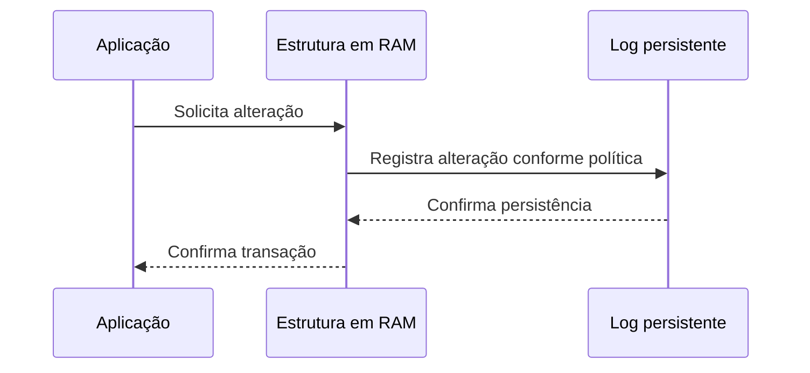
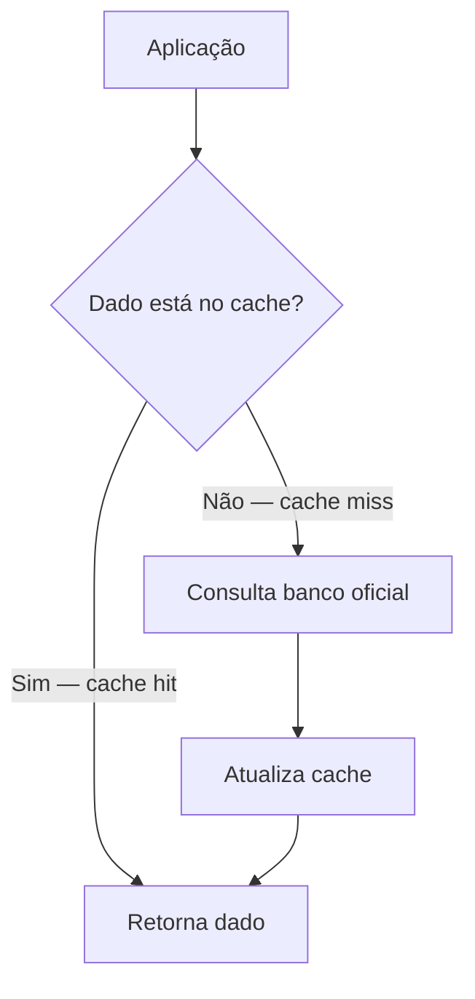
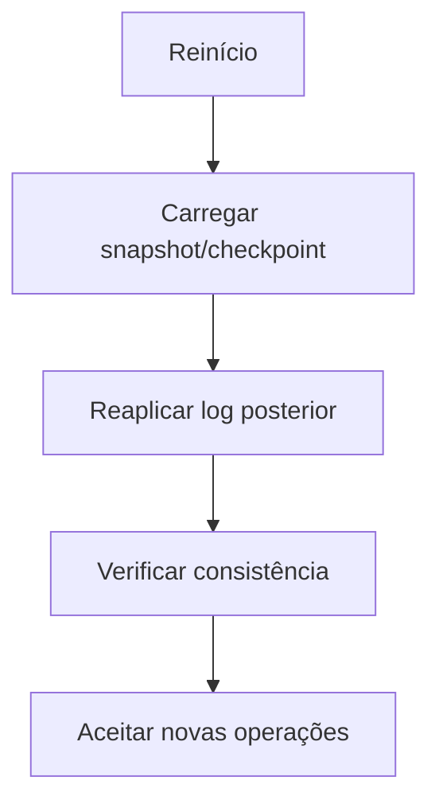
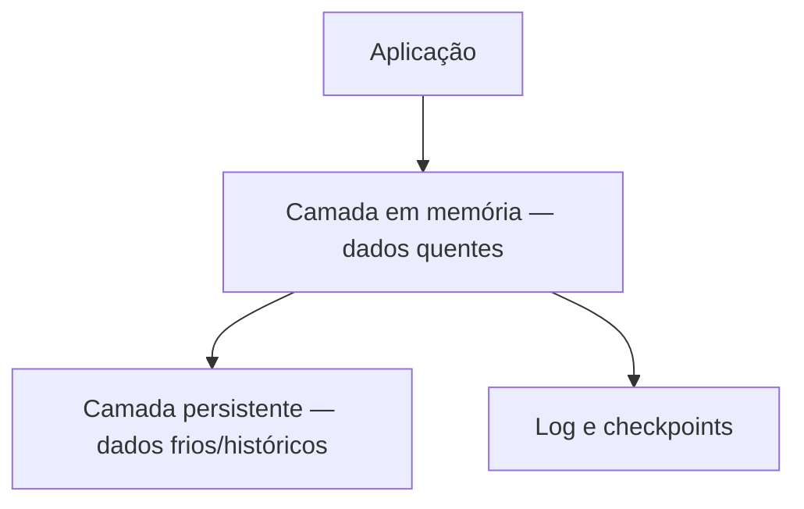

# 1.20 — Banco de dados em memória

[[1.0 Mapa de estudos — Arquitetura de dados|← Mapa]] · [[1.19 Integração dos dados|← Integração de dados]] · [[1.21 Qualidade de dados e gestão de dados mestres e de referência|Qualidade e MDM →]] · [[Banco de questões — Arquitetura de dados|Questões]]

> [!note] Prioridade CESGRANRIO: **BAIXA / CONCEITUAL**
> A matriz de estudos não registra ocorrência direta recente. Ainda assim, o tema pode aparecer em comparações de arquitetura e desempenho. Priorize o conceito, os mecanismos de durabilidade e as diferenças para cache e banco convencional.

## O que você DEVE MANTER e REVISAR — o “coração” da CESGRANRIO

1. **RAM como armazenamento primário (Seção 2):** o conjunto de trabalho principal é mantido em memória, permitindo acesso de baixa latência. **Pegadinha:** isso não significa necessariamente que todos os dados caibam sempre na RAM nem que nunca haja disco.

2. **Banco em memória não é sinônimo de cache (Seção 4):** cache mantém cópias temporárias e geralmente pode ser reconstruído a partir de uma fonte oficial; um banco em memória pode ser o sistema de registro e oferecer consultas, transações e durabilidade.

3. **Volatilidade × durabilidade (Seção 5):** como a RAM volátil perde conteúdo com falha de energia, o SGBD pode combinar log, snapshot/checkpoint, replicação e armazenamento persistente para recuperação. **Pegadinha:** banco em memória não é obrigatoriamente não persistente.

4. **Modelo de dados independente do meio (Seção 3):** “em memória” descreve principalmente onde e como os dados são mantidos, não um modelo lógico único. O banco pode ser relacional, chave–valor, documentos, grafos ou multimodelo.

5. **Desempenho com novos gargalos (Seções 7 e 8):** eliminar grande parte da espera por disco reduz latência, mas CPU, rede, bloqueios, contenção, serialização, replicação e tamanho da memória continuam limitando o sistema.

> [!tip] Regra mental de prova
> **Em memória diz onde o dado principal trabalha; cache diz para que a cópia temporária serve; persistência diz como recuperar após falhas. São dimensões diferentes.**

> [!note] Limite deste módulo
> Índices e otimização geral foram estudados em [[1.17 Melhoria de performance de banco de dados|1.17]]. Famílias NoSQL, em [[1.18 Bancos de dados NoSQL|1.18]]. Aqui serão tratados somente os aspectos específicos do armazenamento primário em memória.

## Objetivos de aprendizagem

1. definir banco de dados em memória;
2. entender por que ele reduz a latência;
3. diferenciar banco em memória, cache e banco convencional com buffer;
4. reconhecer que ele pode usar diferentes modelos de dados;
5. explicar volatilidade, durabilidade e recuperação;
6. distinguir snapshot, log e replicação;
7. reconhecer vantagens, limitações e casos de uso;
8. evitar as principais pegadinhas da CESGRANRIO.

## 1. O que é um banco de dados em memória

Um **banco de dados em memória**, também chamado **In-Memory Database (IMDB)** ou **Main-Memory Database (MMDB)**, é projetado para manter e processar seu conjunto principal de dados na **memória principal — RAM**.


A RAM possui latência de acesso muito menor que dispositivos de armazenamento persistente. Como o projeto parte da premissa de que os dados estão em memória, estruturas e algoritmos podem evitar operações feitas por um SGBD tradicional para administrar páginas em disco.

> [!warning] Pegadinha CESGRANRIO
> “Em memória” descreve o **armazenamento e processamento primários**, não a ausência absoluta de SSD ou disco. O armazenamento persistente pode guardar logs, snapshots, backups ou dados menos acessados.

## 2. Como funciona

### 2.1 Caminho simplificado de leitura

```text
Aplicação → estrutura em RAM → resultado
```

Em um banco projetado primariamente para disco, o SGBD costuma procurar a página em um **buffer pool**; se ela não estiver presente, precisa lê-la do armazenamento.

```text
Aplicação → buffer pool → se não encontrou → SSD/disco → RAM → resultado
```

O banco em memória reduz a necessidade de transferir páginas entre disco e RAM durante a operação normal. Isso também permite estruturas com ponteiros, índices e formatos otimizados para acesso em memória.

### 2.2 Escrita simplificada com durabilidade



A ordem e o momento exatos variam. Um sistema pode confirmar apenas depois que o log foi persistido, agrupar gravações ou aceitar menor durabilidade em troca de desempenho.

> [!warning] Pegadinha CESGRANRIO
> Baixa latência não elimina os princípios transacionais. Se a confirmação depender de log persistente e replicação, eles ainda podem participar do tempo de resposta.

## 3. “Em memória” não define o modelo de dados

Um banco em memória pode adotar diversos modelos:

| Modelo | Exemplo de uso em memória |
|---|---|
| Relacional | Transações e análises SQL de baixa latência |
| Chave–valor | Sessões, contadores e acesso rápido por chave |
| Documentos | Objetos ou perfis semiestruturados |
| Grafos | Travessias rápidas em dados altamente conectados |
| Multimodelo | Mais de uma representação no mesmo produto |

Da mesma forma, um banco NoSQL não é obrigatoriamente em memória: ele pode ter armazenamento primário persistente em SSD ou disco.

> [!warning] Pegadinhas CESGRANRIO
> - **Banco em memória ≠ NoSQL.** Um IMDB pode ser relacional e executar SQL.
> - **NoSQL ≠ banco em memória.** O modelo lógico e o meio de armazenamento são classificações diferentes.
> - **Em memória ≠ armazenamento por colunas.** Um banco em memória pode usar organização por linhas, colunas ou ambas.

## 4. Banco em memória × cache

Um **cache** guarda dados para acelerar o acesso a uma fonte considerada oficial. Se o cache for perdido, seu conteúdo normalmente pode ser reconstruído consultando essa fonte.

Um **banco em memória** pode ser a fonte oficial dos dados e oferecer recursos completos de persistência, consulta, concorrência, transações e recuperação.

| Critério | Cache | Banco em memória |
|---|---|---|
| Papel principal | Acelerar outra fonte | Armazenar e consultar dados como sistema de dados |
| Autoridade sobre o dado | Geralmente não é a fonte oficial | Pode ser a fonte oficial |
| Perda do conteúdo | Em geral, permite reconstrução | Pode representar perda se não houver durabilidade |
| Recursos | Expiração e políticas de substituição | Pode oferecer transações, consultas, índices e recuperação |
| Persistência | Opcional | Opcional ou configurável, conforme o produto |

### 4.1 Cache-aside — visão conceitual



**Cache hit** é uma consulta atendida pelo cache; **cache miss** exige acesso à fonte subjacente.

> [!warning] Pegadinha CESGRANRIO
> A tecnologia pode atuar como cache em uma solução e como banco principal em outra. O papel arquitetural não é determinado apenas pelo nome do produto.

## 5. Volatilidade, persistência e durabilidade

### 5.1 Memória volátil

A RAM convencional perde seu conteúdo quando há queda de energia ou falha do processo. Sem algum mecanismo adicional, os dados mantidos somente nela são voláteis.

### 5.2 Snapshot ou checkpoint

Grava periodicamente uma imagem do estado do banco em armazenamento persistente.

```text
12:00 — snapshot salvo
12:01 — novas alterações
12:05 — falha
```

Se não houver log entre snapshots, alterações posteriores às 12:00 podem ser perdidas. Snapshots muito frequentes reduzem a janela de perda, mas consomem recursos.

### 5.3 Log de transações ou log de alterações

Registra operações em armazenamento persistente. Na recuperação, o sistema carrega o último snapshot e reaplica os registros posteriores do log.


### 5.4 Replicação

Mantém cópias em outros processos ou nós. Ajuda na disponibilidade, mas, se todas as réplicas estiverem apenas em memória e sofrerem uma falha comum, os dados ainda podem ser perdidos.

### 5.5 Armazenamento híbrido

Pode manter dados “quentes” em RAM e dados “frios” em armazenamento persistente, ou usar RAM como camada principal e disco para recuperação.

| Mecanismo | Principal finalidade | Limitação típica |
|---|---|---|
| Snapshot | Capturar o estado em determinado momento | Pode perder alterações após o snapshot |
| Log persistente | Registrar alterações para repetição | Acrescenta escrita e custo de recuperação |
| Replicação | Disponibilidade e tolerância a falhas de nó | Não substitui backup ou persistência independente |
| Backup | Recuperar perda, corrupção ou erro histórico | Normalmente possui recuperação mais lenta |

> [!warning] Pegadinhas CESGRANRIO
> - **Replicação não é backup.** Uma exclusão incorreta pode ser replicada para todas as cópias.
> - Snapshot é uma fotografia periódica; log registra uma sequência de alterações.
> - Banco persistente não significa perda zero em qualquer configuração. A garantia depende da política de confirmação, frequência e mecanismo usado.

## 6. Recuperação após falha

Um fluxo frequente é:



Dois conceitos importantes:

- **tempo de recuperação:** quanto demora para o serviço voltar;
- **janela potencial de perda:** quais alterações confirmadas podem não estar preservadas conforme a configuração.

O estudo detalhado de continuidade e métricas RTO/RPO pertence a Segurança da Informação. Aqui basta perceber o compromisso entre desempenho e garantia de recuperação.

## 7. Por que pode ser mais rápido

Principais razões:

- menor latência de acesso à RAM;
- redução de leituras aleatórias em armazenamento persistente;
- estruturas de dados otimizadas para memória;
- menor necessidade de administrar páginas e buffer pool;
- possibilidade de processamento vetorizado e paralelo;
- eliminação de etapas específicas da arquitetura orientada a disco.

> [!warning] Pegadinha CESGRANRIO
> Não é correto afirmar que um banco em memória é **sempre** mais rápido. Desempenho depende da carga, consultas, índices, concorrência, rede, CPU, volume e configuração de durabilidade.

## 8. Novos gargalos e limitações

Quando a E/S de disco deixa de dominar, outros fatores ganham importância:

| Fator | Possível efeito |
|---|---|
| CPU | Consultas, compressão e serialização passam a dominar |
| Rede | Acesso remoto ou replicação limita a latência |
| Contenção | Bloqueios e conflitos reduzem concorrência |
| Capacidade da RAM | Custo e limite do conjunto de dados |
| Coleta de lixo/alocação | Pausas e variação de latência em alguns ambientes |
| Persistência | Log e confirmação síncrona adicionam custo |
| Recuperação | Bases grandes podem demorar para voltar à RAM |

### 8.1 Custo e capacidade

A RAM tende a ter custo por unidade de capacidade maior que o armazenamento persistente. Compressão, particionamento, remoção de dados expirados e camadas quente/fria ajudam a controlar esse custo.

### 8.2 Evicção

Quando usado com capacidade limitada, o sistema pode remover dados segundo uma política de **evicção**, como itens menos recentemente usados. Isso é comum em caches, mas pode ser inadequado se o banco for a única fonte oficial e não houver persistência.

> [!warning] Pegadinha CESGRANRIO
> **Evicção** é remoção planejada para liberar espaço; **expiração** remove dados ao atingir um prazo; nenhuma delas equivale automaticamente à perda causada por falha.

## 9. Organização por linhas e por colunas

A manutenção na RAM é independente da organização lógica/física por linhas ou colunas.

| Organização | Favorece |
|---|---|
| Por linhas | Acesso e alteração de registros completos; cargas transacionais |
| Por colunas | Leitura de poucas colunas em muitas linhas; agregações analíticas e compressão |
| Híbrida | Combinação de necessidades transacionais e analíticas |

Um banco colunar pode operar em disco; um banco em memória pode ser orientado a linhas. As classificações não são sinônimas.

## 10. Casos de uso

É especialmente útil quando baixa latência e alto volume de operações são importantes:

- sessões de usuário;
- carrinhos de compra;
- contadores e placares;
- dados temporários de aplicações;
- negociação e análise financeira em baixa latência;
- telecomunicações;
- detecção de fraude;
- processamento de eventos;
- análises interativas;
- sistemas transacionais com forte exigência de resposta.

### 10.1 Quando avaliar com cautela

- volume muito maior que a memória economicamente disponível;
- baixa exigência de latência;
- dados raramente acessados;
- solução sem durabilidade compatível com dados críticos;
- equipe sem capacidade de operar recuperação, replicação e monitoramento;
- custo adicional sem benefício mensurável.

## 11. Arquiteturas comuns

### 11.1 Somente em memória e efêmera

Os dados podem ser descartados e reconstruídos. Adequada a cache ou dados temporários.

### 11.2 Em memória com persistência

RAM é o meio operacional principal; log e snapshot permitem recuperação. Pode atuar como banco oficial.

### 11.3 Banco tradicional com cache externo

O banco persistente é a fonte oficial e a camada em memória acelera leituras selecionadas.

### 11.4 Banco híbrido

Gerencia RAM e armazenamento persistente, mantendo dados mais acessados em memória e outros em camada secundária.



## 12. Comparação consolidada

| Critério | Banco em memória | Banco tradicional orientado a disco | Cache sobre banco |
|---|---|---|---|
| Meio operacional principal | RAM | Armazenamento persistente com buffer em RAM | RAM para cópias + banco persistente |
| Fonte oficial | Pode ser | Normalmente é | Normalmente é o banco subjacente |
| Durabilidade | Configurável por log/snapshot/replicação | Parte central do projeto | Cache pode ser efêmero |
| Latência típica | Muito baixa | Maior em faltas no buffer | Baixa em cache hit |
| Capacidade/custo | Limitada pelo custo da RAM | Maior capacidade econômica | Somente subconjunto quente no cache |
| Recuperação | Recarregar snapshot e log | Recuperar páginas e log | Repovoar cache a partir do banco |

## 13. Pegadinhas rápidas

| Afirmação | Julgamento |
|---|---|
| “Todo banco em memória é NoSQL.” | **Falsa** |
| “Todo banco em memória perde os dados ao reiniciar.” | **Falsa** |
| “Cache e banco em memória são sinônimos.” | **Falsa** |
| “Replicação substitui backup.” | **Falsa** |
| “Snapshot e log são o mesmo mecanismo.” | **Falsa** |
| “Um IMDB pode executar SQL e transações ACID.” | **Verdadeira** |
| “Manter dados em RAM elimina todos os gargalos.” | **Falsa** |
| “Organização colunar e armazenamento em memória são dimensões distintas.” | **Verdadeira** |

## 14. Prioridade de estudo

### Maior retorno dentro do tópico

- definição de IMDB/MMDB;
- RAM como armazenamento primário;
- banco em memória × cache;
- volatilidade × durabilidade;
- snapshot × log × replicação;
- “em memória” independente de relacional ou NoSQL;
- vantagens, limitações e casos de uso.

### Chance média dentro de um tópico de baixa frequência

- cache hit e cache miss;
- evicção e expiração;
- dados quentes e frios;
- organização por linhas × colunas;
- recuperação por snapshot mais reaplicação de log;
- novos gargalos: CPU, rede e contenção.

### Baixo retorno agora

- comandos e configuração de produtos específicos;
- algoritmos internos de persistência;
- memória não volátil em profundidade;
- benchmarks e dimensionamento detalhado;
- HTAP e processamento vetorizado em profundidade.

## 15. Checklist de revisão

- [ ] IMDB/MMDB mantém o conjunto principal de trabalho na RAM.
- [ ] Banco em memória pode usar disco para log, snapshot e backup.
- [ ] Banco em memória não é obrigatoriamente NoSQL.
- [ ] NoSQL não é obrigatoriamente em memória.
- [ ] Cache costuma ser reconstruível a partir da fonte oficial.
- [ ] Um banco em memória pode ser a própria fonte oficial.
- [ ] Snapshot registra um estado; log registra alterações.
- [ ] Replicação não substitui persistência ou backup.
- [ ] Organização por linhas/colunas independe de estar em RAM.
- [ ] RAM reduz latência, mas CPU, rede e contenção permanecem.
- [ ] Evicção e expiração não são sinônimas.
- [ ] Durabilidade depende da configuração e do momento de confirmação.

## 16. Questões inéditas — estilo CESGRANRIO

### 16.1 Questão 1

Uma empresa adotou um SGBD cujo conjunto operacional de dados é mantido principalmente na RAM. Para permitir recuperação após reinício, o sistema grava checkpoints periódicos e registra alterações posteriores em um log persistente.

Nesse cenário,

A) o uso de armazenamento persistente impede que o SGBD seja classificado como banco em memória.  
B) o checkpoint e o log são incompatíveis, pois somente um mecanismo pode ser utilizado.  
C) o banco é necessariamente NoSQL e não pode oferecer transações ACID.  
D) o checkpoint pode restaurar um estado-base, e o log pode reaplicar alterações posteriores.  
E) a replicação dos dados em RAM tornaria desnecessários backup e recuperação.

> [!success]- Gabarito comentado
> **Resposta: D.** A operação principal em RAM é compatível com o uso de disco para durabilidade. O snapshot/checkpoint fornece um estado-base e o log permite refazer mudanças posteriores. IMDB não significa NoSQL, ausência de ACID ou dispensa de backup.

### 16.2 Questão 2

Uma aplicação mantém em RAM cópias dos produtos mais consultados. Quando uma chave não é encontrada, consulta o banco de dados oficial e repovoa a camada rápida. A perda total dessa camada não elimina os dados oficiais.

A camada em RAM exerce, predominantemente, a função de

A) cache, pois acelera uma fonte oficial reconstruível.  
B) Data Warehouse, pois mantém somente dados recentes.  
C) banco orientado a objetos, porque seus valores possuem chaves.  
D) log de transações, porque atende primeiro às leituras.  
E) sistema mestre, pois qualquer armazenamento em RAM é autoritativo.

> [!success]- Gabarito comentado
> **Resposta: A.** O dado é uma cópia reconstruível e o banco subjacente continua sendo a fonte oficial: trata-se de cache. A banca pode confundir a tecnologia em memória com o papel arquitetural exercido por ela.

## 17. Resumo de véspera

```text
IMDB/MMDB = conjunto operacional mantido principalmente na RAM
EM MEMÓRIA ≠ obrigatoriamente NoSQL
EM MEMÓRIA ≠ obrigatoriamente volátil
EM MEMÓRIA ≠ organização colunar
CACHE = cópia rápida, normalmente reconstruível da fonte oficial
BANCO EM MEMÓRIA = pode ser a própria fonte oficial
SNAPSHOT/CHECKPOINT = fotografia periódica do estado
LOG = sequência persistente de alterações
RECUPERAÇÃO = carregar snapshot + reaplicar log
REPLICAÇÃO = disponibilidade; não substitui backup
RAM reduz E/S, mas CPU, rede, contenção e memória viram gargalos
DADOS QUENTES = frequentemente acessados
EVICÇÃO = remoção para liberar espaço
EXPIRAÇÃO = remoção após prazo definido
```
