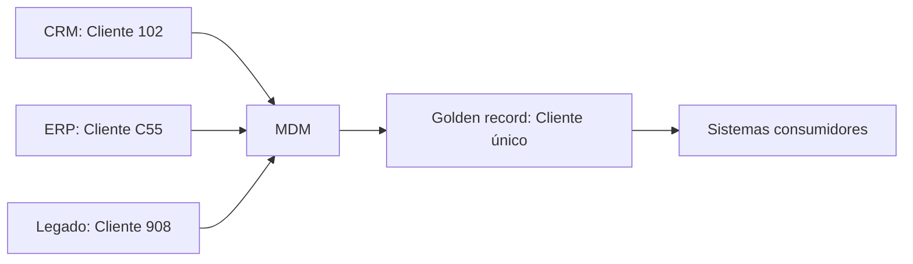

# 1.21 — Qualidade de dados e gestão de dados mestres e de referência

[[1.0 Mapa de estudos — Arquitetura de dados|← Mapa]] · [[1.20 Banco de dados em memória|← Banco em memória]] · [[1.22 Data Lakes e Soluções para Big Data|Data Lakes e Big Data →]]

> [!important] Prioridade CESGRANRIO: **MÉDIA**
> Priorize dimensões de qualidade, profiling, limpeza, deduplicação, **registro dourado**, dados mestres × dados de referência e governança. Atenção: neste tópico, MDM significa **Master Data Management**, não Mobile Device Management.

## O que você DEVE MANTER e REVISAR — o “coração” da CESGRANRIO

1. **Qualidade é multidimensional (Seção 2):** completude, acurácia, consistência, validade, unicidade e atualidade medem aspectos diferentes. Um dado pode ser válido no formato e incorreto no mundo real.
2. **Profiling × limpeza (Seções 3 e 4):** profiling examina e diagnostica; cleansing corrige, padroniza ou trata problemas. **Pegadinha:** descobrir duplicatas não é o mesmo que eliminá-las.
3. **Dados mestres (Seção 6):** descrevem entidades centrais e relativamente estáveis compartilhadas, como cliente, fornecedor, produto e instalação.
4. **Dados de referência (Seção 7):** são conjuntos controlados de códigos e classificações, como UF, moeda, situação e tipo de produto. Normalmente possuem domínio limitado.
5. **MDM e registro dourado (Seções 8 e 9):** MDM governa identificação, conciliação, distribuição e manutenção dos dados mestres. O **golden record** é a representação confiável consolidada, obtida por matching, merging e regras de sobrevivência.

> [!tip] Regra mental de prova
> **Profiling encontra; cleansing corrige; matching relaciona; merging consolida; survivorship escolhe o valor; MDM governa.**

## 1. Conceito de qualidade de dados

Qualidade de dados é o grau em que os dados são adequados ao uso pretendido. Portanto, depende do contexto: um endereço sem CEP pode servir para contato eletrônico, mas não para entrega.


> [!warning] Pegadinha CESGRANRIO
> Qualidade não é apenas ausência de erro sintático. Envolve correção semântica, completude, coerência entre fontes e disponibilidade no tempo necessário.

## 2. Dimensões da qualidade

| Dimensão | Pergunta | Exemplo de problema |
|---|---|---|
| **Acurácia/exatidão** | O valor representa corretamente a realidade? | Data de nascimento diferente da comprovada |
| **Completude** | Os dados necessários estão preenchidos? | Cliente sem documento obrigatório |
| **Consistência** | Os valores concordam entre registros e sistemas? | Cliente ativo no CRM e inativo no ERP |
| **Validade/conformidade** | O valor obedece ao formato, tipo e domínio? | UF = `XX` |
| **Unicidade** | Cada entidade está representada sem duplicidade indevida? | Mesmo cliente cadastrado duas vezes |
| **Atualidade/tempestividade** | O dado está atualizado e disponível no momento necessário? | Endereço antigo usado na entrega |
| **Integridade** | Relações e regras estruturais são preservadas? | Pedido aponta para cliente inexistente |

### 2.1 Acurácia não é validade

```text
Data informada: 01/01/1990
Formato: válido
Data real da pessoa: 01/01/1991
Conclusão: válida, mas não acurada
```

### 2.2 Completude não é acurácia

Todos os campos podem estar preenchidos com valores errados. Assim, 100% de completude não implica acurácia.

## 3. Data profiling

**Data profiling** analisa os dados para conhecer sua estrutura, conteúdo, padrões e anomalias.

Atividades típicas:

- contar nulos e valores distintos;
- calcular mínimo, máximo e distribuição;
- verificar formatos e domínios;
- procurar duplicidades;
- identificar padrões e dependências;
- examinar chaves e relacionamentos;
- estabelecer uma linha de base de qualidade.

```sql
SELECT
    COUNT(*) AS total,
    COUNT(email) AS emails_preenchidos,
    COUNT(DISTINCT email) AS emails_distintos
FROM cliente;
```

> [!warning] Pegadinha CESGRANRIO
> Profiling é predominantemente **diagnóstico**. Ele pode orientar regras, mas não é, por si só, a correção dos registros.

## 4. Limpeza e melhoria

**Data cleansing** ou limpeza de dados aplica tratamentos como:

- padronização de nomes, endereços, datas e unidades;
- correção ou rejeição de valores inválidos;
- tratamento de ausências;
- deduplicação;
- enriquecimento com fonte confiável;
- validação de domínios;
- reconciliação entre fontes.

Não se deve “corrigir” silenciosamente sem regra, evidência e rastreabilidade. Dependendo do problema, o registro pode ser colocado em quarentena para análise.

### 4.1 Matching, merging e survivorship

| Operação | Função |
|---|---|
| **Matching** | Determinar se registros diferentes representam a mesma entidade |
| **Merging** | Unificar registros correspondentes |
| **Survivorship** | Definir qual valor sobreviverá na consolidação |

Exemplo de regra de sobrevivência: endereço do sistema cadastral oficial vence; telefone mais recentemente confirmado vence.

## 5. Prevenção e monitoramento

É melhor impedir erros na origem do que corrigi-los repetidamente a jusante.

Controles possíveis:

- constraints e integridade referencial;
- listas controladas e máscaras de entrada;
- validação na aplicação;
- responsáveis pelo dado;
- indicadores e alertas;
- acordos sobre níveis de qualidade;
- análise de causa-raiz;
- trilha de auditoria e linhagem.

```text
Indicador de completude = registros com campo preenchido / registros esperados
Indicador de validade   = registros válidos / registros avaliados
Taxa de duplicidade     = duplicatas identificadas / registros avaliados
```

> [!warning] Pegadinha CESGRANRIO
> Corrigir somente no destino pode esconder o problema sem eliminar sua causa. Qualidade exige ciclo contínuo e atuação na origem quando possível.

## 6. Dados mestres

**Dados mestres** representam entidades fundamentais e compartilhadas pelos processos da organização.

Exemplos:

- clientes;
- fornecedores;
- empregados;
- produtos e materiais;
- ativos e instalações;
- localidades organizacionais.

São relativamente estáveis, mas não imutáveis. Um cliente pode alterar endereço; um produto pode mudar de categoria.

## 7. Dados de referência

**Dados de referência** classificam ou restringem outros dados por meio de conjuntos controlados de valores.

Exemplos:

| Domínio | Valores possíveis |
|---|---|
| Unidade federativa | AC, AL, AP, …, SP, TO |
| Moeda | BRL, USD, EUR |
| Estado do pedido | aberto, faturado, cancelado |
| Tipo de instalação | refinaria, terminal, plataforma |

Podem ter fonte interna ou externa e precisam de versionamento, vigência, responsável e distribuição controlada.

## 8. Tipos de dados — comparação

| Tipo | O que representa | Exemplo |
|---|---|---|
| **Mestre** | Entidade central compartilhada | Cliente, produto, fornecedor |
| **Referência** | Código/classificação controlada | Moeda, UF, categoria |
| **Transacional** | Evento de negócio | Venda, pagamento, movimentação |
| **Metadado** | Descrição de outro dado | Tipo, origem, regra e definição |

> [!warning] Pegadinhas CESGRANRIO
> - Dados mestres não são simplesmente “todos os dados importantes”.
> - Dados de referência são frequentemente tratados como uma categoria especializada relacionada aos mestres, mas possuem foco em **domínios e classificações controlados**.
> - Venda é transacional; cliente é mestre; código de moeda é referência; definição da coluna é metadado.

## 9. MDM — Master Data Management

MDM é o conjunto de processos, governança, regras e tecnologias para manter dados mestres consistentes e confiáveis em diferentes sistemas.



### 9.1 Fluxo simplificado

1. adquirir registros das fontes;
2. padronizar e validar;
3. identificar correspondências;
4. consolidar e aplicar sobrevivência;
5. atribuir identidade comum;
6. publicar o registro confiável;
7. monitorar e governar alterações.

### 9.2 Registro dourado e fonte de verdade

O **golden record** é a visão consolidada e confiável de uma entidade. Ele não precisa copiar integralmente uma única origem: cada atributo pode ser escolhido segundo regras e autoridades diferentes.

> [!warning] Pegadinha CESGRANRIO
> Golden record não significa necessariamente “o registro do sistema mais antigo” nem “o mais recente inteiro”. A sobrevivência pode ser definida **atributo por atributo**.

## 10. Governança e papéis

| Papel | Responsabilidade típica |
|---|---|
| **Data owner** | Responsabilidade e decisão de negócio sobre o domínio |
| **Data steward** | Cuida operacionalmente de definições, regras e qualidade |
| **Custodiante/TI** | Implementa armazenamento, proteção e operação técnica |
| **Produtor** | Cria ou atualiza dados na origem |
| **Consumidor** | Usa os dados e reporta necessidades/problemas |

Os nomes e limites variam entre organizações; a distinção principal é entre responsabilidade de negócio, gestão cotidiana e custódia técnica.

## 11. Estilos de implementação de MDM — reconhecimento

| Estilo | Característica |
|---|---|
| **Registro/registry** | Mantém índices e correspondências, deixando atributos nas fontes |
| **Consolidação** | Reúne dados para visão central, frequentemente com fluxo predominante das fontes para o hub |
| **Coexistência** | Hub e fontes trocam atualizações e mantêm cópias coordenadas |
| **Centralizado/transacional** | Hub torna-se principal ponto de criação e manutenção dos mestres |

Quanto maior o controle central, maior pode ser a consistência, mas também aumentam impacto organizacional e complexidade de implantação.

## 12. MDM não é MDM de dispositivos móveis

Neste tópico:

```text
MDM = Master Data Management = gestão de dados mestres
```

No item 9.7 de Segurança da Informação:

```text
MDM = Mobile Device Management = gestão de dispositivos móveis
```

O contexto da questão determina o significado.

## 13. Prioridade de estudo

### Maior retorno dentro do tópico

- dimensões de qualidade;
- validade × acurácia e completude × acurácia;
- profiling × cleansing;
- matching, merging e survivorship;
- mestre × referência × transacional × metadado;
- MDM e golden record;
- diferença para Mobile Device Management.

### Chance média

- prevenção, monitoramento e causa-raiz;
- data owner, steward e custodiante;
- estilos registry, consolidação, coexistência e centralizado;
- indicadores de qualidade.

## 14. Checklist de revisão

- [ ] Qualidade é adequação ao uso e possui várias dimensões.
- [ ] Dado válido pode ser inacurado.
- [ ] Dado completo pode estar incorreto.
- [ ] Profiling diagnostica; cleansing trata.
- [ ] Matching encontra correspondências; merging consolida.
- [ ] Survivorship escolhe valores do registro consolidado.
- [ ] Cliente/produto é mestre; UF/moeda é referência.
- [ ] Venda é transacional; definição de campo é metadado.
- [ ] Golden record pode combinar atributos de várias fontes.
- [ ] Master Data Management não é Mobile Device Management.

## 15. Questões inéditas — estilo CESGRANRIO

### 15.1 Questão 1

Um cadastro exige data de nascimento no formato válido. O valor `01/01/1990` passou pela validação, mas o documento oficial informa `01/01/1991`. O dado apresentado possui

A) acurácia e validade.  
B) validade, mas não acurácia.  
C) acurácia, mas não completude.  
D) unicidade, mas não validade.  
E) integridade referencial, mas não atualidade.

> [!success]- Gabarito comentado
> **Resposta: B.** O valor obedece ao formato esperado, portanto é válido; porém não representa a realidade comprovada, logo não é acurado. A banca costuma trocar validade sintática por exatidão semântica.

### 15.2 Questão 2

Uma empresa identificou que três cadastros representam o mesmo fornecedor. Após relacioná-los, escolheu o CNPJ da fonte oficial e o telefone mais recentemente confirmado para formar uma visão única confiável.

Nesse processo, a identificação de correspondência, a escolha dos atributos e a visão resultante são, respectivamente,

A) profiling, validade e metadado.  
B) merging, replicação e dado transacional.  
C) matching, survivorship e golden record.  
D) cleansing, particionamento e registro de referência.  
E) normalização, integridade e snapshot.

> [!success]- Gabarito comentado
> **Resposta: C.** Matching identifica que registros pertencem à mesma entidade; survivorship define quais valores prevalecem; golden record é a representação consolidada confiável.

## 16. Resumo de véspera

```text
QUALIDADE = adequação ao uso
ACURÁCIA = corresponde à realidade
COMPLETUDE = dados necessários presentes
CONSISTÊNCIA = fontes/regras concordam
VALIDADE = formato, tipo e domínio respeitados
UNICIDADE = ausência de duplicidade indevida
ATUALIDADE = dado recente no momento necessário
PROFILING = examina e diagnostica
CLEANSING = corrige e padroniza
MATCHING = relaciona registros da mesma entidade
MERGING = consolida
SURVIVORSHIP = escolhe o valor sobrevivente
MESTRE = cliente, produto, fornecedor
REFERÊNCIA = UF, moeda, categoria
TRANSAÇÃO = venda, pagamento, movimento
GOLDEN RECORD = visão consolidada confiável
MDM aqui = MASTER Data Management, não MOBILE Device Management
```
