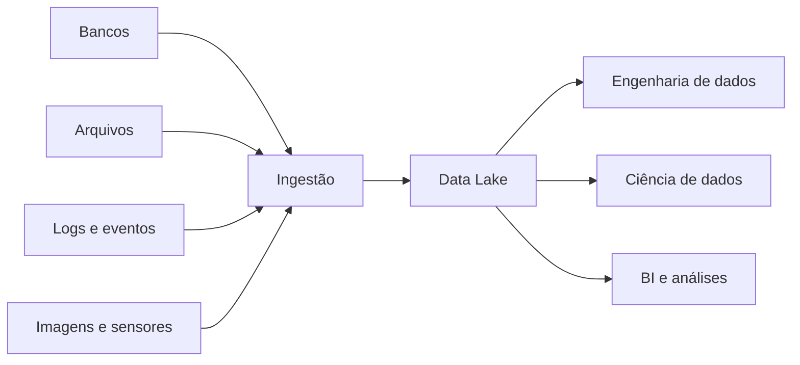
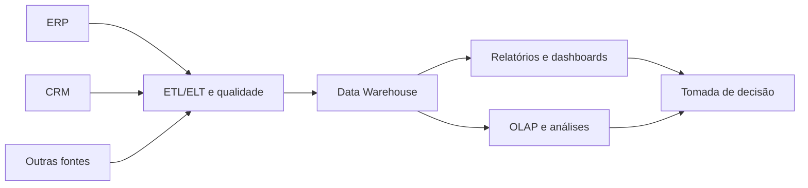
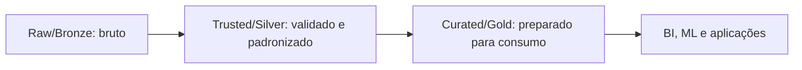
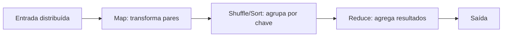

# 1.22 — Data Lakes e Soluções para Big Data

[[1.0 Mapa de estudos — Arquitetura de dados|← Mapa]] · [[1.21 Qualidade de dados e gestão de dados mestres e de referência|← Qualidade e MDM]] · [[1.23 Diferenciação entre bancos relacionais multidimensionais documentos e grafos|Comparação de bancos →]]

> [!danger] Prioridade CESGRANRIO: **ALTA**
> Há registro de cobrança direta. Domine **Data Lake × Data Warehouse**, schema-on-read × schema-on-write, zonas do lake, risco de data swamp, características de Big Data e fundamentos de armazenamento/processamento distribuído.

## O que você DEVE MANTER e REVISAR — o “coração” da CESGRANRIO

1. **Data Lake e dados diversos (Seção 2):** armazena grandes volumes de dados estruturados, semiestruturados e não estruturados, frequentemente em formato próximo ao original.
2. **Schema-on-read × schema-on-write (Seção 4):** no lake, a estrutura costuma ser aplicada durante leitura/uso; no DW tradicional, antes da carga. **Pegadinha:** isso é tendência arquitetural, não ausência de metadados ou qualidade.
3. **Zonas e governança (Seção 5):** dados evoluem de brutos para tratados e curados. Sem catálogo, linhagem, segurança e qualidade, o lake vira **data swamp**.
4. **Big Data e os Vs (Seção 7):** volume, velocidade e variedade formam o trio clássico; veracidade e valor são extensões comuns. A banca pode trocar seus significados.
5. **Distribuição (Seções 8 a 10):** particionamento divide dados e trabalho; replicação ajuda na disponibilidade; processamento vai até os dados; falhas de nós devem ser toleradas.

> [!tip] Regra mental de prova
> **Lake recebe diversidade e preserva matéria-prima; DW entrega estrutura analítica governada. Schema-on-read adia a interpretação, não elimina esquema. Sem governança, lake vira swamp.**

## 1. Por que surgiram Data Lakes e Big Data

Aplicações modernas produzem grande volume e variedade de dados: transações, sensores, logs, imagens, textos, cliques e eventos. Uma única máquina ou estrutura rígida pode não oferecer capacidade, custo ou flexibilidade adequados.

Soluções de Big Data combinam:

- armazenamento distribuído;
- processamento paralelo;
- escalabilidade horizontal;
- tolerância a falhas;
- integração de formatos variados;
- processamento em lote ou fluxo.

## 2. Data Lake

Um **Data Lake** é um repositório escalável destinado a armazenar dados de diferentes formatos e níveis de tratamento, frequentemente preservando uma cópia próxima ao formato original.



Características comuns:

- grande escala;
- formatos estruturados, semiestruturados e não estruturados;
- armazenamento de dados brutos e tratados;
- múltiplos consumidores;
- separação possível entre armazenamento e processamento;
- catálogo e governança para descoberta e controle.

> [!warning] Pegadinha CESGRANRIO
> Data Lake não é simplesmente “uma pasta com qualquer arquivo”. Um lake utilizável precisa de metadados, segurança, qualidade, linhagem, organização e gestão do ciclo de vida.

## 3. Data Lake × Data Warehouse

### 3.1 O que é Data Warehouse

Um **Data Warehouse (DW)** é um repositório de dados **integrados, históricos e organizados para consulta analítica e apoio à tomada de decisão**.

Ele recebe dados de diferentes sistemas operacionais, padroniza conceitos e os disponibiliza em estruturas adequadas a relatórios, indicadores, dashboards e análises.



Ao contrário de um sistema operacional, que registra eventos cotidianos, o DW é projetado principalmente para **leitura, agregação, comparação histórica e análise por diferentes perspectivas**.

Exemplo:

```text
Sistema operacional:
  registrar uma venda e atualizar o estoque

Data Warehouse:
  comparar a receita por produto, região e mês nos últimos cinco anos
```

#### 3.1.1 Características clássicas

| Característica | Significado |
|---|---|
| **Orientado por assunto** | Organiza dados por temas relevantes, como vendas, clientes e produção |
| **Integrado** | Concilia nomes, códigos, formatos, unidades e chaves de diferentes fontes |
| **Variante no tempo** | Mantém perspectiva histórica e referência temporal |
| **Não volátil** | É predominantemente consultado; dados carregados não sofrem a mesma atualização transacional contínua dos sistemas operacionais |

> [!warning] Pegadinhas CESGRANRIO
> - **Não volátil não significa que o DW nunca recebe novas cargas ou correções.** Significa que seu uso predominante é leitura e preservação histórica, em vez de alterações transacionais constantes.
> - Variante no tempo significa que os dados podem ser analisados segundo períodos e histórico; não significa apenas possuir uma coluna com a data atual.
> - Integrado não significa simplesmente copiar várias fontes para o mesmo lugar. É necessário conciliar diferenças sintáticas e semânticas.

#### 3.1.2 DW × banco operacional

| Critério | Banco operacional/OLTP | Data Warehouse/OLAP |
|---|---|---|
| Objetivo | Executar processos do dia a dia | Analisar e apoiar decisões |
| Dados | Atuais e detalhados | Históricos, integrados e em vários níveis |
| Operações | Muitas inserções e atualizações curtas | Leituras e agregações complexas |
| Modelagem frequente | Relacional normalizada | Dimensional: fatos e dimensões |
| Usuários | Aplicações e operadores | Analistas e gestores |

Um **Data Mart** é um subconjunto analítico voltado a uma área, assunto ou grupo de usuários, como finanças ou manutenção. Pode ser dependente de um DW corporativo ou alimentado diretamente por outras fontes.

> [!note] Limite deste acréscimo
> Aqui basta compreender o conceito para comparar DW e Data Lake. Arquitetura, abordagens de construção e detalhes de Data Warehouse serão estudados no item 7.6.

### 3.2 Comparação: Data Lake × Data Warehouse

| Critério | Data Lake | Data Warehouse tradicional |
|---|---|---|
| Dados | Brutos, tratados e curados | Predominantemente integrados e tratados |
| Formatos | Estruturados, semi e não estruturados | Principalmente estruturados |
| Esquema | Frequentemente schema-on-read | Frequentemente schema-on-write |
| Usuários | Engenheiros, cientistas, analistas e aplicações | Analistas, BI e gestores |
| Uso | Exploração, ML, processamento amplo | Relatórios e análise dimensional governada |
| Modelagem antecipada | Menor para zona bruta | Maior antes da disponibilização |

Eles podem coexistir: o lake preserva e prepara dados, enquanto o DW oferece estruturas dimensionais estáveis para BI.

> [!warning] Pegadinhas CESGRANRIO
> - Data Lake não substitui obrigatoriamente o DW.
> - DW não armazena necessariamente apenas dados agregados; pode manter fatos detalhados.
> - Dados brutos não significam dados sem proprietário, proteção ou catálogo.

## 4. Schema-on-read × schema-on-write

### 4.1 Schema-on-write

O esquema e as regras são aplicados antes ou durante a escrita no repositório de consumo.

```text
Fonte → modelar/validar/transformar → carregar estrutura definida
```

Favorece consistência e consultas previsíveis, mas exige antecipar usos e transformações.

### 4.2 Schema-on-read

Os dados são armazenados com flexibilidade e interpretados segundo um esquema no momento da leitura.

```text
Fonte → armazenar → definir interpretação conforme o uso → consultar
```

Favorece exploração e novos usos, mas transfere responsabilidade para catálogo, consumidor e pipelines de preparação.

> [!warning] Pegadinha CESGRANRIO
> Schema-on-read não significa **schema never**. O consumidor ainda precisa conhecer estrutura, tipos, significado e qualidade para interpretar os dados.

## 5. Zonas de um Data Lake

Os nomes variam entre arquiteturas. Uma organização comum é:



| Zona | Conteúdo típico |
|---|---|
| **Raw/landing/bronze** | Dados recebidos, imutáveis ou próximos da origem |
| **Trusted/refined/silver** | Dados limpos, padronizados, deduplicados e conformados |
| **Curated/serving/gold** | Produtos de dados preparados para casos de uso |
| **Sandbox** | Área controlada para exploração e experimentos |

> [!warning] Pegadinha CESGRANRIO
> Bronze, silver e gold são convenções comuns, não nomes universais obrigatórios. A ideia cobrada é a **progressão de bruto para confiável e pronto para consumo**.

## 6. Data swamp

Um **pântano de dados** surge quando o lake acumula dados sem organização, qualidade, catálogo, segurança, linhagem ou utilidade clara.

Controles preventivos:

- catálogo de dados e metadados;
- classificação e proprietário;
- linhagem e versionamento;
- regras de qualidade;
- controle de acesso e criptografia;
- retenção e descarte;
- padrões de nomes, formatos e partições;
- produtos de dados com finalidade definida.

## 7. Big Data e os Vs

| V | Significado |
|---|---|
| **Volume** | Grande quantidade de dados |
| **Velocidade** | Ritmo de geração, chegada e processamento |
| **Variedade** | Diversidade de formatos e fontes |
| **Veracidade** | Confiabilidade e qualidade dos dados |
| **Valor** | Benefício extraído dos dados |

Os três primeiros são o núcleo clássico. Não existe quantidade única e universal de Vs: diferentes autores acrescentam outros.

> [!warning] Pegadinha CESGRANRIO
> Velocidade não é rapidez de CPU; refere-se principalmente ao ritmo de geração, ingestão e necessidade de processamento. Variedade não é volume.

## 8. Escalabilidade e distribuição

### 8.1 Escala vertical × horizontal

| Estratégia | Ação |
|---|---|
| **Vertical — scale up** | Aumentar CPU, RAM ou armazenamento de uma máquina |
| **Horizontal — scale out** | Acrescentar máquinas ao conjunto distribuído |

Big Data frequentemente favorece escala horizontal com máquinas coordenadas, embora as duas estratégias possam coexistir.

### 8.2 Particionamento

Divide os dados entre nós, permitindo paralelismo. Uma chave de partição ruim pode concentrar dados ou requisições, criando **data skew** e hotspots.

### 8.3 Replicação

Mantém cópias para tolerar falhas e melhorar disponibilidade/leitura. Consome capacidade adicional e não substitui backup.

### 8.4 Localidade dos dados

Mover grandes volumes pela rede é caro. Arquiteturas distribuídas procuram executar o processamento próximo de onde os blocos ou partições estão armazenados.

## 9. Processamento batch e streaming

| Modo | Funcionamento | Exemplo |
|---|---|---|
| **Batch** | Processa conjuntos acumulados e limitados | Consolidar logs do dia |
| **Streaming** | Processa eventos contínuos conforme chegam | Monitorar sensores em tempo próximo do real |
| **Micro-batch** | Processa pequenos lotes em intervalos curtos | Atualizar métricas a cada minuto |

> [!warning] Pegadinha CESGRANRIO
> Streaming não significa necessariamente latência zero nem processamento de um único evento por vez; algumas soluções usam micro-lotes.

## 10. Ecossistema Hadoop — reconhecimento

### 10.1 HDFS

O **Hadoop Distributed File System** divide arquivos em blocos distribuídos e replicados entre nós.

| Componente | Função simplificada |
|---|---|
| **NameNode** | Mantém metadados do sistema de arquivos e localização lógica dos blocos |
| **DataNode** | Armazena blocos de dados e atende operações |

> [!warning] Pegadinha CESGRANRIO
> NameNode administra **metadados**; os blocos de conteúdo ficam nos DataNodes. HDFS é otimizado para grandes arquivos e leitura sequencial, não para muitas pequenas atualizações aleatórias.

### 10.2 MapReduce

Modelo de processamento distribuído em lote:



- **Map:** processa registros e emite pares chave–valor;
- **shuffle/sort:** reúne valores da mesma chave;
- **reduce:** agrega ou combina valores por chave.

### 10.3 Processamento em memória

Mecanismos mais recentes podem manter resultados intermediários em memória e construir planos de execução mais gerais, acelerando cargas iterativas e interativas. Isso não significa que todos os dados sejam permanentemente mantidos apenas em RAM.

## 11. Armazenamento de objetos e formatos analíticos

Data Lakes modernos frequentemente usam armazenamento de objetos, que separa armazenamento e computação e oferece grande escala.

Formatos colunares favorecem:

- leitura somente das colunas necessárias;
- compressão;
- varreduras e agregações analíticas;
- redução de E/S.

Isso não deve ser confundido com banco NoSQL de famílias de colunas.

## 12. Lakehouse — visão conceitual

Uma arquitetura **lakehouse** busca combinar a flexibilidade e a escala do lake com recursos de gestão típicos de ambientes analíticos, como tabelas, esquema, transações, qualidade e desempenho de consulta.

> [!warning] Pegadinha CESGRANRIO
> Lakehouse não é simplesmente renomear um Data Lake. A proposta é acrescentar uma camada de gestão confiável sobre o armazenamento do lake.

## 13. Segurança e governança

- autenticação e autorização por menor privilégio;
- criptografia em trânsito e repouso;
- mascaramento e proteção de dados pessoais;
- catálogo, classificação e linhagem;
- auditoria de acesso;
- isolamento de zonas;
- retenção e descarte;
- qualidade e contratos de dados.

Guardar dados “para um possível uso futuro” não elimina obrigações de finalidade, segurança e governança.

## 14. Prioridade de estudo

### Alta frequência/probabilidade

- Data Lake × Data Warehouse;
- estruturado × semiestruturado × não estruturado;
- schema-on-read × schema-on-write;
- zonas raw/trusted/curated;
- data swamp e governança;
- 3 Vs e extensões;
- escala horizontal, particionamento e replicação;
- batch × streaming.

### Chance média

- HDFS: NameNode × DataNode;
- Map, shuffle e reduce;
- localidade dos dados;
- armazenamento de objetos e formato colunar;
- conceito de lakehouse.

## 15. Checklist de revisão

- [ ] Lake armazena dados diversos, inclusive brutos.
- [ ] DW tradicional entrega dados estruturados e integrados para análise.
- [ ] DW é orientado por assunto, integrado, variante no tempo e não volátil.
- [ ] Não volátil não significa que o DW nunca recebe cargas ou correções.
- [ ] Banco operacional registra processos; DW favorece análise histórica.
- [ ] Data Mart atende uma área, assunto ou grupo de usuários.
- [ ] Schema-on-read não significa ausência de esquema.
- [ ] Zonas progridem de bruto para curado.
- [ ] Lake sem governança pode virar data swamp.
- [ ] Volume, velocidade e variedade são os três Vs clássicos.
- [ ] Scale out acrescenta nós; scale up aumenta uma máquina.
- [ ] Particionamento divide; replicação copia.
- [ ] NameNode guarda metadados; DataNode guarda blocos.
- [ ] Shuffle agrupa dados por chave entre Map e Reduce.
- [ ] Streaming pode usar micro-batches.
- [ ] Família de colunas NoSQL não é formato colunar analítico.

## 16. Questões inéditas — estilo CESGRANRIO

### 16.1 Questão 1

Uma empresa mantém logs, imagens, arquivos JSON e tabelas extraídas dos sistemas corporativos em um repositório escalável. Diferentes equipes aplicam estruturas no momento do consumo. A ausência de catálogo e linhagem, porém, dificulta descobrir e confiar nos dados.

Esse cenário descreve

A) um Data Warehouse normalizado com schema-on-write.  
B) um Data Lake com schema-on-read sob risco de se tornar data swamp.  
C) um banco de grafos com integridade referencial obrigatória.  
D) um sistema OLTP que utiliza somente dados estruturados.  
E) um cache em memória cuja principal limitação é a normalização.

> [!success]- Gabarito comentado
> **Resposta: B.** Diversidade de formatos, repositório escalável e interpretação no consumo indicam Data Lake e schema-on-read. Sem catálogo, linhagem e governança, ele pode virar data swamp.

### 16.2 Questão 2

Em um processamento distribuído, uma etapa transforma registros em pares chave–valor, a etapa seguinte reúne os valores associados à mesma chave e a última produz agregações.

Essas etapas correspondem, respectivamente, a

A) Reduce, Map e Snapshot.  
B) Map, Shuffle/Sort e Reduce.  
C) Schema-on-write, replicação e Map.  
D) NameNode, DataNode e Lakehouse.  
E) ingestão, DataNode e cache miss.

> [!success]- Gabarito comentado
> **Resposta: B.** Map emite pares; shuffle/sort agrupa valores por chave; Reduce agrega os grupos. A banca pode trocar os papéis dessas etapas.

## 17. Resumo de véspera

```text
DATA LAKE = dados diversos, brutos e tratados, em grande escala
DW = repositório integrado e histórico para análise e decisão
DW CLÁSSICO = orientado por assunto + integrado + variante no tempo + não volátil
NÃO VOLÁTIL ≠ nunca atualizado; significa uso predominante de leitura/histórico
OLTP = operação cotidiana; DW/OLAP = consulta e análise
DATA MART = subconjunto analítico por assunto, área ou grupo de usuários
SCHEMA-ON-READ = interpretar ao consumir
SCHEMA-ON-WRITE = estruturar antes/durante a carga
RAW/BRONZE → TRUSTED/SILVER → CURATED/GOLD
DATA SWAMP = lake sem catálogo, qualidade, linhagem e governança
3 Vs = volume + velocidade + variedade
VERACIDADE = confiança; VALOR = benefício
SCALE UP = máquina maior; SCALE OUT = mais máquinas
PARTICIONAMENTO = dividir; REPLICAÇÃO = copiar
HDFS: NameNode = metadados; DataNode = blocos
MAP → SHUFFLE/SORT → REDUCE
BATCH = lote; STREAMING = fluxo contínuo; MICRO-BATCH = pequenos lotes
LAKEHOUSE = flexibilidade do lake + gestão confiável de tabelas analíticas
```
