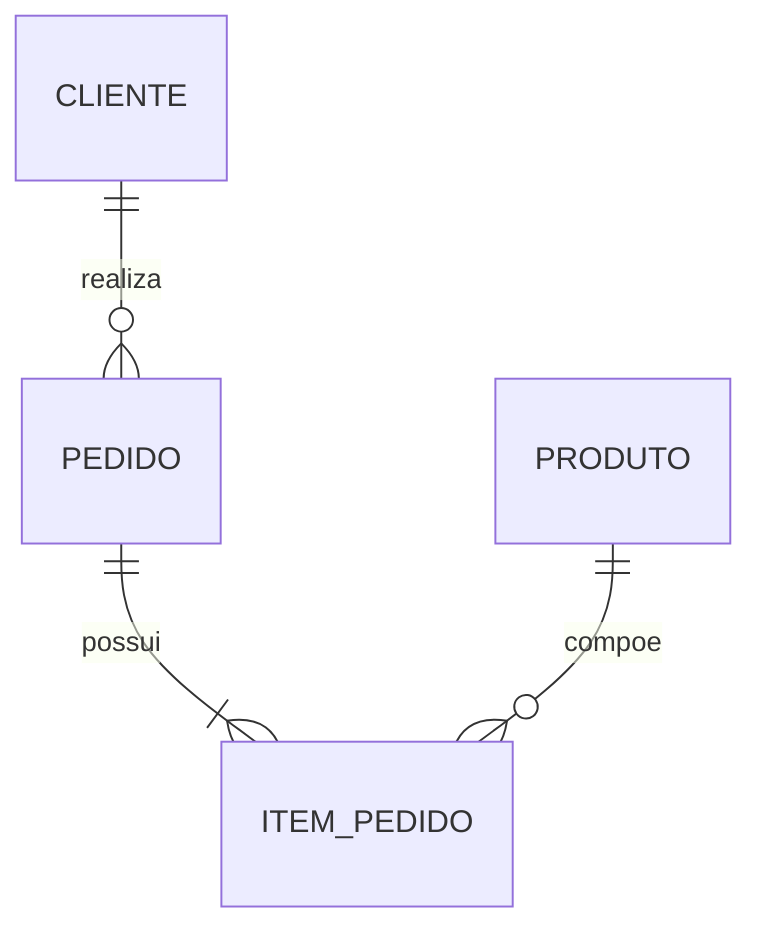
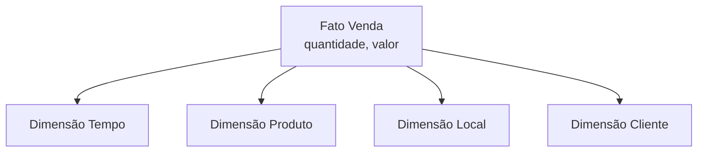
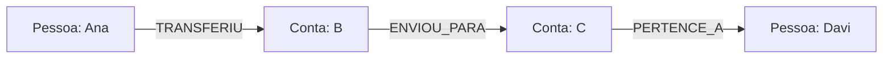
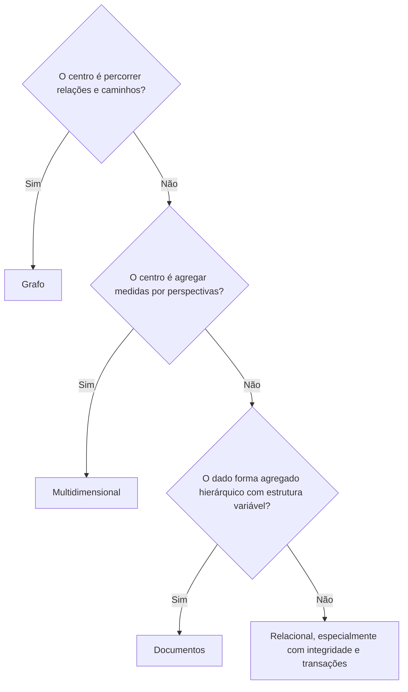
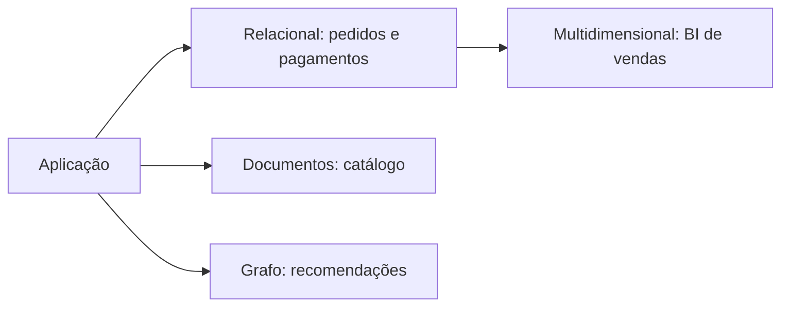

# 1.23 — Diferenciação entre bancos relacionais, multidimensionais, documentos e grafos

[[1.0 Mapa de estudos — Arquitetura de dados|← Mapa]] · [[1.22 Data Lakes e Soluções para Big Data|← Data Lakes e Big Data]] · [[Banco de questões — Arquitetura de dados|Questões]]

> [!danger] Prioridade CESGRANRIO: **ALTA**
> Há registro de comparação direta entre paradigmas. A banca tende a descrever uma necessidade e pedir a tecnologia mais adequada. Domine **estrutura, forma de relacionamento, padrão de consulta e caso de uso** de cada modelo.

## O que você DEVE MANTER e REVISAR — o “coração” da CESGRANRIO

1. **Relacional (Seção 2):** tabelas, linhas, colunas, chaves, constraints e `JOIN`; forte adequação a transações e integridade estruturada.
2. **Multidimensional (Seção 3):** fatos, medidas, dimensões e hierarquias; otimizado para análise, agregação e operações OLAP. **Pegadinha:** dimensão descreve; fato registra o evento mensurável.
3. **Documentos (Seção 4):** documentos autocontidos, semelhantes a JSON/BSON, com campos e estruturas aninhadas; bons para agregados flexíveis.
4. **Grafos (Seção 5):** nós, arestas e propriedades; bons quando relacionamentos e caminhos são o centro da consulta.
5. **Escolha pelo acesso (Seções 6 a 8):** transação estruturada → relacional; análise por dimensões → multidimensional; agregado hierárquico → documento; travessias → grafo.

> [!tip] Regra mental de prova
> **Relacional faz JOIN; multidimensional agrega; documento recupera agregado; grafo percorre relacionamento.**

## 1. Comparação geral

| Critério | Relacional | Multidimensional | Documentos | Grafos |
|---|---|---|---|---|
| Estrutura central | Tabela/relação | Cubo lógico, fatos e dimensões | Documento | Nós e arestas |
| Relacionamento | PK, FK e JOIN | Chaves entre fatos e dimensões | Incorporação ou referência | Aresta explícita |
| Consulta típica | SQL declarativa | Agregação e OLAP | Campos e documentos aninhados | Padrões, caminhos e vizinhança |
| Esquema | Definido e controlado | Definido para análise | Frequentemente flexível | Rótulos/tipos e propriedades flexíveis |
| Melhor ajuste | OLTP e integridade | BI e análise histórica | Agregados variáveis | Relações densas e travessias |
| Exemplo | Pedidos e pagamentos | Vendas por tempo/produto | Catálogo de produtos | Fraude e rede de dependências |

> [!warning] Pegadinha CESGRANRIO
> Nenhum modelo é universalmente superior. “Mais flexível” ou “mais rápido” depende do problema, da modelagem, do volume e das consultas.

## 2. Banco relacional

Organiza dados em relações representadas por tabelas. Cada linha é uma tupla; cada coluna representa um atributo.



### 2.1 Pontos centrais

- esquema explícito;
- chave primária identifica linhas;
- chave estrangeira representa referências;
- integridade por constraints;
- normalização reduz redundância e anomalias;
- `JOIN` combina relações;
- transações ACID são comuns.

### 2.2 Melhor adequação

- pagamentos, contratos e contabilidade;
- cadastros com regras fortes;
- transações envolvendo várias entidades;
- consultas variadas sobre dados estruturados.

### 2.3 Limitação relativa

Travessias profundas podem exigir muitos `JOINs`; agregados hierárquicos podem exigir decomposição em várias tabelas; mudanças frequentes de estrutura exigem evolução de esquema.

> [!warning] Pegadinha CESGRANRIO
> Banco relacional pode armazenar JSON e executar análises. A classificação indica seu modelo central, não uma proibição absoluta de recursos adicionais.

## 3. Banco multidimensional

Organiza dados para análise por diferentes perspectivas.



### 3.1 Elementos

| Elemento | Função |
|---|---|
| **Fato** | Registra evento no grão definido |
| **Medida** | Valor analisado, como quantidade ou receita |
| **Dimensão** | Contexto descritivo, como tempo, produto e local |
| **Hierarquia** | Níveis de navegação, como dia → mês → ano |

### 3.2 Operações OLAP

- **roll-up:** agregar/subir na hierarquia;
- **drill-down:** detalhar/descer;
- **slice:** fixar um valor de dimensão;
- **dice:** selecionar subconjunto multidimensional;
- **pivot:** reorientar a visualização.

### 3.3 Melhor adequação

- BI, relatórios gerenciais e dashboards;
- análise histórica;
- agregações por múltiplas dimensões;
- comparação de indicadores ao longo do tempo.

> [!warning] Pegadinhas CESGRANRIO
> - Multidimensional é voltado a análise, não ao registro operacional de cada transação concorrente.
> - Esquema estrela pode ser implementado em SGBD relacional. Modelo multidimensional e produto físico não são necessariamente a mesma classificação.

## 4. Banco de documentos

Armazena cada agregado como documento, geralmente semelhante a JSON ou BSON.

```json
{
  "pedido": 501,
  "cliente": { "id": 10, "nome": "Ana" },
  "itens": [
    { "produto": 7, "quantidade": 2, "preco": 25.00 }
  ],
  "status": "aberto"
}
```

### 4.1 Pontos centrais

- campos e subdocumentos;
- coleções de documentos;
- estrutura flexível ou variável;
- recuperação conjunta do agregado;
- incorporação ou referência;
- desnormalização deliberada conforme o acesso.

### 4.2 Melhor adequação

- catálogos com atributos variáveis;
- perfis e conteúdo;
- agregados hierárquicos lidos em conjunto;
- evolução frequente da estrutura.

### 4.3 Limitação relativa

Duplicação dificulta atualizações globais; relacionamentos muitos-para-muitos e consultas cruzadas complexas podem exigir referências ou tratamento adicional.

> [!warning] Pegadinhas CESGRANRIO
> - Documento não é valor totalmente opaco: seus campos normalmente podem ser indexados e consultados.
> - Flexibilidade não significa ausência de validação ou modelagem.
> - Documento JSON não equivale a banco orientado a objetos.

## 5. Banco de grafos

Representa entidades e relações diretamente.



### 5.1 Pontos centrais

- **nó/vértice:** entidade;
- **aresta/relacionamento:** ligação;
- **propriedade:** dado associado ao nó ou aresta;
- **caminho:** sequência de relações;
- consultas por padrão e vizinhança.

Padrão Cypher ilustrativo:

```cypher
MATCH (a:Conta)-[:TRANSFERIU*1..4]->(b:Conta)
WHERE a.numero = '100'
RETURN b.numero
```

### 5.2 Melhor adequação

- detecção de fraude;
- redes sociais;
- recomendação;
- rotas e dependências;
- conhecimento e relacionamentos complexos.

### 5.3 Limitação relativa

Pode não ser a melhor escolha quando predominam agregações tabulares simples, transações convencionais ou recuperação isolada por chave sem travessia.

> [!warning] Pegadinhas CESGRANRIO
> - Uma chave estrangeira representa relação no modelo relacional, mas a aresta é elemento explícito e navegável no grafo.
> - Grafo não é escolhido apenas porque “existem relacionamentos”; eles existem em quase todos os sistemas. Escolha grafo quando **explorar conexões e caminhos** é central.

## 6. O mesmo domínio nos quatro modelos

Considere vendas de produtos:

### 6.1 Relacional

```text
CLIENTE ─< PEDIDO ─< ITEM_PEDIDO >─ PRODUTO
```

Favorece integridade e operações de cadastro, pedido e pagamento.

### 6.2 Multidimensional

```text
FATO_VENDA(valor, quantidade)
  → DIM_TEMPO
  → DIM_PRODUTO
  → DIM_CLIENTE
  → DIM_LOJA
```

Favorece perguntas como “qual foi a receita mensal por categoria e região?”.

### 6.3 Documentos

```text
Documento Pedido
  ├── dados do cliente
  └── lista de itens
```

Favorece recuperar o pedido completo como um agregado.

### 6.4 Grafo

```text
(Cliente)-[COMPROU]->(Produto)-[PERTENCE_A]->(Categoria)
```

Favorece recomendação por padrões de compra e conexões entre clientes e produtos.

## 7. Como escolher em questões por cenário



Heurística, não regra absoluta: requisitos de consistência, escala, equipe, ferramentas e consultas também influenciam.

## 8. Palavras-chave da banca

| Se o enunciado mencionar… | Pense primeiro em… |
|---|---|
| PK, FK, normalização, JOIN, integridade | Relacional |
| fatos, medidas, dimensões, hierarquias, OLAP | Multidimensional |
| JSON/BSON, agregado, subdocumento, coleção | Documentos |
| nós, arestas, caminhos, vizinhos, travessias | Grafos |
| fraude por conexões indiretas | Grafos |
| relatório por tempo, produto e região | Multidimensional |
| catálogo com atributos diferentes por categoria | Documentos |
| pagamento com transação e restrições fortes | Relacional |

## 9. Consistência e esquema — sem generalizações

Afirmações absolutas costumam estar erradas:

```text
“Todo banco de documentos é eventualmente consistente.”
“Banco de grafos não oferece ACID.”
“Banco relacional não escala horizontalmente.”
“Modelo multidimensional só armazena agregados.”
“Documento não possui esquema.”
```

Garantias dependem do produto, da configuração e do escopo. O modelo de dados indica a forma central de organização, não todas as capacidades possíveis.

## 10. Persistência poliglota

É o uso consciente de mais de um paradigma na mesma solução:



Benefício: adequação de cada tecnologia ao problema. Custos: integração, sincronização, governança, operação e competências mais complexas.

> [!warning] Pegadinha CESGRANRIO
> Persistência poliglota não significa duplicar dados sem controle. É uma decisão arquitetural que exige fonte de verdade, consistência e integração definidas.

## 11. Tabela definitiva de revisão

| Modelo | Unidade | Relação | Operação forte | Cenário clássico | Pegadinha |
|---|---|---|---|---|---|
| Relacional | Linha em tabela | FK + JOIN | Transação e consulta SQL | Pagamentos | Pode armazenar JSON e escalar |
| Multidimensional | Fato no grão | Fato–dimensão | Agregação OLAP | BI histórico | Fato mede; dimensão descreve |
| Documentos | Documento/agregado | Embed ou referência | Recuperar agregado | Catálogo variável | Flexível não é sem esquema |
| Grafos | Nó e aresta | Aresta explícita | Travessia e caminho | Fraude/rede | Ter relações não basta para exigir grafo |

## 12. Prioridade de estudo

### Alta frequência/probabilidade

- diferenças da tabela definitiva;
- escolha por cenário;
- relacional: PK, FK, constraints e JOIN;
- multidimensional: fato, medida, dimensão e OLAP;
- documentos: agregado, embed e referência;
- grafos: nó, aresta, propriedade e caminho;
- evitar afirmações absolutas.

### Chance média

- mesmo domínio representado nos quatro modelos;
- persistência poliglota;
- Cypher básico;
- limitações relativas de cada paradigma.

## 13. Checklist de revisão

- [ ] Relacional usa tabelas, chaves, constraints e JOIN.
- [ ] Multidimensional usa fatos, medidas, dimensões e hierarquias.
- [ ] Documento guarda agregado com campos e estruturas aninhadas.
- [ ] Grafo prioriza nós, arestas, caminhos e travessias.
- [ ] Relatório por tempo/produto/região sugere multidimensional.
- [ ] Catálogo com atributos variáveis sugere documentos.
- [ ] Fraude por conexões indiretas sugere grafos.
- [ ] Pagamento com regras transacionais sugere relacional.
- [ ] Esquema estrela pode ser implementado em SGBD relacional.
- [ ] Banco de documentos não é banco orientado a objetos.
- [ ] Nenhum modelo é sempre mais rápido ou superior.
- [ ] Persistência poliglota aumenta adequação e complexidade.

## 14. Questões inéditas — estilo CESGRANRIO

### 14.1 Questão 1

Uma companhia precisa identificar cadeias de transferências com até seis intermediários entre contas e descobrir comunidades de contas fortemente conectadas. O modelo mais diretamente adequado e sua estrutura central são

A) relacional, fatos e dimensões.  
B) multidimensional, documentos e coleções.  
C) documentos, chaves estrangeiras e cubos.  
D) grafos, nós e arestas.  
E) relacional, somente valores chave–valor.

> [!success]- Gabarito comentado
> **Resposta: D.** Caminhos de profundidade variável e comunidades conectadas são consultas típicas de grafos, formados por nós, arestas e propriedades. Embora o relacional possa representar relações, muitas travessias são o centro deste cenário.

### 14.2 Questão 2

Associe a necessidade ao modelo mais diretamente adequado:

I — registrar pagamentos com integridade e transações;  
II — analisar receita por mês, região e produto;  
III — armazenar catálogo cujos atributos variam por categoria.

A associação correta é

A) I–grafos; II–documentos; III–relacional.  
B) I–relacional; II–multidimensional; III–documentos.  
C) I–multidimensional; II–relacional; III–grafos.  
D) I–documentos; II–grafos; III–multidimensional.  
E) I–relacional; II–documentos; III–multidimensional.

> [!success]- Gabarito comentado
> **Resposta: B.** Pagamentos favorecem integridade e transações relacionais; análise por perspectivas favorece fatos e dimensões; catálogo variável favorece documentos. A questão explora as palavras-chave de cada paradigma.

## 15. Resumo de véspera

```text
RELACIONAL = tabelas + PK/FK + constraints + JOIN + transações
MULTIDIMENSIONAL = fato + medida + dimensão + hierarquia + OLAP
DOCUMENTOS = JSON/BSON + agregado + embed/referência + flexibilidade
GRAFOS = nós + arestas + propriedades + caminhos/travessias

INTEGRIDADE E OLTP → RELACIONAL
AGREGAÇÃO POR PERSPECTIVAS → MULTIDIMENSIONAL
AGREGADO HIERÁRQUICO VARIÁVEL → DOCUMENTOS
CONEXÕES E CAMINHOS → GRAFOS

FATO mede; DIMENSÃO descreve
DOCUMENTO não é valor opaco nem objeto OO
TER RELAÇÕES não basta: grafo é forte quando PERCORRÊ-LAS é central
PERSISTÊNCIA POLIGLOTA = combinar modelos com governança
```
