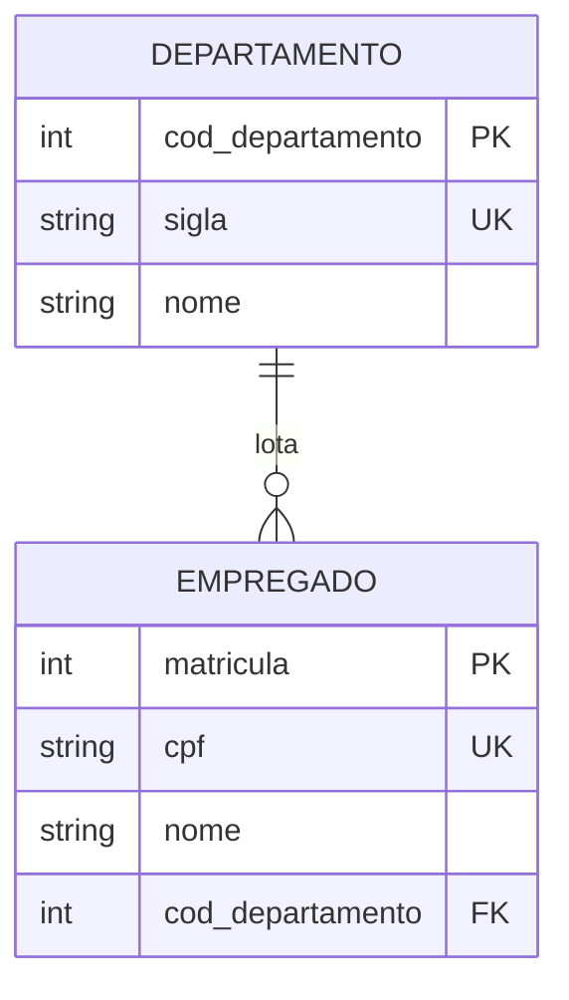
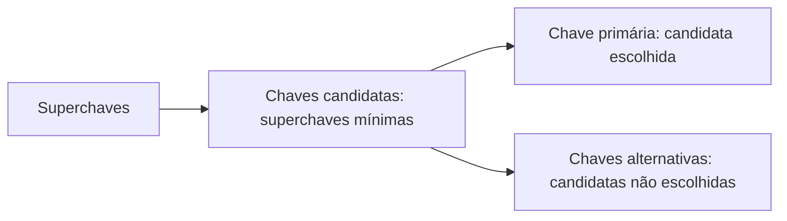

> [!important] Prioridade CESGRANRIO: **ALTA**
> O modelo relacional integra o núcleo mais recorrente e mais treinável de Arquitetura de Dados: **modelagem ER + modelo relacional + SQL + normalização**. Para este tópico, domine sobretudo vocabulário, chaves, restrições, esquema versus estado e diferenças entre a teoria relacional e o comportamento prático do SQL.

## O que você DEVE MANTER e REVISAR — o “coração” da CESGRANRIO

A CESGRANRIO concentra as questões de modelo relacional em cinco pilares:

1. **Vocabulário relacional (Seções 1 e 2):** relação equivale conceitualmente à tabela, tupla à linha e atributo à coluna. Esquema é a estrutura; estado é o conteúdo em determinado instante.

2. **Grau × cardinalidade (Seção 2.1):** grau é o número de atributos; cardinalidade é o número de tuplas. **Pegadinha:** inserir linha aumenta cardinalidade, enquanto adicionar coluna aumenta grau.

3. **Hierarquia de chaves (Seção 4):** superchave identifica; candidata é superchave mínima; primária é a candidata escolhida; alternativas são candidatas não escolhidas. Uma PK composta continua sendo uma única chave.

4. **Restrições de integridade (Seção 5):** domínio controla valores; chave controla unicidade; entidade proíbe `NULL` na PK; referência exige correspondência da FK com uma chave candidata existente.

5. **Propriedades formais da relação (Seções 3 e 6):** tuplas não se repetem e não possuem ordem lógica. **Pegadinha:** exibição, índice ou PK não garantem ordenação; em SQL, apenas `ORDER BY` garante a sequência do resultado.

## Objetivos de aprendizagem

Ao final deste módulo, você deverá conseguir:

1. distinguir relação, esquema, estado, tupla, atributo, domínio, grau e cardinalidade;
2. classificar superchaves e chaves candidata, primária, alternativa, composta, natural, substituta e estrangeira;
3. reconhecer as restrições de domínio, chave, entidade e integridade referencial;
4. diferenciar o modelo relacional matemático de uma tabela SQL;
5. interpretar um esquema relacional e prever inserções, alterações e exclusões válidas;
6. evitar as principais trocas conceituais usadas em questões da CESGRANRIO.

## 1. Visão geral

Proposto por **Edgar F. Codd**, o modelo relacional representa os dados por meio de **relações** e fundamenta-se na teoria dos conjuntos e na lógica de predicados. A estrutura lógica é separada dos detalhes de armazenamento: o usuário manipula o que os dados representam sem precisar saber em qual página de disco cada registro está.

No uso cotidiano, costuma-se aproximar uma relação de uma tabela:

| Modelo relacional          | Representação tabular usual                                                                  |
| -------------------------- | -------------------------------------------------------------------------------------------- |
| relação                    | tabela                                                                                       |
| tupla                      | linha/registro                                                                               |
| atributo                   | coluna/campo                                                                                 |
| domínio                    | conjunto de valores admitidos                                                                |
| esquema da relação         | nome da relação e definição dos atributos                                                    |
| estado/extensão da relação | conjunto de tuplas em dado instante                                                          |
| chave primária             | Um atributo ou conjunto que identifica de maneira **única e exclusiva** uma linha na tabela. |
| chave estrangeira          |  Um atributo em uma tabela que aponta para a Chave Primária de outra tabela (ou da mesma)    |

> [!warning] Pegadinha CESGRANRIO
> **Relação** e **tabela SQL** não são sinônimos perfeitos. Na teoria, uma relação é um conjunto e não contém tuplas duplicadas; em SQL, uma consulta pode produzir duplicatas, pois o resultado normalmente tem semântica de **multiconjunto** (_bag_). Usa-se `DISTINCT` quando se deseja eliminá-las.

## 2. Relação, esquema e estado

Considere o esquema:

```text
EMPREGADO(matricula, cpf, nome, cod_lotacao)
```

Uma descrição mais formal é:

```text
EMPREGADO(
  matricula: INTEIRO,
  cpf: DOM_CPF,
  nome: TEXTO,
  cod_lotacao: DOM_COD_LOTACAO
)
```

- **Esquema ou intenção:** estrutura relativamente estável da relação, formada por seu nome e seus atributos/domínios.
- **Estado, instância ou extensão:** conjunto de tuplas existentes em um instante; muda com inserções, alterações e exclusões.
- **Banco de dados relacional:** coleção de esquemas de relações mais as restrições de integridade.

Exemplo de estado válido:

| matricula | cpf | nome | cod_lotacao |
|---:|---|---|---:|
| 101 | 11122233344 | Ana | 10 |
| 102 | 55566677788 | Bruno | 20 |

### 2.1 Grau e cardinalidade

| Propriedade | Significado | No exemplo |
|---|---|---:|
| **grau** ou **aridade** | quantidade de atributos da relação | 4 |
| **cardinalidade** | quantidade de tuplas no estado atual | 2 |

> [!warning] Pegadinha CESGRANRIO
> A banca pode inverter os termos. **Adicionar uma coluna** aumenta o grau; **inserir uma linha** aumenta a cardinalidade. A cardinalidade também aparece em modelagem ER com outro sentido (`1:1`, `1:N`, `N:M`); identifique o contexto.

### 2.2 Domínio

O domínio é o conjunto de valores **atômicos e admissíveis** para um atributo. Ele envolve mais do que o tipo físico:

```text
DOM_PERCENTUAL = números decimais entre 0 e 100
DOM_UF         = {AC, AL, AP, ..., SP, TO}
DOM_CPF        = cadeias de 11 dígitos que atendam às regras definidas
```

Dois atributos podem usar o mesmo tipo SQL e ter domínios semânticos diferentes. `cpf CHAR(11)` e `telefone CHAR(11)`, por exemplo, não se tornam comparáveis apenas porque compartilham o tipo físico.

## 3. Propriedades formais de uma relação

Na teoria relacional:

1. cada célula contém um valor único e atômico;
2. os valores de um atributo pertencem ao mesmo domínio;
3. não há tuplas duplicadas;
4. a ordem das tuplas não possui significado;
5. a ordem de apresentação dos atributos também não possui significado, pois eles são identificados por nome;
6. cada atributo possui nome distinto dentro da relação.

> [!warning] Pegadinha CESGRANRIO
> A ausência de ordem lógica não impede o SGBD de exibir linhas em alguma sequência acidental. **Somente `ORDER BY` garante a ordem do resultado SQL.** Índice, chave primária ou ordem de inserção não constituem promessa de ordenação.

## 4. Chaves: a hierarquia que mais cai

Considere:

```text
EMPREGADO(matricula, cpf, email, nome, data_nascimento)
```

Suponha que `matricula`, `cpf` e `email` sejam individualmente únicos.

### 4.1 Superchave

Qualquer conjunto de um ou mais atributos que identifica univocamente uma tupla.

```text
{matricula}
{cpf}
{email}
{matricula, nome}
{cpf, data_nascimento}
```

Os dois últimos exemplos têm atributos excedentes, mas continuam sendo superchaves.

### 4.2 Chave candidata

 É uma **superchave mínima**. Ou seja, é um conjunto de atributos que identifica a tupla de forma única, mas se você remover qualquer atributo dele, ele perde a capacidade de identificação unívoca.

```text
{matricula}, {cpf} e {email}
```

### 4.3 Chave primária e chaves alternativas

- **chave primária (PK):** chave candidata escolhida como identificador principal;
- **chaves alternativas:** candidatas não escolhidas como primária.

Se `matricula` for a PK, `cpf` e `email` serão chaves alternativas. Uma relação possui no máximo **uma restrição de chave primária**, embora essa chave possa ter vários atributos.

### 4.4 Chave simples e chave composta

- **simples:** formada por um atributo;
- **composta:** formada por dois ou mais atributos.

```text
ALOCACAO(matricula, cod_projeto, horas)
PK = (matricula, cod_projeto)
```

Uma PK composta continua sendo **uma única chave primária**.

### 4.5 Chave natural e chave substituta

- **natural:** possui significado no negócio, como CPF ou código oficial;
- **substituta/artificial/surrogate:** criada apenas para identificação, como um inteiro gerado ou UUID.

Uma chave substituta não elimina automaticamente a unicidade da chave natural:

```sql
CREATE TABLE empregado (
    id_empregado BIGINT PRIMARY KEY,
    cpf          CHAR(11) NOT NULL UNIQUE,
    nome         VARCHAR(120) NOT NULL
);
```

Sem o `UNIQUE`, dois empregados poderiam compartilhar o mesmo CPF, ainda que `id_empregado` fosse válido.

### 4.6 Chave estrangeira

A FK é um atributo ou conjunto de atributos de uma relação **referenciante** cujos valores devem corresponder a uma chave candidata da relação **referenciada**, salvo quando forem nulos e a restrição permitir `NULL`.



> [!warning] Pegadinhas CESGRANRIO sobre FK
>
> - FK não precisa apontar exclusivamente para uma **PK**; pode referenciar outra chave candidata implementada com `UNIQUE`, conforme as regras do SGBD.
> - FK pode ser **composta**, **autorrepresentativa** (referir a mesma tabela) e, se não houver `NOT NULL`, pode aceitar `NULL`.
> - Os valores da FK podem se repetir: vários empregados podem pertencer ao mesmo departamento.
> - FK não precisa ter o mesmo nome da chave referenciada, mas seus componentes devem ser compatíveis e estar na ordem correspondente.
> - Uma coluna pode participar simultaneamente da PK e de uma FK, como ocorre no mapeamento de entidade fraca.

### 4.7 Hierarquia correta



Em termos de classificação:

```text
chave primária ⊂ chaves candidatas ⊂ superchaves
```

Não se deve usar “superchave forte” e “superchave fraca” como categorias gerais. Em uma **entidade fraca**, o discriminador é apenas uma **chave parcial**; sua identificação completa combina esse discriminador com a chave da entidade proprietária.

## 5. Restrições de integridade

### 5.1 Restrição de domínio

Cada valor deve pertencer ao domínio do atributo. Pode ser implementada por tipo, `CHECK`, `NOT NULL` e outras regras.

```sql
percentual DECIMAL(5,2) CHECK (percentual BETWEEN 0 AND 100)
```

### 5.2 Restrição de chave

Nenhum par de tuplas pode ter o mesmo valor para uma chave candidata. Na teoria, a existência de pelo menos uma chave candidata decorre do fato de a relação ser um conjunto de tuplas distintas; o conjunto de todos os atributos é, no mínimo, uma superchave.

### 5.3 Integridade de entidade

Nenhum componente da chave primária pode ser `NULL`. Em uma PK composta, a proibição alcança **todos** os componentes.

### 5.4 Integridade referencial

Para cada valor não nulo de uma FK, deve existir valor igual na chave candidata referenciada.

Considere:

```text
DEPARTAMENTO: {10, 20}
```

| Operação em `EMPREGADO.cod_departamento` | Resultado                                 |
| ---------------------------------------- | ----------------------------------------- |
| inserir `10`                             | válida                                    |
| inserir `30`                             | inválida, se não existir departamento 30  |
| inserir `NULL`                           | válida somente se a coluna aceitar `NULL` |

Ao excluir ou alterar a linha-pai, a ação referencial definida pode ser:

- `RESTRICT`/`NO ACTION`: impede a operação enquanto houver referências;
- `CASCADE`: propaga a exclusão ou atualização;
- `SET NULL`: atribui `NULL` à FK, que precisa ser anulável;
- `SET DEFAULT`: atribui valor padrão que ainda deve satisfazer a referência.

> [!warning] Pegadinha CESGRANRIO
> `CASCADE` não significa “garantir integridade impedindo tudo”. Ele **preserva** a integridade propagando a operação. Já `SET NULL` é incompatível com uma FK declarada `NOT NULL`.

### 5.5 Restrições semânticas ou de negócio

Expressam regras específicas da organização, por exemplo: “um empregado não pode registrar mais de 44 horas semanais”. Dependendo da abrangência, podem ser implementadas com `CHECK`, asserções (na teoria/padrão), gatilhos, procedimentos ou lógica transacional da aplicação.

> [!note] Cuidado com a classificação
> `NOT NULL`, `UNIQUE`, `CHECK` e `FOREIGN KEY` são mecanismos declarativos de DDL. A regra representada por eles pode ser de domínio, chave, entidade, referência ou negócio. “Implícita versus explícita” não substitui essa classificação conceitual.
## 6. Ordenação de tuplas em uma relação
- Uma tabela é definida como um conjunto de tuplas. Elementos de um conjunto não são ordenados. Assim, as tuplas em uma relação não possuem nenhuma ordenaço. A seguinte tabela/relação são iguais, pois a ordem das tuplas de uma relação não importam

```
RELAÇÃO_A                                 RELAÇÃO_B
+-------+------------------+             +-------+------------------+
| ident | nome             |             | ident | nome             |
+-------+------------------+             +-------+------------------+
| 1163  | Claudia Morais   |      =      | 1166  | Patrícia Sorte   |
| 1164  | Jorge Vila Verde |             | 1165  | Moacir Junqueira |
| 1165  | Moacir Junqueira |             | 1163  | Claudia Morais   |
| 1166  | Patrícia Sorte   |             | 1164  | Jorge Vila Verde |
+-------+------------------+             +-------+------------------+
```

- Uma tupla é uma lista ordenada de valores, então a ordem dos valores na tupla é importante. Na seguinte tabela não são iguais, pois a ordem dos valores das tuplas são diferentes
```
RELAÇÃO_A                                 RELAÇÃO_C
+-------+------------------+             +------------------+-------+
| ident | nome             |             | nome             | ident |
+-------+------------------+    <  >     +------------------+-------+
| 1163  | Claudia Morais   |             | Claudia Morais   | 1163  |
| 1164  | Jorge Vila Verde |             | Jorge Vila Verde | 1164  |
| 1165  | Moacir Junqueira |             | Moacir Junqueira | 1165  |
| 1166  | Patrícia Sorte   |             | Patrícia Sorte   | 1166  |
+-------+------------------+             +------------------+-------+
```
## 7. Mapa de prioridade e revisão

### Alta frequência / alto retorno na CESGRANRIO

- relação, tupla, atributo, domínio, esquema e estado;
- grau versus cardinalidade;
- hierarquia de chaves e minimalidade da chave candidata;
- PK, FK, chave composta e integridade referencial;
- comportamento de `NULL`;
- teoria de conjuntos versus duplicatas do SQL;
- seleção, projeção e junção ligadas à leitura de SQL.

### Conceitual / menor frequência isolada

- formalização da relação como subconjunto do produto cartesiano;
- terminologia intenção/extensão;
- renomeação na álgebra relacional;
- detalhes formais de domínios e lógica de predicados.

> [!tip] Estratégia de prova
> Quando a questão trouxer um esquema, marque primeiro PKs, candidatas e FKs. Depois teste a operação na ordem: **domínio → entidade/PK → unicidade → referência**. Isso reduz erros causados pelo texto narrativo.

## 8. Questões inéditas — estilo CESGRANRIO

### Questão 1

Considere a relação `TECNICO(matricula, cpf, email, nome)`. Sabe-se que `matricula`, `cpf` e `email` identificam, cada um isoladamente, uma tupla; `matricula` foi escolhida como chave primária.

Nesse cenário, é correto afirmar que

A) apenas `matricula` é superchave, pois foi escolhida como chave primária.  
B) `{matricula, nome}` é chave candidata, pois identifica univocamente uma tupla.  
C) `cpf` e `email` são chaves alternativas, e `{cpf, nome}` é superchave não mínima.  
D) a relação possui três chaves primárias simples.  
E) toda superchave é também uma chave candidata.

> [!success]- Gabarito comentado
> **Resposta: C.** `matricula`, `cpf` e `email` são chaves candidatas; a candidata escolhida, `matricula`, é a PK, e as demais são alternativas. `{cpf, nome}` ainda identifica a tupla, logo é superchave, mas não é mínima porque `{cpf}` já basta. A alternativa B explora a confusão entre unicidade e minimalidade; D confunde candidata com primária; E inverte a relação de inclusão.

## 9. Resumo de véspera

```text
RELAÇÃO = conjunto de tuplas
ESQUEMA = estrutura; ESTADO = conteúdo em um instante
GRAU = número de atributos; CARDINALIDADE = número de tuplas
SUPERCHAVE = identifica
CANDIDATA = superchave mínima
PRIMÁRIA = candidata escolhida
ALTERNATIVA = candidata não escolhida
FK = referência a chave candidata; pode repetir e pode ser nula
PK = única por relação, possivelmente composta, nunca nula
```
