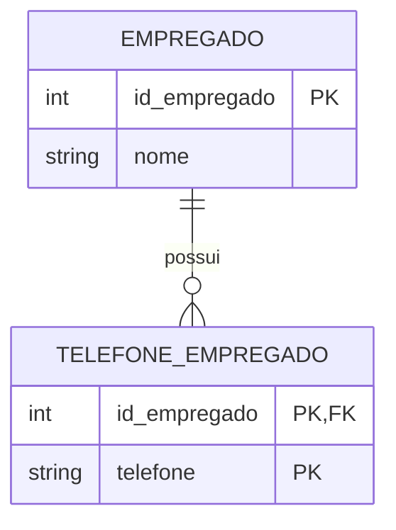
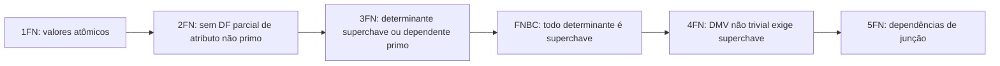

> [!important] Prioridade CESGRANRIO: **ALTA**
> Normalização integra o núcleo de maior retorno de Arquitetura de Dados, junto com modelo relacional e SQL. A banca pode apresentar uma relação, suas dependências funcionais e uma decomposição para cobrar: **chave candidata, forma normal atingida, anomalia removida, junção sem perda ou preservação de dependências**.

## O que você DEVE MANTER e REVISAR — o “coração” da CESGRANRIO

A CESGRANRIO concentra as questões de normalização em cinco pilares:

1. **Anomalias de dados (Seção 2):** redundância provoca anomalias de inserção, exclusão e atualização. Primeiro identifique o fato repetido; depois localize a dependência que causa o problema.

2. **Dependências funcionais (Seções 3 e 4):** `X → Y` significa que valores iguais em X obrigam valores iguais em Y. **Pegadinha:** a DF não é comutativa; `X → Y` não implica `Y → X`.

3. **Fechamento e chaves candidatas (Seção 5):** calcule `X⁺`; se ele contém todos os atributos, X é superchave. Depois retire atributos para testar minimalidade e encontrar a candidata.

4. **1FN, 2FN, 3FN e FNBC (Seções 8 a 11):** 1FN trata atomicidade; 2FN elimina dependência parcial de atributo não primo; 3FN exige determinante superchave ou dependente primo; FNBC exige todo determinante como superchave.

5. **Decomposição de qualidade (Seções 15 e 16):** a junção deve reconstruir exatamente a relação original, sem tuplas espúrias, e as dependências devem ser preservadas quando possível. **Pegadinha:** junção sem perda e preservação de dependências são propriedades diferentes.

## Objetivos de aprendizagem

Ao final deste módulo, você deverá conseguir:

1. reconhecer anomalias de inserção, exclusão e atualização;
2. interpretar e derivar dependências funcionais;
3. calcular fechamento de atributos e identificar chaves candidatas;
4. distinguir 1FN, 2FN, 3FN, FNBC, 4FN e 5FN;
5. decompor relações até 3FN/FNBC;
6. avaliar junção sem perda e preservação de dependências;
7. diferenciar normalização de desnormalização controlada;
8. evitar as principais pegadinhas da CESGRANRIO.

## 1. O que é normalização

A **normalização** é uma técnica formal de organização e decomposição de esquemas relacionais. Seu propósito é reduzir redundâncias prejudiciais e evitar anomalias, mantendo propriedades importantes da relação original.


Resultados desejáveis:

- menor redundância lógica;
- menor risco de inconsistência;
- eliminação de anomalias de atualização;
- representação mais fiel das dependências do negócio;
- decomposição com **junção sem perda**;
- preferencialmente, **preservação das dependências**.

> [!warning] Pegadinha CESGRANRIO
> Normalização não garante desempenho, segurança, integridade referencial ou ausência de toda redundância. Ela trata principalmente da qualidade lógica do esquema. Índices, transações e restrições continuam necessários.

## 2. Anomalias causadas por redundância

Considere a relação não normalizada:

```text
ALOCACAO(
  matricula,
  nome_empregado,
  cod_projeto,
  nome_projeto,
  cod_departamento,
  nome_departamento,
  horas
)

PK = (matricula, cod_projeto)
```

Exemplo de estado:

| matricula | nome_empregado | cod_projeto | nome_projeto | cod_departamento | nome_departamento | horas |
|---:|---|---:|---|---:|---|---:|
| 10 | Ana | P1 | Refinaria | 5 | Engenharia | 20 |
| 10 | Ana | P2 | Oleoduto | 5 | Engenharia | 15 |
| 20 | Bruno | P1 | Refinaria | 8 | Operações | 30 |

### 2.1 Anomalia de atualização

Alterar o nome do departamento 5 exige modificar várias linhas. Se uma delas permanecer como “Engenharia” e outra for alterada para “Engenharia de Projetos”, surge inconsistência.

### 2.2 Anomalia de inserção

Não é possível cadastrar um novo projeto sem alocar algum empregado, caso os atributos da PK sejam obrigatórios.

### 2.3 Anomalia de exclusão

Excluir a única alocação do projeto P2 pode apagar também a única informação existente sobre esse projeto.

> [!tip] Método de prova
> Pergunte qual fato está repetido e de que determinante ele depende. A anomalia é o sintoma; a dependência funcional revela a causa.

## 3. Dependência funcional

Dada uma relação `R`, uma dependência funcional

```text
X → Y
```

significa que, em todo estado válido de `R`, duas tuplas que concordem nos valores de `X` também devem concordar nos valores de `Y`.

Formalmente:

$$
t_1[X] = t_2[X] \Rightarrow t_1[Y] = t_2[Y]
$$

- `X` é o **determinante**;
- `Y` é o **dependente**.

Exemplos:

```text
matricula → nome_empregado, cod_departamento
cod_departamento → nome_departamento
cod_projeto → nome_projeto
(matricula, cod_projeto) → horas
```

> [!warning] Pegadinhas CESGRANRIO
>
> - DF é uma restrição semântica do esquema, não uma coincidência observada em poucas linhas.
> - `X → Y` não implica `Y → X`.
> - DF não é comutativa.
> - Se `X` é superchave, então `X` determina todos os atributos; a recíproca também caracteriza uma superchave.

### 3.1 Tipos de dependência funcional

#### Trivial

`X → Y` é trivial quando `Y ⊆ X`.

```text
{matricula, nome} → matricula
```

#### Não trivial

É não trivial quando `Y ⊄ X`; é completamente não trivial quando `X ∩ Y = ∅`.

#### Total ou plena

`Y` depende plenamente de `X` quando `X → Y`, mas nenhum subconjunto próprio de `X` determina `Y`.

```text
(matricula, cod_projeto) → horas
```

Se nem `matricula → horas` nem `cod_projeto → horas`, a dependência é plena.

#### Parcial

Ocorre quando `Y` depende de um subconjunto próprio de um determinante composto.

```text
(matricula, cod_projeto) → nome_empregado
matricula → nome_empregado
```

Logo, `nome_empregado` depende apenas de parte da chave composta. Esse é o problema tratado pela **2FN**.

#### Transitiva

Ocorre quando uma dependência é obtida por intermédio de outro conjunto de atributos:

```text
matricula → cod_departamento
cod_departamento → nome_departamento
∴ matricula → nome_departamento
```

Quando essa cadeia envolve atributos não primos nas condições relevantes, caracteriza o problema tratado pela **3FN**.

## 4. Axiomas de Armstrong

Os axiomas são corretos e completos para inferir dependências funcionais.

| Regra | Forma | Interpretação |
|---|---|---|
| reflexividade | se `Y ⊆ X`, então `X → Y` | um conjunto determina seus subconjuntos |
| aumento | se `X → Y`, então `XZ → YZ` | adicionar os mesmos atributos preserva a DF |
| transitividade | se `X → Y` e `Y → Z`, então `X → Z` | encadeamento de DFs |
| união | se `X → Y` e `X → Z`, então `X → YZ` | reúne dependentes |
| decomposição | se `X → YZ`, então `X → Y` e `X → Z` | separa dependentes |
| pseudotransitividade | se `X → Y` e `WY → Z`, então `WX → Z` | combina aumento e transitividade |

As três primeiras são axiomas básicos; as demais são regras derivadas.

> [!warning] Pegadinha CESGRANRIO
> O aumento adiciona o mesmo conjunto aos dois lados: de `X → Y`, conclui-se `XZ → YZ`. Não se pode concluir arbitrariamente `X → YZ`.

## 5. Fechamento de atributos e chaves candidatas

O fechamento `X⁺` em relação a um conjunto de DFs `F` é o conjunto de todos os atributos funcionalmente determinados por `X`.

Considere:

```text
R(A, B, C, D, E)
F = { A → B, B → C, AC → D, D → E }
```

### 5.1 Cálculo de `A⁺`

```text
início:       A⁺ = {A}
por A → B:    A⁺ = {A, B}
por B → C:    A⁺ = {A, B, C}
por AC → D:   A⁺ = {A, B, C, D}
por D → E:    A⁺ = {A, B, C, D, E}
```

Como `A⁺` contém todos os atributos de `R`, `A` é superchave. Como possui apenas um atributo, é também chave candidata.

### 5.2 Algoritmo prático

1. comece com `X⁺ = X`;
2. procure uma DF cujo lado esquerdo esteja contido em `X⁺`;
3. acrescente o lado direito;
4. repita até não haver mudança;
5. se `X⁺ = R`, `X` é superchave;
6. teste os subconjuntos próprios para verificar a minimalidade.

> [!tip] Atalho
> Atributos que nunca aparecem no lado direito de nenhuma DF geralmente precisam pertencer a toda chave candidata, pois não podem ser derivados a partir de outros atributos.

## 6. Cobertura mínima

Uma cobertura mínima ou canônica é um conjunto equivalente de DFs em que:

1. cada lado direito possui um único atributo;
2. nenhum atributo do lado esquerdo é extrínseco;
3. nenhuma DF é redundante.

Exemplo inicial:

```text
F = { A → BC, AB → C, C → D }
```

Passos resumidos:

```text
1. decompor:       A → B, A → C, AB → C, C → D
2. AB → C é redundante, pois A → C já vale
3. cobertura:      A → B, A → C, C → D
```

A cobertura mínima é particularmente útil na síntese de relações em **3FN**.

## 7. Vocabulário indispensável

- **atributo primo:** pertence a pelo menos uma chave candidata;
- **atributo não primo:** não pertence a nenhuma chave candidata;
- **determinante:** lado esquerdo de uma DF;
- **superchave:** conjunto cujo fechamento contém todos os atributos;
- **DF parcial:** dependência de parte própria de uma chave candidata composta;
- **DF transitiva problemática:** dependência indireta relevante de atributo não primo.

> [!warning] Pegadinha CESGRANRIO
> “Atributo primo” não significa “atributo da chave primária”. Basta participar de **qualquer chave candidata**.

## 8. Primeira Forma Normal — 1FN

Uma relação está na 1FN quando cada atributo contém, para cada tupla, um único valor pertencente ao domínio declarado, sem grupos repetitivos ou coleções internas manipuladas como vários valores.

- Exemplos
- Exemplo problemático:

| id_empregado | nome | telefones |
|---:|---|---|
| 10 | Ana | 21999990000, 2133334444 |

- Solução: Mover atributos multivalorados para uma nova tabela dedicada (com FK apontando para a tabela original).
- Decomposição:

```text
EMPREGADO(id_empregado PK, nome)
TELEFONE_EMPREGADO(id_empregado PK/FK, telefone PK)
```



> [!warning] Pegadinha CESGRANRIO
> Atomicidade depende do uso e do domínio. Uma data pode ser tratada como um único valor, embora contenha dia, mês e ano. Um endereço armazenado como texto não viola automaticamente a 1FN se o sistema o trata como valor indivisível. Já uma coluna com lista de telefones que precisam ser consultados separadamente caracteriza grupo multivalorado inadequado.

## 9. Segunda Forma Normal — 2FN

Uma relação está na 2FN quando:

1. está na 1FN; e
2. todo atributo **não primo** é plenamente dependente de **cada chave candidata**.

- Considere:

```text
ALOCACAO(matricula, cod_projeto, nome_empregado, nome_projeto, horas)
PK = (matricula, cod_projeto)

matricula → nome_empregado
cod_projeto → nome_projeto
(matricula, cod_projeto) → horas
```

- Solução: Identificar os atributos que dependem apenas de parte da chave composta e separá-los em tabelas próprias para suas respectivas entidades (`FP2` para Funcionário e `FP3` para Projeto).
- As duas primeiras DFs são parciais. A decomposição é:

```text
EMPREGADO(matricula PK, nome_empregado)
PROJETO(cod_projeto PK, nome_projeto)
ALOCACAO(matricula PK/FK, cod_projeto PK/FK, horas)
```

> [!warning] Pegadinhas CESGRANRIO
>
> - Relação em 1FN cujas chaves candidatas são todas simples está automaticamente na 2FN.
> - A definição formal considera todas as chaves candidatas, não apenas a chave escolhida como PK.
> - Dependência parcial exige determinante composto; dependência transitiva não é o problema específico da 2FN.

## 10. Terceira Forma Normal — 3FN

Uma relação está na 3FN quando, para toda DF não trivial `X → A`, pelo menos uma condição é verdadeira:

1. `X` é superchave; ou
2. `A` é atributo primo.

A regra didática “todo atributo não chave depende da chave, de toda a chave e de nada além da chave” funciona na maioria dos exemplos simples, mas a definição formal é mais precisa.

- Considere:

```text
EMPREGADO(matricula, nome, cod_departamento, nome_departamento)

matricula → nome, cod_departamento
cod_departamento → nome_departamento
```

- Temos:

```text
matricula → cod_departamento → nome_departamento
```

`cod_departamento` não é superchave e `nome_departamento` não é primo. A relação viola a 3FN.

- Solução: Remover os atributos que dependem de uma chave não primária e criar uma nova tabela para a entidade dependente 
- Decomposição:

```text
EMPREGADO(matricula PK, nome, cod_departamento FK)
DEPARTAMENTO(cod_departamento PK, nome_departamento)
```


> [!warning] Pegadinha CESGRANRIO
> Não chame a cadeia acima de dependência parcial. A PK é simples e, portanto, não existe “parte própria” dela. Trata-se de dependência transitiva.

## 11. Forma Normal de Boyce-Codd — FNBC/BCNF

Uma relação está na FNBC quando, para toda DF não trivial `X → Y`, `X` é superchave.

```text
FNBC ⇒ 3FN
3FN ⇏ FNBC
```

A FNBC elimina a exceção da 3FN que permite um dependente primo.

### 11.1 Exemplo clássico de 3FN que viola FNBC

Considere:

```text
CONSULTA(paciente, medico, especialidade)

medico → especialidade
(paciente, especialidade) → medico
```

Chaves candidatas:

```text
(paciente, especialidade)
(paciente, medico)
```

Todos os atributos são primos. Na DF `medico → especialidade`, `medico` não é superchave, mas `especialidade` é primo. Portanto:

- a relação satisfaz a 3FN;
- a relação viola a FNBC.

Decomposição em FNBC:

```text
MEDICO_ESPECIALIDADE(medico PK, especialidade)
PACIENTE_MEDICO(paciente PK, medico PK/FK)
```

Essa decomposição possui junção sem perda, mas ilustra um possível custo da FNBC: certas decomposições podem não preservar todas as dependências de forma local.

## 12. Quarta Forma Normal — 4FN

A 4FN trata **dependências multivaloradas** independentes, denotadas por `X ↠ Y`.

Considere que um técnico possa possuir vários certificados e conhecer vários idiomas, independentemente:

```text
TECNICO_COMPETENCIA(tecnico, certificado, idioma)

tecnico ↠ certificado
tecnico ↠ idioma
```

A relação gera o produto de todas as combinações certificado–idioma.

| tecnico | certificado | idioma |
|---|---|---|
| Ana | AWS | Inglês |
| Ana | AWS | Espanhol |
| Ana | ITIL | Inglês |
| Ana | ITIL | Espanhol |

Decomposição em 4FN:

```text
TECNICO_CERTIFICADO(tecnico, certificado)
TECNICO_IDIOMA(tecnico, idioma)
```

Definição: para toda DMV não trivial `X ↠ Y`, `X` deve ser superchave.

> [!warning] Pegadinha CESGRANRIO
> A 4FN não trata simplesmente “coluna com vários valores” — isso remete à 1FN. Ela trata conjuntos multivalorados independentes já representados em linhas, cuja combinação causa redundância.

## 13. Quinta Forma Normal — 5FN/PJNF

A 5FN trata dependências de junção que não decorrem apenas de chaves candidatas. Uma relação está em 5FN quando toda dependência de junção não trivial é implicada por suas chaves candidatas.

O exemplo clássico envolve uma relação ternária:

```text
FORNECIMENTO(fornecedor, peca, projeto)
```

Sob regras específicas, ela pode ser decomposta em:

```text
FORNECEDOR_PECA(fornecedor, peca)
FORNECEDOR_PROJETO(fornecedor, projeto)
PECA_PROJETO(peca, projeto)
```

A 5FN é conceitual e rara isoladamente. O ponto central é evitar redundância sem gerar **tuplas espúrias** ao reconstruir a relação.

## 14. Hierarquia das formas normais



| Forma normal | Problema principal eliminado | Teste resumido |
|---|---|---|
| 1FN | grupos repetitivos/valores multivalorados internos | um valor do domínio por célula |
| 2FN | dependência parcial | não primo depende da chave candidata inteira |
| 3FN | dependência transitiva problemática | determinante é superchave ou dependente é primo |
| FNBC | determinante que não é superchave | todo determinante não trivial é superchave |
| 4FN | dependências multivaloradas independentes | determinante de DMV é superchave |
| 5FN | dependências de junção | decomposição em projeções sem tuplas espúrias |

> [!warning] Pegadinha CESGRANRIO
> As formas são cumulativas: FNBC pressupõe 3FN; 3FN pressupõe 2FN; 2FN pressupõe 1FN. Uma relação não pode estar na 3FN e simultaneamente violar a 2FN.

## 15. Decomposição com junção sem perda

Uma decomposição é **sem perda de informação** quando a junção natural das relações resultantes reconstrói exatamente os estados válidos da relação original, sem eliminar nem criar tuplas espúrias.

Para uma decomposição binária de `R` em `R1` e `R2`, ela é sem perda em relação a `F` se pelo menos uma das condições puder ser inferida:

```text
(R1 ∩ R2) → R1
ou
(R1 ∩ R2) → R2
```

Ou seja, os atributos comuns devem formar superchave de pelo menos uma das relações decompostas.

### 15.1 Exemplo sem perda

```text
R(A, B, C), com A → B
R1(A, B)
R2(A, C)
```

A interseção é `{A}` e `A → R1`; portanto a decomposição é sem perda.

### 15.2 Exemplo com perda/tuplas espúrias

Considere:

```text
R(A, B, C) = {(1, X, P), (2, X, Q)}
R1(A, B) = {(1, X), (2, X)}
R2(B, C) = {(X, P), (X, Q)}
```

A junção de `R1` e `R2` também produz `(1, X, Q)` e `(2, X, P)`, que não existiam. A decomposição gerou tuplas espúrias.

> [!warning] Pegadinha CESGRANRIO
> “Sem perda” não significa que nenhuma coluna foi removida de cada tabela individualmente. Significa que a **junção** reconstrói exatamente a relação original.

## 16. Preservação de dependências

Uma decomposição preserva dependências quando todas as DFs originais podem ser verificadas impondo restrições separadamente nas relações decompostas, sem precisar executar junções.

Exemplo:

```text
R(A, B, C), F = {A → B, B → C}
R1(A, B)
R2(B, C)
```

As duas DFs podem ser verificadas localmente; a decomposição preserva dependências.

### 16.1 O conflito clássico

- síntese em **3FN** pode garantir junção sem perda e preservação de dependências;
- decomposição em **FNBC** garante junção sem perda pelo algoritmo apropriado, mas pode sacrificar a preservação de alguma DF.

> [!important] Ordem de preferência
> Junção sem perda é indispensável. Preservar dependências é altamente desejável, mas pode haver compromisso ao buscar FNBC.

## 17. Procedimento completo de normalização

Use esta sequência em questões:

1. liste os atributos da relação;
2. escreva as DFs fornecidas pelas regras de negócio;
3. calcule fechamentos e encontre **todas** as chaves candidatas;
4. marque atributos primos e não primos;
5. verifique 1FN;
6. procure DF parcial de não primo para testar 2FN;
7. aplique a condição formal da 3FN;
8. verifique se todo determinante é superchave para FNBC;
9. decomponha pelo determinante que causa a violação;
10. teste junção sem perda;
11. teste preservação de dependências.

```text
Chaves primeiro → formas normais depois.
```

Sem encontrar as chaves candidatas, não é seguro classificar 2FN, 3FN ou FNBC.

## 18. Normalização versus desnormalização

**Desnormalização** é a introdução deliberada e controlada de redundância para reduzir junções ou pré-calcular resultados, normalmente em cargas intensivas de leitura.

| Normalização | Desnormalização controlada |
|---|---|
| reduz redundância | aceita redundância deliberada |
| favorece consistência | favorece determinadas leituras |
| comum em sistemas transacionais | comum em BI, DW, caches e relatórios |
| exige mais junções em alguns casos | exige mecanismos contra inconsistência |

Exemplos de desnormalização:

- armazenar total do pedido além dos itens;
- repetir descrição de dimensão em modelo estrela;
- criar visão materializada;
- manter tabela agregada por mês.

> [!warning] Pegadinha CESGRANRIO
> Desnormalizar não significa “desfazer o projeto sem critério”. É uma decisão física/lógica consciente, baseada em medições, com estratégia de sincronização e conhecimento das anomalias reintroduzidas.

## 19. Priorização para a CESGRANRIO

### Alta frequência / alto retorno

- anomalias de inserção, exclusão e atualização;
- dependências total, parcial e transitiva;
- chave candidata e fechamento;
- 1FN, 2FN e 3FN;
- diferença entre 3FN e FNBC;
- decomposição de relações;
- junção sem perda.

### Frequência média / assunto de diferenciação

- axiomas de Armstrong;
- cobertura mínima;
- atributos primos;
- preservação de dependências;
- decomposição formal em FNBC.

### Conceitual / menor frequência isolada

- dependência multivalorada e 4FN;
- dependência de junção e 5FN;
- algoritmos formais completos de síntese e teste _chase_.

## 20. Checklist de pegadinhas

- [ ] DF decorre da semântica, não apenas dos dados observados.
- [ ] `X → Y` não implica `Y → X`.
- [ ] Atributo primo pertence a alguma chave candidata, não necessariamente à PK.
- [ ] Chave candidata exige superchave e minimalidade.
- [ ] 2FN considera dependências parciais de atributos não primos em relação às chaves candidatas.
- [ ] Chave simples elimina a possibilidade de dependência parcial, não a de dependência transitiva.
- [ ] 3FN admite `X` não superchave quando o dependente é primo.
- [ ] FNBC exige que todo determinante de DF não trivial seja superchave.
- [ ] Toda FNBC está em 3FN, mas nem toda 3FN está em FNBC.
- [ ] Junção sem perda e preservação de dependências são propriedades diferentes.
- [ ] 4FN trata DMVs independentes; não é apenas uma “1FN mais forte”.
- [ ] Desnormalização pode melhorar leitura, mas reintroduz redundância e risco de anomalias.

## 21. Questões inéditas — estilo CESGRANRIO

### Questão 1

Considere a relação

```text
ALOCACAO(matricula, cod_projeto, nome_empregado, nome_projeto, horas)
```

com chave candidata `(matricula, cod_projeto)` e dependências:

```text
matricula → nome_empregado
cod_projeto → nome_projeto
(matricula, cod_projeto) → horas
```

Uma decomposição adequada para eliminar as violações da 2FN é

A) `EMPREGADO(matricula, nome_empregado, horas)` e `PROJETO(cod_projeto, nome_projeto)`.  
B) `EMPREGADO(matricula, nome_empregado)`, `PROJETO(cod_projeto, nome_projeto)` e `ALOCACAO(matricula, cod_projeto, horas)`.  
C) `ALOCACAO(matricula, cod_projeto, horas)` e `NOMES(nome_empregado, nome_projeto)`.  
D) manter a relação original, pois toda relação com chave composta está automaticamente na 2FN.  
E) retirar `horas`, pois esse atributo depende plenamente da chave composta.

> [!success]- Gabarito comentado
> **Resposta: B.** `nome_empregado` depende apenas de `matricula` e `nome_projeto` depende apenas de `cod_projeto`: são dependências parciais de atributos não primos. `horas` depende da chave inteira e deve permanecer em `ALOCACAO`. A alternativa D inverte a regra: chaves simples tornam impossível a dependência parcial; chaves compostas exigem que ela seja investigada.

### Questão 2

Considere `R(A, B, C)` e o conjunto de dependências funcionais

```text
F = {AB → C, C → B}
```

As chaves candidatas são `AB` e `AC`. Com base nessas informações, a relação `R`

A) está na FNBC, pois todo atributo pertence a alguma chave candidata.  
B) viola a 3FN, pois `C` não é superchave em `C → B`.  
C) está na 3FN, mas viola a FNBC, pois `B` é primo e `C` não é superchave.  
D) viola a 2FN, pois `C → B` é uma dependência parcial da chave `AC`.  
E) está apenas na 1FN, pois possui duas chaves candidatas sobrepostas.

> [!success]- Gabarito comentado
> **Resposta: C.** Na DF `C → B`, o determinante `C` não é superchave, o que viola a FNBC. Contudo, `B` é atributo primo por participar da chave candidata `AB`; assim, a exceção formal da 3FN é satisfeita. A alternativa B ignora essa exceção. Embora `C` seja parte própria da chave `AC`, a DF `C → B` não viola a 2FN porque `B` é primo; a 2FN proíbe dependência parcial de atributo **não primo**.

## 22. Resumo de véspera

```text
DF: mesmos valores em X obrigam mesmos valores em Y
X⁺ = tudo que X determina
CHAVE CANDIDATA = superchave mínima
1FN = um valor atômico do domínio por célula
2FN = sem dependência parcial de não primo em chave candidata
3FN = X é superchave OU o dependente é primo
FNBC = todo determinante não trivial é superchave
4FN = elimina DMVs independentes
5FN = trata dependências de junção
SEM PERDA = a junção reconstrói exatamente o original
PRESERVAÇÃO = DFs verificáveis sem juntar as relações
```
