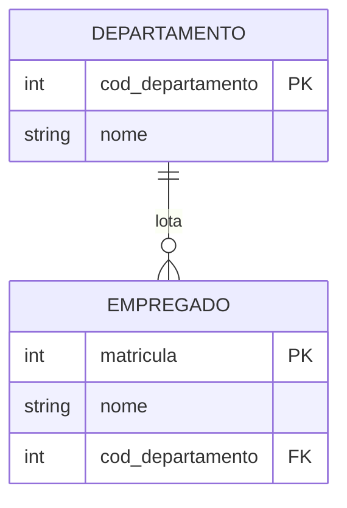

# 1.5 — Integridade referencial

[[1.0 Mapa de estudos — Arquitetura de dados|← Mapa]] · [[1.4 - Normalização dos dados|← Normalização]] · [[1.6 - Metadados|Metadados →]] · [[Banco de questões — Arquitetura de dados|Questões]]

> [!important] Prioridade CESGRANRIO: **ALTA**
> Integridade referencial aparece diretamente em questões de modelagem, modelo relacional e DDL, ou indiretamente em comandos de inserção, atualização e exclusão. O maior retorno está em dominar **PK/FK, lado referenciante e referenciado, valores nulos e ações referenciais**.

## O que você DEVE MANTER e REVISAR — o “coração” da CESGRANRIO

A CESGRANRIO concentra as questões de integridade referencial em cinco pilares:

1. **Pai × filha (Seções 1 e 3):** a tabela filha/referenciante contém a FK; a pai/referenciada contém a chave candidata alvo. Em `1:N`, a FK fica normalmente no lado N.

2. **Integridade de entidade × referencial (Seção 2):** PK nula viola integridade de entidade; FK não nula apontando para pai inexistente viola integridade referencial.

3. **Operações que causam violação (Seção 5):** inserir ou alterar a filha exige pai existente; excluir ou alterar a chave do pai exige verificar filhos e a ação definida.

4. **Ações referenciais (Seção 6):** `RESTRICT`/`NO ACTION` bloqueiam; `CASCADE` propaga; `SET NULL` anula a FK; `SET DEFAULT` aplica o padrão. **Pegadinha:** `SET NULL` é incompatível com FK `NOT NULL`.

5. **FK composta e `NULL` (Seções 7 e 8):** componentes devem corresponder em quantidade, ordem e domínio. A FK pode ser anulável e repetida; não precisa ser PK nem apontar exclusivamente para a PK.

## Objetivos de aprendizagem

Ao final deste módulo, você deverá conseguir:

1. diferenciar integridade de domínio, chave, entidade e referencial;
2. identificar as tabelas referenciante (filha) e referenciada (pai);
3. validar inserções, atualizações e exclusões envolvendo FKs;
4. interpretar `RESTRICT`, `NO ACTION`, `CASCADE`, `SET NULL` e `SET DEFAULT`;
5. construir FKs simples, compostas, autorreferentes e múltiplas;
6. entender o efeito de `NULL`, `MATCH SIMPLE` e `MATCH FULL`;
7. distinguir restrições imediatas e postergáveis;
8. evitar as pegadinhas mais prováveis da CESGRANRIO.

## 1. Conceito central

A **integridade referencial** garante a consistência das referências entre relações. Para cada valor não nulo de uma **chave estrangeira**, deve existir um valor correspondente na chave candidata da relação referenciada.

Considere:

```text
DEPARTAMENTO(cod_departamento PK, nome)
EMPREGADO(matricula PK, nome, cod_departamento FK)
```



- `EMPREGADO` é a relação **referenciante**, filha ou dependente;
- `DEPARTAMENTO` é a relação **referenciada**, pai ou principal;
- `EMPREGADO.cod_departamento` é a FK;
- `DEPARTAMENTO.cod_departamento` é a chave referenciada.

Formalmente, para cada tupla `e` de `EMPREGADO`:

```text
e.cod_departamento é NULL
OU
existe d em DEPARTAMENTO tal que
e.cod_departamento = d.cod_departamento
```

> [!warning] Pegadinha CESGRANRIO
> A FK fica normalmente no lado **N** de um relacionamento `1:N`. Muitos candidatos colocam a FK no lado pai por associarem “pai” à origem da ligação.

## 2. As quatro integridades fundamentais

| Integridade     | Regra                                                   | Exemplo de violação                            |
| --------------- | ------------------------------------------------------- | ---------------------------------------------- |
| **domínio**     | o valor pertence ao domínio do atributo                 | salário recebe texto ou percentual recebe 150  |
| **chave**       | uma chave candidata identifica tuplas unicamente        | dois empregados com o mesmo CPF candidato      |
| **entidade**    | nenhum componente da PK pode ser `NULL`                 | empregado com matrícula nula                   |
| **referencial** | FK não nula corresponde a uma chave candidata existente | empregado aponta para departamento inexistente |

> [!warning] Pegadinha CESGRANRIO
> PK nula viola **integridade de entidade**. FK órfã viola **integridade referencial**. Tipo ou faixa inválida viola **integridade de domínio**.

## 3. Chave estrangeira: propriedades

Uma chave estrangeira é um conjunto de atributos da relação referenciante que referencia uma chave candidata da relação referenciada.

Ela pode:

- ser simples ou composta;
- aceitar `NULL`, quando a participação é opcional;
- ter valores repetidos;
- referenciar outra tabela ou a própria tabela;
- participar da PK da tabela filha;
- ter nome diferente da coluna referenciada;
- referenciar uma PK ou outra chave candidata protegida por unicidade.

Ela não precisa:
- ser única na tabela filha;
- ser a PK da tabela filha;
- apontar exclusivamente para a PK;
- ter o mesmo nome da coluna pai.

### 3.1 FK referenciando chave alternativa

```sql
CREATE TABLE unidade (
    id_unidade BIGINT PRIMARY KEY,
    sigla      VARCHAR(10) NOT NULL UNIQUE,
    nome       VARCHAR(100) NOT NULL
);

CREATE TABLE empregado (
    matricula    BIGINT PRIMARY KEY,
    nome         VARCHAR(120) NOT NULL,
    sigla_unidade VARCHAR(10),
    CONSTRAINT fk_empregado_unidade_sigla
        FOREIGN KEY (sigla_unidade)
        REFERENCES unidade (sigla)
);
```

`unidade.sigla` não é PK, mas é chave candidata implementada com `UNIQUE NOT NULL` e pode ser referenciada.

> [!warning] Pegadinha CESGRANRIO
> `UNIQUE` na coluna filha alteraria a cardinalidade: impediria que dois empregados pertencessem à mesma unidade, transformando a implementação em algo próximo de `1:1`. Para um relacionamento `1:N`, a FK do lado N normalmente **não** é `UNIQUE`.

## 4. Criação declarativa em SQL

### 4.1 Restrição em nível de coluna

```sql
CREATE TABLE empregado (
    matricula        BIGINT PRIMARY KEY,
    nome             VARCHAR(120) NOT NULL,
    cod_departamento INTEGER REFERENCES departamento(cod_departamento)
);
```

### 4.2 Restrição em nível de tabela

```sql
CREATE TABLE empregado (
    matricula        BIGINT PRIMARY KEY,
    nome             VARCHAR(120) NOT NULL,
    cod_departamento INTEGER,
    CONSTRAINT fk_empregado_departamento
        FOREIGN KEY (cod_departamento)
        REFERENCES departamento (cod_departamento)
        ON UPDATE CASCADE
        ON DELETE SET NULL
);
```

A forma em nível de tabela é necessária para FKs compostas e facilita nomear a restrição.

### 4.3 Adição posterior

```sql
ALTER TABLE empregado
ADD CONSTRAINT fk_empregado_departamento
FOREIGN KEY (cod_departamento)
REFERENCES departamento (cod_departamento);
```

Antes de adicionar a restrição, os dados existentes precisam ser válidos. Esta consulta localiza órfãos:

```sql
SELECT e.*
FROM empregado AS e
LEFT JOIN departamento AS d
  ON d.cod_departamento = e.cod_departamento
WHERE e.cod_departamento IS NOT NULL
  AND d.cod_departamento IS NULL;
```

> [!warning] Pegadinha CESGRANRIO
> Criar uma FK não “corrige” automaticamente registros órfãos existentes. Em regra, o SGBD rejeita a ativação da restrição até que os dados sejam ajustados, ressalvadas opções específicas de alguns produtos para restrições ainda não validadas.

## 5. Operações que podem violar a referência

Considere o estado:

```text
DEPARTAMENTO = {(10, 'Operações'), (20, 'TI')}
EMPREGADO    = {(1, 'Ana', 10), (2, 'Beto', NULL)}
```

### 5.1 Inserção na filha

| Operação                              | Resultado                 |
| ------------------------------------- | ------------------------- |
| inserir empregado com departamento 10 | válida                    |
| inserir empregado com departamento 30 | inválida: pai inexistente |
| inserir empregado com `NULL`          | válida se FK for anulável |

### 5.2 Atualização da FK na filha

Alterar `cod_departamento` de 10 para 20 é válido; alterar de 10 para 30 não é, enquanto o departamento 30 não existir.

### 5.3 Exclusão no pai

Excluir o departamento 10 pode deixar Ana órfã. O resultado depende da ação `ON DELETE`.

### 5.4 Atualização da chave no pai

Alterar `DEPARTAMENTO.cod_departamento` de 10 para 15 pode quebrar a referência de Ana. O resultado depende de `ON UPDATE`.

> [!tip] Método de prova
> Inserir ou atualizar a **filha** exige verificar se o pai existe. Excluir ou atualizar a chave do **pai** exige verificar se há filhos e qual ação referencial foi definida.

## 6. Ações referenciais

As ações são declaradas separadamente para exclusão e atualização:

```sql
ON DELETE <ação>
ON UPDATE <ação>
```

### 6.1 `RESTRICT`

Impede a alteração ou exclusão da linha pai se existirem linhas filhas correspondentes.

```sql
ON DELETE RESTRICT
```

É adequada quando a existência de filhos deve bloquear a remoção do pai.

### 6.2 `NO ACTION`

Se a restrição estiver violada no momento de sua verificação, a operação é rejeitada. Em muitos cenários e SGBDs, produz o mesmo efeito prático de `RESTRICT`.

Diferença conceitual do padrão SQL:

- `RESTRICT` impede imediatamente a operação referenciada;
- `NO ACTION` verifica a restrição no momento previsto, que pode ser postergado quando o SGBD suporta restrições diferíveis.

> [!warning] Pegadinha CESGRANRIO
> Não trate `RESTRICT` e `NO ACTION` como opostos. Ambos podem impedir a operação; a distinção está principalmente no momento da verificação e depende do suporte do SGBD.

### 6.3 `CASCADE`

Propaga a operação do pai para os filhos.

```sql
ON DELETE CASCADE
ON UPDATE CASCADE
```

- ao excluir o pai, exclui as linhas filhas correspondentes;
- ao atualizar a chave referenciada, atualiza as FKs filhas.


> [!warning] Pegadinha CESGRANRIO
> `CASCADE` preserva a integridade propagando a operação; não significa impedir alterações. Uma cascata pode atingir várias tabelas e excluir grande volume de dados.

### 6.4 `SET NULL`

Atribui `NULL` às colunas da FK nas linhas filhas.

```sql
ON DELETE SET NULL
```

Só é coerente se as colunas afetadas aceitarem `NULL`.

### 6.5 `SET DEFAULT`

Atribui o valor padrão às colunas da FK:

```sql
cod_departamento INTEGER DEFAULT 1,
FOREIGN KEY (cod_departamento)
  REFERENCES departamento(cod_departamento)
  ON DELETE SET DEFAULT
```

O valor padrão ainda deve satisfazer a referência. No exemplo, o departamento 1 precisa existir, salvo se o padrão for `NULL` e a coluna o admitir.

### 6.6 Quadro comparativo

| Ação          | Efeito sobre as filhas                         | Condição importante                                          |
| ------------- | ---------------------------------------------- | ------------------------------------------------------------ |
| `RESTRICT`    | nenhuma alteração; pai é bloqueado             | filhos existentes impedem a operação                         |
| `NO ACTION`   | rejeita se a violação persistir na verificação | pode interagir com postergação                               |
| `CASCADE`     | propaga exclusão/atualização                   | risco de efeito em cadeia                                    |
| `SET NULL`    | FK passa a `NULL`                              | FK deve admitir `NULL`                                       |
| `SET DEFAULT` | FK recebe o padrão                             | padrão deve constituir referência válida ou `NULL` permitido |

## 7. Participação obrigatória e opcional

Uma FK e sua nulabilidade materializam parte da cardinalidade mínima:

```sql
-- todo empregado deve pertencer a um departamento
cod_departamento INTEGER NOT NULL,
FOREIGN KEY (cod_departamento)
  REFERENCES departamento(cod_departamento)
```

```sql
-- empregado pode ainda não estar lotado
cod_departamento INTEGER NULL,
FOREIGN KEY (cod_departamento)
  REFERENCES departamento(cod_departamento)
```

Porém, a FK na filha não garante sozinha que todo departamento possua pelo menos um empregado. Essa é uma restrição do lado pai que pode exigir lógica adicional.

> [!warning] Pegadinha CESGRANRIO
> `NOT NULL` na FK garante que cada filho tenha pai; não garante que cada pai tenha filho.

## 8. Chaves estrangeiras compostas

Considere uma chave referenciada composta:

```sql
CREATE TABLE contrato (
    empresa_id  INTEGER,
    numero      INTEGER,
    descricao   VARCHAR(200),
    PRIMARY KEY (empresa_id, numero)
);

CREATE TABLE medicao (
    medicao_id      BIGINT PRIMARY KEY,
    empresa_id      INTEGER,
    numero_contrato INTEGER,
    valor           DECIMAL(14,2),
    CONSTRAINT fk_medicao_contrato
        FOREIGN KEY (empresa_id, numero_contrato)
        REFERENCES contrato (empresa_id, numero)
);
```

Regras:

- a FK possui a mesma quantidade de componentes da chave referenciada;
- os domínios correspondentes devem ser compatíveis;
- a ordem faz correspondência: `empresa_id → empresa_id` e `numero_contrato → numero`;
- a combinação completa é verificada, e não cada coluna isoladamente.

### 8.1 `NULL` em FK composta

No comportamento padrão mais comum, equivalente a `MATCH SIMPLE`, se **qualquer** componente da FK for `NULL`, a linha fica dispensada da verificação de correspondência.

```text
(empresa_id, numero_contrato)
(10, 25)   → exige contrato (10, 25)
(10, NULL) → dispensada da correspondência em MATCH SIMPLE
(NULL, 25) → dispensada da correspondência em MATCH SIMPLE
```

Isso pode permitir referências parcialmente preenchidas. Para proibi-las, use `NOT NULL`, `MATCH FULL` quando suportado, ou uma restrição equivalente.

```sql
CHECK (
    (empresa_id IS NULL AND numero_contrato IS NULL)
    OR
    (empresa_id IS NOT NULL AND numero_contrato IS NOT NULL)
)
```

## 9. Questões inéditas — estilo CESGRANRIO

### Questão 1

Considere as tabelas:

```sql
CREATE TABLE SETOR (
    COD_SETOR INTEGER PRIMARY KEY,
    SIGLA VARCHAR(10) NOT NULL UNIQUE
);

CREATE TABLE EMPREGADO (
    MATRICULA INTEGER PRIMARY KEY,
    NOME VARCHAR(100) NOT NULL,
    COD_SETOR INTEGER,
    FOREIGN KEY (COD_SETOR)
        REFERENCES SETOR(COD_SETOR)
        ON DELETE SET NULL
);
```

No estado atual, o setor 10 é referenciado por três empregados. Se o setor 10 for excluído, o SGBD deverá

A) impedir a exclusão, pois toda FK utiliza implicitamente `RESTRICT`.  
B) excluir também os três empregados.  
C) atribuir `NULL` ao `COD_SETOR` dos três empregados e excluir o setor.  
D) criar automaticamente um setor de código nulo.  
E) manter o valor 10 nos empregados, pois a FK aceita `NULL`.

> [!success]- Gabarito comentado
> **Resposta: C.** `ON DELETE SET NULL` preserva as linhas filhas e torna nula a FK correspondente. Isso é possível porque `EMPREGADO.COD_SETOR` não foi declarado `NOT NULL`. A alternativa B descreve `ON DELETE CASCADE`; A ignora a ação explicitamente declarada; E deixaria referências órfãs.

### Questão 2

Considere `CONTRATO(empresa, numero, descricao)`, cuja PK é `(empresa, numero)`, e a tabela `MEDICAO`, que deve referenciar um contrato. A declaração que implementa corretamente essa referência é

A) `FOREIGN KEY (empresa) REFERENCES CONTRATO(empresa, numero)`.  
B) `FOREIGN KEY (numero_contrato, empresa) REFERENCES CONTRATO(empresa, numero)`, independentemente da ordem.  
C) `UNIQUE (empresa, numero_contrato) REFERENCES CONTRATO(empresa, numero)`.  
D) `FOREIGN KEY (empresa, numero_contrato) REFERENCES CONTRATO(empresa, numero)`.  
E) duas FKs independentes, uma para `empresa` e outra para `numero`, mesmo que nenhuma coluna isolada seja candidata em `CONTRATO`.

> [!success]- Gabarito comentado
> **Resposta: D.** Uma chave referenciada composta deve ser tratada como unidade: a FK possui igual número de componentes, com domínios compatíveis e correspondência na ordem declarada. A alternativa A tem quantidade incompatível; B troca a correspondência dos componentes; C usa `UNIQUE`, que não cria referência; E tenta referenciar separadamente colunas que não constituem chaves candidatas isoladas.

## 10. Resumo de véspera

```text
FILHA/REFERENCIANTE contém a FK
PAI/REFERENCIADA contém a chave candidata alvo
FK não nula deve encontrar valor correspondente no pai
FK pode repetir e pode ser nula; PK nunca é nula
RESTRICT/NO ACTION = bloqueiam se a violação persistir
CASCADE = propaga exclusão ou atualização
SET NULL = anula a FK; exige coluna anulável
SET DEFAULT = aplica padrão; padrão deve ser válido
FK composta = combinação, ordem e domínios compatíveis
NOT NULL na FK = todo filho possui pai
UNIQUE na FK = no máximo um filho por valor referenciado
```
