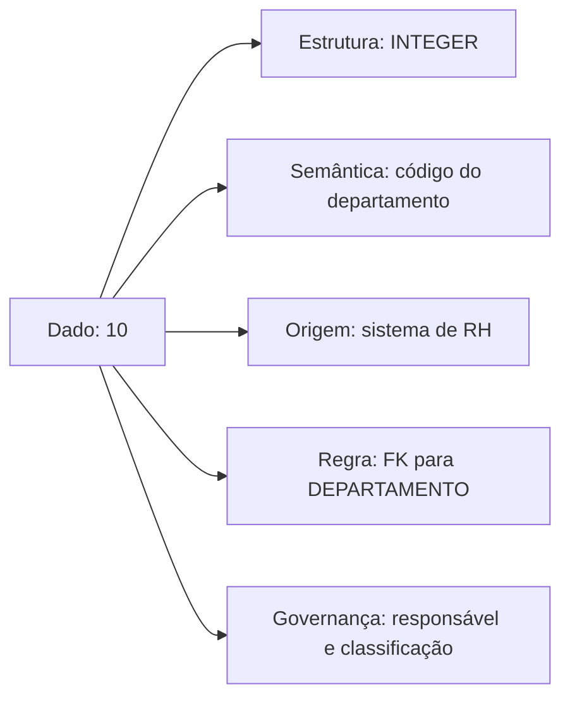
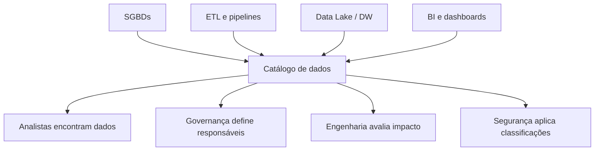
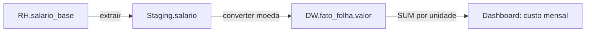
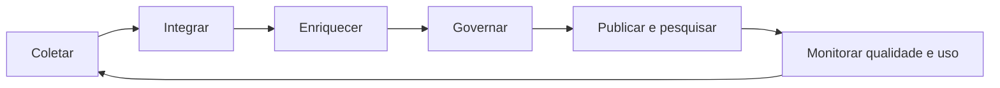

# 1.6 — Metadados

[[1.0 Mapa de estudos — Arquitetura de dados|← Mapa]] · [[1.5 - Integridade referencial|← Integridade referencial]] · [[1.7 Modelagem dimensional|Modelagem dimensional →]] · [[Banco de questões — Arquitetura de dados|Questões]]

> [!important] Prioridade CESGRANRIO: **MÉDIA**
> Metadados tendem a aparecer de forma conceitual ou integrados a SGBD, ETL, Data Warehouse, Data Lake, qualidade e governança. O maior retorno está em dominar **dicionário de dados, catálogo, glossário, metadados técnicos/de negócio/operacionais e linhagem**. Detalhes nominais de padrões são de menor prioridade.

## O que você DEVE MANTER e REVISAR — o “coração” da CESGRANRIO

A CESGRANRIO tende a concentrar este subtema em cinco pilares:

1. **Tipos de metadados (Seção 3):** negócio explica significado e responsabilidade; técnico descreve estrutura e transformação; operacional registra execução, uso, volumes e erros.

2. **Dicionário × catálogo × glossário (Seções 5 a 8):** dicionário detalha elementos; catálogo inventaria e permite descobrir ativos; glossário padroniza o vocabulário do negócio. **Pegadinha:** as ferramentas podem reunir os três, mas os conceitos não são idênticos.

3. **Catálogo do SGBD (Seção 6):** contém tabelas, colunas, chaves, restrições, usuários e outros objetos. `INFORMATION_SCHEMA` oferece visões padronizadas para consultar esses metadados.

4. **Linhagem e impacto (Seção 10):** linhagem mostra origem, transformações e destinos; análise de impacto percorre os consumidores afetados por uma mudança. Log de acesso, isoladamente, não representa toda a linhagem.

5. **Metadados × mestre × referência (Seção 17):** metadados descrevem; dados mestres representam entidades centrais; dados de referência fornecem classificações controladas. **Pegadinha:** todos exigem governança, mas cumprem funções diferentes.

## Objetivos de aprendizagem

Ao final deste módulo, você deverá conseguir:

1. definir metadados sem cair na simplificação incompleta de “dados sobre dados”;
2. distinguir metadados de negócio, técnicos, operacionais, administrativos e de qualidade;
3. diferenciar catálogo de dados, dicionário de dados, catálogo do SGBD e glossário de negócio;
4. explicar linhagem, proveniência, impacto e rastreabilidade;
5. reconhecer metadados em bancos relacionais, ETL, DW, BI e Data Lakes;
6. diferenciar metadados de dados mestres e de referência;
7. interpretar consultas ao catálogo do SGBD;
8. evitar as principais pegadinhas da CESGRANRIO.

## 1. Conceito

**Metadados são dados que descrevem outros dados, seus significados, estruturas, origens, transformações, regras, responsáveis, condições de acesso e contexto de uso.**

Considere o valor:

```text
10
```

Isoladamente, ele possui pouco significado. Os metadados podem informar que:

```text
	nome do atributo: cod_departamento
	tipo: INTEGER
	significado: identificador interno do departamento
origem: sistema corporativo de RH
regra: deve referenciar DEPARTAMENTO.cod_departamento
responsável: Gerência de Recursos Humanos
classificação: uso interno
atualização: diária às 02:00
```



> [!warning] Pegadinha CESGRANRIO
> Metadado não descreve apenas formato técnico. Definição de negócio, proprietário, classificação de segurança, qualidade, origem e histórico de transformação também são metadados.

## 2. Dado versus metadado: depende do contexto

| Elemento | Papel provável |
|---|---|
| salário de um empregado | dado de negócio |
| tipo `DECIMAL(12,2)` do salário | metadado técnico |
| definição de “salário-base” | metadado de negócio |
| horário da última carga do salário | metadado operacional |
| percentual de salários nulos | metadado de qualidade |

A classificação depende do objeto descrito. O nome de um arquivo é metadado sobre seu conteúdo, mas pode ser tratado como dado por um sistema de inventário de arquivos.

> [!warning] Pegadinha CESGRANRIO
> “Dado” e “metadado” não são categorias absolutamente separadas pela natureza do valor. Um valor atua como metadado quando descreve ou contextualiza outro recurso.

## 3. Principais classificações

Não existe uma única taxonomia universal. A classificação mais útil para concursos e ambientes corporativos separa metadados de **negócio**, **técnicos** e **operacionais**, com qualidade, segurança e administração às vezes apresentados como grupos próprios.

### 3.1 Metadados de negócio

Explicam o significado dos dados para a organização.

Exemplos:

- definição de “empregado ativo”;
- fórmula de “margem operacional”;
- sinônimos e abreviações;
- área proprietária e _data steward_ responsável;
- políticas e regras de negócio;
- finalidade de uso;
- indicador certificado/oficial;
- classificação conceitual de um elemento.

```text
Termo: Empregado ativo
Definição: pessoa com vínculo vigente na data de referência
Proprietário: Diretoria de RH
Regra: data_admissao <= referência e data_desligamento ausente ou posterior
```

### 3.2 Metadados técnicos

Descrevem estruturas, formatos, relacionamentos e transformações implementadas.

Exemplos:

- nomes de schemas, tabelas e colunas;
- tipos, tamanhos e nulabilidade;
- PKs, FKs, índices e restrições;
- formatos JSON, XML, CSV ou Parquet;
- endpoints e contratos de APIs;
- mapeamentos origem–destino;
- código ou expressão de transformação;
- esquema de tópico de eventos;
- partições e formatos de armazenamento.

### 3.3 Metadados operacionais

Registram execução, processamento, uso e comportamento dos ativos.

Exemplos:

- início, fim e duração de uma carga ETL;
- quantidade de linhas lidas, rejeitadas e gravadas;
- usuário e horário de acesso;
- frequência de consultas;
- versão implantada;
- data da última atualização;
- mensagens de erro e status de _jobs_;
- volume e crescimento de uma tabela.

### 3.4 Metadados de qualidade

Descrevem regras, métricas e resultados de qualidade:

- completude: percentual de valores presentes;
- unicidade: ocorrência de duplicatas;
- validade: aderência ao domínio;
- consistência: concordância entre fontes;
- atualidade: defasagem desde a atualização;
- acurácia: proximidade do valor real.

### 3.5 Metadados administrativos e de segurança

Auxiliam gestão, proteção, retenção e conformidade:

- proprietário e custodiante;
- permissões e perfis de acesso;
- classificação da informação;
- presença de dado pessoal ou sensível;
- base legal e finalidade de tratamento;
- prazo de retenção;
- política de descarte;
- localização e jurisdição do armazenamento.

> [!note] Sobreposição
> “Classificação LGPD” pode ser chamada de metadado de negócio, governança, segurança ou administrativo conforme a taxonomia adotada. Em prova, observe a finalidade, não apenas o rótulo.

## 4. Exemplo integrado

Para a coluna `FUNCIONARIO.salario`:

| Categoria | Metadado |
|---|---|
| negócio | remuneração mensal fixa antes de adicionais |
| técnico | `DECIMAL(12,2) NOT NULL` |
| qualidade | valores devem ser positivos; completude esperada de 100% |
| operacional | atualizada pelo job `carga_rh_diaria` às 02:00 |
| segurança | confidencial; acesso restrito a RH e folha |
| linhagem | `RH_ORIGEM.VENCIMENTO_BASE` → conversão monetária → `DW.DIM_FUNCIONARIO.SALARIO` |

## 5. Dicionário de dados

O **dicionário de dados** documenta elementos de dados individualmente, normalmente com foco estrutural e semântico.

Campos comuns:

| Campo do dicionário | Exemplo |
|---|---|
| nome lógico | Código do Departamento |
| nome físico | `cod_departamento` |
| descrição | identificador da unidade de lotação |
| tipo e tamanho | `INTEGER` |
| domínio | inteiros positivos cadastrados em `DEPARTAMENTO` |
| nulabilidade | não nulo |
| chave | FK para `DEPARTAMENTO.cod_departamento` |
| regra de validação | deve corresponder a departamento ativo |
| origem | sistema de RH |
| proprietário | Diretoria de RH |

### 5.1 Dicionário ativo e passivo

- **ativo/integrado:** mantido e consultado pelo próprio SGBD ou ferramenta; alterações no esquema refletem-se no repositório;
- **passivo:** documentação externa atualizada por processos manuais ou separados, podendo ficar dessincronizada.

> [!warning] Pegadinha CESGRANRIO
> Um dicionário ativo reduz divergência porque acompanha o esquema real. Uma planilha desatualizada continua sendo documentação, mas não representa necessariamente os metadados vigentes.

## 6. Catálogo do SGBD

O **catálogo do sistema** é o conjunto de metadados mantido pelo SGBD sobre os objetos do banco.

Pode conter:

- schemas, tabelas, colunas e tipos;
- restrições, chaves e relacionamentos;
- visões, índices, sequências e gatilhos;
- usuários, papéis e privilégios;
- estatísticas usadas pelo otimizador;
- procedimentos e funções.

O catálogo é consultado pelo próprio SGBD e por administradores, ferramentas de modelagem e aplicações.

### 6.1 `INFORMATION_SCHEMA`

O padrão SQL define visões para consultar metadados de maneira relativamente portável:

```sql
SELECT table_schema,
       table_name,
       column_name,
       data_type,
       is_nullable
FROM information_schema.columns
WHERE table_name = 'empregado'
ORDER BY ordinal_position;
```

Consulta de restrições:

```sql
SELECT constraint_name,
       constraint_type,
       table_schema,
       table_name
FROM information_schema.table_constraints
WHERE table_name = 'empregado';
```

Cada SGBD também possui catálogos e visões proprietárias, como estruturas específicas do PostgreSQL, Oracle e SQL Server.

> [!warning] Pegadinha CESGRANRIO
> `INFORMATION_SCHEMA` contém **metadados**, não as linhas de negócio da tabela consultada. Consultar o catálogo não equivale a consultar os dados de `EMPREGADO`.

## 7. Catálogo de dados corporativo

Um **catálogo de dados** inventaria, organiza e facilita descobrir ativos distribuídos por bancos, arquivos, APIs, Data Lakes, relatórios e modelos analíticos.

Capacidades típicas:

- busca por ativos e termos;
- classificação e etiquetagem;
- perfilamento de dados;
- identificação de proprietários;
- glossário de negócio;
- linhagem e análise de impacto;
- avaliação, comentários e certificação;
- políticas de acesso e integração com governança;
- coleta automática de metadados por conectores.



## 8. Dicionário, catálogo e glossário

| Artefato | Foco | Pergunta principal |
|---|---|---|
| **dicionário de dados** | definição detalhada de elementos/campos | “Como este elemento é definido?” |
| **catálogo do SGBD** | objetos de uma instância geridos pelo SGBD | “Quais tabelas, colunas e restrições existem aqui?” |
| **catálogo de dados** | descoberta e governança de ativos corporativos | “Quais dados existem, onde estão e como posso usá-los?” |
| **glossário de negócio** | vocabulário corporativo controlado | “O que este termo significa para a organização?” |
| **repositório de metadados** | armazenamento consolidado de metadados | “Onde os metadados são persistidos e integrados?” |

As ferramentas podem integrar todos esses recursos; a distinção é conceitual, não necessariamente uma separação física.

> [!warning] Pegadinha CESGRANRIO
> Glossário define termos de negócio; catálogo inventaria ativos; dicionário detalha elementos. Um catálogo corporativo pode incorporar glossário e dicionário, mas isso não torna os conceitos idênticos.

## 9. Repositório de metadados

O repositório centraliza metadados coletados de várias fontes. Ele pode armazenar:

- metamodelos e modelos de dados;
- definições de tabelas e arquivos;
- mapeamentos ETL;
- linhagem entre campos;
- regras de qualidade;
- termos de negócio;
- classificações e responsáveis;
- histórico e versões.

## 10. Linhagem, proveniência e análise de impacto

### 10.1 Linhagem de dados

A **linhagem** registra o caminho percorrido pelo dado, desde a origem até seus destinos, incluindo transformações.



Ela responde:

- de onde veio este indicador?
- quais transformações foram aplicadas?
- quais tabelas e relatórios dependem desta coluna?
- qual será o impacto de alterar ou remover um campo?

### 10.2 Proveniência

**Proveniência** enfatiza a origem, a custódia e o histórico do dado. Na prática, linhagem e proveniência frequentemente se sobrepõem; linhagem costuma enfatizar o fluxo e as transformações ponta a ponta.

### 10.3 Análise de impacto

Percorre a linhagem no sentido dos consumidores:

```text
alteração em coluna de origem
→ pipelines afetados
→ tabelas derivadas
→ indicadores
→ relatórios e usuários
```

> [!warning] Pegadinha CESGRANRIO
> Linhagem não é apenas auditoria de quem acessou. Ela representa origens, destinos e transformações. Logs de acesso são metadados operacionais e de auditoria.

## 11. Metadados em ETL e integração

Em um pipeline ETL, metadados orientam tanto o projeto quanto a execução.

### 11.1 Metadados de projeto/técnicos

- conexão e localização da fonte;
- mapeamento origem–destino;
- tipos e conversões;
- regras de limpeza;
- chaves de integração;
- dependências entre tarefas;
- periodicidade planejada.

### 11.2 Metadados de execução/operacionais

- identificador da execução;
- horários de início e fim;
- sucesso ou falha;
- quantidade de linhas lidas, gravadas e rejeitadas;
- mensagens de erro;
- marca d'água da carga incremental;
- versão do pipeline.

Exemplo:

```text
job: carga_dim_departamento
execução: 2026-09-01T02:00:00-03:00
origem: RH.DEPARTAMENTO
destino: DW.DIM_DEPARTAMENTO
lidas: 450
inseridas: 3
atualizadas: 12
rejeitadas: 1
status: concluído_com_alerta
```

Os números acima não são registros de departamento; são metadados sobre o processamento.

## 12. Metadados em Data Warehouse e BI

Em DW/BI, metadados conectam linguagem de negócio e implementação técnica:

- definição de fatos, dimensões e granularidade;
- significado e fórmula de medidas;
- hierarquias e níveis de dimensão;
- origem dos dados;
- regras de transformação;
- frequência de atualização;
- dimensões lentamente mutáveis;
- filtros aplicados em relatórios;
- proprietário e certificação de indicadores.

> [!example] Exemplo
> “Receita líquida” no dashboard deve possuir fórmula, unidade monetária, granularidade temporal, fonte, filtros, responsável e horário da última carga. Sem esses metadados, dois painéis podem exibir números diferentes com o mesmo rótulo.

## 13. Metadados em Data Lakes

Um Data Lake armazena dados variados e frequentemente separados do esquema rígido de um SGBD relacional. Metadados são essenciais para evitar um **data swamp** — conjunto de dados difícil de localizar, entender, confiar e governar.

Metadados úteis:

- formato e esquema dos arquivos;
- localização física/lógica;
- partições;
- proprietário e domínio de negócio;
- origem e data de ingestão;
- classificação de sensibilidade;
- qualidade e atualização;
- linhagem;
- política de retenção.

### 13.1 _Schema-on-write_ e _schema-on-read_

- **schema-on-write:** estrutura validada antes ou durante a gravação, comum em DW tradicional;
- **schema-on-read:** estrutura aplicada na leitura, comum em Data Lakes.

_Schema-on-read_ não significa ausência de metadados. Ao contrário, formatos, contratos e catálogos tornam-se ainda mais importantes para interpretar os dados.

> [!warning] Pegadinha CESGRANRIO
> Data Lake não é depósito sem governança. Sem catálogo, qualidade, classificação e linhagem, ele pode degradar-se em _data swamp_.

## 14. Metadados de descoberta, avaliação e uso

Um catálogo maduro ajuda o usuário em três etapas:

1. **descoberta:** localizar um ativo por nome, termo, domínio ou etiqueta;
2. **avaliação:** verificar definição, qualidade, atualização, proprietário e certificação;
3. **uso:** conhecer esquema, acesso, exemplo, linhagem e restrições.

Metadados não substituem os dados. Eles reduzem o custo para encontrá-los, compreendê-los e utilizá-los corretamente.

## 15. Gestão de metadados

Gestão de metadados é o conjunto de práticas para coletar, integrar, manter, governar e disponibilizar metadados confiáveis.



### 15.1 Papéis comuns

- **data owner/proprietário:** responde pelo dado no negócio e decide políticas;
- **data steward:** cuida de definições, qualidade e aplicação das regras;
- **custodiante:** opera a infraestrutura e os controles técnicos;
- **produtor:** gera ou mantém a fonte;
- **consumidor:** utiliza o dado em processos, análises ou sistemas.

Os nomes e responsabilidades exatos variam entre organizações.

### 15.2 Desafios

- metadados desatualizados;
- duplicidade de termos;
- coleta excessivamente manual;
- ausência de responsáveis;
- baixa integração entre ferramentas;
- falta de versionamento;
- divergência entre definição e implementação;
- catálogo com ativos sem qualidade ou contexto.

## 16. Coleta automática e enriquecimento manual

### 16.1 Automação

Conectores podem extrair:

- nomes e tipos de colunas;
- chaves e relacionamentos;
- código de pipelines;
- consultas e dependências;
- estatísticas e perfilamento;
- logs de execução e acesso.

### 16.2 Curadoria humana

Pessoas precisam frequentemente definir:

- significado de negócio;
- contexto e finalidade;
- proprietário responsável;
- criticidade;
- regras e exceções;
- certificação de um indicador.

> [!warning] Pegadinha CESGRANRIO
> Coleta automática é forte em metadados técnicos e operacionais, mas não deduz com segurança toda a semântica do negócio. Um catálogo eficaz combina automação e curadoria.

## 17. Metadados versus outros tipos de dados

### 17.1 Dados mestres

Representam entidades centrais e relativamente estáveis do negócio:

```text
CLIENTE, PRODUTO, FORNECEDOR, EMPREGADO
```

### 17.2 Dados de referência

Representam conjuntos controlados usados para classificação:

```text
UF, moeda, país, tipo de contrato, código de situação
```

### 17.3 Dados transacionais

Registram eventos do negócio:

```text
pedido, pagamento, medição, movimentação de estoque
```

### 17.4 Metadados

Descrevem os elementos anteriores:

```text
definição de CLIENTE
tipo da coluna cod_cliente
origem de PEDIDO
responsável pela tabela MOEDA
frequência de atualização de PAGAMENTO
```

| Categoria | Exemplo | Função |
|---|---|---|
| mestre | cliente Petrobras Distribuidora | representar entidade central |
| referência | código BR para Brasil | padronizar classificação |
| transacional | pedido nº 500 | registrar evento |
| metadado | `pedido.numero` é `BIGINT` e único | descrever o dado |

> [!warning] Pegadinha CESGRANRIO
> Metadados não são sinônimo de dados mestres. Ambos exigem governança, mas cumprem funções diferentes.

## 18. Qualidade dos próprios metadados

Metadados também precisam de qualidade:

- **completude:** ativos críticos possuem descrição e responsável;
- **atualidade:** esquema e linhagem refletem o ambiente vigente;
- **consistência:** o mesmo termo não possui definições conflitantes;
- **validade:** valores obedecem ao metamodelo;
- **acurácia:** a descrição corresponde ao dado real;
- **unicidade:** ativos e termos não estão duplicados indevidamente.

```text
Dados ruins prejudicam decisões.
Metadados ruins dificultam até descobrir quais dados são ruins.
```

## 19. Benefícios e limitações

### 19.1 Benefícios

- descoberta e reutilização de dados;
- compreensão compartilhada;
- análise de impacto;
- rastreabilidade e auditoria;
- apoio à qualidade e segurança;
- conformidade regulatória;
- redução de duplicação;
- automação de integração e processamento.

### 19.2 Limitações

- catálogo não corrige automaticamente o dado;
- linhagem não garante acurácia;
- definição não substitui controle de acesso;
- grande volume de metadados sem curadoria pode aumentar confusão;
- valor depende de atualização, integração e adoção.

## 20. Priorização para a CESGRANRIO

### 20.1 Alta frequência dentro do subtema / alto retorno

- conceito e finalidade de metadados;
- metadados técnicos, de negócio e operacionais;
- catálogo e dicionário de dados;
- catálogo do SGBD;
- linhagem e origem;
- metadados em ETL, DW e Data Lake;
- diferença entre metadados, dados mestres e dados de referência.

### 20.2 Frequência média / diferenciação

- glossário de negócio;
- repositório de metadados;
- análise de impacto;
- metamodelo;
- qualidade dos metadados;
- papéis de governança.

### 20.3 Conceitual / menor frequência isolada

- dicionário ativo e passivo;
- taxonomia descritivo/estrutural/administrativo;
- ISO/IEC 11179, Dublin Core e RDF;
- arquitetura interna de ferramentas de catálogo.

## 21. Checklist de pegadinhas

- [ ] Metadado inclui semântica e operação, não apenas estrutura técnica.
- [ ] O mesmo valor pode ser dado ou metadado conforme o contexto.
- [ ] Catálogo do SGBD descreve objetos da instância.
- [ ] Catálogo corporativo inventaria ativos de várias plataformas.
- [ ] Glossário padroniza termos de negócio.
- [ ] Dicionário detalha elementos de dados.
- [ ] Linhagem mostra origem, transformação e destino.
- [ ] Log de acesso é metadado operacional, mas não resume toda a linhagem.
- [ ] Data Lake precisa de metadados mesmo com _schema-on-read_.
- [ ] Metadados não são dados mestres nem dados de referência.
- [ ] Automação coleta estrutura; curadoria acrescenta contexto de negócio.
- [ ] Catálogo não garante automaticamente qualidade, segurança ou conformidade.

## 22. Questões inéditas — estilo CESGRANRIO

### 22.1 Questão 1

Uma organização mantém, para a coluna `valor_total` de uma tabela de contratos, as seguintes informações:

I. tipo físico `DECIMAL(14,2)`;  
II. definição corporativa de “valor total contratado”;  
III. horário, duração e quantidade de linhas da última carga;  
IV. valor `850000,00` de determinado contrato.

São classificados, respectivamente, como metadado técnico, metadado de negócio, metadado operacional e dado de negócio os itens

A) I, II, III e IV.  
B) I, III, IV e II.  
C) II, I, III e IV.  
D) III, II, I e IV.  
E) IV, III, II e I.

> [!success]- Gabarito comentado
> **Resposta: A.** O tipo físico descreve a implementação; a definição explica a semântica corporativa; horário, duração e contagem descrevem a execução; `850000,00` é o fato armazenado para um contrato. A pegadinha é tratar todo número como dado de negócio: contagens e durações de carga são metadados sobre o processamento.

### 22.2 Questão 2

Após a alteração de uma coluna no sistema de origem, uma equipe precisa descobrir quais pipelines, tabelas do Data Warehouse e dashboards poderão ser afetados. O recurso de gestão de metadados mais diretamente relacionado a essa necessidade é

A) o domínio de valores do atributo.  
B) a chave substituta da dimensão.  
C) a linhagem de dados associada à análise de impacto.  
D) a normalização do catálogo até a FNBC.  
E) o cadastro mestre de usuários.

> [!success]- Gabarito comentado
> **Resposta: C.** A linhagem conecta origens, transformações e destinos. Percorrê-la em direção aos consumidores permite identificar os ativos afetados por uma mudança. Domínio e chave substituta são metadados/estruturas relevantes, mas não fornecem, isoladamente, o encadeamento necessário; cadastro de usuários é dado mestre, não análise de dependência.

## 23. Resumo de véspera

```text
METADADO = significado + estrutura + origem + transformação + contexto
NEGÓCIO = definição, regra, proprietário
TÉCNICO = schema, tipo, chave, formato, mapeamento
OPERACIONAL = execução, uso, volume, erro, atualização
DICIONÁRIO = definição detalhada dos elementos
CATÁLOGO DO SGBD = objetos da instância
CATÁLOGO DE DADOS = descoberta e governança corporativa
GLOSSÁRIO = vocabulário de negócio
LINHAGEM = origem → transformações → destinos
IMPACTO = consumidores afetados por uma mudança
METAMODELO = estrutura dos próprios metadados
DATA LAKE sem metadados pode virar DATA SWAMP
```
