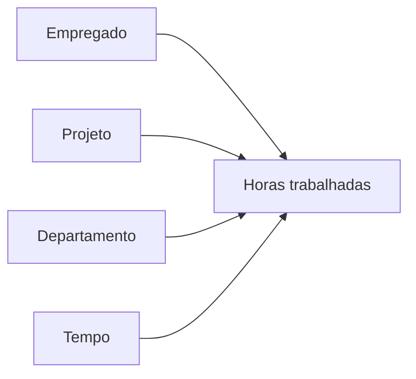
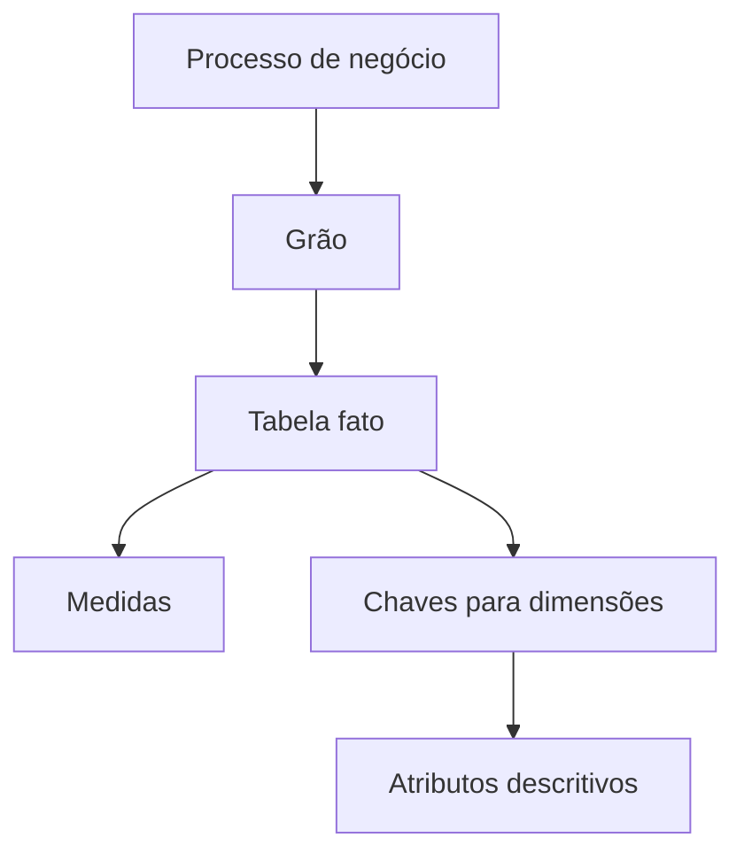
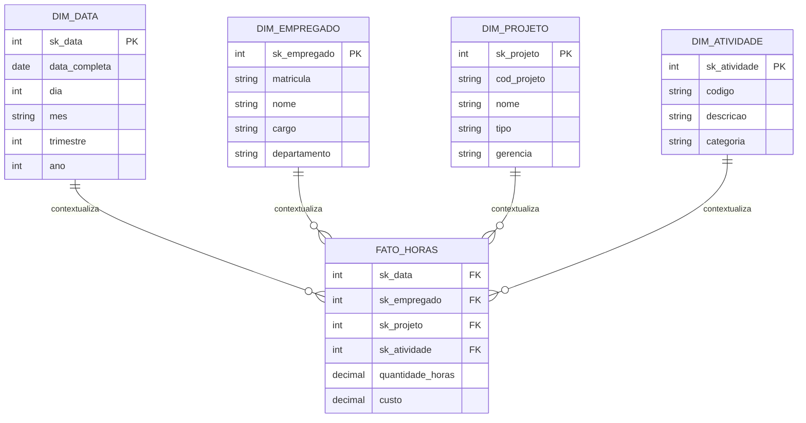
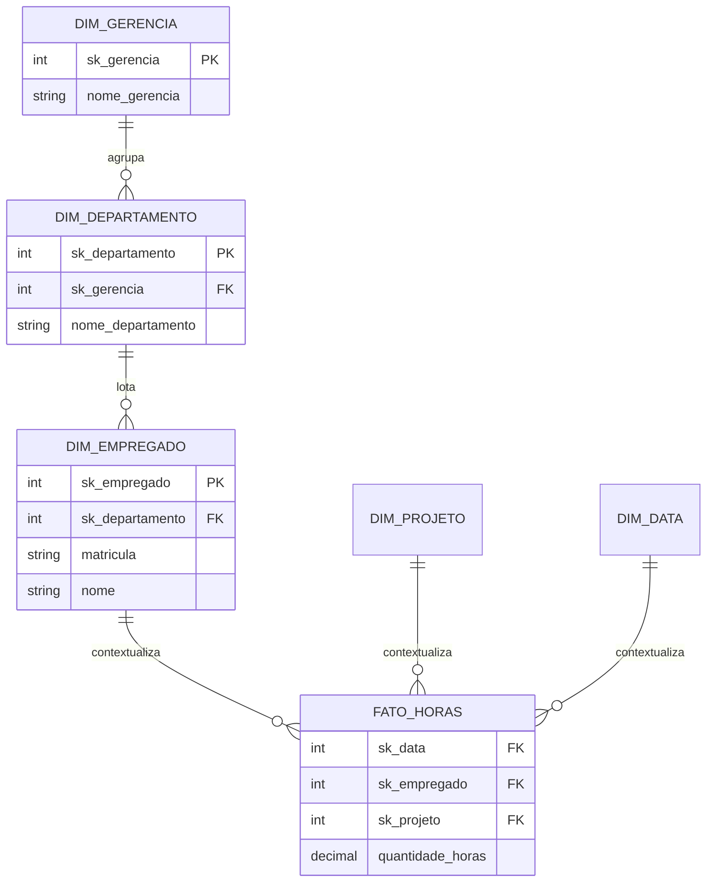
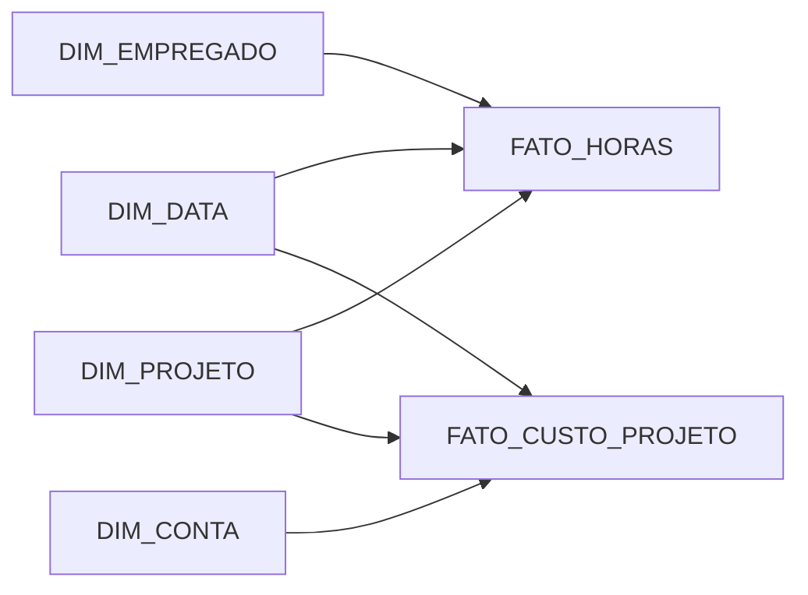
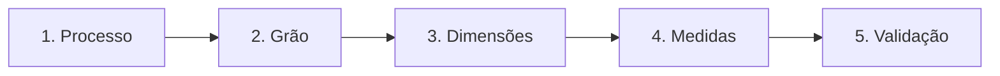

# 1.7 — Modelagem dimensional

[[1.0 Mapa de estudos — Arquitetura de dados|← Mapa]] · [[1.6 - Metadados|← Metadados]] · [[1.8 Avaliação de modelos de dados|Avaliação de modelos →]] · [[Banco de questões — Arquitetura de dados|Questões]]

> [!important] Prioridade CESGRANRIO: **ALTA**
> A matriz de estudos registra cobrança direta anterior e forte conexão com BI/OLAP. Para este subitem, priorize **grão, tabela fato, dimensões, medidas, esquema estrela e floco de neve**. A banca costuma trocar as características de fato e dimensão.

## O que você DEVE MANTER e REVISAR — o “coração” da CESGRANRIO

A CESGRANRIO concentra suas questões de modelagem dimensional nos mesmos cinco pilares:

1. **Grão/granularidade (Seção 3.2):** o grão define o significado exato de uma linha da fato. Quanto mais fino o grão, mais detalhes e, normalmente, mais linhas. Misturar grãos causa dupla contagem.

2. **Estrela × floco de neve (Seções 4 e 5):** estrela possui dimensões desnormalizadas e menos junções; floco possui dimensões normalizadas, mais tabelas e mais junções. **Pegadinha:** é a dimensão que fica normalizada no floco, não a fato.

3. **Classificação das medidas (Seção 9):** aditiva soma por todas as dimensões; semi-aditiva não soma corretamente por alguma dimensão, geralmente tempo; não aditiva, como média e percentual, não deve ser somada diretamente.

4. **Dimensão conformada × degenerada (Seções 12 e 13):** conformada é compartilhada com semântica consistente entre fatos; degenerada é um identificador mantido na fato sem tabela dimensão própria, como número da nota fiscal.

5. **Chave substituta/_surrogate key_ (Seção 11):** chave técnica sem significado de negócio, usada para desacoplar o ambiente analítico das origens e apoiar histórico. Ela não elimina o código natural, que permanece como atributo.

> [!note] Limite deste módulo
> Data Warehouse, OLAP, ETL, otimização multidimensional e construção de dashboards aparecem novamente na Área 7. Aqui serão apresentados apenas os conceitos indispensáveis para entender o modelo dimensional.

## Objetivos de aprendizagem

Ao final deste módulo, você deverá conseguir:

1. explicar a finalidade da modelagem dimensional;
2. distinguir fatos, dimensões, medidas e atributos descritivos;
3. declarar corretamente o grão de uma tabela fato;
4. diferenciar estrela, floco de neve e constelação;
5. classificar fatos por processo e medidas por aditividade;
6. reconhecer dimensões de tempo, degeneradas e conformadas;
7. esboçar um modelo dimensional a partir de um processo de negócio;
8. evitar as principais pegadinhas da CESGRANRIO.

## 1. Conceito e finalidade

A **modelagem dimensional** organiza dados para facilitar consultas analíticas, compreensão pelo usuário e agregação de medidas segundo diferentes perspectivas.

Sua ideia central é simples:

```text
um evento mensurável do negócio
analisado por diferentes contextos
```

Exemplo:

```text
Medida: quantidade de horas trabalhadas
Contextos: empregado, projeto, departamento e tempo
```



O modelo dimensional é muito usado em ambientes de Data Warehouse e BI, frequentemente implementado em bancos relacionais.

> [!warning] Pegadinha CESGRANRIO
> “Dimensional” não significa necessariamente banco multidimensional proprietário. Um esquema estrela pode ser implementado por tabelas relacionais comuns e consultado com SQL.

## 2. Modelo transacional versus dimensional

| Aspecto | Modelo relacional transacional | Modelo dimensional analítico |
|---|---|---|
| objetivo | registrar operações corretamente | analisar o negócio com facilidade |
| carga típica | muitas inserções e atualizações pontuais | cargas periódicas e leituras agregadas |
| estrutura | geralmente mais normalizada | frequentemente desnormalizada |
| consultas | curtas e previsíveis | agregações e filtros sobre grande volume |
| redundância | minimizada | aceita de forma controlada nas dimensões |
| usuário principal | aplicações operacionais | analistas, gestores e ferramentas de BI |
| orientação | entidades e transações | processos, fatos e perspectivas |

O mesmo banco relacional pode servir a ambos, mas os modelos são otimizados para finalidades diferentes.

> [!warning] Pegadinha CESGRANRIO
> Modelo dimensional não “substitui” universalmente o modelo relacional. Ele pode ser uma organização lógica sobre tecnologia relacional, desenhada para análise em vez de processamento transacional.

## 3. Os componentes fundamentais



### 3.1 Processo de negócio

É a atividade que será medida, como:

- venda de produto;
- movimentação de estoque;
- pagamento de fatura;
- alocação de empregado em projeto;
- atendimento de chamado;
- medição de contrato.

O modelo costuma ser construído em torno de um processo, não de um organograma ou de uma lista arbitrária de fontes.

### 3.2 Grão ou granularidade

O **grão** declara exatamente o que cada linha da tabela fato representa.

Exemplo claro:

```text
Uma linha representa as horas registradas por um empregado,
em um projeto, em um dia e tipo de atividade.
```

Nesse grão, a combinação lógica é:

```text
empregado + projeto + data + tipo de atividade
```

O grão deve ser definido **antes** de selecionar dimensões e medidas. Todas as linhas e medidas da tabela fato precisam obedecer ao mesmo grão.

> [!warning] Pegadinha CESGRANRIO
> Granularidade fina contém mais detalhe e normalmente mais linhas; granularidade grossa contém dados mais resumidos e menos linhas. “Fina” não significa tabela menor.

### 3.3 Tabela fato

A **tabela fato** registra eventos ou estados mensuráveis de um processo no grão declarado.

Ela normalmente contém:

- chaves estrangeiras para dimensões;
- medidas numéricas;
- grande quantidade de linhas;
- poucos atributos textuais descritivos;
- uma PK composta pelas FKs ou uma chave técnica adicional, conforme o projeto.

```text
FATO_HORAS(
  sk_data FK,
  sk_empregado FK,
  sk_projeto FK,
  sk_atividade FK,
  quantidade_horas,
  custo
)
```

### 3.4 Tabela dimensão

Uma **dimensão** fornece contexto descritivo para filtrar, agrupar e rotular os fatos.

Ela normalmente contém:

- uma chave primária, frequentemente substituta;
- códigos naturais oriundos dos sistemas de origem;
- atributos textuais e categóricos;
- hierarquias para navegação;
- menos linhas e mais colunas que a fato;
- redundância controlada para simplificar consultas.

```text
DIM_PROJETO(
  sk_projeto PK,
  cod_projeto,
  nome_projeto,
  tipo_projeto,
  nome_departamento,
  nome_gerencia
)
```

### 3.5 Medidas

São valores observados ou calculados no grão do fato:

```text
quantidade_horas
custo
quantidade_itens
valor_venda
tempo_atendimento
```

> [!warning] Pegadinhas CESGRANRIO
>
> - Fato não é sinônimo de “qualquer tabela grande”; seu papel é registrar um processo em um grão.
> - Dimensão não é identificada apenas por ter poucas linhas; ela fornece contexto descritivo.
> - FKs ficam normalmente na tabela fato, apontando para dimensões.
> - Medidas são frequentemente numéricas, mas nem todo número é medida: CPF, matrícula e CEP são descritores ou identificadores.

## 4. Esquema estrela

No **esquema estrela**, uma tabela fato central conecta-se diretamente a dimensões geralmente desnormalizadas.



Características:

- estrutura intuitiva para usuários;
- menor quantidade de junções;
- dimensões mais largas e desnormalizadas;
- redundância descritiva controlada;
- bom suporte a consultas de agregação.

Exemplo de pergunta respondida:

```text
Qual foi o custo total por gerência, tipo de projeto e trimestre?
```

## 5. Esquema floco de neve

No **floco de neve** (_snowflake_), uma ou mais dimensões são normalizadas em tabelas relacionadas.



Características:

- menor redundância nas dimensões;
- maior número de tabelas e junções;
- estrutura menos simples para consumo direto;
- pode representar hierarquias de forma normalizada.

### 5.1 Estrela versus floco de neve

| Aspecto | Estrela | Floco de neve |
|---|---|---|
| dimensões | geralmente desnormalizadas | parcialmente normalizadas |
| quantidade de tabelas | menor | maior |
| junções | menos | mais |
| compreensão | mais simples | mais complexa |
| redundância descritiva | maior | menor |
| manutenção de hierarquias | atributos repetidos na dimensão | níveis separados em tabelas |

> [!warning] Pegadinha CESGRANRIO
> Quem fica normalizada no floco de neve são principalmente as **dimensões**, não a tabela fato “dividida em medidas menores”.

## 6. Constelação de fatos

Uma **constelação** ou _galaxy schema_ possui múltiplas tabelas fato que compartilham dimensões.



Exemplo:

- `FATO_HORAS` mede alocações;
- `FATO_CUSTO_PROJETO` mede lançamentos financeiros;
- ambas compartilham `DIM_DATA` e `DIM_PROJETO`.

> [!warning] Pegadinha CESGRANRIO
> Constelação não é uma tabela fato ligada diretamente a outra fato. O padrão desejável é compartilhar dimensões compatíveis, respeitando o grão de cada processo.

## 7. Tipos de tabela fato

- _Fato Transacional:_ Registra evento no tempo (inserção constante, grão fino).
- _Snapshot Acumulado:_ Acompanha um processo por etapas (pode sofrer **UPDATE** na mesma linha quando a etapa avança). _(Pegadinha de prova!)_

| Tipo | Linha representa | Comportamento comum |
|---|---|---|
| transacional | um evento | novas linhas são inseridas |
| snapshot periódico | estado em um período | novas fotografias são inseridas |
| snapshot acumulado | ciclo de um processo | mesma linha pode ser atualizada |

> [!warning] Pegadinha CESGRANRIO
> Nem toda tabela fato é somente de inserção. O snapshot acumulado pode receber atualizações quando o processo avança.

## 8. Tabela fato sem medidas

Uma **fato sem medidas** (_factless fact table_) registra a ocorrência ou cobertura de um evento apenas por suas chaves dimensionais.

```text
FATO_PRESENCA_TREINAMENTO(
  sk_data,
  sk_empregado,
  sk_treinamento
)
```

A presença é contada pelo número de linhas. Outro uso é registrar cobertura:

```text
quais produtos estavam em promoção em quais lojas e dias
```

> [!warning] Pegadinha CESGRANRIO
> Tabela fato pode existir sem coluna numérica de medida. A própria ocorrência da combinação dimensional é o fato analisável.

## 9. Aditividade das medidas

A classificação depende das dimensões ao longo das quais a medida pode ser somada.

### 9.1 Medida aditiva

Pode ser somada por todas as dimensões relevantes.

```text
quantidade vendida
valor de vendas
horas lançadas
```

### 9.2 Medida semi-aditiva

Pode ser somada por algumas dimensões, mas não por todas — frequentemente não ao longo do tempo.

```text
saldo de conta
estoque disponível
quantidade de empregados no fim do mês
```

Somar saldos de várias contas numa data pode fazer sentido; somar o saldo da mesma conta em vários dias geralmente não.

### 9.3 Medida não aditiva

Não deve ser somada diretamente.

```text
percentual
média
taxa
preço unitário
```

Para percentuais e médias, é preferível armazenar componentes aditivos quando possível:

```text
taxa de falhas = quantidade_falhas / quantidade_total
```

Armazenar numerador e denominador permite recalcular corretamente a taxa em diferentes agregações.

> [!warning] Pegadinha CESGRANRIO
> Medida ser numérica não a torna aditiva. Percentuais e saldos são os exemplos clássicos de soma inadequada.

## 10. Dimensão tempo

A dimensão tempo permite analisar fatos por calendário e períodos de negócio.

```text
DIM_DATA(
  sk_data,
  data_completa,
  dia_semana,
  dia_mes,
  nome_mes,
  trimestre,
  ano,
  dia_util,
  feriado
)
```

Mesmo informações deriváveis da data podem ser armazenadas para facilitar filtros, padronizar calendários e representar conceitos como feriado e período fiscal.

Uma fato pode desempenhar vários papéis com a mesma dimensão:

```text
sk_data_criacao
sk_data_aprovacao
sk_data_conclusao
```

Esse uso é chamado de **dimensão desempenhando papéis** (_role-playing dimension_). O conceito será apenas reconhecido neste módulo.

## 11. Chave natural e chave substituta

### 11.1 Chave natural

Vem do sistema operacional e possui significado externo:

```text
matricula = 'E1035'
cod_projeto = 'PRJ-2026-18'
```

### 11.2 Chave substituta

É criada no ambiente dimensional e não possui significado de negócio:

```text
sk_empregado = 78142
sk_projeto = 320
```

Vantagens comuns da chave substituta:

- independência em relação à chave da origem;
- integração de fontes com códigos diferentes;
- suporte ao histórico de versões de uma dimensão;
- tratamento uniforme de registros desconhecidos;
- chaves compactas nas tabelas fato.

```text
DIM_EMPREGADO
sk_empregado PK | matricula_origem | nome | cargo
78142            | E1035            | Ana  | Analista
```

> [!warning] Pegadinha CESGRANRIO
> A chave substituta não elimina a chave natural. A dimensão normalmente preserva o código da origem como atributo para rastreamento e integração.

## 12. Dimensão degenerada

Uma **dimensão degenerada** é um identificador dimensional mantido na tabela fato sem uma tabela dimensão própria, pois não há outros atributos descritivos relevantes.

```text
FATO_MEDICAO(
  sk_data,
  sk_contrato,
  numero_documento,  ← dimensão degenerada
  valor_medido
)
```

Exemplos clássicos:

- número do pedido;
- número da fatura;
- número do protocolo.

> [!warning] Pegadinha CESGRANRIO
> Dimensão degenerada não é uma dimensão “com dados incompletos” nem uma tabela vazia. É o identificador que permanece fisicamente na fato sem tabela dimensional correspondente.

## 13. Dimensão conformada

Uma **dimensão conformada** possui significado, estrutura e valores compatíveis para uso por diferentes fatos ou áreas.

```text
DIM_DATA compartilhada por:
- FATO_HORAS
- FATO_CUSTOS
- FATO_MEDICOES
```

Ela permite comparar processos com definições consistentes. Se cada área usa conceitos diferentes de “projeto” sob o mesmo nome, a análise integrada pode ser incorreta.

> [!note] Escopo
> Arquitetura de barramento dimensional e governança de dimensões conformadas serão aprofundadas apenas se aparecerem em módulos posteriores. Aqui, retenha o compartilhamento consistente entre fatos.

## 14. Processo de construção

Uma sequência segura é:

1. selecionar o processo de negócio;
2. declarar o grão da tabela fato;
3. identificar as dimensões aplicáveis ao grão;
4. identificar as medidas compatíveis com o grão;
5. definir chaves e relacionamentos;
6. validar perguntas analíticas e regras de agregação.



> [!important] Ordem essencial
> Definir o grão antes das dimensões e medidas evita misturar níveis diferentes na mesma fato.

## 15. Erros comuns de modelagem

### 15.1 Misturar grãos

```text
linha A: venda por item
linha B: total mensal da loja
```

Colocar ambos na mesma fato causa dupla contagem e medidas incomparáveis.

### 15.2 Guardar descrição repetida na fato

```text
FATO_VENDA(..., nome_produto, categoria_produto, ...)
```

Esses atributos normalmente pertencem a `DIM_PRODUTO`.

### 15.3 Somar medida não aditiva

Somar percentuais mensais não produz necessariamente percentual anual correto.

### 15.4 Usar somente chaves naturais voláteis

Mudanças nas origens e histórico dimensional tornam-se mais difíceis.

### 15.5 Criar uma fato sem declarar o processo

Uma coleção de números sem evento ou estado claramente definido não oferece semântica analítica segura.

## 16. Priorização para a CESGRANRIO

### 16.1 Alta frequência / alto retorno

- tabela fato versus tabela dimensão;
- grão/granularidade;
- medidas e atributos descritivos;
- esquema estrela;
- esquema floco de neve;
- FKs da fato para dimensões;
- medida aditiva, semi-aditiva e não aditiva;
- diferenças entre modelo transacional e dimensional.

### 16.2 Frequência média / diferenciação

- fato transacional e snapshots;
- fato sem medidas;
- chave substituta;
- dimensão tempo;
- dimensão conformada;
- constelação de fatos.

### 16.3 Conceitual / menor frequência isolada

- dimensão degenerada;
- dimensão lixo;
- tabela ponte;
- dimensão desempenhando papéis;
- detalhes de SCD;
- arquitetura de barramento dimensional.

## 17. Checklist de pegadinhas

- [ ] Modelo dimensional pode ser implementado em SGBD relacional.
- [ ] O grão define o significado de cada linha da fato.
- [ ] Grão fino significa mais detalhe e normalmente mais linhas.
- [ ] Fato registra processo; dimensão fornece contexto descritivo.
- [ ] Nem todo número é medida.
- [ ] FK fica normalmente na fato e referencia dimensões.
- [ ] Estrela possui dimensões geralmente desnormalizadas.
- [ ] Floco de neve normaliza dimensões e aumenta junções.
- [ ] Fato sem medidas registra ocorrências ou cobertura.
- [ ] Saldo é normalmente semi-aditivo no tempo.
- [ ] Percentual e média não devem ser somados diretamente.
- [ ] Chave substituta não elimina o código natural.
- [ ] Dimensão conformada pode ser compartilhada por diferentes fatos.
- [ ] Snapshot acumulado pode sofrer atualizações.

## 18. Questões inéditas — estilo CESGRANRIO

### 18.1 Questão 1

Uma empresa deseja analisar as horas registradas por empregado, projeto, tipo de atividade e dia. Cada linha da tabela central representa exatamente uma combinação desses quatro elementos e contém `quantidade_horas` e `custo`.

Nesse modelo,

A) empregado e projeto devem ser medidas numéricas da tabela fato.  
B) o grão corresponde ao total mensal de horas por departamento.  
C) `quantidade_horas` e `custo` são atributos descritivos de dimensões.  
D) empregado, projeto, atividade e data são dimensões que contextualizam os fatos.  
E) a tabela central deve armazenar listas de empregados para reduzir seu número de linhas.

> [!success]- Gabarito comentado
> **Resposta: D.** O grão é uma linha por empregado, projeto, atividade e dia; esses elementos fornecem os contextos dimensionais. `quantidade_horas` e `custo` são medidas. A alternativa B altera o grão para um nível mais agregado, enquanto E viola a estrutura dimensional e elimina a clareza do evento.

### 18.2 Questão 2

Em relação aos esquemas estrela e floco de neve, é correto afirmar que

A) no estrela, as dimensões são normalmente mais desnormalizadas e exigem menos junções.  
B) no floco de neve, todas as dimensões são incorporadas como colunas da tabela fato.  
C) no estrela, a tabela fato contém prioritariamente longas descrições textuais.  
D) no floco de neve, medidas aditivas deixam de poder ser agregadas.  
E) ambos exigem obrigatoriamente um SGBD multidimensional não relacional.

> [!success]- Gabarito comentado
> **Resposta: A.** O estrela favorece dimensões mais largas e desnormalizadas, simplicidade e menor quantidade de junções. O floco de neve normaliza níveis das dimensões em tabelas adicionais. A tabela fato concentra chaves e medidas, e ambos os esquemas podem ser implementados em bancos relacionais.

## 19. Resumo de véspera

```text
PROCESSO = o que será medido
GRÃO = o que cada linha da fato representa
FATO = FKs + medidas no grão declarado
DIMENSÃO = contexto descritivo para filtrar e agrupar
ESTRELA = fato central + dimensões desnormalizadas
FLOCO = dimensões normalizadas + mais junções
CONSTELAÇÃO = múltiplas fatos compartilhando dimensões
ADITIVA = soma em todas as dimensões relevantes
SEMI-ADITIVA = soma em algumas; saldo não soma bem no tempo
NÃO ADITIVA = percentual, média, taxa
FATO SEM MEDIDAS = ocorrência contada pelas linhas
CHAVE SUBSTITUTA = chave técnica sem significado de negócio
DIMENSÃO CONFORMADA = compartilhada com semântica consistente
```
