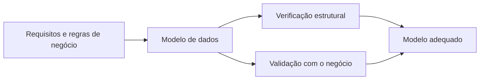
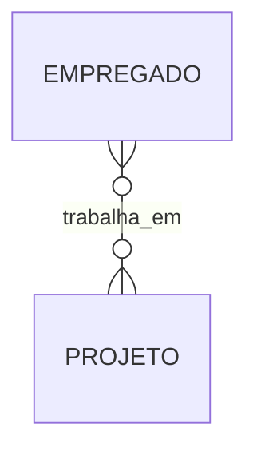
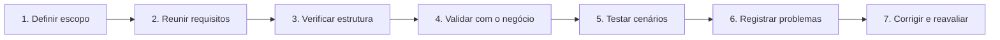

# 1.8 — Avaliação de modelos de dados

[[1.0 Mapa de estudos — Arquitetura de dados|← Mapa]] · [[1.7 Modelagem dimensional|← Modelagem dimensional]] · [[1.9 Técnicas de engenharia reversa|Engenharia reversa →]] · [[Banco de questões — Arquitetura de dados|Questões]]

> [!important] Prioridade CESGRANRIO: **MÉDIA**
> A matriz de estudos aponta potencial de cobrança por cenários de **qualidade e adequação**. O maior retorno está em reconhecer se o modelo representa corretamente as regras de negócio, se está completo e consistente e se evita redundâncias e ambiguidades. A cobrança tende a ser mais aplicada do que baseada em nomes de métodos.

## O que você DEVE MANTER e REVISAR — o “coração” da CESGRANRIO

A CESGRANRIO tende a cobrar avaliação de modelos por cinco pilares:

1. **Correção, completude e consistência (Seções 4 e 5):** correção verifica se o representado está certo; completude procura o que foi omitido; consistência procura contradições. **Pegadinha:** um modelo pode estar correto no que mostra e ainda ser incompleto.

2. **Verificação × validação (Seção 3):** verificação pergunta se o modelo foi construído corretamente; validação pergunta se foi construído o modelo correto para o negócio. Notação correta não garante semântica correta.

3. **Chaves e identidade (Seção 9):** a chave precisa garantir unicidade e minimalidade. Uma chave substituta não elimina a necessidade de proteger uma chave natural determinada pelo negócio.

4. **Relacionamentos e cardinalidades (Seção 10):** leia cada associação nos dois sentidos e confira mínimos e máximos. `1:N` não informa sozinho obrigatoriedade; `N:M` exige relação associativa no modelo lógico.

5. **Técnicas de avaliação (Seções 12 e 13):** revisão por pares verifica estrutura; especialistas validam significado; exemplos testam limites e exceções; rastreabilidade demonstra cobertura; matriz CRUD relaciona processos e entidades.

> [!note] Limite deste módulo
> Engenharia reversa, SQL, SGBD, transações e melhoria de performance pertencem aos tópicos seguintes. Aqui será avaliada principalmente a **qualidade do modelo**, sem aprofundar ferramentas de extração, comandos ou técnicas físicas de otimização.

## Objetivos de aprendizagem

Ao final deste módulo, você deverá conseguir:

1. explicar por que e quando um modelo deve ser avaliado;
2. distinguir correção, completude, consistência, clareza e adequação;
3. verificar entidades, atributos, chaves, relacionamentos e cardinalidades;
4. avaliar regras de negócio, domínios e restrições;
5. aplicar revisão, rastreabilidade e testes com exemplos;
6. reconhecer defeitos comuns em modelos conceituais, lógicos e dimensionais;
7. priorizar problemas por impacto;
8. evitar as principais pegadinhas da CESGRANRIO.

## 1. Conceito

A **avaliação de um modelo de dados** é o processo sistemático de verificar se ele representa adequadamente o domínio, atende aos requisitos, respeita as regras de modelagem e pode servir de base confiável para implementação e evolução.

Um modelo não é bom apenas porque está sintaticamente correto. Ele também precisa representar o negócio certo.



Perguntas centrais:

- o modelo contém todos os conceitos necessários?
- cada conceito foi representado corretamente?
- chaves e cardinalidades refletem as regras?
- há contradições, ambiguidades ou redundâncias?
- os nomes são compreensíveis?
- o modelo suporta os usos previstos?
- uma mudança pode ser incorporada sem desorganizar todo o esquema?

> [!warning] Pegadinha CESGRANRIO
> Modelo correto na notação não é necessariamente correto para o negócio. Um relacionamento `1:N` pode estar perfeitamente desenhado e ainda assim estar semanticamente errado se a regra real for `N:M`.

## 2. Por que avaliar

Erros encontrados no modelo propagam-se para tabelas, integrações, relatórios e aplicações. Corrigi-los depois da implantação tende a ser mais caro.

Benefícios da avaliação:

- detectar requisitos ausentes ou contraditórios;
- impedir cardinalidades incorretas;
- reduzir redundância e anomalias;
- padronizar nomes e definições;
- melhorar comunicação entre negócio e TI;
- evitar regras importantes apenas no conhecimento informal;
- aumentar rastreabilidade;
- preparar uma transformação segura entre níveis de modelagem.

```text
erro no requisito
→ erro no modelo
→ erro no esquema
→ dados inconsistentes
→ decisões ou operações incorretas
```

## 3. Verificação e validação

### 3.1 Verificação

Pergunta principal:

```text
O modelo foi construído corretamente segundo as regras e padrões?
```

Exemplos:

- toda entidade possui identificador adequado?
- a notação foi usada corretamente?
- FKs correspondem aos relacionamentos?
- não existem dependências parciais indevidas?
- nomes seguem o padrão estabelecido?
- domínios são compatíveis?

### 3.2 Validação

Pergunta principal:

```text
Foi construído o modelo correto para as necessidades do negócio?
```

Exemplos:

- um empregado pode participar de vários projetos?
- um projeto pode existir antes de receber empregados?
- dependentes precisam ser historizados?
- a definição de departamento é a mesma para RH e financeiro?
- as consultas e operações necessárias são suportadas?

| Aspecto | Verificação | Validação |
|---|---|---|
| foco | conformidade interna e técnica | adequação ao domínio e ao uso |
| referência | regras de modelagem e padrões | requisitos e especialistas do negócio |
| pergunta | “construímos corretamente?” | “construímos o modelo correto?” |
| exemplo | PK está definida | PK representa a identidade real |

> [!warning] Pegadinha CESGRANRIO
> Verificação não substitui validação. Um modelo pode estar normalizado, bem nomeado e sintaticamente perfeito, mas omitir uma regra essencial do negócio.

## 4. Critérios essenciais de qualidade

### 4.1 Correção

O modelo representa fielmente as regras conhecidas e utiliza corretamente a técnica de modelagem.

Exemplos:

- a cardinalidade corresponde à regra real;
- a chave identifica exatamente uma ocorrência;
- um atributo está associado à entidade correta;
- a entidade fraca depende de seu proprietário;
- fatos e dimensões desempenham seus papéis corretos.

### 4.2 Completude

Todos os conceitos, relacionamentos, atributos e regras necessários ao escopo estão representados.

Um modelo pode estar correto no que mostra, mas incompleto por omitir:

- data de vigência de uma associação;
- relacionamento entre projeto e departamento;
- atributo obrigatório;
- regra de unicidade;
- entidade associativa de um relacionamento `N:M`.

### 4.3 Consistência

Não existem contradições internas ou entre o modelo e sua documentação.

Exemplos de inconsistência:

- diagrama indica participação opcional, mas o esquema declara FK `NOT NULL`;
- o mesmo atributo aparece como texto em uma tabela e inteiro em outra referência;
- glossário define “projeto ativo” de duas formas incompatíveis;
- duas entidades representam o mesmo conceito com nomes diferentes.

### 4.4 Clareza e compreensibilidade

O modelo pode ser entendido por seus públicos sem ambiguidade desnecessária.

Contribuem para a clareza:

- nomes significativos;
- definições objetivas;
- notação consistente;
- ausência de elementos decorativos sem função;
- nível de detalhe adequado ao público;
- diagramas divididos por assunto quando muito extensos.

### 4.5 Não redundância

O mesmo fato não deve ser armazenado desnecessariamente em vários lugares sem regra de sincronização.

```text
EMPREGADO(matricula, cod_departamento, nome_departamento)
DEPARTAMENTO(cod_departamento, nome_departamento)
```

No modelo operacional normalizado, repetir `nome_departamento` em `EMPREGADO` cria risco de inconsistência. Em modelo dimensional, redundância descritiva pode ser deliberada. O critério depende da finalidade.

### 4.6 Simplicidade

O modelo deve possuir a menor complexidade compatível com os requisitos — nem simplificação que perca regras, nem detalhamento sem necessidade.

```text
Simplicidade ≠ omissão
Detalhamento ≠ qualidade automática
```

### 4.7 Flexibilidade e extensibilidade

O modelo deve acomodar mudanças previsíveis sem alterações desproporcionais.

Exemplo: armazenar `telefone_1`, `telefone_2` e `telefone_3` limita artificialmente a quantidade de telefones. Uma relação própria `TELEFONE_EMPREGADO` acomoda novas ocorrências sem mudar a estrutura.

### 4.8 Conformidade e padronização

O modelo deve seguir padrões organizacionais relevantes:

- convenção de nomes;
- definição de domínios;
- representação de datas e códigos;
- documentação de chaves;
- terminologia do glossário;
- notação escolhida.

### 4.9 Adequação ao uso

Um modelo deve ser avaliado segundo sua finalidade:

- modelo conceitual prioriza comunicação e semântica;
- modelo lógico prioriza estrutura, chaves e restrições;
- modelo dimensional prioriza análise em um grão declarado;
- modelo físico concretiza escolhas no SGBD.

> [!warning] Pegadinha CESGRANRIO
> Não existe um modelo universalmente “melhor” sem considerar objetivo e contexto. Desnormalização pode ser defeito em um esquema transacional e decisão consciente em uma dimensão analítica.

## 5. Critérios que não devem ser confundidos

| Situação | Critério principal afetado |
|---|---|
| regra real é `N:M`, mas o modelo mostra `1:N` | correção |
| entidade necessária não aparece | completude |
| FK opcional no diagrama e obrigatória no esquema | consistência |
| nomes `TAB_X1` e `CAMPO_99` sem definição | clareza |
| mesmo nome de departamento repetido sem controle | não redundância |
| três estruturas diferentes para representar telefone | padronização |
| modelo exige alteração de coluna a cada telefone novo | flexibilidade |
| modelo analítico não responde às perguntas solicitadas | adequação ao uso |

Um defeito pode afetar vários critérios, mas questões objetivas normalmente pedem o mais direto.

## 6. Avaliação por nível de modelagem

### 6.1 Modelo conceitual

Avalie principalmente:

- entidades relevantes para o escopo;
- significado e limites de cada entidade;
- relacionamentos e seus nomes;
- cardinalidades mínimas e máximas;
- atributos identificadores;
- entidades fortes e fracas;
- generalizações/especializações, quando necessárias;
- aderência às regras de negócio;
- compreensão pelos especialistas do domínio.

Não é prioridade conceitual avaliar:

- tipo físico específico;
- índice;
- particionamento;
- mecanismo de armazenamento.

### 6.2 Modelo lógico relacional

Avalie principalmente:

- relações e atributos;
- chaves candidatas e PK escolhida;
- FKs e integridade referencial;
- domínios e nulabilidade;
- transformação de relacionamentos `1:1`, `1:N` e `N:M`;
- dependências funcionais;
- formas normais adequadas;
- restrições de unicidade;
- rastreabilidade com o conceitual.

### 6.3 Modelo dimensional

Avalie principalmente:

- processo de negócio;
- declaração do grão;
- consistência das medidas com o grão;
- fatos e dimensões;
- aditividade das medidas;
- dimensões compartilhadas coerentemente;
- ausência de mistura de granularidades;
- capacidade de responder às perguntas analíticas previstas.

### 6.4 Modelo físico — apenas visão de avaliação

Neste ponto, basta verificar se o modelo físico:

- implementa as chaves e restrições do modelo lógico;
- usa tipos compatíveis com os domínios;
- respeita limitações do SGBD escolhido;
- mantém rastreabilidade com o modelo lógico;
- documenta desvios deliberados.

Índices, particionamento e melhoria de desempenho serão estudados no tópico 1.17.

## 7. Avaliação de entidades

Para cada entidade, pergunte:

1. representa um conceito relevante e distinguível?
2. possui ocorrências próprias?
3. existe dentro do escopo do sistema?
4. tem identificador adequado?
5. seus atributos realmente a descrevem?
6. está duplicando outra entidade?
7. o nome está no singular e possui significado claro?

### 7.1 Entidade excessivamente genérica

```text
CADASTRO(id, tipo, campo1, campo2, campo3)
```

Problemas:

- semântica escondida em `tipo`;
- domínios diferentes misturados;
- muitos valores nulos;
- regras difíceis de expressar;
- baixa clareza.

Entidades genéricas não são sempre erradas, mas exigem justificativa e regras claras.

### 7.2 Entidade duplicada

```text
COLABORADOR
FUNCIONARIO
EMPREGADO
```

Se os três nomes representam o mesmo conceito, o modelo possui duplicidade semântica. Se representam conceitos distintos, suas definições e relações precisam explicitar a diferença.

## 8. Avaliação de atributos e domínios

Para cada atributo, verifique:

- nome e definição;
- entidade à qual pertence;
- atomicidade necessária ao uso;
- domínio e unidade de medida;
- obrigatoriedade;
- valor padrão, quando houver;
- unicidade;
- derivação a partir de outros dados;
- estabilidade ao longo do tempo.

### 8.1 Unidade e significado

```text
pressao = 30
```

Sem unidade, escala e contexto, o atributo é ambíguo. O dicionário deve esclarecer se o valor está em bar, psi ou outra unidade.

### 8.2 Atributo derivado

```text
idade = data_atual - data_nascimento
```

Armazenar `idade` pode gerar desatualização. Em muitos casos é melhor armazenar `data_nascimento` e derivar a idade. Entretanto, valores calculados podem ser armazenados deliberadamente quando existe requisito claro e controle de consistência.

> [!warning] Pegadinha CESGRANRIO
> Atributo derivado não é sempre proibido. A avaliação deve considerar necessidade, custo e mecanismo de consistência. No nível conceitual, ele pode aparecer identificado como derivado.

### 8.3 Campos multivalorados disfarçados

```text
telefones = '21999990000;2133334444'
```

Se os telefones precisam ser manipulados separadamente, o atributo esconde múltiplos valores e deve ser revisto.

## 9. Avaliação de identificadores e chaves

Uma chave candidata deve ser:

- única;
- mínima;
- não nula;
- estável, tanto quanto possível;
- conhecida ou gerável para todas as ocorrências;
- adequada ao significado da entidade.

Perguntas úteis:

- há mais de uma candidata?
- a PK escolhida muda com frequência?
- existe chave composta desnecessariamente larga?
- a chave natural precisa continuar protegida por `UNIQUE`?
- uma chave substituta esconde duplicatas do negócio?

```text
CLIENTE(id_cliente PK, cpf)
```

Se CPF identifica clientes segundo a regra, criar `id_cliente` não elimina a necessidade de declarar a unicidade do CPF.

> [!warning] Pegadinha CESGRANRIO
> Uma chave substituta resolve a identificação técnica, mas não garante automaticamente a unicidade das chaves naturais.

## 10. Avaliação de relacionamentos e cardinalidades

Para cada relacionamento, verifique:

- verbo e significado;
- entidades participantes;
- cardinalidade mínima e máxima em cada lado;
- obrigatoriedade;
- atributos próprios do relacionamento;
- necessidade de entidade associativa;
- dependência de existência;
- validade temporal da associação.

### 10.1 Traduzir em frases

Um modo eficaz de validar é ler o relacionamento nos dois sentidos:

```text
Um DEPARTAMENTO pode lotar zero ou muitos EMPREGADOS.
Um EMPREGADO deve pertencer a exatamente um DEPARTAMENTO.
```

Depois, confirme cada frase com o especialista do negócio.

### 10.2 Relacionamento `N:M` não resolvido



No modelo lógico relacional, deve surgir uma relação associativa:

```text
TRABALHA_EM(
  matricula PK/FK,
  cod_projeto PK/FK,
  horas
)
```

O atributo `horas` descreve a associação empregado–projeto, não apenas uma das entidades.

### 10.3 Cardinalidade mínima omitida

Saber apenas que a relação é `1:N` não informa se:

- todo empregado precisa de departamento;
- um departamento pode existir sem empregados.

As cardinalidades mínimas `0` ou `1` representam regras distintas e afetam nulabilidade e validações.

## 11. Avaliação de regras de negócio

As regras precisam ser:

- claras;
- não contraditórias;
- rastreáveis até uma fonte;
- representadas no nível adequado;
- verificáveis sempre que possível;
- acompanhadas de exceções e temporalidade relevantes.

Exemplo:

```text
Regra vaga:
“Empregados normalmente pertencem a departamentos.”

Regra avaliável:
“Todo empregado ativo deve pertencer a exatamente um departamento ativo.”
```

A segunda regra define população, obrigatoriedade, quantidade e condição do departamento.

> [!warning] Pegadinha CESGRANRIO
> Uma FK garante que o departamento exista, mas não garante, sozinha, que esteja “ativo”. Existência referencial e condição de negócio são controles diferentes.

## 12. Técnicas de avaliação

### 12.1 Revisão por pares

Outro modelador analisa notação, estrutura, padrões, chaves e relacionamentos. É útil para encontrar inconsistências técnicas e suposições não documentadas.

### 12.2 Revisão com especialistas do negócio

Usuários e especialistas verificam conceitos, regras, nomes e exemplos. É essencial para a validação semântica.

### 12.3 Walkthrough

O autor percorre o modelo e explica suas decisões. Os participantes simulam cenários e questionam cada elemento.

### 12.4 Checklist

Uma lista padronizada reduz omissões:

- entidades possuem identificadores?
- relacionamentos têm cardinalidades nos dois lados?
- atributos têm domínio?
- nomes obedecem ao padrão?
- relacionamentos `N:M` foram tratados no lógico?
- FKs preservam a referência?
- requisitos possuem correspondência no modelo?

### 12.5 Teste com dados de exemplo

Instâncias pequenas revelam defeitos que o diagrama abstrato pode esconder.

Casos importantes:

- mínimo permitido;
- máximo permitido;
- valor ausente;
- duplicidade;
- entidade sem relacionamento opcional;
- várias ocorrências no lado N;
- exceções reais do negócio.

### 12.6 Cenários de operações

Simule eventos do ciclo de vida:

```text
cadastrar
consultar
alterar
associar
desassociar
encerrar
excluir
```

Se “transferir empregado entre departamentos mantendo histórico” não pode ser representado, o modelo pode estar incompleto.

## 14. Avaliação de normalização

Como a normalização já foi estudada, use-a como critério do modelo lógico:

- há grupos repetitivos ou listas em uma coluna?
- atributos não primos dependem apenas de parte da chave?
- atributos não primos dependem de outros não primos?
- a decomposição possui junção sem perda?
- as dependências relevantes foram preservadas?

Não normalize mecanicamente sem considerar o objetivo. A avaliação deve registrar qualquer desnormalização deliberada e o risco de inconsistência assumido.

## 15. Avaliação do modelo dimensional

Use este checklist específico:

1. o processo de negócio está explícito?
2. o grão foi declarado antes das medidas?
3. cada linha da fato respeita o mesmo grão?
4. dimensões fornecem contexto descritivo?
5. medidas são compatíveis com o grão?
6. aditividade foi definida corretamente?
7. chaves das dimensões relacionam-se à fato?
8. o modelo responde às perguntas analíticas previstas?

### 15.1 Exemplo de defeito

Uma `FATO_CUSTOS` contém:

```text
linha por lançamento diário
e
linha com total mensal do projeto
```

A tabela mistura granularidades. Somar suas medidas pode contar o total mensal junto com os lançamentos que o compõem.

## 16. Defeitos comuns e diagnóstico

| Defeito | Sintoma | Risco |
|---|---|---|
| entidade genérica demais | muitas colunas vagas e nulas | regras ocultas e baixa clareza |
| ausência de chave natural protegida | duplicatas do mesmo objeto real | inconsistência de identidade |
| cardinalidade incorreta | ocorrências válidas não cabem ou inválidas são aceitas | violação do negócio |
| relacionamento `N:M` oculto | várias colunas repetidas ou listas | limite artificial e anomalias |
| atributo na entidade errada | repetição do mesmo valor | atualização inconsistente |
| domínio genérico demais | texto livre para códigos controlados | baixa validade |
| nomes ambíguos | `codigo`, `tipo`, `valor` sem qualificação | interpretação divergente |
| regra apenas em documentação externa | modelo não expressa restrição possível | perda de controle |
| mistura de grãos | totais e detalhes na mesma fato | dupla contagem |
| divergência entre níveis | conceitual e lógico expressam regras diferentes | implementação incorreta |

## 17. Priorização de problemas

Nem todo defeito possui o mesmo impacto. Uma ordem prática:

1. identidade e perda de dados;
2. regras e cardinalidades incorretas;
3. integridade e consistência;
4. conceitos ou requisitos ausentes;
5. redundância e anomalias;
6. ambiguidades e padronização;
7. melhorias estéticas.

Critérios de priorização:

- impacto no negócio;
- probabilidade de ocorrência;
- quantidade de sistemas afetados;
- dificuldade de correção após implantação;
- risco de dados inválidos;
- dependência de outras decisões.

> [!warning] Pegadinha CESGRANRIO
> Um nome fora do padrão é defeito, mas normalmente é menos grave que uma chave incapaz de garantir identidade ou uma cardinalidade que aceita dados impossíveis.

## 18. Processo recomendado de avaliação



### 18.1 Definir escopo

Identifique o nível do modelo, a finalidade, os processos cobertos e os públicos da revisão.

### 18.2 Reunir referências

Use requisitos, regras, glossário, exemplos, modelos relacionados e padrões organizacionais.

### 18.3 Verificar

Analise estrutura, notação, chaves, domínios, normalização e coerência interna.

### 18.4 Validar

Confirme significados, cardinalidades, exceções e cenários com especialistas.

### 18.5 Registrar

Para cada problema, documente:

```text
elemento afetado
regra ou requisito relacionado
descrição do problema
impacto
recomendação
responsável pela decisão
status
```

### 18.6 Reavaliar

Uma alteração pode corrigir um defeito e criar outro. Após a correção, repita os testes relevantes.


## 20. Priorização para a CESGRANRIO

### 20.1 Alta chance dentro do subtema

- correção, completude e consistência;
- verificação versus validação;
- chaves e identificadores;
- cardinalidades e obrigatoriedade;
- relacionamento `N:M` e entidade associativa;
- redundância e normalização;
- adequação do modelo à finalidade;
- identificação de defeitos por cenário.

### 20.2 Chance média / diferenciação

- clareza, simplicidade e flexibilidade;
- revisão por pares e com especialistas;
- testes com dados de exemplo;
- rastreabilidade;
- matriz CRUD;
- avaliação do grão dimensional;
- priorização de problemas.

### 20.3 Baixo retorno neste subtema

- nomes de ferramentas comerciais;
- métricas matemáticas sofisticadas de qualidade estrutural;
- algoritmos automáticos de engenharia reversa;
- tuning físico e comparação detalhada de planos;
- padrões acadêmicos nominais sem aplicação no edital.

## 21. Checklist de pegadinhas

- [ ] Correção avalia se o que foi modelado está certo.
- [ ] Completude avalia se algo necessário foi omitido.
- [ ] Consistência procura contradições.
- [ ] Verificação pergunta se foi construído corretamente.
- [ ] Validação pergunta se o modelo correto foi construído.
- [ ] Notação correta não garante semântica correta.
- [ ] Chave substituta não elimina unicidade natural.
- [ ] Cardinalidade deve ser lida nos dois sentidos.
- [ ] `1:N` não informa sozinho a participação mínima.
- [ ] Atributo derivado não é universalmente proibido.
- [ ] Rastreabilidade demonstra cobertura, não prova correção.
- [ ] Redundância pode ser deliberada conforme a finalidade.
- [ ] Modelo dimensional deve manter um único grão por fato.
- [ ] Avaliação depende do nível e do objetivo do modelo.

## 22. Questões inéditas — estilo CESGRANRIO

### 22.1 Questão 1

Durante a revisão de um modelo, constatou-se que todos os relacionamentos obedecem à notação adotada. Entretanto, o diagrama representa que cada projeto pertence a exatamente um departamento, enquanto especialistas afirmam que projetos podem ser conduzidos conjuntamente por vários departamentos.

Essa constatação indica, principalmente,

A) ausência de padronização dos nomes.  
B) erro de correção semântica identificado pela validação.  
C) falha de desempenho do modelo físico.  
D) ausência de atomicidade transacional.  
E) problema de sintaxe da notação.

> [!success]- Gabarito comentado
> **Resposta: B.** O diagrama está sintaticamente correto, mas sua cardinalidade não representa a regra real. Trata-se de erro de correção semântica descoberto ao validar o modelo com especialistas. A pegadinha é concluir que o uso correto da notação basta para tornar o modelo correto.

### 22.2 Questão 2

Um modelo lógico possui a relação `CLIENTE(id_cliente PK, cpf, nome)`. `id_cliente` é uma chave substituta, e a regra de negócio determina que não pode haver dois clientes com o mesmo CPF.

Para avaliar positivamente a representação dessa regra, deve-se verificar se

A) `cpf` também foi declarado chave primária.  
B) `nome` determina funcionalmente `id_cliente`.  
C) existe restrição de unicidade para `cpf`, além da PK substituta.  
D) `cpf` foi removido, pois chaves naturais são incompatíveis com substitutas.  
E) a relação foi transformada em uma tabela fato.

> [!success]- Gabarito comentado
> **Resposta: C.** A PK substituta identifica tecnicamente a linha, mas não impede dois registros com o mesmo CPF. A chave natural deve continuar protegida pela restrição correspondente. Uma relação possui apenas uma PK, embora possa possuir várias chaves candidatas.

## 23. Resumo de véspera

```text
AVALIAR = verificar estrutura + validar semântica
CORREÇÃO = o representado está certo
COMPLETUDE = nada necessário foi omitido
CONSISTÊNCIA = não há contradições
CLAREZA = nomes e estruturas são compreensíveis
ADEQUAÇÃO = modelo serve à finalidade prevista
VERIFICAÇÃO = construímos corretamente?
VALIDAÇÃO = construímos o modelo correto?
CHAVES = unicidade + minimalidade + estabilidade adequada
CARDINALIDADE = ler nos dois sentidos, incluindo mínimo e máximo
RASTREABILIDADE = requisito ligado ao elemento que o representa
TESTE = usar exemplos, limites, exceções e operações do ciclo de vida
MODELO DIMENSIONAL = processo + grão + dimensões + medidas coerentes
```
