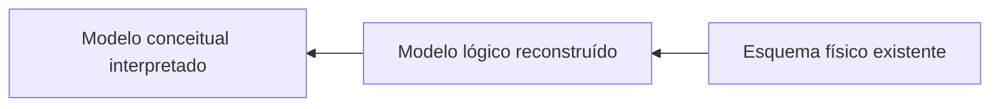
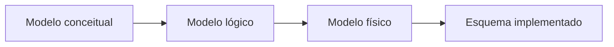
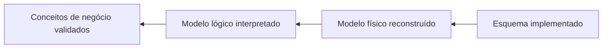

# 1.9 — Técnicas de engenharia reversa para criação e atualização de modelos de dados

[[1.0 Mapa de estudos — Arquitetura de dados|← Mapa]] · [[1.8 Avaliação de modelos de dados|← Avaliação de modelos]] · [[1.10 Linguagem de consulta estruturada SQL|SQL →]] · [[Banco de questões — Arquitetura de dados|Questões]]

> [!important] Prioridade CESGRANRIO: **BAIXA/MÉDIA**
> A matriz do repositório não encontrou ocorrência direta no corpus analisado. A chance mais plausível é uma cobrança conceitual integrada a **níveis de modelagem, metadados, chaves, relacionamentos e atualização de modelos**. Não vale priorizar nomes de ferramentas ou comandos proprietários.

## O que você DEVE MANTER e REVISAR — o “coração” da CESGRANRIO

Se este subtema aparecer, a tendência é concentrar-se em cinco pilares:

1. **Engenharia direta × reversa (Seção 2):** direta transforma modelo em esquema; reversa parte de artefatos existentes para reconstruir uma representação de nível mais alto. **Pegadinha:** engenharia reversa não recupera automaticamente toda a intenção do negócio.

2. **Fontes de metadados (Seções 4 e 5):** catálogo do SGBD, DDL, restrições, visões, documentação e aplicações ajudam a reconstruir o modelo. PKs e FKs declaradas são mais confiáveis que relações inferidas apenas por nomes.

3. **Reconstrução de entidades e relacionamentos (Seção 6):** tabelas sugerem entidades ou associações; PKs sugerem identificadores; FKs sugerem relacionamentos; `NULL` e `UNIQUE` ajudam a interpretar participação e cardinalidade.

4. **Limites da automação (Seção 8):** ausência de FK não prova ausência de relacionamento; nomes semelhantes não provam referência; regras em código, procedimentos ou conhecimento humano podem não aparecer no catálogo.

5. **Comparação e sincronização (Seções 10 e 11):** compare modelo e banco, classifique diferenças e escolha conscientemente qual lado é a referência. **Pegadinha:** sincronização automática e bidirecional pode sobrescrever decisões válidas.

> [!note] Limite deste módulo
> Consultas SQL detalhadas, recursos internos do SGBD, transações, tuning e qualidade de dados pertencem aos tópicos posteriores. Aqui estudaremos o processo de reconstruir e manter o **modelo**, sem aprofundar esses mecanismos.

## Objetivos de aprendizagem

Ao final deste módulo, você deverá conseguir:

1. definir engenharia direta, reversa e sincronização de modelos;
2. identificar fontes úteis para reconstrução de um esquema;
3. inferir entidades, atributos, chaves e relacionamentos com cautela;
4. distinguir elementos declarados de elementos apenas inferidos;
5. reconhecer limitações da geração automática de modelos;
6. comparar modelo e banco para identificar divergências;
7. descrever um fluxo seguro de atualização do modelo;
8. evitar as pegadinhas mais prováveis da CESGRANRIO.

## 1. Conceito

A **engenharia reversa de dados** analisa artefatos já existentes — como esquema de banco, DDL, catálogo, arquivos, aplicações e documentação — para reconstruir ou atualizar uma representação estruturada do modelo de dados.



O fluxo acima não é completamente automático:

- o físico informa como os dados foram implementados;
- o lógico organiza relações, chaves e restrições;
- o conceitual exige interpretação da semântica e das regras do negócio.

A engenharia reversa é útil quando:

- não há modelo documentado;
- a documentação ficou desatualizada;
- um sistema legado será modernizado;
- é necessário compreender integrações existentes;
- o banco mudou diretamente e o modelo precisa ser atualizado;
- será realizada migração ou consolidação;
- é preciso avaliar o impacto de mudanças.

> [!warning] Pegadinha CESGRANRIO
> Engenharia reversa não é cópia ou restauração de backup. Seu objetivo é **compreender e reconstruir abstrações** a partir de artefatos existentes.

## 2. Engenharia direta, reversa e sincronização

### 2.1 Engenharia direta (_forward engineering_)

Parte de uma especificação ou modelo e gera artefatos de implementação.



Exemplos:

- transformar entidades e relacionamentos em relações;
- transformar tipos lógicos em tipos concretos;
- gerar DDL a partir do modelo físico.

### 2.2 Engenharia reversa (_reverse engineering_)

Parte dos artefatos implementados para recuperar uma representação mais abstrata.



### 2.3 Comparação e sincronização

Compara modelo e implementação para identificar diferenças e, após decisão humana, atualizar um dos lados.

```text
Modelo → banco = engenharia direta/implantação
Banco → modelo = engenharia reversa/atualização documental
Comparar os dois = detecção de divergências
```

### 2.4 Engenharia de ida e volta (_round-trip engineering_)

Combina engenharia direta e reversa para manter modelo e implementação alinhados durante a evolução.

> [!warning] Pegadinha CESGRANRIO
> _Round-trip_ não significa copiar alterações automaticamente em ambas as direções sem análise. Conflitos precisam de fonte de verdade, revisão e decisão sobre o que será preservado.

## 3. Níveis que podem ser recuperados

### 3.1 Modelo físico

É o nível mais diretamente recuperável do banco:

- tabelas e colunas;
- tipos concretos;
- PKs, FKs e restrições;
- índices e visões;
- nomes de schemas;
- detalhes específicos do SGBD.

### 3.2 Modelo lógico

Exige abstrair detalhes físicos:

- relações e atributos;
- domínios lógicos;
- chaves candidatas;
- relacionamentos;
- obrigatoriedade;
- entidades associativas;
- dependências estruturais.

### 3.3 Modelo conceitual

Exige maior participação humana:

- conceitos de negócio;
- significado das associações;
- regras não declaradas;
- limites entre entidades;
- terminologia corporativa;
- especializações e exceções.

| Nível recuperado | Automação possível | Necessidade de interpretação |
|---|---:|---:|
| físico | alta | baixa/média |
| lógico | média | média |
| conceitual | baixa | alta |

> [!warning] Pegadinha CESGRANRIO
> Uma ferramenta pode gerar um diagrama automaticamente, mas isso não significa que recuperou o modelo conceitual correto. Normalmente ela recupera primeiro a estrutura física e parte do lógico.

## 4. Fontes para a engenharia reversa

### 4.1 Catálogo do SGBD

É a fonte primária para objetos declarados:

- tabelas, colunas e tipos;
- PKs e restrições de unicidade;
- FKs;
- nulabilidade e valores padrão;
- visões e outros objetos;
- comentários e descrições, quando existentes.

O catálogo já foi estudado em [[1.6 - Metadados]].

### 4.2 Scripts DDL

Arquivos de criação e alteração podem revelar:

- estrutura planejada;
- ordem das mudanças;
- restrições removidas ou adicionadas;
- diferenças entre versões;
- objetos que ainda não foram implantados.

O DDL deve ser comparado ao banco vigente: um script armazenado no repositório pode não ter sido executado ou pode estar desatualizado.

### 4.3 Documentação existente

- modelos antigos;
- dicionários de dados;
- glossários;
- requisitos;
- especificações de interface;
- manuais do sistema;
- registros de mudança.

Documentação ajuda a recuperar semântica, mas precisa ser validada contra a implementação e o negócio atual.

### 4.4 Aplicações e integrações

Código, mapeamentos e interfaces podem revelar:

- relacionamentos não declarados no banco;
- regras de validação;
- valores e domínios esperados;
- tabelas lidas ou atualizadas em conjunto;
- significados ocultos em códigos.

### 4.5 Dados existentes

Uma amostra pode sugerir:

- valores únicos;
- nulabilidade real;
- padrões de formato;
- possíveis referências;
- domínios enumerados;
- colunas sempre preenchidas em conjunto.

Entretanto, dados observados fornecem **evidência**, não prova de uma regra universal.

> [!warning] Pegadinha CESGRANRIO
> Uma coluna estar única na amostra atual não prova que seja chave candidata. Chaves decorrem da semântica e das restrições válidas para todos os estados permitidos.

## 5. Técnicas principais

### 5.1 Introspecção de esquema

Leitura automatizada dos metadados mantidos pelo SGBD para identificar objetos e propriedades.

Resultado típico:

```text
schema
└── tabela
    ├── colunas e tipos
    ├── chave primária
    ├── chaves estrangeiras
    ├── restrições
    └── índices
```

### 5.2 Análise de DDL

Interpretação de comandos de criação e alteração para reconstruir a estrutura e, quando há histórico, sua evolução.

### 5.3 Análise de dependências

Identifica objetos que dependem de outros:

```text
FK → chave referenciada
visão → tabelas consultadas
pipeline → origem e destino
relatório → tabela ou visão
```

Essa técnica auxilia a compreensão e a análise de impacto, sem substituir a validação do significado.

### 5.4 Análise de nomes

Convenções podem sugerir relações:

```text
EMPREGADO.cod_departamento
DEPARTAMENTO.cod_departamento
```

É uma heurística fraca. Nomes iguais podem representar conceitos diferentes, e nomes distintos podem representar a mesma referência.

### 5.5 Perfilamento estrutural básico

Observa características dos valores:

- quantidade de nulos;
- quantidade de distintos;
- mínimos e máximos;
- padrões de formato;
- sobreposição entre colunas;
- combinações potencialmente únicas.

Neste módulo, perfilamento serve somente como apoio à inferência. Qualidade de dados será aprofundada no tópico 1.21.

### 5.6 Revisão com especialistas

Especialistas confirmam:

- significado de tabelas e campos;
- validade das chaves inferidas;
- cardinalidades reais;
- regras não declaradas;
- exceções e histórico;
- terminologia correta.

> [!important] Princípio
> Metadados extraem a estrutura; especialistas recuperam a intenção.


## 8. Limitações e riscos

### 8.1 Ausência de restrições declaradas

Bancos legados podem depender da aplicação e não possuir PKs ou FKs declaradas. A ferramenta então gera tabelas isoladas, mesmo que existam relacionamentos reais.

### 8.2 Nomes obscuros

```text
TB_X01.CD_TP2
```

Sem dicionário ou especialista, a semântica não pode ser recuperada com segurança.

### 8.3 Regras fora do esquema

Regras podem estar em:

- aplicação;
- procedimentos;
- integrações;
- processos manuais;
- conhecimento tácito dos usuários.

### 8.4 Dados inconsistentes

Uma referência conceitualmente válida pode conter órfãos por falta de FK. Inferir a regra apenas pelos dados pode ocultá-la por causa dos erros atuais.

### 8.5 Estruturas físicas sem equivalente conceitual

Tabelas técnicas, caches, logs e estruturas temporárias não devem ser promovidos automaticamente a conceitos centrais do negócio.

### 8.6 Perda de histórico das decisões

O esquema mostra o estado atual, mas nem sempre explica por que uma escolha foi feita ou quais alternativas foram rejeitadas.

> [!warning] Pegadinha CESGRANRIO
> Engenharia reversa recupera com maior facilidade **estrutura** do que **semântica**. Quanto maior o nível de abstração desejado, maior a necessidade de validação humana.

## 9. Heurística versus restrição declarada

| Evidência | Força | Cuidado |
|---|---:|---|
| PK declarada | alta para identidade física | pode ser substituta e não revelar a chave natural |
| FK declarada | alta para referência | não revela toda regra de participação do pai |
| `UNIQUE` declarado | alta para unicidade | tratamento de `NULL` varia conforme contexto/SGBD |
| `NOT NULL` | alta para obrigatoriedade da coluna | não explica sozinho a regra de negócio completa |
| comentário/documentação | média | pode estar desatualizado |
| nome semelhante | baixa | pode ser coincidência |
| valores coincidentes | baixa/média | amostra não prova regra universal |
| uso conjunto no código | média | pode ser conveniência, não dependência semântica |

> [!tip] Regra de prova
> Restrição declarada é evidência estrutural; padrão de dados é indício; regra confirmada pelo negócio estabelece a semântica.

## 12. Controle de versão e rastreabilidade

Um processo confiável mantém:

- versão do modelo;
- versão ou identificação do esquema analisado;
- data da extração;
- ferramenta e parâmetros relevantes;
- diferenças detectadas;
- decisões de aceitação ou rejeição;
- responsáveis;
- vínculo com requisitos e mudanças.

Benefícios:

- distinguir mudança planejada de deriva;
- reconstruir a evolução;
- auditar decisões;
- repetir comparações;
- evitar sobrescrever personalizações.

### 12.1 Deriva de esquema (_schema drift_)

É a divergência acumulada entre estruturas esperadas e reais, ou entre ambientes.

Exemplos:

```text
desenvolvimento possui coluna que produção não possui
modelo exige FK que foi removida diretamente no banco
tipo foi alterado sem atualizar a documentação
```

Detectar deriva não determina automaticamente qual lado está correto.

## 19. Priorização para a CESGRANRIO

### 19.1 Chance média dentro do subtema

- engenharia direta versus reversa;
- reconstrução a partir de catálogo e DDL;
- identificação de tabelas, PKs e FKs;
- reconstrução de relacionamentos e cardinalidades;
- limites da automação;
- estrutura física versus semântica conceitual;
- comparação e atualização de modelo;
- engenharia reversa versus reengenharia.

### 19.2 Chance baixa / apenas reconhecimento

- _round-trip engineering_;
- deriva de esquema;
- perfilamento como fonte de inferência;
- engenharia reversa de arquivos semiestruturados;
- análise de dependências de visões e integrações;
- controle de versão do modelo.

### 19.3 Baixo retorno

- nomes de ferramentas comerciais;
- formatos proprietários de arquivos de modelagem;
- comandos específicos de cada SGBD;
- algoritmos internos de comparação;
- telas e assistentes de produtos.

## 20. Checklist de pegadinhas

- [ ] Engenharia direta vai do modelo para a implementação.
- [ ] Engenharia reversa parte do existente para recuperar abstrações.
- [ ] Reversa não é restauração de backup.
- [ ] O físico é mais automatizável que o conceitual.
- [ ] Toda tabela não representa necessariamente entidade de negócio.
- [ ] Ausência de FK não prova ausência de relacionamento.
- [ ] Nome semelhante não prova referência.
- [ ] Unicidade na amostra não prova chave candidata.
- [ ] PK substituta não revela necessariamente a identidade natural.
- [ ] `NULL` e `UNIQUE` ajudam, mas não revelam toda cardinalidade.
- [ ] Comparar não significa aplicar automaticamente.
- [ ] Detectar diferença não informa sozinho qual lado está correto.
- [ ] Engenharia reversa compreende; reengenharia transforma.

## 21. Questões inéditas — estilo CESGRANRIO

### 21.1 Questão 1

Uma ferramenta examinou o catálogo de um banco legado e gerou automaticamente um diagrama contendo tabelas, colunas, PKs e FKs. Sobre o resultado, é correto afirmar que

A) o modelo conceitual completo foi necessariamente recuperado, inclusive regras não declaradas.  
B) toda tabela gerada corresponde obrigatoriamente a uma entidade do negócio.  
C) a estrutura física e parte do modelo lógico podem ser recuperadas, mas a semântica deve ser validada.  
D) relacionamentos inexistem quando não há FK declarada.  
E) valores únicos na amostra tornam-se automaticamente chaves candidatas.

> [!success]- Gabarito comentado
> **Resposta: C.** Catálogo fornece forte base para reconstruir objetos físicos, chaves declaradas e parte da estrutura lógica. Conceitos, regras implícitas e significado exigem documentação, código e validação humana. A pegadinha é atribuir à automação capacidade de recuperar integralmente a intenção do negócio.

### 21.2 Questão 2

Ao comparar um modelo versionado com o banco de produção, foram encontradas uma coluna existente apenas no banco e uma FK existente apenas no modelo. A conduta mais adequada é

A) remover imediatamente a coluna e a FK para igualar os lados.  
B) copiar automaticamente todas as diferenças do banco para o modelo, pois produção sempre prevalece.  
C) copiar automaticamente todas as diferenças do modelo para o banco, pois documentação sempre prevalece.  
D) classificar as diferenças, validar a intenção e definir a direção de sincronização antes da alteração.  
E) ignorar a divergência, pois modelos e bancos não precisam manter rastreabilidade.

> [!success]- Gabarito comentado
> **Resposta: D.** A coluna pode ser mudança legítima não documentada ou desvio; a FK pode ser mudança planejada ainda não implantada ou documentação obsoleta. A comparação detecta a divergência, mas somente validação, análise de impacto e definição da fonte de verdade determinam a correção.

## 22. Resumo de véspera

```text
DIRETA = modelo → implementação
REVERSA = implementação → modelo reconstruído
ROUND-TRIP = direta + reversa com conciliação
CATÁLOGO/DDL = fontes fortes de estrutura declarada
DADOS OBSERVADOS = evidência, não prova universal
PK/FK = ajudam a recuperar identidade e relacionamentos
NULL/UNIQUE = ajudam a inferir participação e cardinalidade
FÍSICO = maior automação
CONCEITUAL = maior validação humana
COMPARAR = detectar diferenças
SINCRONIZAR = decidir e aplicar conscientemente
REVERSA = compreender; REENGENHARIA = transformar
```
