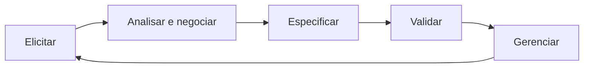
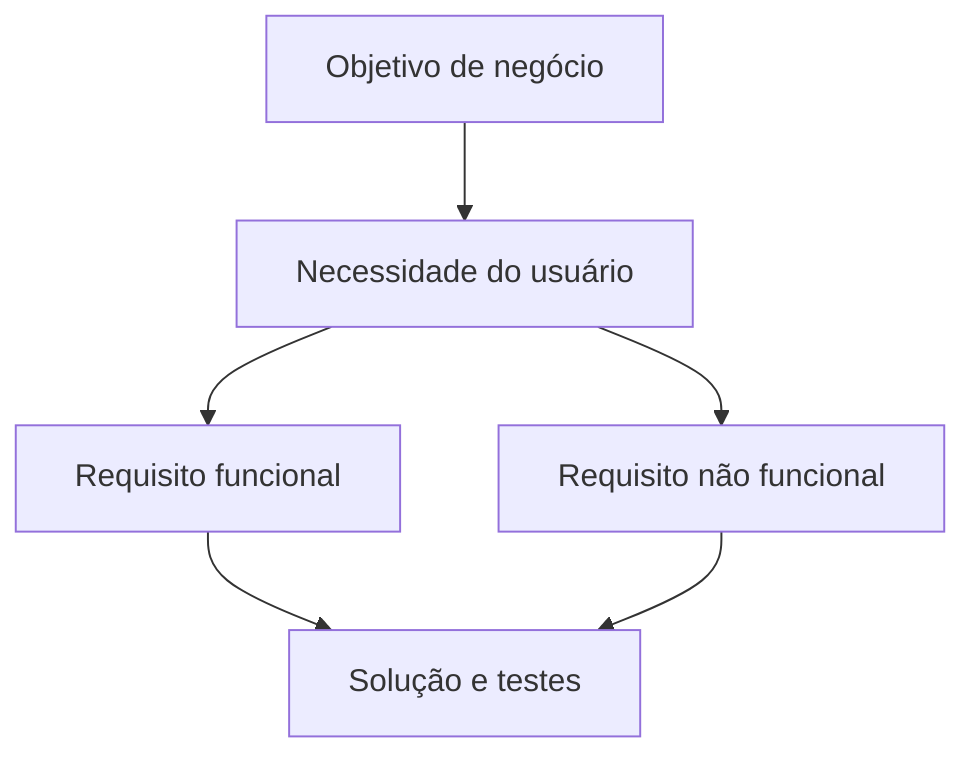
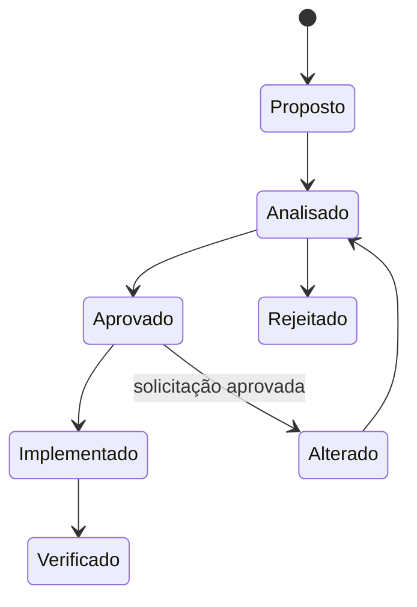
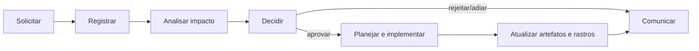
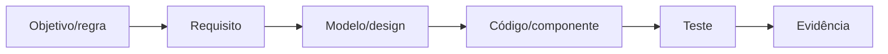

# 5.1 — Levantamento, análise e gerenciamento de requisitos

[[00 - Mapa de estudos — Engenharia de software|← Mapa]] · [[5.2 Ciclo de vida de sistemas e seus paradigmas|Ciclo de vida →]] · [[Banco de questões — Engenharia de software|Questões]]

> [!important] Prioridade CESGRANRIO: **ALTA**
> A matriz identifica 5.1 como o maior subtema de Engenharia de Software nas duas provas analisadas. A banca tende a apresentar uma situação realista e pedir a classificação do requisito, a técnica de elicitação ou a atividade correta do processo.

## O que você DEVE MANTER e REVISAR — o “coração” da CESGRANRIO

A CESGRANRIO concentra suas questões de requisitos em cinco pilares:

1. **Funcional × não funcional (Seção 5):** funcional descreve serviço ou comportamento; não funcional define qualidade ou condição sobre o serviço. **Pegadinha:** “o sistema deve autenticar o usuário” é funcional; “a autenticação deve concluir em até 2 segundos” é não funcional.

2. **Elicitação × análise × especificação × validação (Seções 3 e 4):** elicitação descobre; análise organiza, modela e negocia; especificação registra; validação confirma se os requisitos representam a necessidade. Essas atividades são iterativas, não uma fila rígida.

3. **Técnicas de elicitação (Seção 7):** entrevista aprofunda; questionário alcança muitos; observação revela trabalho real; workshop negocia coletivamente; protótipo esclarece necessidades difíceis de verbalizar.

4. **Qualidade dos requisitos (Seção 10):** devem ser necessários, corretos, claros, consistentes, completos, viáveis, verificáveis e rastreáveis. **Pegadinha:** “interface amigável” não é verificável sem critério mensurável.

5. **Gerenciamento e rastreabilidade (Seções 13 a 16):** mudança exige solicitação, análise de impacto, decisão, implementação e atualização dos artefatos. Rastreabilidade bidirecional liga origem → requisito → solução → teste e também permite voltar do teste à origem.

> [!note] Limite deste módulo
> Ciclos de vida serão estudados em 5.2; análise estruturada, orientação a objetos e UML, em 5.3; verificação, validação e testes em profundidade, em 5.4. Casos de uso e histórias serão usados aqui apenas como formas de representar requisitos.

## Objetivos de aprendizagem

1. definir requisito e engenharia de requisitos;
2. identificar stakeholders e fontes;
3. distinguir elicitação, análise, especificação, validação e gerenciamento;
4. classificar requisitos funcionais, não funcionais, regras e restrições;
5. escolher técnicas de elicitação adequadas;
6. reconhecer propriedades de um bom requisito;
7. aplicar priorização, baseline, mudanças e rastreabilidade;
8. evitar as principais pegadinhas da CESGRANRIO.

## 1. Conceitos fundamentais

### 1.1 Requisito

É uma necessidade, capacidade, condição ou propriedade que o sistema ou produto deve satisfazer para atender objetivos, usuários, contratos, normas ou restrições.

Exemplos:

```text
O sistema deve permitir cadastrar contratos.
O relatório mensal deve ser gerado em até 10 segundos.
A solução deve utilizar o serviço corporativo de identidade.
```

### 1.2 Engenharia de requisitos

Conjunto de atividades para:

- descobrir necessidades;
- analisar e negociar conflitos;
- documentar de forma compreensível;
- verificar e validar;
- priorizar;
- controlar mudanças;
- manter rastreabilidade.



O ciclo é iterativo: uma validação pode revelar nova necessidade e retornar à elicitação.

### 1.3 Levantamento × elicitação

Em muitos editais e materiais, são usados como equivalentes. “Elicitação” enfatiza que requisitos não estão apenas prontos para serem coletados: precisam ser descobertos, provocados e construídos com stakeholders.

> [!warning] Pegadinha CESGRANRIO
> Requisito não é apenas funcionalidade. Desempenho, segurança, disponibilidade, regras legais e restrições tecnológicas também fazem parte do escopo.

## 2. Stakeholders e fontes

**Stakeholder** é pessoa, grupo ou organização que afeta, é afetado ou percebe-se afetado pelo sistema.

Exemplos:

- usuários finais;
- patrocinador;
- cliente e área de negócio;
- gestores;
- equipe de desenvolvimento e operação;
- segurança, jurídico e auditoria;
- órgãos reguladores;
- sistemas externos;
- fornecedores.

### 2.1 Identificação

Pergunte:

- quem usa o sistema?
- quem fornece dados?
- quem recebe resultados?
- quem autoriza e paga?
- quem opera e mantém?
- quem define normas?
- quem pode impedir ou alterar a solução?

### 2.2 Conflitos

Stakeholders podem desejar coisas incompatíveis:

```text
usuário → acesso rápido e simples
segurança → autenticação e controles adicionais
gestão → menor custo e prazo
operação → facilidade de manutenção
```

O analista explicita o conflito e apoia negociação; não escolhe silenciosamente uma necessidade.

## 3. Processo de engenharia de requisitos

### 3.1 Elicitação

Descobre necessidades, problemas, contexto, exceções e restrições.

Saídas possíveis:

- notas de entrevistas;
- processos atuais;
- objetivos;
- necessidades candidatas;
- glossário inicial;
- protótipos;
- questões em aberto.

### 3.2 Análise e negociação

Transforma informações brutas em requisitos compreendidos e compatíveis.

Inclui:

- classificar;
- modelar;
- detectar ambiguidades;
- resolver conflitos;
- verificar viabilidade;
- delimitar escopo;
- priorizar;
- identificar dependências.

### 3.3 Especificação

Registra requisitos em formato apropriado:

- linguagem natural estruturada;
- casos de uso;
- histórias de usuário;
- modelos;
- regras de negócio;
- critérios de aceitação;
- especificação de requisitos.

### 3.4 Verificação e validação

- **verificação:** requisito foi escrito/modelado corretamente, segundo padrões?
- **validação:** requisito representa a necessidade correta do stakeholder?

### 3.5 Gerenciamento

Controla requisitos ao longo do tempo:

- identificação única;
- atributos e status;
- versionamento;
- baseline;
- mudanças;
- impacto;
- rastreabilidade;
- comunicação.

## 4. Atividades que a banca costuma trocar

| Situação | Atividade predominante |
|---|---|
| entrevistar operador para descobrir exceções | elicitação |
| eliminar contradição entre áreas | análise/negociação |
| escrever requisito em modelo padronizado | especificação |
| confirmar com usuário se atende à necessidade | validação |
| revisar ambiguidade e completude | verificação |
| avaliar efeito de mudança aprovada | gerenciamento |
| ligar requisito ao teste correspondente | rastreabilidade/gerenciamento |

> [!warning] Pegadinha CESGRANRIO
> Revisar a qualidade textual do documento é verificação; confirmar se o conteúdo expressa a necessidade real é validação.

## 5. Classificação dos requisitos

### 5.1 Requisito funcional — RF

Descreve serviço, comportamento, reação ou transformação realizada pelo sistema.

```text
RF01 — O sistema deve permitir que o analista cadastre um contrato.
RF02 — O sistema deve calcular o valor acumulado das medições.
RF03 — O sistema deve bloquear o envio de contrato sem responsável.
```

Pergunta de bolso:

```text
O que o sistema deve fazer?
```

### 5.2 Requisito não funcional — RNF

Define qualidade, condição ou restrição sobre o sistema ou seus serviços.

```text
RNF01 — A consulta deve responder em até 2 segundos no percentil 95.
RNF02 — O serviço deve estar disponível 99,9% no mês.
RNF03 — Dados pessoais em trânsito devem ser criptografados.
```

Categorias comuns:

- desempenho;
- disponibilidade;
- segurança;
- usabilidade;
- confiabilidade;
- manutenibilidade;
- portabilidade;
- compatibilidade;
- acessibilidade;
- escalabilidade.

Pergunta de bolso:

```text
Com qual qualidade ou condição o sistema deve operar?
```

### 5.3 Restrição

Limita as alternativas de solução ou desenvolvimento:

```text
A aplicação deve utilizar o provedor corporativo de identidade.
O produto deve ser executado no ambiente homologado pela empresa.
A entrega deve atender à legislação aplicável.
```

Restrições podem ser tratadas como requisitos não funcionais em algumas taxonomias. Observe a classificação adotada na questão.

### 5.4 Regra de negócio

Expressa política ou condição do domínio, independentemente de um sistema específico:

```text
Um contrato acima de R$ 1 milhão exige duas aprovações.
Empregados desligados não podem registrar novas horas.
```

O sistema pode implementar a regra por validação, permissão ou fluxo.

### 5.5 Requisito de domínio

Origina-se das características específicas da área de aplicação, incluindo terminologia, cálculos e normas.

### 5.6 Requisito de interface

Define interação com usuário, hardware ou outro sistema:

```text
O sistema deve enviar medições aprovadas à API financeira.
```

Pode ser funcional ou conter aspectos não funcionais.

> [!warning] Pegadinhas CESGRANRIO
>
> - “autenticar usuário” é comportamento funcional; “usar MFA” pode ser restrição/qualidade de segurança;
> - regra de negócio existe no domínio; requisito descreve como a solução deve atendê-la;
> - nem todo requisito contendo verbo é funcional;
> - taxonomias podem sobrepor restrição e RNF.

## 6. Níveis de requisitos

### 6.1 Requisito de negócio

Expressa objetivo ou resultado organizacional:

```text
Reduzir em 30% o tempo médio de aprovação de contratos.
```

### 6.2 Requisito de usuário/stakeholder

Expressa capacidade necessária do ponto de vista do usuário:

```text
O gestor precisa acompanhar contratos aguardando sua aprovação.
```

### 6.3 Requisito de sistema/software

Detalha o comportamento ou qualidade que a solução deve implementar:

```text
O sistema deve listar contratos pendentes do gestor autenticado,
ordenados pela data de envio.
```



## 7. Técnicas de elicitação

### 7.1 Entrevista

Boa para aprofundar conhecimento, motivações e exceções.

- estruturada: perguntas predefinidas;
- semiestruturada: roteiro com exploração;
- aberta: conversa exploratória.

**Limite:** consome tempo e depende da comunicação do entrevistado.

### 7.2 Questionário

Alcança grande número de pessoas com baixo custo relativo e facilita comparação.

**Limite:** pouco aprofundamento e baixa oportunidade de esclarecer respostas.

### 7.3 Observação

O analista acompanha o trabalho real.

É útil para descobrir:

- conhecimento tácito;
- atalhos;
- exceções;
- diferenças entre processo documentado e real.

**Limite:** presença do observador pode alterar o comportamento.

### 7.4 Análise documental

Examina normas, formulários, relatórios, sistemas legados, contratos e manuais.

**Limite:** documentos podem estar incompletos ou desatualizados.

### 7.5 Workshop/JAD

Reúne stakeholders para descobrir, modelar, negociar e decidir colaborativamente.

**Vantagens:** resolve conflitos rapidamente e cria entendimento compartilhado.  
**Limites:** exige facilitação e disponibilidade; participantes dominantes podem enviesar decisões.

### 7.6 Brainstorming

Gera muitas ideias inicialmente, adiando julgamento. Depois as ideias são organizadas e avaliadas.

### 7.7 Prototipação

Cria representação parcial para esclarecer interação e requisitos difíceis de verbalizar.

- descartável: usada para aprender e depois abandonada;
- evolutiva: refinada progressivamente.

**Pegadinha:** protótipo não é necessariamente o produto quase pronto.

### 7.8 Grupo focal

Discussão moderada com representantes de determinado público para explorar percepções, expectativas e reações.

### 7.9 Análise de interface

Examina interações com sistemas, usuários e dispositivos para identificar entradas, saídas, formatos e contratos.

### 7.10 Escolha rápida

| Necessidade | Técnica mais adequada entre as opções |
|---|---|
| aprofundar experiência individual | entrevista |
| alcançar muitos usuários dispersos | questionário |
| descobrir trabalho tácito | observação |
| negociar conflitos em grupo | workshop/JAD |
| esclarecer interface incerta | protótipo |
| recuperar regras existentes | análise documental |

> [!warning] Pegadinha CESGRANRIO
> Nenhuma técnica é universalmente melhor. Projetos combinam técnicas conforme risco, acesso, quantidade de stakeholders e maturidade do domínio.

## 8. Análise de requisitos

### 8.1 Classificação e organização

Agrupa requisitos por processo, funcionalidade, qualidade, stakeholder, prioridade ou componente.

### 8.2 Modelagem

Representações podem esclarecer:

- interações;
- processos;
- dados;
- estados;
- regras;
- interfaces.

Os modelos detalhados serão estudados em 5.3.

### 8.3 Detecção de conflitos

```text
R1: qualquer gestor pode aprovar contratos de sua unidade.
R2: contratos acima de R$ 1 milhão só podem ser aprovados pela diretoria.
```

Não é obrigatório existir conflito: R2 pode ser exceção de R1. A análise deve explicitar precedência e condições.

### 8.4 Viabilidade

Avalia se o requisito pode ser atendido considerando tecnologia, custo, prazo, operação e restrições legais.

### 8.5 Delimitação de escopo

Separa o que pertence ao produto do que está fora dele. Escopo não é apenas lista de telas; inclui capacidades, dados, integrações e limites.

### 8.6 Dependências

```text
R10 depende de R03
R12 conflita com R15
R20 deriva da regra RN07
```

Registrar dependências apoia priorização e mudanças.

## 9. Especificação

### 9.1 Linguagem natural estruturada

Modelo recomendado:

```text
ID: RF-023
Título: Aprovar contrato
Descrição: O sistema deve permitir que o gestor responsável aprove
           contrato pendente de sua unidade.
Precondição: gestor autenticado e contrato pendente.
Resultado: contrato aprovado e evento registrado.
Prioridade: alta.
Fonte: Gerência de Contratos.
Critério: aprovação aparece no histórico com usuário e horário.
```

### 9.2 Caso de uso — visão curta

Descreve interação entre ator e sistema para atingir um objetivo:

```text
Ator: Gestor
Objetivo: Aprovar contrato
Fluxo principal: selecionar → revisar → confirmar
Alternativas: rejeitar; solicitar correção
```

### 9.3 História de usuário — visão curta

```text
Como gestor de contratos,
quero visualizar pendências da minha unidade,
para priorizar aprovações.
```

História é lembrete para conversa e deve ser complementada por critérios de aceitação. Será aprofundada em UX 6.2.

### 9.4 Critério de aceitação

Define condição observável para aceitar o comportamento:

```text
Dado que o gestor possui duas pendências,
quando acessar sua fila,
então ambas devem aparecer ordenadas da mais antiga para a mais nova.
```

> [!warning] Pegadinha CESGRANRIO
> Caso de uso, história e protótipo são representações complementares; nenhum deles elimina automaticamente a necessidade de requisitos não funcionais e regras.

## 10. Qualidade de requisitos

Um requisito individual deve ser:

| Propriedade | Pergunta |
|---|---|
| necessário | contribui para objetivo real? |
| correto | representa a necessidade? |
| não ambíguo | admite interpretação principal clara? |
| completo | contém condição e resultado necessários? |
| consistente | não contradiz outros? |
| viável | pode ser implementado dentro das restrições? |
| verificável | existe forma objetiva de comprovar? |
| rastreável | origem e consequências são conhecidas? |
| priorizado | importância está explícita? |
| modificável | pode ser alterado sem desorganizar o conjunto? |

### 10.1 Ambiguidade

Ruim:

```text
O sistema deve responder rapidamente.
```

Melhor:

```text
95% das consultas de contrato devem responder em até 2 segundos,
sob carga de 300 usuários simultâneos no ambiente especificado.
```

### 10.2 Requisito composto

```text
O sistema deve cadastrar, consultar, aprovar e cancelar contratos.
```

Separar facilita priorização, teste, mudança e rastreabilidade.

### 10.3 Solução disfarçada

```text
O sistema deve possuir um botão azul no canto superior direito.
```

Pode ser decisão de design, não necessidade. Pergunte qual objetivo justifica a solução, salvo quando cor e posição forem realmente restrições.

### 10.4 Palavras perigosas

```text
rápido, fácil, adequado, intuitivo, normalmente,
quando possível, etc., amigável, eficiente
```

Precisam de contexto ou critério verificável.

## 11. Validação de requisitos

A validação busca confirmar que o conjunto representa as necessidades corretas.

Técnicas:

- revisões e inspeções;
- walkthrough;
- protótipos;
- geração de casos/critérios de teste;
- simulação de cenários;
- validação de modelos;
- aprovação por stakeholders autorizados.

### 11.1 Perguntas de validação

- atende ao objetivo de negócio?
- contempla fluxos alternativos e exceções?
- existe requisito desnecessário?
- stakeholders concordam com o significado?
- os critérios são verificáveis?
- o conjunto é viável?

### 11.2 Verificação não é validação

```text
verificação → qualidade e conformidade do artefato
validação   → adequação à necessidade real
```

## 12. Priorização

Priorização orienta sequência e negociação; não transforma requisito baixo em requisito inexistente.

### 12.1 MoSCoW

| Classe | Significado |
|---|---|
| Must have | indispensável para o recorte acordado |
| Should have | importante, mas existe alternativa temporária |
| Could have | desejável se houver capacidade |
| Won't have this time | não será entregue neste recorte |

### 12.2 Critérios de prioridade

- valor de negócio;
- risco;
- urgência;
- dependência;
- obrigação legal;
- custo;
- aprendizado;
- impacto em stakeholders.

### 12.3 Outros métodos — reconhecimento

- votação e ordenação;
- comparação aos pares;
- valor × esforço;
- Kano;
- WSJF em contextos específicos.

> [!warning] Pegadinha CESGRANRIO
> Em MoSCoW, `Won't have this time` significa fora do recorte atual, não necessariamente rejeitado para sempre.

## 13. Gerenciamento de requisitos

Gerenciar é manter os requisitos controlados durante sua evolução.

Atividades:

- atribuir identificadores;
- registrar fonte e responsável;
- manter versões;
- controlar estados;
- estabelecer baseline;
- receber mudanças;
- analisar impacto;
- aprovar ou rejeitar;
- atualizar rastreabilidade;
- comunicar decisões.

### 13.1 Atributos úteis

```text
ID
título
descrição
fonte
prioridade
status
versão
responsável
risco
estabilidade/volatilidade
dependências
critério de aceitação
```

### 13.2 Estados possíveis



O fluxo real varia por organização.

## 14. Baseline

Uma **baseline** é uma versão aprovada do conjunto de requisitos que serve como referência para desenvolvimento e controle de mudanças.

Depois da baseline:

- requisitos ainda podem mudar;
- mudanças passam por controle definido;
- impacto deve ser analisado;
- versão e rastreabilidade são atualizadas.

> [!warning] Pegadinha CESGRANRIO
> Baseline não “congela para sempre” os requisitos. Ela estabelece referência controlada.

## 15. Controle de mudanças



### 15.1 Análise de impacto

Avalia consequências sobre:

- outros requisitos;
- arquitetura e design;
- código;
- banco de dados;
- interfaces;
- testes;
- documentação;
- custo e prazo;
- risco e operação.

### 15.2 _Scope creep_

Expansão não controlada do escopo por mudanças incorporadas sem avaliação e decisão adequadas.

### 15.3 _Gold plating_

Adicionar funcionalidade ou qualidade não solicitada, sem validação de valor. Pode aumentar custo, risco e manutenção.

> [!warning] Pegadinha CESGRANRIO
> Mudança não é defeito em si. O problema é mudança sem controle, análise de impacto e alinhamento.

## 16. Rastreabilidade

Rastreabilidade permite acompanhar origem, implementação e verificação de cada requisito.



### 16.1 Para frente

Do requisito aos elementos derivados:

```text
requisito → solução → código → teste
```

Ajuda a verificar implementação e impacto.

### 16.2 Para trás

Do elemento implementado à sua justificativa:

```text
teste/código → requisito → objetivo/fonte
```

Ajuda a detectar funcionalidade sem justificativa.

### 16.3 Vertical e horizontal

- vertical: conecta diferentes níveis, como negócio → usuário → sistema;
- horizontal: conecta artefatos no mesmo nível ou fase, como requisitos relacionados.

### 16.4 Matriz de rastreabilidade

| Requisito | Fonte | Componente | Teste | Status |
|---|---|---|---|---|
| RF-01 | Gestor | ServiçoContrato | CT-01, CT-02 | verificado |
| RNF-03 | Segurança | Gateway | CT-15 | em teste |
| RF-08 | Jurídico | — | — | não implementado |

> [!warning] Pegadinha CESGRANRIO
> Rastreabilidade não é apenas “saber quem escreveu”. Ela conecta requisito à origem e aos artefatos que o realizam e verificam.

## 17. Volatilidade e dependências

### 17.1 Volatilidade

Probabilidade ou frequência esperada de mudança. Requisitos ligados a legislação em transição, processo novo ou tecnologia instável podem ser mais voláteis.

### 17.2 Dependência

Um requisito pode precisar de outro para entregar valor ou ser implementado.

### 17.3 Estratégias

- modularizar;
- registrar premissas;
- prototipar áreas incertas;
- priorizar aprendizado;
- rastrear dependências;
- evitar acoplamento desnecessário;
- revisar requisitos voláteis com maior frequência.

## 18. Abordagem tradicional × ágil

### Tradicional/preditiva

- especificação mais extensa antecipadamente;
- baseline formal;
- processo explícito de mudança;
- rastreabilidade documental forte.

### Ágil/adaptativa

- requisitos evoluem em backlog;
- histórias e critérios são refinados progressivamente;
- colaboração frequente;
- priorização contínua;
- documentação suficiente ao contexto.

Não são opostos absolutos. Projetos ágeis também gerenciam mudanças, requisitos não funcionais e rastreabilidade; projetos preditivos também refinam requisitos.

> [!warning] Pegadinha CESGRANRIO
> “Ágil” não significa ausência de análise ou documentação. Significa adaptar profundidade e momento, valorizando colaboração e feedback.

## 19. Antipadrões

### 19.1 Aceitar a primeira solução como necessidade

Pergunte qual problema ou objetivo a solução sugerida atende.

### 19.2 Conversar apenas com o patrocinador

Pode omitir usuários, operação, segurança e áreas regulatórias.

### 19.3 Usar somente uma técnica

Entrevista não revela necessariamente trabalho tácito; observação não explica toda motivação.

### 19.4 Requisitos vagos

“Rápido”, “seguro” e “intuitivo” precisam de critérios.

### 19.5 Alterar sem impacto

Pode invalidar design, testes, prazo e requisitos dependentes.

### 19.6 Tratar aprovação como imutabilidade

Baseline controla mudança; não a proíbe.

## 20. Procedimento para questões

1. identifique a atividade descrita;
2. procure se o enunciado está descobrindo, analisando, registrando, validando ou gerenciando;
3. se classificar requisito, separe comportamento de qualidade/restrição;
4. identifique o stakeholder e a fonte;
5. verifique se o requisito é mensurável;
6. em técnica de elicitação, associe objetivo e limitação;
7. em mudança, procure impacto, decisão, versão e rastreabilidade.

## 21. Priorização para a CESGRANRIO

### 21.1 Alta frequência / alto retorno

- funcional versus não funcional;
- elicitação, análise, especificação e validação;
- entrevistas, observação, questionário, workshop e protótipo;
- requisitos de negócio, usuário e sistema;
- qualidades de um bom requisito;
- critérios de aceitação;
- gerenciamento de mudanças;
- rastreabilidade.

### 21.2 Chance média / diferenciação

- regras de negócio e restrições;
- conflitos e negociação;
- baseline;
- análise de impacto;
- priorização MoSCoW;
- volatilidade;
- matriz de rastreabilidade;
- _scope creep_ e _gold plating_.

### 21.3 Baixo retorno agora

- ferramentas comerciais;
- modelos documentais proprietários;
- detalhes formais de padrões;
- técnicas quantitativas sofisticadas de priorização;
- sintaxe aprofundada de UML.

## 22. Checklist de pegadinhas

- [ ] Requisito não é apenas função.
- [ ] Elicitação descobre; análise organiza e negocia.
- [ ] Especificação registra; validação confirma a necessidade.
- [ ] Verificação avalia qualidade/conformidade do artefato.
- [ ] Funcional = comportamento; RNF = qualidade/condição.
- [ ] Regra de negócio pertence ao domínio.
- [ ] Técnica depende do objetivo; nenhuma é sempre melhor.
- [ ] Protótipo pode ser descartável.
- [ ] “Rápido” não é verificável sem métrica e contexto.
- [ ] Baseline controla mudanças; não congela para sempre.
- [ ] Mudança exige análise de impacto.
- [ ] Rastreabilidade deve permitir ir e voltar.
- [ ] Ágil não elimina análise, RNFs ou documentação.

## 23. Questões inéditas — estilo CESGRANRIO

### 23.1 Questão 1

Uma equipe precisa descobrir exceções e atalhos praticados por operadores que não aparecem nos procedimentos documentados. A técnica de elicitação mais diretamente adequada é

A) questionário fechado.  
B) observação do trabalho.  
C) análise de impacto.  
D) matriz de rastreabilidade.  
E) controle de versão.

> [!success]- Gabarito comentado
> **Resposta: B.** A observação permite acompanhar o trabalho real e revelar conhecimento tácito, exceções e diferenças em relação ao processo formal. Questionários alcançam muitas pessoas, mas possuem menor capacidade de revelar práticas não verbalizadas.

### 23.2 Questão 2

Considere os requisitos:

```text
R1 — O sistema deve permitir que o gestor aprove contratos pendentes.
R2 — 95% das aprovações devem ser registradas em até 2 segundos,
     sob carga de 200 usuários simultâneos.
```

R1 e R2 são, respectivamente,

A) não funcional e funcional.  
B) regra de negócio e caso de uso.  
C) funcional e não funcional.  
D) restrição tecnológica e funcional.  
E) ambos funcionais, porque contêm verbos.

> [!success]- Gabarito comentado
> **Resposta: C.** R1 descreve comportamento oferecido pelo sistema; R2 estabelece desempenho mensurável sob contexto de carga. A presença de verbo não determina a classificação: requisitos não funcionais também são escritos como obrigações.

## 24. Resumo de véspera

```text
ELICITAR = descobrir
ANALISAR = organizar, modelar, negociar e priorizar
ESPECIFICAR = registrar
VERIFICAR = construímos o requisito corretamente?
VALIDAR = é o requisito correto para a necessidade?
RF = o que o sistema faz
RNF = qualidade ou condição
ENTREVISTA = profundidade
QUESTIONÁRIO = alcance
OBSERVAÇÃO = trabalho tácito
WORKSHOP = colaboração e negociação
PROTÓTIPO = esclarecer necessidade/interface
BASELINE = referência aprovada e controlada
RASTREABILIDADE = origem ↔ requisito ↔ solução ↔ teste
```
