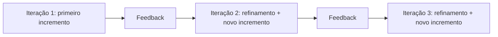
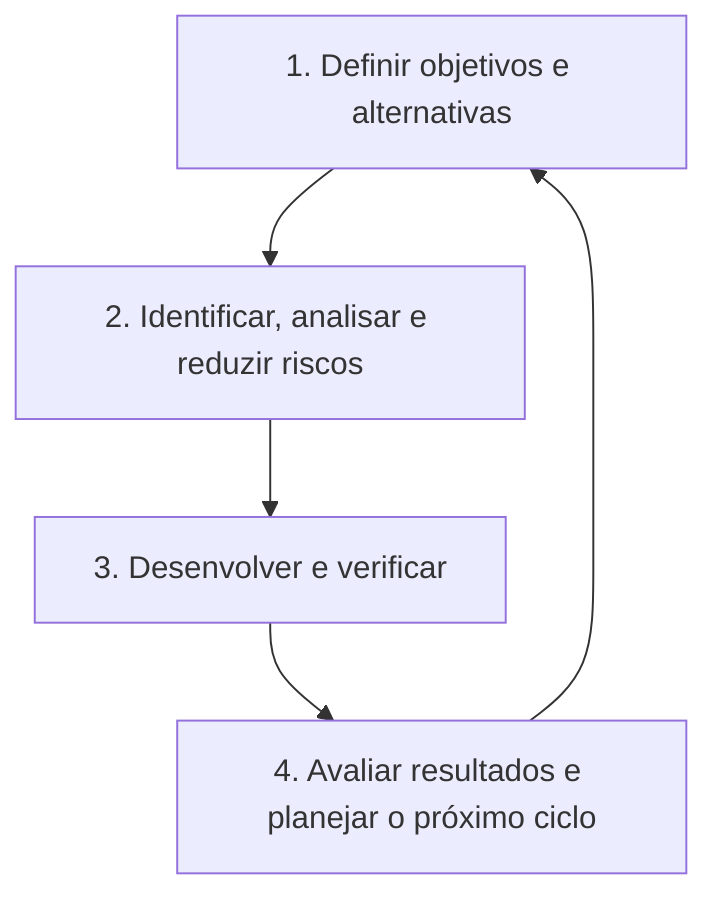
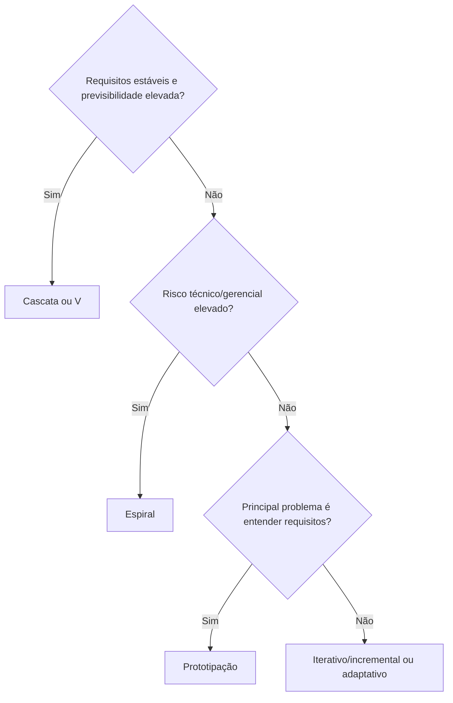

# 5.2 Ciclo de vida de sistemas e seus paradigmas

[[5.1 Levantamento análise e gerenciamento de requisitos|← 5.1 Requisitos]] | [[5.3 Uso de modelos metodologias técnicas e ferramentas de análise e projeto de sistemas|5.3 Análise e projeto →]]

> [!danger] Prioridade alta na CESGRANRIO
> A banca costuma apresentar um **cenário de projeto** e pedir o modelo de ciclo de vida mais adequado. As comparações mais importantes são: **cascata × incremental × iterativo**, **modelo V**, **prototipação** e **espiral**. RAD e RUP têm chance média.

## 1. Visão geral

O **ciclo de vida de um sistema** compreende sua trajetória completa, desde a ideia e o planejamento até a operação, manutenção e retirada de uso.

Um fluxo genérico contém:


Essas atividades aparecem em quase todos os modelos. O que muda é **a ordem, a sobreposição, a repetição e a forma de entrega**.

### 1.1 Conceitos que não são sinônimos

| Conceito | Significado |
|---|---|
| **Processo de software** | Conjunto estruturado de atividades para desenvolver, entregar e manter software. |
| **Ciclo de vida** | Todas as etapas pelas quais o sistema passa, da concepção à desativação. |
| **Modelo de ciclo de vida/processo** | Representação abstrata de como as atividades são organizadas e relacionadas. |
| **Metodologia** | Conjunto mais concreto de práticas, papéis, técnicas, artefatos e orientações. |
| **Paradigma de desenvolvimento** | Orientação geral adotada, como preditiva, iterativa, incremental, evolucionária ou adaptativa. |

> [!warning] Pegadinha CESGRANRIO
> **Ciclo de vida, modelo e metodologia não são a mesma coisa.** O ciclo de vida é a trajetória completa; o modelo organiza abstratamente as etapas; uma metodologia prescreve práticas mais concretas.

### 1.2 Escopo deste tópico

Aqui, “paradigmas” refere-se principalmente às formas de organizar o desenvolvimento. Os paradigmas **estruturado e orientado a objetos** serão aprofundados no item 5.3; testes, verificação e validação, no item 5.4.

---

## 2. O que você DEVE MANTER e REVISAR — o “coração” da CESGRANRIO

A CESGRANRIO tende a concentrar as questões deste tópico em cinco pilares:

1. **Cascata e sequenciamento das fases (Seção 4):** desenvolvimento predominantemente linear, com planejamento antecipado, documentação e marcos de aprovação. Ajusta-se melhor a requisitos estáveis. Mudanças tardias tendem a custar mais.

2. **Modelo V e associação entre desenvolvimento e testes (Seção 5):** cada nível de especificação ou projeto possui um nível de teste correspondente. A preparação dos testes começa cedo; eles não são simplesmente deixados para o final.

3. **Incremental × iterativo (Seção 6):** incremental acrescenta **novas parcelas funcionais**; iterativo **refina** uma solução por repetição e aprendizado. Um processo pode ser simultaneamente iterativo e incremental.

4. **Prototipação descartável × evolucionária (Seção 7):** o protótipo descartável serve para aprender e esclarecer requisitos; o evolucionário é refinado até integrar o produto. Protótipo não é automaticamente software pronto para produção.

5. **Espiral orientado a riscos (Seção 8):** cada ciclo envolve definição de objetivos, análise e redução de riscos, desenvolvimento e avaliação. O elemento distintivo é o **tratamento explícito dos riscos**.

> [!tip] Regra mental de prova
> **Previsibilidade → cascata. Correspondência desenvolvimento–teste → V. Entregas em partes → incremental. Refinamento → iterativo. Incerteza de requisitos → protótipo. Alto risco → espiral.**

---

## 3. Abordagens preditivas e adaptativas

### 3.1 Preditiva

Na abordagem preditiva, tenta-se definir antecipadamente o escopo, o cronograma e os custos. É adequada quando os requisitos são relativamente claros e estáveis ou quando existe forte necessidade de documentação, conformidade e controle.

### 3.2 Adaptativa

Na abordagem adaptativa, o planejamento e a solução evoluem com entregas frequentes e feedback. É indicada quando há maior incerteza ou mudança de requisitos.

### 3.3 Híbrida

Combina características preditivas e adaptativas. Um projeto pode, por exemplo, manter governança e marcos formais, mas desenvolver partes do produto em ciclos iterativos e incrementais.

> [!warning] Pegadinha CESGRANRIO
> Adaptativo **não significa ausência de planejamento, documentação ou controle**. Significa revisar esses elementos conforme o aprendizado e as mudanças.

---

## 4. Modelo em cascata

No modelo em cascata, as fases seguem uma progressão predominantemente sequencial. Em sua representação clássica, uma fase deve produzir resultados suficientes para a próxima.


### 4.1 Características

- planejamento e especificação antecipados;
- documentação e marcos bem definidos;
- maior facilidade de controle quando há estabilidade;
- feedback funcional e descoberta de problemas podem ocorrer tarde;
- mudanças tardias tendem a gerar retrabalho elevado.

### 4.2 Quando faz sentido

- requisitos conhecidos e pouco voláteis;
- tecnologia dominada;
- contratos ou regulações exigem entregáveis e aprovações formais.

> [!warning] Pegadinhas CESGRANRIO
> - Cascata não quer dizer que seja fisicamente impossível retornar a uma fase. Sua marca é a **progressão planejada e predominantemente sequencial**.
> - O modelo não é o mais indicado quando os requisitos mudam continuamente.

---

## 5. Modelo V

O modelo V destaca a relação entre as atividades de especificação/projeto, no lado esquerdo, e os respectivos níveis de teste, no lado direito.

```text
Requisitos do usuário              Teste de aceitação
        \                              /
 Requisitos do sistema          Teste de sistema
          \                        /
    Arquitetura              Teste de integração
            \                  /
      Projeto detalhado — Teste de unidade
                 \       /
                 Codificação
```

| Atividade de desenvolvimento | Teste relacionado |
|---|---|
| Requisitos do usuário/negócio | Teste de aceitação |
| Especificação do sistema | Teste de sistema |
| Arquitetura e interfaces | Teste de integração |
| Projeto detalhado dos componentes | Teste de unidade |

O lado esquerdo favorece a **verificação** dos artefatos; o lado direito executa testes para apoiar a **validação** e a verificação do produto. A distinção completa será estudada no item 5.4.

> [!warning] Pegadinha CESGRANRIO
> O modelo V não propõe pensar em testes apenas depois da codificação. Os testes correspondentes são **planejados desde as fases iniciais**.

---

## 6. Desenvolvimento incremental e iterativo

### 6.1 Incremental

O produto é entregue em **partes funcionais sucessivas**. Cada incremento acrescenta capacidade utilizável.

```text
Incremento 1: cadastro
Incremento 2: cadastro + pedidos
Incremento 3: cadastro + pedidos + faturamento
```

Vantagens: entrega antecipada de valor, priorização de funcionalidades e redução do impacto de uma entrega única.

### 6.2 Iterativo

A solução é construída por **repetições**, sendo revisada e aperfeiçoada a partir de feedback e aprendizado.

```text
Iteração 1: relatório básico
Iteração 2: melhora filtros e cálculos
Iteração 3: melhora desempenho e usabilidade
```

### 6.3 Podem coexistir



> [!warning] Pegadinha CESGRANRIO
> - **Incremental** responde principalmente: “que nova parte funcional foi adicionada?”
> - **Iterativo** responde principalmente: “o que foi revisto e aperfeiçoado em um novo ciclo?”
> - Os termos são relacionados, mas não são sinônimos.

### 6.4 Iteração, incremento e release

| Termo | Ideia central |
|---|---|
| **Iteração** | Ciclo de trabalho e aprendizado. |
| **Incremento** | Resultado integrado que acrescenta funcionalidade ao produto. |
| **Release** | Versão disponibilizada a usuários ou a um ambiente-alvo. |

Nem toda iteração precisa resultar em uma liberação externa, embora deva produzir algum resultado ou aprendizado relevante conforme o processo adotado.

---

## 7. Prototipação e modelo evolucionário

Um **protótipo** é uma representação inicial, parcial ou simplificada do sistema, utilizada para explorar alternativas, obter feedback e reduzir incertezas, especialmente sobre requisitos e interação.

### 7.1 Protótipo descartável (throwaway)

É criado rapidamente para esclarecer requisitos ou testar uma ideia e depois é descartado. O produto definitivo é construído com uma solução apropriada.

### 7.2 Protótipo evolucionário

Começa com uma versão inicial e a refina sucessivamente até que ela se torne parte ou base do sistema final.

| Tipo | Destino | Principal objetivo |
|---|---|---|
| Descartável | Não integra o produto final | Aprender e esclarecer requisitos |
| Evolucionário | É refinado rumo ao produto | Construir a solução progressivamente |

> [!warning] Pegadinhas CESGRANRIO
> - Protótipo descartável não deve ser transformado apressadamente em produção só porque “funcionou”.
> - Prototipação reduz incerteza, mas não elimina análise, projeto, testes ou cuidados de qualidade.

---

## 8. Modelo espiral

O modelo espiral é iterativo e orientado a **riscos**. Cada volta da espiral aprofunda o produto e trata as maiores incertezas.



Pode usar protótipos para reduzir riscos, mas não se confunde com prototipação. É mais justificável em projetos grandes, complexos, caros ou tecnologicamente incertos.

> [!warning] Pegadinhas CESGRANRIO
> - A característica definidora do espiral é a **análise explícita de riscos**, não apenas a repetição de ciclos.
> - O modelo não costuma ser a opção mais simples ou barata para projetos pequenos e de baixo risco.

---

## 9. RAD — Rapid Application Development

O RAD busca desenvolvimento rápido por meio de:

- forte participação do usuário;
- prototipação;
- ciclos curtos e **timeboxing**;
- reutilização de componentes;
- ferramentas que aceleram construção e integração.

É mais adequado quando o sistema pode ser modularizado, há disponibilidade dos usuários e os prazos são curtos. Pode ser inadequado quando existem riscos técnicos elevados, baixa modularidade ou indisponibilidade dos usuários.

> [!warning] Pegadinha CESGRANRIO
> RAD não é sinônimo de desenvolver “sem método”. A rapidez depende de ciclos delimitados, participação do usuário, ferramentas e reutilização.

---

## 10. RUP — Rational Unified Process

O RUP é um processo:

- **iterativo e incremental**;
- dirigido por **casos de uso**;
- centrado na **arquitetura**;
- orientado ao tratamento de **riscos**.

### 10.1 Fases

| Fase | Foco predominante |
|---|---|
| **Concepção (Inception)** | Visão, escopo, viabilidade e caso de negócio |
| **Elaboração (Elaboration)** | Arquitetura-base, requisitos relevantes e redução dos principais riscos |
| **Construção (Construction)** | Desenvolvimento dos incrementos e conclusão da capacidade planejada |
| **Transição (Transition)** | Entrega, implantação, treinamento e ajustes para os usuários |

As disciplinas, como requisitos, análise e projeto, implementação e testes, podem ocorrer em todas as fases, mas com intensidades diferentes.

> [!warning] Pegadinha CESGRANRIO
> As fases do RUP não correspondem, uma a uma, a “requisitos, projeto, código e testes”. O RUP é iterativo: várias disciplinas atravessam as fases.

---

## 11. Métodos ágeis e fluxo contínuo — visão introdutória

Abordagens ágeis favorecem colaboração com o cliente, resposta a mudanças, feedback frequente e entrega incremental de software funcional. Elas são geralmente **adaptativas, iterativas e incrementais**.

Em fluxo contínuo, o trabalho avança conforme a capacidade disponível, sem depender necessariamente de iterações de duração fixa. Scrum e Kanban serão aprofundados no item 2.1 do edital.

DevOps amplia a colaboração entre desenvolvimento e operações, empregando automação e feedback contínuo ao longo da entrega e operação. Os ambientes de desenvolvimento serão vistos no item 5.5.

> [!warning] Pegadinha CESGRANRIO
> Ágil não significa ausência de documentação, arquitetura, contrato ou planejamento. A ênfase está em produzir somente o necessário e adaptar o plano com base em feedback.

---

## 12. Manutenção no ciclo de vida

A manutenção começa depois da entrega e pode consumir grande parte do ciclo de vida do sistema.

| Tipo | Finalidade | Exemplo |
|---|---|---|
| **Corretiva** | Corrigir defeitos | Corrigir cálculo incorreto de imposto |
| **Adaptativa** | Adequar a mudanças externas | Ajustar o sistema a uma nova lei ou SGBD |
| **Perfectiva** | Melhorar funcionalidades, desempenho ou usabilidade | Otimizar uma consulta ou incluir um relatório |
| **Preventiva** | Reduzir problemas futuros e melhorar manutenibilidade | Refatorar código frágil antes de falhas |

> [!warning] Pegadinha CESGRANRIO
> Adaptação a uma nova regra externa é manutenção **adaptativa**; melhoria de desempenho é normalmente **perfectiva**; correção de defeito é **corretiva**.

---

## 13. Comparação para resolver questões por cenário

| Modelo/abordagem | Palavra-chave | Melhor indicação | Limitação típica |
|---|---|---|---|
| Cascata | Sequência e previsibilidade | Requisitos estáveis e controle formal | Mudanças tardias custosas |
| V | Desenvolvimento associado a testes | Necessidade de rastreabilidade e qualidade planejada | Menor flexibilidade diante de mudanças intensas |
| Incremental | Entregas em partes | Valor antecipado e priorização | Exige arquitetura e integração coerentes |
| Iterativo | Refinamento por ciclos | Aprendizado e feedback | Pode gerar retrabalho se mal controlado |
| Prototipação | Descoberta de requisitos | Requisitos incertos e interface relevante | Confundir protótipo com produto final |
| Espiral | Risco | Projetos grandes, complexos e arriscados | Gestão mais complexa e custosa |
| RAD | Rapidez e timeboxing | Sistemas modularizáveis e usuário disponível | Menos adequado a alto risco/baixa modularidade |
| RUP | Casos de uso, arquitetura e riscos | Projetos que precisam de processo iterativo configurável | Pode ficar pesado se aplicado sem adaptação |
| Ágil | Adaptação e feedback | Mudança frequente e entregas contínuas | Requer colaboração e disciplina |

### 13.1 Como escolher



Essa árvore é uma heurística de prova, não uma regra absoluta. Na prática, contexto organizacional, criticidade, regulação, equipe, tecnologia e contrato também influenciam a escolha.

---

## 14. Prioridade de estudo

### Alta frequência/probabilidade na CESGRANRIO

- cascata e suas limitações;
- modelo V e correspondência entre fases e testes;
- diferença entre incremental e iterativo;
- protótipo descartável e evolucionário;
- espiral e análise de riscos;
- identificação do modelo adequado a um cenário.

### Chance média

- RAD e timeboxing;
- fases e características do RUP;
- abordagens preditiva, adaptativa e híbrida;
- tipos de manutenção;
- distinção entre processo, ciclo de vida, modelo e metodologia.

### Apenas reconhecimento neste momento

- detalhes de Scrum e Kanban — item 2.1;
- análise estruturada e orientação a objetos — item 5.3;
- técnicas detalhadas de verificação, validação e testes — item 5.4;
- ferramentas e ambientes de desenvolvimento — item 5.5.

---

## 15. Checklist de revisão

- [ ] Sei diferenciar processo, ciclo de vida, modelo e metodologia.
- [ ] Reconheço quando o cascata é adequado e qual sua principal limitação.
- [ ] Consigo associar as etapas do modelo V aos níveis de teste.
- [ ] Sei explicar, com exemplo, incremental × iterativo.
- [ ] Diferencio protótipo descartável de evolucionário.
- [ ] Associo imediatamente o modelo espiral à análise de riscos.
- [ ] Conheço timeboxing e participação do usuário no RAD.
- [ ] Memorizei as quatro fases e as três características centrais do RUP.
- [ ] Distingo manutenção corretiva, adaptativa, perfectiva e preventiva.

---

## 16. Questões inéditas — estilo CESGRANRIO

### Questão 1

Uma empresa pretende construir um sistema de apoio à operação de uma nova unidade industrial. A tecnologia ainda não foi utilizada pela organização, falhas podem gerar perdas elevadas e os requisitos serão aprofundados ao longo do projeto. A direção deseja que, em cada ciclo, sejam comparadas alternativas, avaliados riscos e produzida uma versão mais completa do sistema.

O modelo de ciclo de vida mais adequado ao cenário é o

A) cascata, por estabelecer fases estritamente sequenciais e eliminar incertezas.  
B) modelo V, por concentrar os testes após a conclusão da codificação.  
C) espiral, por organizar ciclos orientados à identificação e à redução de riscos.  
D) protótipo descartável, porque sua implementação deverá necessariamente tornar-se o produto final.  
E) incremental, porque todo desenvolvimento por incrementos possui análise formal de riscos como elemento central.

**Gabarito: C.**

**Comentário:** alto risco, tecnologia incerta e avaliação de alternativas a cada ciclo apontam para o **modelo espiral**. A letra B erra porque o modelo V planeja os testes desde cedo. A D troca o protótipo descartável pelo evolucionário. A E atribui a qualquer processo incremental uma característica distintiva do espiral.

### Questão 2

Uma equipe entregou inicialmente o módulo de cadastro de clientes. No ciclo seguinte, aperfeiçoou esse módulo com base no feedback dos usuários e acrescentou o módulo de pedidos. Nesse caso, o desenvolvimento é

A) exclusivamente iterativo, pois não houve nova funcionalidade.  
B) exclusivamente incremental, pois o módulo anterior não foi alterado.  
C) iterativo e incremental, pois houve refinamento e acréscimo funcional.  
D) em cascata, pois cada módulo corresponde necessariamente a uma fase.  
E) baseado no modelo V, pois cada incremento equivale a um nível de teste.

**Gabarito: C.**

**Comentário:** o aperfeiçoamento do cadastro caracteriza **iteração**; a inclusão do módulo de pedidos caracteriza **incremento**. Os dois paradigmas podem coexistir, uma distinção frequentemente explorada em prova.

---

## 17. Resumo final

> [!summary] Revisão de véspera
> - **Cascata:** sequência planejada; melhor com requisitos estáveis; mudança tardia custa caro.
> - **V:** especificação/projeto de um lado e testes correspondentes do outro; testes são planejados cedo.
> - **Incremental:** adiciona partes funcionais. **Iterativo:** refina por repetição. Podem coexistir.
> - **Protótipo descartável:** serve para aprender e é abandonado. **Evolucionário:** é refinado rumo ao produto.
> - **Espiral:** ciclos orientados à análise e redução de riscos.
> - **RAD:** rapidez, timeboxing, prototipação, reutilização e usuário presente.
> - **RUP:** iterativo e incremental, dirigido por casos de uso, centrado na arquitetura e orientado a riscos; fases: concepção, elaboração, construção e transição.
> - **Manutenção:** corretiva corrige; adaptativa acompanha o ambiente; perfectiva melhora; preventiva evita problemas futuros.

