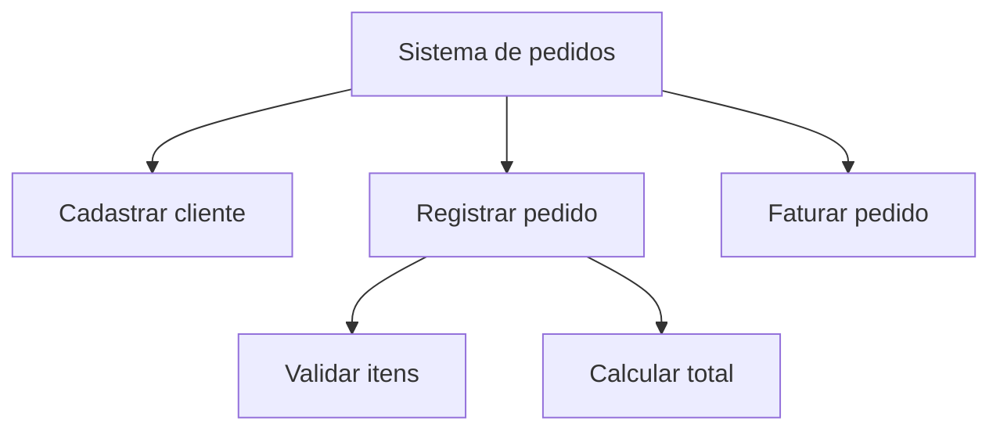
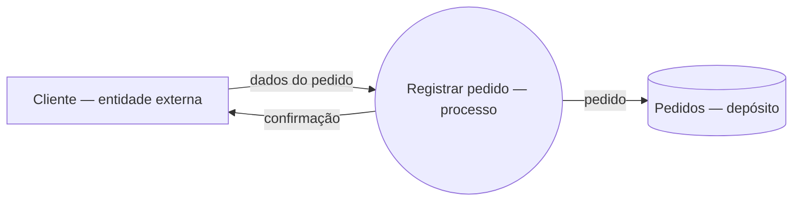
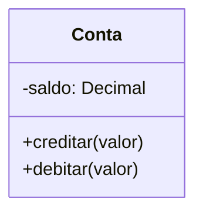
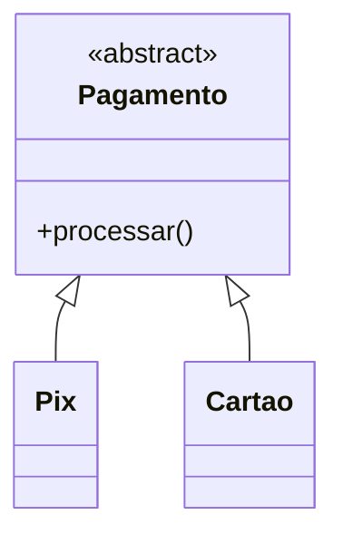
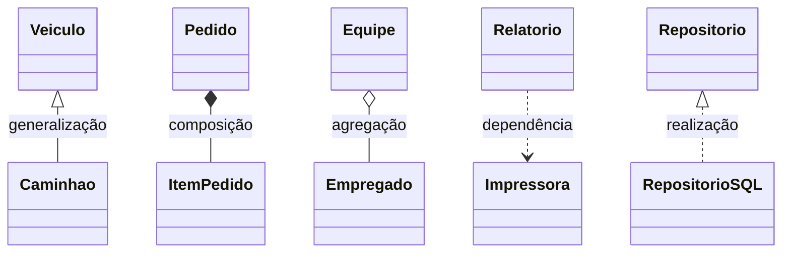
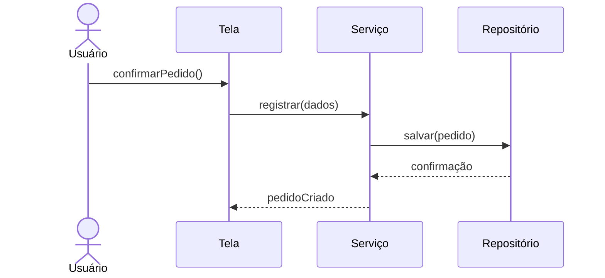
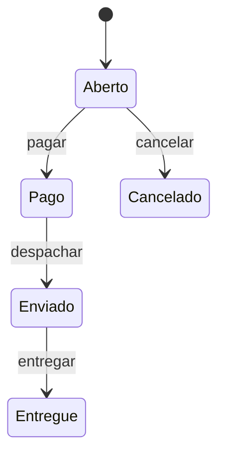

# 5.3 — Modelos, metodologias, técnicas e ferramentas de análise e projeto de sistemas

[[5.1 Levantamento análise e gerenciamento de requisitos|← Requisitos]] · [[5.2 Ciclo de vida de sistemas e seus paradigmas|← Ciclo de vida]] · [[5.4 Verificação validação e teste|Verificação, validação e teste →]]

> [!danger] Prioridade CESGRANRIO: **ALTA**
> Há cobrança de UML e conceitos de orientação a objetos. Priorize a finalidade de cada diagrama, associação × agregação × composição, generalização, encapsulamento, coesão/acoplamento e a comparação entre análise estruturada e OO.

## O que você DEVE MANTER e REVISAR — o “coração” da CESGRANRIO

1. **Estruturado × orientado a objetos (Seções 3 e 6):** o estruturado decompõe funções/processos e mantém dados e processos mais separados; OO organiza o sistema em objetos que combinam estado e comportamento.
2. **DFD (Seção 4):** mostra fluxo e transformação de dados por processos, depósitos, entidades externas e fluxos. **Pegadinha:** DFD não representa sequência temporal nem controle de execução.
3. **Princípios OO (Seção 7):** abstração, encapsulamento, herança e polimorfismo. Encapsular é ocultar decisões internas por uma interface, não apenas agrupar atributos.
4. **Relações UML (Seção 9):** composição implica vínculo forte e ciclo de vida dependente; agregação é todo–parte fraca; generalização representa “é um”.
5. **Finalidade dos diagramas UML (Seções 10 e 11):** classes = estrutura; casos de uso = objetivos dos atores; sequência = mensagens no tempo; atividade = fluxo; estados = ciclo de vida; componentes = módulos; implantação = distribuição física.

> [!tip] Regra mental de prova
> **Estruturado pergunta “quais funções transformam os dados?”; OO pergunta “quais objetos colaboram e quais responsabilidades possuem?”.**

## 1. Análise × projeto

| Etapa | Pergunta predominante | Resultado |
|---|---|---|
| **Análise** | O que o sistema deve fazer e quais conceitos existem? | Modelo do problema, requisitos e responsabilidades |
| **Projeto/design** | Como a solução será estruturada para atender ao problema? | Arquitetura, componentes, interfaces, classes e decisões técnicas |

> [!warning] Pegadinha CESGRANRIO
> Análise e projeto podem ocorrer iterativamente. A distinção é de **foco**, não uma proibição de voltar ou refinar decisões.

## 2. Modelo, metodologia, técnica e ferramenta

| Termo | Significado | Exemplo |
|---|---|---|
| **Modelo** | Representação simplificada de um aspecto do sistema | Diagrama de classes |
| **Metodologia/método** | Orientação organizada de processo, práticas e artefatos | Método estruturado, processo unificado |
| **Técnica** | Procedimento para executar uma atividade | Tabela de decisão, análise de cenários |
| **Notação** | Convenção visual/textual de representação | UML, símbolos de DFD |
| **Ferramenta** | Software que apoia a execução | Ferramenta CASE, modelador UML |

Um modelo não é o sistema real; destaca determinados aspectos e omite outros.

## 3. Paradigma estruturado

A análise estruturada enfoca **processos, funções e fluxos de dados**, usando decomposição hierárquica do sistema.



Características:

- decomposição top-down;
- separação entre processos e dados;
- refinamento progressivo;
- foco no fluxo de informações;
- especificação de processos e regras.

## 4. Diagrama de Fluxo de Dados — DFD

Elementos conceituais:

| Elemento | Função |
|---|---|
| **Processo** | Transforma dados de entrada em saída |
| **Fluxo de dados** | Dados que circulam entre elementos |
| **Depósito de dados** | Dados mantidos para uso posterior |
| **Entidade externa** | Origem ou destino fora do sistema modelado |



### 4.1 Diagrama de contexto e níveis

O **diagrama de contexto** representa o sistema como um único processo e mostra suas interações externas. Nos níveis seguintes, esse processo é decomposto.

O **balanceamento** exige que entradas e saídas externas preservadas na decomposição sejam compatíveis com o processo-pai.

### 4.2 Regras e pegadinhas

- fluxo deve ter nome substantivo que represente dados;
- processo deve transformar dados e costuma receber nome verbal;
- entidade externa não acessa diretamente depósito;
- depósito não troca dados diretamente com outro depósito;
- DFD lógico descreve o que ocorre, sem necessariamente indicar tecnologia;
- DFD não mostra ordem cronológica como um fluxograma de controle.

> [!warning] Pegadinha CESGRANRIO
> DFD mostra **fluxo de dados**, não fluxo de controle, algoritmo, decisão temporal ou estrutura organizacional.

## 5. Outras técnicas estruturadas

### 5.1 Dicionário de dados

Define fluxos, depósitos e elementos: nome, significado, estrutura, domínio e aliases. Complementa o DFD e reduz ambiguidades.

### 5.2 Especificação de processos

Processos elementares podem ser detalhados por:

- português estruturado/pseudocódigo;
- tabelas de decisão;
- árvores de decisão.

### 5.3 Tabela × árvore de decisão

| Técnica | Melhor uso |
|---|---|
| **Tabela de decisão** | Combinações de condições e ações, verificando regras completas |
| **Árvore de decisão** | Sequência visual de decisões e caminhos |

### 5.4 Diagrama entidade-relacionamento

Modela entidades, atributos e relacionamentos dos dados. É complementar ao DFD: o DER enfoca a estrutura dos dados; o DFD, suas transformações e movimentos.

## 6. Paradigma orientado a objetos

Um **objeto** possui:

- identidade;
- estado, representado por atributos;
- comportamento, representado por operações/métodos.



| Conceito | Definição |
|---|---|
| **Classe** | Descrição de um conjunto de objetos com estrutura e comportamento comuns |
| **Objeto/instância** | Ocorrência concreta de uma classe |
| **Atributo** | Estado mantido pelo objeto |
| **Método/operação** | Comportamento ou serviço do objeto |
| **Mensagem** | Solicitação enviada a um objeto para executar comportamento |

> [!warning] Pegadinha CESGRANRIO
> Classe é a abstração/tipo; objeto é a instância concreta. Objetos distintos podem possuir os mesmos valores e continuar tendo identidades diferentes.

## 7. Pilares da orientação a objetos

### 7.1 Abstração

Seleciona características relevantes e ignora detalhes desnecessários ao contexto.

### 7.2 Encapsulamento

Oculta representação e decisões internas, expondo serviços por uma interface controlada. Favorece baixo acoplamento e proteção de invariantes.

### 7.3 Herança

Permite que uma classe mais específica reutilize e especialize características de uma classe mais geral.

### 7.4 Polimorfismo

Permite tratar objetos por uma abstração comum, com comportamento correspondente ao tipo concreto.



> [!warning] Pegadinhas CESGRANRIO
> - Herança representa relação **“é um”**, não simples “tem um”.
> - Polimorfismo não é apenas dar nomes diferentes a operações; é permitir múltiplas implementações sob uma interface comum.
> - Encapsulamento não exige que absolutamente tudo seja privado; exige controle da exposição.

## 8. Coesão, acoplamento e responsabilidade

- **Alta coesão:** elementos de um módulo/classe colaboram para um propósito bem definido.
- **Baixo acoplamento:** módulos dependem pouco de detalhes internos uns dos outros.

Objetivo geral:

```text
ALTA COESÃO + BAIXO ACOPLAMENTO
```

Isso tende a melhorar compreensão, testes, manutenção e substituição de componentes.

> [!warning] Pegadinha CESGRANRIO
> Baixo acoplamento não significa ausência completa de dependências. Sistemas precisam colaborar; a meta é reduzir dependências desnecessárias e instáveis.

## 9. Relações entre classes na UML

| Relação | Significado | Notação conceitual |
|---|---|---|
| **Associação** | Vínculo estrutural entre objetos | linha |
| **Agregação** | Todo–parte fraca; parte pode existir separadamente | losango vazio no todo |
| **Composição** | Todo–parte forte; parte depende do ciclo de vida do todo | losango preenchido no todo |
| **Generalização** | Especialização/herança — “é um” | triângulo vazio apontando ao geral |
| **Dependência** | Uso temporário ou dependência de mudança | seta tracejada |
| **Realização** | Classe implementa contrato/interface | tracejada com triângulo vazio |



### 9.1 Multiplicidade

| Notação | Significado |
|---|---|
| `1` | exatamente um |
| `0..1` | zero ou um |
| `*` ou `0..*` | zero ou muitos |
| `1..*` | um ou muitos |
| `m..n` | intervalo definido |

## 10. UML — visão geral

A **Unified Modeling Language** é uma linguagem de modelagem visual padronizada. Ela não é, por si só, processo de desenvolvimento, metodologia ou linguagem de programação.

### 10.1 Diagramas estruturais

| Diagrama | Mostra |
|---|---|
| **Classes** | Classes, atributos, operações e relacionamentos |
| **Objetos** | Instâncias e ligações em um momento específico |
| **Componentes** | Componentes e dependências/interfaces |
| **Implantação** | Nós físicos/ambientes e artefatos implantados |
| **Pacotes** | Agrupamentos e dependências |
| **Estrutura composta** | Estrutura interna e colaboração de partes |

### 10.2 Diagramas comportamentais

| Diagrama | Mostra |
|---|---|
| **Casos de uso** | Objetivos dos atores e serviços do sistema |
| **Atividades** | Fluxos de trabalho, decisões e paralelismo |
| **Máquina de estados** | Estados e transições no ciclo de vida de uma entidade |
| **Sequência** | Mensagens entre participantes ao longo do tempo |
| **Comunicação** | Interações com ênfase nas ligações entre participantes |

> [!warning] Pegadinhas CESGRANRIO
> - Caso de uso não descreve estrutura de classes.
> - Diagrama de sequência enfatiza **ordem temporal das mensagens**.
> - Atividade enfatiza fluxo de trabalho; estados enfatiza mudanças de estado de um objeto.
> - Implantação mostra topologia de execução; componentes mostra organização de módulos de software.

## 11. Diagramas mais cobrados

### 11.1 Caso de uso

Elementos: ator, caso de uso, fronteira do sistema e relações.

- `<<include>>`: comportamento obrigatório reutilizado pelo caso base;
- `<<extend>>`: comportamento adicional executado sob condição, em ponto de extensão;
- generalização: especialização de ator ou caso de uso.

> [!warning] Pegadinha CESGRANRIO
> `include` não significa opcional; `extend` não é sequência obrigatória. Ator é um **papel externo**, não necessariamente uma pessoa específica.

### 11.2 Classes

Representa visão estática de classes, atributos, operações e relações. Pode ser usado conceitualmente na análise e com detalhes técnicos no projeto.

### 11.3 Sequência



O tempo progride de cima para baixo; mensagens mostram colaboração entre linhas de vida.

### 11.4 Atividade

Mostra ações, decisões, junções e paralelismo. É adequada para processos de negócio e fluxos algorítmicos.

### 11.5 Máquina de estados

Adequada quando o comportamento depende do estado atual.



## 12. Ferramentas CASE

**CASE — Computer-Aided Software Engineering** são ferramentas que automatizam ou apoiam atividades de engenharia de software.

| Categoria | Apoio predominante |
|---|---|
| **Upper CASE** | Planejamento, requisitos, análise e projeto |
| **Lower CASE** | Implementação, testes e manutenção |
| **Integrated CASE** | Integra várias etapas do ciclo de vida |

Recursos: modelagem, repositório, rastreabilidade, validação de consistência, documentação e geração/engenharia reversa de código.

> [!warning] Pegadinha CESGRANRIO
> CASE apoia e automatiza atividades, mas não substitui análise, decisão arquitetural ou comunicação com as partes interessadas.

## 13. Estruturado × OO — comparação final

| Critério | Estruturado | Orientado a objetos |
|---|---|---|
| Unidade principal | Processo/função | Objeto/classe |
| Dados e comportamento | Mais separados | Encapsulados no objeto |
| Decomposição | Funcional, top-down | Responsabilidades e colaborações |
| Modelo típico | DFD | UML |
| Dados | DER e dicionário | Atributos, associações e objetos |
| Reutilização | Funções/módulos | Composição, interfaces, classes |

Os paradigmas podem coexistir em uma organização; técnicas de um não tornam automaticamente inválidas as do outro.

## 14. Prioridade de estudo

### Alta frequência/probabilidade

- estruturado × OO;
- componentes e regras do DFD;
- abstração, encapsulamento, herança e polimorfismo;
- coesão × acoplamento;
- associação, agregação, composição e generalização;
- finalidade dos diagramas UML;
- `include` × `extend`;
- multiplicidade.

### Chance média

- análise × projeto;
- dicionário, tabela e árvore de decisão;
- diagramas de objetos, pacotes, componentes e implantação;
- CASE: upper, lower e integrated;
- balanceamento de DFD.

## 15. Checklist de revisão

- [ ] DFD mostra fluxo e transformação de dados, não controle temporal.
- [ ] DER modela dados; DFD modela fluxo e transformação.
- [ ] Classe é tipo; objeto é instância.
- [ ] Encapsulamento oculta decisões internas por interface controlada.
- [ ] Herança é “é um”; composição/agregação são “tem parte”.
- [ ] Composição possui vínculo de ciclo de vida mais forte.
- [ ] Alta coesão e baixo acoplamento são desejáveis.
- [ ] Classes = estrutura; sequência = mensagens no tempo.
- [ ] Atividade = fluxo; estados = ciclo de vida de objeto.
- [ ] Componentes = módulos; implantação = nós físicos.
- [ ] `include` é reutilização obrigatória; `extend` é condicional.
- [ ] UML é notação, não metodologia.

## 16. Questões inéditas — estilo CESGRANRIO

### 16.1 Questão 1

Em um modelo UML, `Pedido` mantém seus `ItensPedido`, os quais não fazem sentido isoladamente e são destruídos quando o pedido é removido. A relação mais adequada é

A) dependência.  
B) generalização.  
C) agregação compartilhada.  
D) composição.  
E) realização.

> [!success]- Gabarito comentado
> **Resposta: D.** A composição representa relação todo–parte forte, com dependência de ciclo de vida. O losango preenchido fica no lado do todo, `Pedido`. Agregação é mais fraca e permite existência independente da parte.

### 16.2 Questão 2

Uma equipe precisa representar as mensagens trocadas entre tela, serviço e repositório durante a confirmação de um pedido, enfatizando sua ordem temporal.

O diagrama UML mais apropriado é o de

A) classes.  
B) implantação.  
C) sequência.  
D) pacotes.  
E) componentes.

> [!success]- Gabarito comentado
> **Resposta: C.** O diagrama de sequência representa linhas de vida e mensagens ordenadas no tempo. Classes mostra estrutura; componentes, módulos; implantação, distribuição física; pacotes, agrupamentos.

## 17. Resumo de véspera

```text
ESTRUTURADO = processos + fluxos + depósitos + entidades externas
DFD = fluxo de DADOS, não controle temporal
DER = estrutura dos dados
OO = objetos com identidade + estado + comportamento
ABSTRAÇÃO = selecionar o essencial
ENCAPSULAMENTO = ocultar interior por interface
HERANÇA = “é um”
POLIMORFISMO = mesma abstração, comportamentos concretos
ALTA COESÃO + BAIXO ACOPLAMENTO
AGREGAÇÃO = todo–parte fraca
COMPOSIÇÃO = todo–parte forte e ciclo dependente
UML = notação, não metodologia
CLASSES = estrutura; SEQUÊNCIA = tempo; ATIVIDADE = fluxo
ESTADOS = ciclo do objeto; COMPONENTES = módulos; IMPLANTAÇÃO = nós
INCLUDE = obrigatório/reutilizado; EXTEND = condicional
CASE = apoio automatizado à engenharia de software
```
