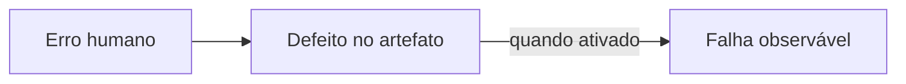
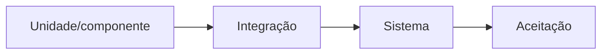
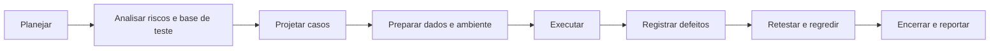

# 5.4 — Verificação, validação e teste

[[5.3 Uso de modelos metodologias técnicas e ferramentas de análise e projeto de sistemas|← Análise e projeto]] · [[5.5 Ambientes de desenvolvimento de software|Ambientes de desenvolvimento →]]

> [!danger] Prioridade CESGRANRIO: **ALTA**
> Há cobrança direta. Priorize verificação × validação, níveis de teste, caixa-preta × caixa-branca, particionamento de equivalência, valor-limite, integração top-down/bottom-up, regressão × reteste e testes funcionais × não funcionais.

## O que você DEVE MANTER e REVISAR — o “coração” da CESGRANRIO

1. **Verificação × validação (Seção 2):** verificação pergunta se construímos corretamente conforme especificações; validação pergunta se construímos o produto certo para a necessidade.
2. **Estático × dinâmico (Seção 3):** revisão e análise estática não executam o software; teste dinâmico executa código. **Pegadinha:** verificação não é exclusivamente estática, nem validação exclusivamente dinâmica.
3. **Níveis de teste (Seção 5):** unidade testa componentes; integração testa interfaces; sistema testa o conjunto; aceitação avalia necessidades e critérios do usuário/negócio.
4. **Técnicas (Seções 8 e 9):** caixa-preta deriva casos da especificação; caixa-branca usa a estrutura interna. Valores-limite complementam classes de equivalência.
5. **Regressão × reteste (Seção 11):** reteste confirma a correção do defeito; regressão procura efeitos colaterais em partes antes funcionais.

> [!tip] Regra mental de prova
> **Verificação = produto conforme especificação. Validação = produto atende ao uso. Reteste olha o conserto; regressão olha o entorno.**

## 1. Conceitos fundamentais

| Conceito | Definição |
|---|---|
| **Erro humano (mistake)** | Ação humana que produz resultado incorreto |
| **Defeito/falha interna (defect/fault)** | Problema inserido em artefato ou código |
| **Falha observada (failure)** | Comportamento incorreto manifestado durante execução |
| **Caso de teste** | Entradas, precondições, ações e resultado esperado |
| **Oráculo de teste** | Fonte usada para decidir qual resultado é correto |
| **Suíte de testes** | Conjunto organizado de casos de teste |



Um defeito pode existir sem produzir falha em toda execução; depende do caminho e das condições que o ativam.

## 2. Verificação × validação

### 2.1 Verificação

Avalia se artefatos e produto estão consistentes com requisitos, especificações, padrões e decisões técnicas.

```text
“Estamos construindo o produto corretamente?”
```

Exemplos: revisão de requisito, inspeção de projeto, análise estática e teste de conformidade com uma especificação.

### 2.2 Validação

Avalia se o produto atende às necessidades, ao uso pretendido e às expectativas das partes interessadas.

```text
“Estamos construindo o produto certo?”
```

Exemplos: protótipo avaliado pelo usuário, teste de aceitação e demonstração em cenário realista.

| Verificação | Validação |
|---|---|
| Conformidade com especificação | Adequação à necessidade e ao uso |
| Pode avaliar artefatos intermediários | Enfatiza produto e valor para o usuário |
| Pode ser estática ou dinâmica | Pode empregar execução e outras avaliações |

> [!warning] Pegadinha CESGRANRIO
> As frases mnemônicas ajudam, mas não crie equivalências absolutas: **verificação não é sinônimo obrigatório de teste estático**, e validação não se limita a uma única fase final.

## 3. Testes estáticos × dinâmicos

### 3.1 Estáticos

Avaliam artefatos sem executar o software:

- revisão informal;
- walkthrough;
- revisão técnica;
- inspeção;
- análise estática automatizada.

Podem encontrar ambiguidades, inconsistências, violações de padrão, vulnerabilidades e defeitos antes da execução.

### 3.2 Dinâmicos

Executam o software ou componente com entradas e condições definidas, comparando resultado obtido e esperado.

> [!warning] Pegadinha CESGRANRIO
> Compilação e análise de código por ferramenta podem revelar defeitos sem executar a lógica da aplicação; isso pertence ao campo estático. Teste dinâmico exige execução.

## 4. Revisões

| Tipo | Característica geral |
|---|---|
| **Revisão informal** | Pouca formalidade e preparação |
| **Walkthrough** | Autor conduz participantes pelo artefato |
| **Revisão técnica** | Pares avaliam aspectos técnicos e alternativas |
| **Inspeção** | Processo formal, papéis, critérios, registro de defeitos e acompanhamento |

> [!warning] Pegadinha CESGRANRIO
> Revisões podem avaliar requisitos, modelos, código, casos de teste e documentação. Elas não se restringem ao código-fonte.

## 5. Níveis de teste



### 5.1 Unidade ou componente

Testa a menor unidade isolável, como função, classe ou módulo. Geralmente é executado próximo ao desenvolvimento e pode usar dublês.

### 5.2 Integração

Testa interfaces e interações entre componentes, serviços, subsistemas ou sistemas.

### 5.3 Sistema

Testa o sistema completo contra requisitos funcionais e não funcionais em ambiente representativo.

### 5.4 Aceitação

Avalia se a solução está pronta e atende critérios de negócio, contrato ou usuário.

| Variação | Característica |
|---|---|
| **Aceitação do usuário — UAT** | Usuários/negócio avaliam necessidades e processos |
| **Alfa** | Avaliação controlada no ambiente ou supervisão do produtor |
| **Beta** | Avaliação por usuários externos em condições reais, antes da liberação geral |

> [!warning] Pegadinhas CESGRANRIO
> - Integração procura defeitos de **interface e colaboração**, não apenas defeitos internos de uma unidade.
> - Sistema não é sinônimo de aceitação: o primeiro compara o conjunto aos requisitos; o segundo enfatiza prontidão e necessidades do usuário/negócio.

## 6. Integração: estratégias e dublês

| Estratégia | Ordem | Dublê mais associado |
|---|---|---|
| **Top-down** | Módulos superiores antes dos inferiores | **Stub** substitui módulo inferior chamado |
| **Bottom-up** | Módulos inferiores antes dos superiores | **Driver** simula módulo superior chamador |
| **Big bang** | Integra tudo de uma vez | Dificulta isolar a origem de defeitos |

### 6.1 Outros dublês de teste

| Dublê | Função simplificada |
|---|---|
| **Dummy** | Apenas preenche parâmetro, sem comportamento relevante |
| **Stub** | Fornece respostas programadas |
| **Spy** | Registra como foi utilizado |
| **Mock** | Verifica interações esperadas |
| **Fake** | Implementação funcional simplificada, como repositório em memória |

> [!warning] Pegadinha CESGRANRIO
> **Top-down usa stubs; bottom-up usa drivers.** Essa inversão é clássica em prova.

## 7. Testes funcionais × não funcionais

### 7.1 Funcionais

Avaliam **o que** o sistema faz: regras, cálculos, fluxos e funções especificadas.

### 7.2 Não funcionais

Avaliam **como** o sistema se comporta:

- desempenho;
- segurança;
- usabilidade;
- confiabilidade;
- compatibilidade;
- portabilidade;
- acessibilidade;
- recuperação.

### 7.3 Desempenho

| Tipo | Objetivo |
|---|---|
| **Carga** | Avaliar sob volume esperado e variações previstas |
| **Estresse** | Levar além dos limites para observar ruptura e recuperação |
| **Volume** | Avaliar grande quantidade de dados |
| **Endurance/soak** | Manter carga por longo período |
| **Escalabilidade** | Avaliar resposta ao acréscimo de recursos/carga |

> [!warning] Pegadinha CESGRANRIO
> Carga mede comportamento em níveis esperados; estresse ultrapassa limites. Não são sinônimos.

## 8. Técnicas caixa-preta

Derivam casos a partir de especificações e comportamento externo, sem depender da estrutura do código.

### 8.1 Particionamento de equivalência

Divide entradas em classes que deveriam ser tratadas de maneira semelhante, escolhendo representantes.

Exemplo: idade permitida de 18 a 65 anos.

```text
Classe inválida: idade < 18
Classe válida:   18 ≤ idade ≤ 65
Classe inválida: idade > 65
```

### 8.2 Análise de valor-limite

Testa valores nas fronteiras e próximos a elas. Para 18 a 65:

```text
17, 18, 19, 64, 65, 66
```

### 8.3 Tabela de decisão

Adequada a combinações de condições e regras de negócio.

### 8.4 Transição de estados

Adequada quando resposta depende do estado atual e do evento.

### 8.5 Teste baseado em casos de uso

Deriva cenários dos fluxos principal e alternativos.

> [!warning] Pegadinha CESGRANRIO
> Equivalência reduz o número de testes representando classes; valor-limite explora as bordas onde defeitos são frequentes.

## 9. Técnicas caixa-branca

Usam conhecimento da estrutura interna do código.

| Cobertura | O que busca executar |
|---|---|
| **Instruções** | Cada instrução executável |
| **Decisões/ramos** | Cada resultado possível das decisões |
| **Condições** | Resultados verdadeiro/falso de condições individuais |
| **Caminhos** | Caminhos de execução selecionados |

### 9.1 Relação de força

Em geral, 100% de cobertura de ramos implica cobertura de instruções, mas 100% de instruções não garante que todos os ramos foram exercitados.

```java
if (saldo >= valor) {
    debitar(valor);
}
```

Executar apenas com condição verdadeira cobre as instruções internas, mas não exercita o resultado falso da decisão.

> [!warning] Pegadinhas CESGRANRIO
> - Cobertura alta não prova ausência de defeitos nem correção dos resultados.
> - Cobertura exaustiva de caminhos pode ser inviável por laços e combinações.

## 10. Técnica baseada na experiência

- **error guessing:** casos derivados da experiência sobre erros prováveis;
- **teste exploratório:** aprendizagem, projeto e execução evoluem conjuntamente;
- **checklist:** verificações baseadas em listas acumuladas.

Teste exploratório não significa teste aleatório ou sem disciplina; pode ter missão, tempo delimitado e registro de descobertas.

## 11. Reteste, regressão, smoke e sanity

| Teste | Objetivo |
|---|---|
| **Reteste/confirmação** | Executar novamente o caso que falhou para confirmar a correção |
| **Regressão** | Verificar se mudanças afetaram funcionalidades existentes |
| **Smoke** | Conjunto amplo e superficial para verificar estabilidade básica de uma build |
| **Sanity** | Verificação mais focada de uma mudança ou área antes de testes extensos |

> [!warning] Pegadinha CESGRANRIO
> Corrigir A e executar novamente o teste de A é reteste. Executar B, C e D para verificar efeitos colaterais é regressão.

## 12. Processo de teste



### 12.1 Plano e caso de teste

O plano define escopo, abordagem, recursos, ambiente, riscos, cronograma e critérios. O caso especifica condições, dados, passos e resultado esperado.

### 12.2 Critérios de entrada e saída

- entrada: condições mínimas para iniciar uma atividade;
- saída: condições para considerá-la suficiente ou encerrada.

### 12.3 Rastreabilidade

Liga requisitos a casos, resultados e defeitos, permitindo medir cobertura e impacto de mudanças.

## 13. Princípios importantes

- testes mostram a presença de defeitos, não sua ausência;
- teste exaustivo é normalmente impossível;
- testar cedo reduz custo de correção;
- defeitos tendem a se concentrar em poucos módulos;
- repetir sempre os mesmos testes reduz sua capacidade de encontrar novos defeitos — paradoxo do pesticida;
- teste depende do contexto;
- ausência de defeitos não ajuda se o produto não atender à necessidade — falácia da ausência de erros.

## 14. Automação, TDD e pirâmide — reconhecimento

Automação é valiosa em testes repetitivos, regressão e pipeline, mas requer manutenção e não substitui toda avaliação humana.

No **TDD**:

```text
Red → escrever teste que falha
Green → implementar o mínimo para passar
Refactor → melhorar preservando os testes verdes
```

A pirâmide de testes sugere muitos testes de unidade rápidos, menos testes de integração e ainda menos testes ponta a ponta, mais lentos e frágeis. É uma heurística, não quantidade universal.

## 15. Prioridade de estudo

### Alta frequência/probabilidade

- verificação × validação;
- estático × dinâmico;
- unidade, integração, sistema e aceitação;
- top-down/stub × bottom-up/driver;
- funcional × não funcional;
- equivalência × valor-limite;
- caixa-preta × caixa-branca;
- regressão × reteste;
- carga × estresse.

### Chance média

- inspeção, walkthrough e revisão técnica;
- coberturas de instrução, ramo e condição;
- alfa × beta;
- smoke × sanity;
- dublês de teste;
- princípios de teste, TDD e automação.

## 16. Checklist de revisão

- [ ] Verificação = conformidade; validação = adequação à necessidade.
- [ ] Teste estático não executa o software.
- [ ] Unidade → integração → sistema → aceitação.
- [ ] Integração testa interfaces.
- [ ] Top-down usa stub; bottom-up usa driver.
- [ ] Caixa-preta usa especificação; caixa-branca usa estrutura.
- [ ] Equivalência escolhe representantes; limite testa bordas.
- [ ] 100% de instruções não garante 100% de ramos.
- [ ] Reteste confirma correção; regressão busca efeitos colaterais.
- [ ] Carga usa níveis esperados; estresse ultrapassa limites.
- [ ] Testes revelam presença, não ausência, de defeitos.
- [ ] Teste exaustivo é normalmente inviável.

## 17. Questões inéditas — estilo CESGRANRIO

### 17.1 Questão 1

Após corrigir um defeito no cálculo de juros, uma equipe executou novamente o caso que havia falhado e também uma suíte sobre pagamento, renegociação e emissão de boleto.

As duas ações caracterizam, respectivamente,

A) regressão e inspeção.  
B) reteste e regressão.  
C) validação e teste estático.  
D) smoke e walkthrough.  
E) caixa-branca e aceitação.

> [!success]- Gabarito comentado
> **Resposta: B.** Reexecutar o caso defeituoso confirma a correção: reteste. Testar funcionalidades relacionadas procura efeitos colaterais: regressão.

### 17.2 Questão 2

Um campo aceita valores inteiros de 10 a 50, inclusive. Para aplicar análise de valor-limite, o conjunto mais apropriado é

A) 9, 10, 11, 49, 50 e 51.  
B) 10 e 50 somente.  
C) 20, 30 e 40.  
D) todos os inteiros possíveis.  
E) apenas 9 e 51.

> [!success]- Gabarito comentado
> **Resposta: A.** A análise explora a própria fronteira e valores imediatamente abaixo e acima: 9/10/11 e 49/50/51. A alternativa B omite a vizinhança; D descreve tentativa exaustiva.

## 18. Resumo de véspera

```text
VERIFICAÇÃO = produto conforme especificação
VALIDAÇÃO = produto atende à necessidade
ESTÁTICO = sem executar; DINÂMICO = executando
UNIDADE → INTEGRAÇÃO → SISTEMA → ACEITAÇÃO
TOP-DOWN = STUB; BOTTOM-UP = DRIVER
CAIXA-PRETA = especificação/comportamento
CAIXA-BRANCA = estrutura/código
EQUIVALÊNCIA = classes representativas
VALOR-LIMITE = bordas e vizinhos
RETESTE = confirmar correção
REGRESSÃO = procurar efeitos colaterais
CARGA = volume esperado; ESTRESSE = além do limite
100% DE COBERTURA ≠ ausência de defeitos
TESTE EXAUSTIVO = normalmente impossível
TDD = RED → GREEN → REFACTOR
```
