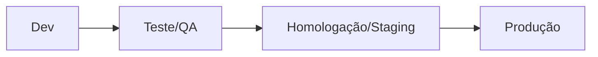
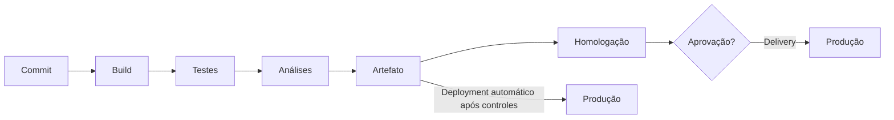

# 5.5 — Ambientes de desenvolvimento de software

[[5.4 Verificação validação e teste|← Verificação, validação e teste]] · [[5.1 Levantamento análise e gerenciamento de requisitos|Requisitos]] · [[5.2 Ciclo de vida de sistemas e seus paradigmas|Ciclo de vida]]

> [!note] Prioridade CESGRANRIO: **BAIXA / CONCEITUAL**
> Não há ocorrência direta no corpus local. O edital é amplo; priorize as funções de IDE, SDK, compilador, interpretador, depurador, controle de versão, build, dependências, repositório de artefatos, CI/CD e separação dos ambientes.

## O que você DEVE MANTER e REVISAR — o “coração” da CESGRANRIO

1. **IDE e cadeia de ferramentas (Seções 2 e 3):** IDE integra edição, navegação, build, testes e depuração. SDK reúne ferramentas e bibliotecas para uma plataforma. **Pegadinha:** IDE não é compilador nem linguagem.
2. **Controle de versão (Seção 5):** registra histórico, autoria e ramificações; commit é registro local no distribuído, push publica; merge combina linhas de desenvolvimento.
3. **Build, dependências e artefatos (Seções 6 e 7):** build transforma código-fonte em artefato; gerenciador de dependências resolve bibliotecas; repositório de artefatos armazena saídas versionadas.
4. **Ambientes separados (Seção 8):** desenvolvimento, teste, homologação/staging e produção têm finalidades distintas. Código deve ser promovido com configuração externa e controles.
5. **CI × entrega × implantação contínua (Seção 9):** CI integra e verifica mudanças frequentemente; entrega contínua mantém software pronto para produção; implantação contínua publica automaticamente mudanças aprovadas pelo pipeline.

> [!tip] Regra mental de prova
> **Código entra no versionamento; build produz artefato; pipeline verifica; repositório guarda; promoção leva o mesmo artefato pelos ambientes.**

## 1. O que é um ambiente de desenvolvimento

É o conjunto de ferramentas, configurações, serviços e recursos usados para criar, executar, testar, integrar e empacotar software.


Inclui máquina local, runtime, compilador, bibliotecas, banco de desenvolvimento, ferramentas de versionamento, automação e observabilidade.

## 2. Editor × IDE

| Ferramenta | Característica |
|---|---|
| **Editor de código** | Edição de texto com recursos extensíveis |
| **IDE** | Ambiente integrado com edição, navegação, build, teste, execução e depuração |

Recursos frequentes de uma IDE:

- realce e conclusão de código;
- refatoração automatizada;
- navegação entre símbolos;
- integração com compilador e build;
- execução de testes;
- depurador;
- integração com controle de versão;
- análise estática.

> [!warning] Pegadinha CESGRANRIO
> IDE **integra** ferramentas; não é sinônimo de compilador, interpretador, linguagem, framework ou SDK.

## 3. SDK, runtime, compilador e interpretador

| Elemento | Função |
|---|---|
| **SDK** | Kit para desenvolver em uma plataforma: ferramentas, bibliotecas, cabeçalhos, documentação e exemplos |
| **Runtime** | Ambiente necessário para executar o programa |
| **Compilador** | Traduz código para outra representação antes da execução |
| **Interpretador** | Executa instruções por meio de outro programa, sem exigir tradução integral antecipada |
| **Depurador** | Controla a execução para investigar estado e defeitos |
| **Profiler** | Mede tempo, memória e comportamento para analisar desempenho |
| **Linter** | Detecta padrões problemáticos e violações de estilo estaticamente |

Linguagens e plataformas modernas podem combinar compilação antecipada, bytecode, interpretação e compilação JIT; evite classificações absolutas.

### 3.1 Depuração

Recursos comuns:

- breakpoint: pausa em ponto definido;
- step into: entra na chamada;
- step over: executa a chamada sem entrar nela;
- step out: conclui a função atual;
- watch: acompanha expressão;
- call stack: mostra a pilha de chamadas.

## 4. Estrutura e reprodutibilidade

Um projeto costuma conter:

```text
projeto/
├── src/          código de produção
├── tests/        testes automatizados
├── docs/         documentação
├── config/       modelos de configuração não secreta
├── build/        saídas geradas, quando aplicável
└── manifesto     dependências e scripts
```

Reprodutibilidade significa que outra máquina ou pipeline consegue reconstruir o ambiente e o artefato a partir de definições versionadas, reduzindo o problema “funciona na minha máquina”.

## 5. Controle de versão

Registra alterações, autoria, histórico e linhas paralelas de desenvolvimento.

### 5.1 Centralizado × distribuído

| Modelo | Característica |
|---|---|
| **Centralizado** | Repositório central concentra o histórico principal |
| **Distribuído** | Cada clone possui histórico local completo ou amplo e sincroniza com remotos |

### 5.2 Conceitos essenciais

| Conceito | Significado |
|---|---|
| **Working tree** | Arquivos de trabalho |
| **Staging/index** | Seleção preparada para o próximo commit em ferramentas como Git |
| **Commit** | Registro versionado de uma alteração |
| **Branch** | Linha de desenvolvimento |
| **Merge** | Combinação de históricos/branches |
| **Clone** | Cópia do repositório |
| **Fetch** | Obtém referências/objetos remotos sem integrar automaticamente |
| **Pull** | Obtém e integra mudanças remotas conforme configuração |
| **Push** | Publica commits em repositório remoto |
| **Tag** | Nome estável associado a uma versão/commit |

> [!warning] Pegadinhas CESGRANRIO
> - Em sistema distribuído, commit pode ser apenas local; **push** envia ao remoto.
> - Branch não é uma cópia física obrigatória de todo o projeto.
> - Merge pode gerar conflito quando mudanças incompatíveis atingem a mesma região lógica.

## 6. Build e automação

**Build** transforma fontes e recursos em artefatos executáveis ou distribuíveis.


Ferramentas de build automatizam tarefas e suas dependências, evitando comandos manuais inconsistentes.

Conceitos:

- build limpa: reconstrói sem saídas anteriores;
- build incremental: recompila somente o necessário;
- script/descritor de build: declara etapas e opções;
- artefato: saída versionável, como pacote, binário ou imagem.

## 7. Dependências e repositórios

### 7.1 Gerenciador de dependências

Resolve, baixa e controla bibliotecas usadas pelo projeto. Um arquivo de lock registra versões efetivamente resolvidas, favorecendo builds reproduzíveis.

### 7.2 Repositório de código × artefatos

| Repositório | Guarda |
|---|---|
| **Código-fonte** | Fontes, configuração de build e histórico |
| **Artefatos/pacotes** | Binários, bibliotecas, pacotes e imagens versionadas |

> [!warning] Pegadinha CESGRANRIO
> Recompilar separadamente em cada ambiente pode gerar diferenças. É preferível produzir um artefato imutável e promover a mesma unidade, alterando apenas configuração externa.

## 8. Ambientes: desenvolvimento até produção

| Ambiente | Finalidade |
|---|---|
| **Desenvolvimento — dev** | Codificação e testes rápidos pelos desenvolvedores |
| **Teste/QA** | Testes controlados e integração |
| **Homologação/staging/UAT** | Validação próxima da produção por negócio/usuários |
| **Produção — prod** | Uso real e dados reais |



### 8.1 Paridade e isolamento

- ambientes devem ser suficientemente semelhantes para reduzir surpresas;
- credenciais e dados devem ser isolados;
- produção exige acesso restrito e auditoria;
- dados pessoais de produção não devem ser copiados livremente para dev/teste;
- diferenças devem estar em configuração externa, não em branches de código por ambiente.

### 8.2 Configuração e segredos

Configurações variam por ambiente: endpoints, capacidade e chaves de funcionalidades. Segredos incluem senhas, tokens e chaves privadas e devem ficar em mecanismo seguro, não no código-fonte.

> [!warning] Pegadinhas CESGRANRIO
> - Homologação busca representar produção, mas não deve compartilhar indiscriminadamente dados e credenciais reais.
> - Segredo não deve ser versionado junto ao código.
> - Configuração externa permite promover o mesmo artefato.

## 9. CI, entrega e implantação contínuas

### 9.1 Integração contínua — CI

Desenvolvedores integram mudanças frequentemente; cada alteração dispara build, análise e testes automatizados, oferecendo feedback rápido.

### 9.2 Entrega contínua — continuous delivery

Mantém o software em estado implantável. A publicação em produção pode depender de decisão/aprovação manual.

### 9.3 Implantação contínua — continuous deployment

Toda mudança que passa pelos controles do pipeline é implantada automaticamente em produção, sem etapa manual obrigatória de liberação.



> [!warning] Pegadinha CESGRANRIO
> Continuous delivery não exige implantação automática em produção; continuous deployment exige. CI não é sinônimo de CD.

## 10. Pipeline e qualidade

Etapas possíveis:

1. obter fontes;
2. resolver dependências;
3. compilar/build;
4. executar testes;
5. análise estática e segurança;
6. empacotar e assinar;
7. publicar artefato;
8. implantar em ambiente;
9. executar verificações pós-implantação.

Falhar rapidamente reduz custo. O pipeline deve produzir logs, resultados e rastreabilidade.

SAST, DAST e IAST serão aprofundados no item 9.5 de Segurança da Informação.

## 11. Contêiner × máquina virtual

| Aspecto | Contêiner | Máquina virtual |
|---|---|---|
| Virtualização | Nível do sistema operacional | Hardware virtualizado |
| Kernel | Compartilhado com o host | Cada VM possui seu sistema/kernel convidado |
| Inicialização | Geralmente rápida | Geralmente mais pesada |
| Isolamento | Processos e recursos do SO | Fronteira de VM mais completa |
| Unidade | Imagem e contêiner | Imagem da máquina virtual |

> [!warning] Pegadinha CESGRANRIO
> Contêiner não contém obrigatoriamente um sistema operacional completo nem possui kernel próprio como uma VM.

## 12. Infraestrutura e ambiente como código

**Infrastructure as Code — IaC** descreve infraestrutura de forma versionável e automatizável. Benefícios:

- repetibilidade;
- revisão e histórico;
- redução de configuração manual;
- criação consistente de ambientes;
- recuperação e auditoria.

IaC não elimina governança, testes ou gestão de segredos.

## 13. Observabilidade no desenvolvimento

- **logs:** registros de eventos;
- **métricas:** valores numéricos ao longo do tempo;
- **traces:** caminho de uma requisição distribuída;
- **debugger:** investigação interativa durante execução controlada.

Observabilidade ajuda a entender o estado interno por suas saídas; monitoramento acompanha condições conhecidas e alerta sobre elas.

## 14. Ferramentas CASE × IDE

| CASE | IDE |
|---|---|
| Apoia atividades amplas de engenharia, como requisitos e modelagem | Integra principalmente codificação, execução, build e depuração |
| Pode manter modelos e rastreabilidade | Mantém projeto de código e integra ferramentas técnicas |

Há sobreposição de recursos; a classificação considera a finalidade predominante.

## 15. Prioridade de estudo

### Maior retorno dentro do tópico

- IDE × SDK × runtime;
- compilador × interpretador;
- depurador, profiler e linter;
- conceitos básicos de controle de versão;
- build, dependência e artefato;
- dev × teste × homologação × produção;
- CI × continuous delivery × continuous deployment;
- configuração externa e segredos.

### Chance média em tópico de baixa frequência

- contêiner × VM;
- IaC e reprodutibilidade;
- repositório de código × artefatos;
- logs, métricas e traces;
- CASE × IDE.

## 16. Checklist de revisão

- [ ] IDE integra ferramentas; SDK fornece kit de desenvolvimento.
- [ ] Runtime executa; compilador traduz; depurador investiga.
- [ ] Commit local não equivale a push remoto.
- [ ] Fetch obtém; pull obtém e integra conforme configuração.
- [ ] Build produz artefato; gerenciador resolve dependências.
- [ ] Repositório de código não é repositório de artefatos.
- [ ] O mesmo artefato deve ser promovido entre ambientes.
- [ ] Segredos não devem ficar no código-fonte.
- [ ] CI integra e verifica frequentemente.
- [ ] Delivery pode ter aprovação manual para produção.
- [ ] Deployment automatiza a ida a produção após controles.
- [ ] Contêiner compartilha kernel; VM possui sistema convidado.

## 17. Questões inéditas — estilo CESGRANRIO

### 17.1 Questão 1

Uma equipe automatizou build e testes a cada integração. Toda versão aprovada fica pronta para produção, mas a implantação depende de autorização de um gerente.

Essa prática caracteriza

A) implantação contínua, pois nenhuma decisão humana pode existir.  
B) entrega contínua, pois o software permanece implantável com liberação controlada.  
C) somente controle de versão centralizado.  
D) interpretação contínua, pois a build dispensa artefatos.  
E) virtualização, pois os testes são automatizados.

> [!success]- Gabarito comentado
> **Resposta: B.** Continuous delivery mantém versões prontas para implantação, que pode exigir aprovação. No continuous deployment, mudanças aprovadas pelo pipeline seguem automaticamente para produção.

### 17.2 Questão 2

Em um sistema de controle de versão distribuído, um desenvolvedor registrou uma alteração em seu repositório local e deseja publicá-la no repositório remoto compartilhado.

A operação necessária é

A) commit.  
B) fetch.  
C) push.  
D) clone.  
E) breakpoint.

> [!success]- Gabarito comentado
> **Resposta: C.** O commit cria o registro local; push publica commits no remoto. Fetch obtém mudanças remotas; clone cria uma cópia; breakpoint pertence à depuração.

## 18. Resumo de véspera

```text
IDE = editor + navegação + build + testes + debug integrados
SDK = ferramentas e bibliotecas para desenvolver
RUNTIME = ambiente de execução
COMPILADOR = traduz; INTERPRETADOR = executa via outro programa
DEBUGGER = investiga; PROFILER = mede; LINTER = analisa padrões
COMMIT = registra; PUSH = publica; FETCH = obtém; MERGE = combina
BUILD = transforma fontes em artefato
LOCK FILE = fixa resolução de dependências
DEV → TESTE/QA → HOMOLOGAÇÃO/STAGING → PRODUÇÃO
SEGREDO ≠ configuração comum e não deve estar no código
CI = integrar, construir e testar frequentemente
DELIVERY = pronto para produção, liberação pode ser manual
DEPLOYMENT = publicação automática após controles
CONTÊINER = compartilha kernel; VM = sistema convidado próprio
IaC = infraestrutura versionável e automatizável
```
