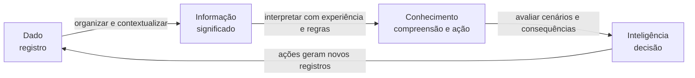
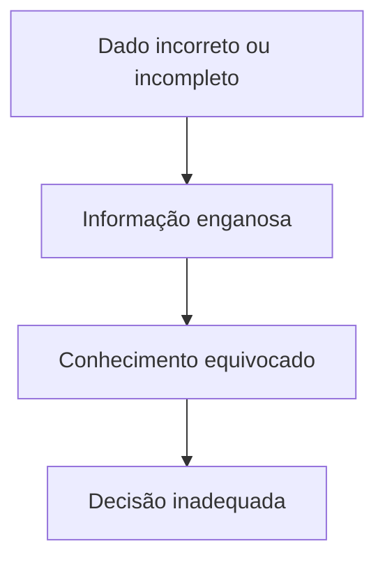
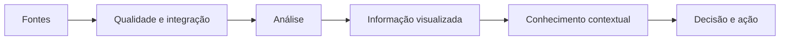

# 7.1 — Dado, informação, conhecimento e inteligência

[[7.2 Conceitos fundamentos características técnicas e métodos de BI|BI →]] · [[7.3 Mapeamento de fontes de dados|Mapeamento de fontes →]]

> [!danger] Prioridade CESGRANRIO: **ALTA**
> Há registro de questão direta. A banca tende a fornecer exemplos e pedir a classificação correta. Domine o acréscimo de **contexto, significado, experiência e capacidade de decisão** em cada nível.

## O que você DEVE MANTER e REVISAR — o “coração” da CESGRANRIO

1. **Dado (Seção 2):** representação bruta de um fato, evento ou observação, ainda sem contexto suficiente para determinada finalidade.
2. **Informação (Seção 3):** dado organizado e contextualizado, com significado e relevância para um receptor.
3. **Conhecimento (Seção 4):** interpretação da informação combinada a experiência, regras e compreensão, permitindo explicar ou agir.
4. **Inteligência (Seção 5):** aplicação coordenada do conhecimento para avaliar cenários, antecipar consequências e apoiar decisão. **Pegadinha:** não é sinônimo de grande quantidade de informação.
5. **Processo, não propriedade absoluta (Seção 6):** o mesmo conteúdo pode ser dado para uma pessoa e informação para outra, conforme contexto e finalidade.

> [!tip] Regra mental de prova
> **Dado registra; informação significa; conhecimento explica/aplica; inteligência decide e antecipa.**

## 1. A cadeia de transformação



O valor aumenta quando o conteúdo é relacionado a uma finalidade. A progressão não ocorre automaticamente: dados ruins, contexto inadequado ou interpretação incorreta podem gerar decisões ruins.

## 2. Dado

É uma representação de fato, evento, medida, símbolo ou observação.

Exemplos isolados:

```text
87
2026-09-06
P-103
42 °C
```

Sem contexto, `87` pode ser temperatura, quantidade, código ou percentual.

Características:

- pode ser numérico, textual, visual ou sonoro;
- pode ser capturado manualmente ou por sistemas/sensores;
- pode ser estruturado ou não estruturado;
- precisa de metadados para ser interpretado corretamente.

> [!warning] Pegadinha CESGRANRIO
> “Bruto” não significa necessariamente incorreto ou inútil. Significa que ainda falta tratamento ou contexto para determinado uso.

## 3. Informação

Surge quando dados são organizados, contextualizados e interpretáveis para responder a uma pergunta.

```text
Dado:       42 °C
Contexto:   temperatura do motor M7 às 14h
Informação: o motor M7 atingiu 42 °C às 14h
```

Informação útil tende a possuir:

- relevância;
- clareza;
- acurácia;
- completude adequada;
- atualidade;
- disponibilidade no momento necessário.

> [!warning] Pegadinha CESGRANRIO
> Processar dados não garante informação útil. O resultado precisa ter significado e relevância para seu consumidor.

## 4. Conhecimento

É a compreensão obtida ao relacionar informações a experiência, regras, modelos mentais e contexto.

```text
Informação: motor M7 atingiu 42 °C.
Regra/experiência: acima de 40 °C, esse motor apresenta risco de falha.
Conhecimento: o motor M7 está operando em condição anormal e requer atenção.
```

### 4.1 Conhecimento explícito × tácito

| Tipo | Característica | Exemplo |
|---|---|---|
| **Explícito** | Pode ser documentado, codificado e transmitido formalmente | Manual, procedimento, regra de negócio |
| **Tácito** | Ligado à experiência, habilidade e percepção pessoal; difícil de formalizar integralmente | Diagnóstico intuitivo de técnico experiente |

> [!warning] Pegadinha CESGRANRIO
> Conhecimento tácito não significa secreto; significa difícil de articular e codificar. Explícito não significa necessariamente público.

## 5. Inteligência

É a capacidade de mobilizar conhecimento para comparar alternativas, reconhecer padrões, antecipar efeitos e tomar decisões alinhadas a objetivos.

```text
Conhecimento: motor M7 apresenta risco de falha.
Alternativas: parar agora, reduzir carga ou manter operação.
Inteligência: considerar risco, custo e segurança e decidir reduzir a carga
              e programar manutenção antes da janela crítica.
```

Em contexto organizacional, inteligência pode integrar dados internos, ambiente externo, análises e conhecimento humano para apoiar decisões.

> [!warning] Pegadinha CESGRANRIO
> Inteligência não é simplesmente informação resumida ou sofisticada. Seu ponto central é o **uso do conhecimento para avaliação e decisão**.

## 6. A classificação depende do contexto

Considere `1.250`:

| Para quem/situação | Papel possível |
|---|---|
| Sistema coletor sem descrição | Dado |
| Relatório “1.250 vendas em agosto” | Informação |
| Analista relaciona a alta a uma campanha | Conhecimento |
| Gestor decide realocar orçamento para a campanha | Inteligência aplicada |

A classificação descreve o papel desempenhado no processo cognitivo e decisório, não um rótulo permanente do arquivo.

## 7. Metadados e contexto

Metadados explicam significado, origem, unidade, formato e regras.

```text
valor = 42
unidade = graus Celsius
sensor = S9
equipamento = motor M7
instante = 14:00
```

Sem unidade e origem, o valor pode ser interpretado incorretamente. Metadados estudados em [[1.6 - Metadados|1.6 Metadados]] apoiam a passagem de dado para informação.

## 8. Qualidade ao longo da cadeia



Ainda que os dados estejam corretos, viés de seleção, contexto insuficiente e interpretação causal indevida podem comprometer conhecimento e inteligência.

> [!warning] Pegadinha CESGRANRIO
> “Garbage in, garbage out” destaca a influência da entrada, mas dados corretos não garantem automaticamente decisão correta.

## 9. Decisão operacional, tática e estratégica

| Nível | Horizonte/foco | Exemplo |
|---|---|---|
| **Operacional** | Curto prazo e rotina | Repor hoje um item abaixo do estoque mínimo |
| **Tático** | Coordenação de áreas e médio prazo | Redefinir política trimestral de estoques |
| **Estratégico** | Longo prazo e direção organizacional | Abrir novo centro de distribuição |

BI pode apoiar os três níveis, embora diferentes granularidades e frequências sejam necessárias.

## 10. Relação com BI



Ferramentas produzem análises e visualizações, mas pessoas e processos atribuem contexto, fazem julgamento e assumem decisões.

## 11. Pegadinhas rápidas

| Exemplo | Classificação mais provável |
|---|---|
| Leituras isoladas de sensores | Dados |
| Média diária identificada por equipamento | Informação |
| Diagnóstico baseado em padrão e experiência | Conhecimento |
| Escolha da intervenção após avaliar cenários | Inteligência |
| Manual formalizado | Conhecimento explícito |
| Habilidade adquirida por prática | Conhecimento tácito |

## 12. Prioridade de estudo

### Alta frequência/probabilidade

- dado × informação × conhecimento × inteligência;
- classificação por exemplos;
- papel do contexto e significado;
- inteligência ligada a decisão;
- qualidade na cadeia.

### Chance média

- conhecimento tácito × explícito;
- decisões operacional, tática e estratégica;
- metadados na contextualização;
- relatividade da classificação conforme usuário e finalidade.

## 13. Checklist de revisão

- [ ] Dado é representação ainda sem contexto suficiente para o uso.
- [ ] Informação é dado contextualizado com significado.
- [ ] Conhecimento combina informação, experiência e regras.
- [ ] Inteligência aplica conhecimento à avaliação e decisão.
- [ ] Mais informação não significa automaticamente mais inteligência.
- [ ] Tácito é experiencial e difícil de formalizar.
- [ ] Explícito pode ser documentado e transmitido.
- [ ] O papel do conteúdo depende do contexto e do usuário.
- [ ] Dados ruins podem contaminar toda a cadeia.
- [ ] Ferramentas apoiam, mas não substituem julgamento decisório.

## 14. Questões inéditas — estilo CESGRANRIO

### 14.1 Questão 1

Um sensor produziu a leitura `95`. Após associá-la à pressão de um duto e ao horário, o sistema indicou que o valor ultrapassou o limite operacional. Um engenheiro, combinando esse resultado à experiência, concluiu que havia risco de ruptura e decidiu interromper o fluxo.

A leitura isolada, a indicação contextualizada, a conclusão e a decisão correspondem, respectivamente, a

A) informação, dado, inteligência e conhecimento.  
B) dado, informação, conhecimento e inteligência.  
C) dado, conhecimento, informação e inteligência.  
D) conhecimento, informação, dado e inteligência.  
E) dado, inteligência, conhecimento e informação.

> [!success]- Gabarito comentado
> **Resposta: B.** `95` isolado é dado; pressão identificada e comparada ao limite é informação; a interpretação do risco com experiência é conhecimento; a escolha da ação é inteligência aplicada.

### 14.2 Questão 2

Um técnico experiente reconhece pelo som uma vibração anormal, mas tem dificuldade de explicar integralmente os indícios usados em seu diagnóstico. Esse conhecimento é predominantemente

A) explícito, pois toda habilidade pode ser integralmente documentada.  
B) tácito, por estar ligado à experiência e ser difícil de formalizar.  
C) dado, por não ter sido armazenado em banco.  
D) informação, porque necessariamente dispensa interpretação.  
E) referência, porque forma um domínio de códigos.

> [!success]- Gabarito comentado
> **Resposta: B.** Conhecimento tácito está incorporado à experiência e à habilidade e pode ser difícil de comunicar completamente. Não é sinônimo de segredo nem depende de estar em banco.

## 15. Resumo de véspera

```text
DADO = registro/observação
INFORMAÇÃO = dado + organização + contexto + significado
CONHECIMENTO = informação + experiência + regras + compreensão
INTELIGÊNCIA = conhecimento aplicado a cenários, decisão e ação
TÁCITO = experiencial, difícil de formalizar
EXPLÍCITO = documentável e codificável
METADADOS = contexto para interpretar dados
OPERACIONAL = rotina/curto prazo
TÁTICO = coordenação/médio prazo
ESTRATÉGICO = direção/longo prazo
CLASSIFICAÇÃO depende do uso e do receptor
DADOS CORRETOS não garantem interpretação ou decisão correta
```
