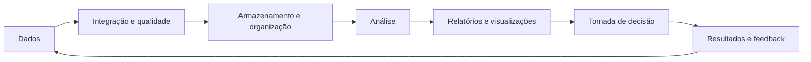
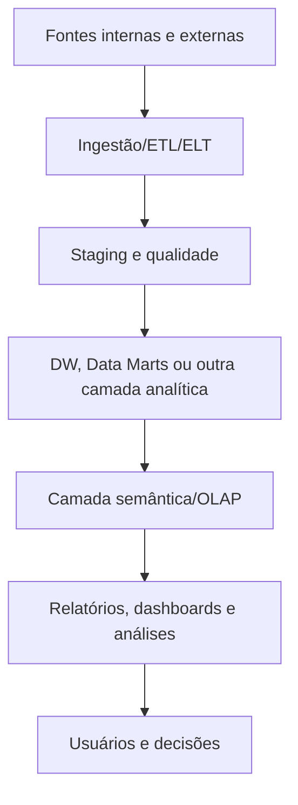

# 7.2 — Conceitos, fundamentos, características, técnicas e métodos de BI

[[7.1 Dado informação conhecimento e inteligência|← Dado à inteligência]] · [[7.3 Mapeamento de fontes de dados|Mapeamento de fontes →]] · [[7.4 Dados estruturados e não estruturados|Tipos de dados →]]

> [!danger] Prioridade CESGRANRIO: **ALTA**
> BI é recorrente e transversal. Priorize BI como processo de apoio à decisão, arquitetura em camadas, relatórios × análise ad hoc × dashboard × scorecard, KPI, análises descritiva/diagnóstica/preditiva/prescritiva e self-service governado.

## O que você DEVE MANTER e REVISAR — o “coração” da CESGRANRIO

1. **BI não é apenas ferramenta (Seção 1):** reúne processos, pessoas, governança, métodos e tecnologias para transformar dados em informação útil à decisão.
2. **Cadeia de BI (Seção 2):** fontes → integração/qualidade → armazenamento/camada semântica → análise/apresentação → decisão. **Pegadinha:** dashboard é a camada visível, não o BI inteiro.
3. **Técnicas de consumo (Seção 5):** relatório é apresentação estruturada; consulta ad hoc responde pergunta não predefinida; dashboard monitora visualmente; scorecard acompanha objetivos, metas e indicadores.
4. **Métricas e KPIs (Seção 6):** toda KPI é uma métrica, mas nem toda métrica é KPI. KPI está ligado a objetivo crítico, meta e ação.
5. **Tipos de análise (Seção 7):** descritiva = o que ocorreu; diagnóstica = por quê; preditiva = o que pode ocorrer; prescritiva = o que fazer.

> [!tip] Regra mental de prova
> **BI coleta e integra, organiza e analisa, comunica e apoia a decisão. Se o processo termina no gráfico sem ação ou aprendizado, falta fechar o ciclo.**

## 1. O que é Business Intelligence

**Business Intelligence — BI** é o conjunto de estratégias, processos, arquiteturas, métodos e tecnologias usados para coletar, integrar, analisar e apresentar dados, apoiando decisões.



BI busca uma visão confiável do negócio, compreensão de desempenho, identificação de padrões e suporte a decisões operacionais, táticas e estratégicas.

> [!warning] Pegadinhas CESGRANRIO
> - BI não é sinônimo de Data Warehouse, OLAP, dashboard ou mineração de dados; esses são componentes ou técnicas possíveis.
> - BI não substitui o gestor: oferece evidências e capacidade analítica para a decisão.

## 2. Arquitetura conceitual



| Camada | Responsabilidade |
|---|---|
| Fontes | Produzir dados operacionais ou externos |
| Integração | Extrair, transformar, padronizar e carregar |
| Armazenamento analítico | Integrar histórico para consumo |
| Semântica | Traduzir estruturas técnicas em medidas e conceitos de negócio |
| Apresentação | Permitir consulta, visualização e distribuição |
| Governança | Qualidade, segurança, catálogo, linhagem e responsabilidades |

Não é obrigatório que toda solução possua exatamente essas tecnologias ou camadas físicas.

## 3. Características desejáveis

- dados integrados e confiáveis;
- visão consistente de conceitos e indicadores;
- acesso oportuno;
- histórico para comparação temporal;
- diferentes níveis de detalhe;
- interatividade e autosserviço controlado;
- rastreabilidade até a origem;
- segurança conforme perfil;
- escalabilidade e desempenho adequados.

> [!warning] Pegadinha CESGRANRIO
> “Orientado por assunto, integrado, variante no tempo e não volátil” são características clássicas do **Data Warehouse**, não uma definição exclusiva de todo BI. O módulo 7.6 aprofundará isso.

## 4. BI tradicional, operacional e self-service

### 4.1 BI corporativo/tradicional

Modelos e relatórios centralmente governados, com forte consistência. Pode ter maior tempo para atender novas demandas.

### 4.2 BI operacional

Leva indicadores e análises de baixa latência aos processos cotidianos, permitindo ação próxima ao evento.

### 4.3 Self-service BI

Permite que usuários de negócio explorem dados e criem análises com menor dependência de TI.

Benefícios: agilidade e proximidade com o problema. Riscos: métricas divergentes, duplicação, exposição de dados e decisões sem contexto.

```text
Self-service saudável = autonomia + dados certificados + catálogo + segurança + governança
```

> [!warning] Pegadinha CESGRANRIO
> Self-service não significa acesso irrestrito nem abandono da governança. A autonomia deve existir dentro de limites confiáveis.

## 5. Técnicas e produtos de informação

| Recurso | Finalidade predominante |
|---|---|
| **Relatório padronizado** | Entregar informação recorrente em formato definido |
| **Consulta ad hoc** | Responder pergunta específica não predefinida |
| **Dashboard** | Monitorar indicadores visualmente, de forma consolidada |
| **Scorecard** | Acompanhar estratégia, objetivos, metas e desempenho |
| **OLAP** | Explorar medidas por dimensões e níveis de detalhe |
| **Alertas** | Notificar exceções e limiares |
| **Data mining** | Descobrir padrões e relações em dados |

### 5.1 Dashboard × scorecard

Um dashboard pode acompanhar operações e indicadores diversos. Um scorecard vincula explicitamente indicadores a **objetivos e metas estratégicas**.

> [!warning] Pegadinha CESGRANRIO
> Relatório não é necessariamente estático, e dashboard não é automaticamente estratégico. A finalidade e o desenho determinam o uso.

## 6. Métrica, indicador, KPI e meta

| Conceito | Significado | Exemplo |
|---|---|---|
| **Métrica** | Medida quantitativa | 120 chamados |
| **Indicador** | Medida interpretada para acompanhar fenômeno | taxa de resolução |
| **KPI** | Indicador-chave ligado a objetivo crítico | disponibilidade do serviço crítico |
| **Meta** | Valor desejado com prazo/contexto | disponibilidade ≥ 99,9% no trimestre |

Uma boa KPI deve possuir definição inequívoca, fórmula, unidade, periodicidade, responsável, fonte, meta e possibilidade de ação.

### 6.1 Indicador antecedente × resultante

| Tipo | Papel |
|---|---|
| **Leading/antecedente** | Sinaliza fatores que podem influenciar resultado futuro |
| **Lagging/resultante** | Mede resultado já ocorrido |

> [!warning] Pegadinha CESGRANRIO
> Toda KPI é métrica, mas nem toda métrica é chave. Quantidade de gráficos não aumenta a qualidade da gestão.

## 7. Tipos de análise

| Tipo | Pergunta | Exemplo |
|---|---|---|
| **Descritiva** | O que aconteceu? | Receita caiu 8% |
| **Diagnóstica** | Por que aconteceu? | Queda concentrada na região Sul após ruptura de estoque |
| **Preditiva** | O que provavelmente acontecerá? | Modelo prevê nova queda no próximo mês |
| **Prescritiva** | O que devemos fazer? | Otimização recomenda redistribuir estoque |


> [!warning] Pegadinha CESGRANRIO
> Correlação e detalhamento ajudam o diagnóstico, mas não provam automaticamente causalidade. Preditiva estima resultados; prescritiva recomenda ações.

## 8. Descoberta e análise de dados

Métodos comuns:

- agregação e comparação;
- análise de tendência;
- segmentação;
- análise de variância em relação à meta;
- detecção de exceções;
- drill-down para detalhe;
- análise de causa com contexto;
- mineração e modelagem preditiva.

OLAP será aprofundado em 7.5; Data Warehouse, em 7.6; dashboards, em 7.8.

## 9. Processo de BI

1. definir decisão, pergunta e objetivo;
2. identificar indicadores e conceitos;
3. mapear fontes;
4. integrar, limpar e governar;
5. modelar e disponibilizar;
6. analisar e comunicar;
7. decidir e agir;
8. medir resultado e aprender.

> [!warning] Pegadinha CESGRANRIO
> Começar pela ferramenta sem definir pergunta, público e decisão pode produzir painéis visualmente ricos, mas pouco úteis.

## 10. Dimensões de sucesso

| Dimensão | Pergunta |
|---|---|
| Qualidade | Os dados e indicadores são confiáveis? |
| Adoção | Usuários conseguem e desejam utilizar a solução? |
| Desempenho | A resposta chega no tempo necessário? |
| Governança | Há definição, responsabilidade e segurança? |
| Valor | A análise melhora decisão ou resultado? |

## 11. Governança de BI

- glossário de negócio;
- catálogo e linhagem;
- métricas certificadas;
- responsáveis por domínio e indicador;
- controle de acesso;
- qualidade monitorada;
- gestão de mudanças;
- treinamento e alfabetização de dados.

Uma **camada semântica** ajuda a apresentar nomes, relacionamentos e medidas consistentes, evitando que cada usuário redefina conceitos críticos.

## 12. BI × Analytics × Data Science

| Termo | Ênfase comum |
|---|---|
| **BI** | Monitoramento, análise e decisão com dados organizacionais |
| **Analytics** | Uso amplo de métodos analíticos descritivos a prescritivos |
| **Data Science** | Exploração, experimentação e modelos estatísticos/computacionais |

As fronteiras se sobrepõem; não trate os termos como categorias totalmente excludentes.

## 13. Armadilhas de implementação

- indicadores sem objetivo ou responsável;
- múltiplas versões da verdade;
- dados desatualizados ou sem linhagem;
- excesso de elementos visuais;
- confundir correlação com causa;
- ignorar segurança e LGPD;
- automatizar relatório incorreto;
- medir atividade em vez de resultado;
- não avaliar a ação tomada.

## 14. Prioridade de estudo

### Alta frequência/probabilidade

- definição e finalidade do BI;
- arquitetura conceitual;
- BI não é apenas ferramenta/dashboard;
- relatório, ad hoc, dashboard e scorecard;
- métrica, indicador, KPI e meta;
- análise descritiva, diagnóstica, preditiva e prescritiva;
- self-service com governança;
- apoio à decisão.

### Chance média

- BI tradicional × operacional;
- leading × lagging indicator;
- camada semântica;
- BI × analytics × data science;
- fatores de sucesso e armadilhas.

## 15. Checklist de revisão

- [ ] BI reúne pessoas, processos, métodos, governança e tecnologia.
- [ ] Dashboard é parte da solução, não sinônimo de BI.
- [ ] Camada semântica traduz dados em conceitos de negócio.
- [ ] Consulta ad hoc responde pergunta não predefinida.
- [ ] Scorecard liga indicadores a objetivos e metas.
- [ ] Toda KPI é métrica; nem toda métrica é KPI.
- [ ] Descritiva = o quê; diagnóstica = por quê.
- [ ] Preditiva = o que pode ocorrer; prescritiva = o que fazer.
- [ ] Self-service exige dados certificados, segurança e governança.
- [ ] Correlação não prova causalidade.
- [ ] BI deve fechar o ciclo com decisão, ação e feedback.

## 16. Questões inéditas — estilo CESGRANRIO

### 16.1 Questão 1

Uma análise informa que as vendas caíram, identifica que a queda se concentrou em lojas que sofreram ruptura de estoque, estima a demanda do mês seguinte e recomenda redistribuição de produtos.

As quatro etapas são, respectivamente,

A) preditiva, prescritiva, descritiva e diagnóstica.  
B) descritiva, diagnóstica, preditiva e prescritiva.  
C) diagnóstica, descritiva, prescritiva e preditiva.  
D) descritiva, preditiva, diagnóstica e prescritiva.  
E) prescritiva, diagnóstica, descritiva e preditiva.

> [!success]- Gabarito comentado
> **Resposta: B.** Informar o ocorrido é descrever; investigar sua razão é diagnosticar; estimar o futuro é predizer; recomendar ação é prescrever.

### 16.2 Questão 2

Uma organização pretende adotar self-service BI. Para preservar autonomia sem criar versões conflitantes de indicadores, é adequado

A) liberar acesso irrestrito às bases operacionais e eliminar o catálogo.  
B) permitir que cada área redefina livremente KPIs corporativas.  
C) oferecer conjuntos certificados, glossário, segurança e camada semântica governada.  
D) proibir consultas ad hoc e manter apenas relatórios impressos.  
E) substituir responsáveis de negócio exclusivamente por ferramentas automáticas.

> [!success]- Gabarito comentado
> **Resposta: C.** Self-service combina autonomia com governança. Dados certificados, conceitos comuns, segurança e camada semântica reduzem divergência sem impedir exploração.

## 17. Resumo de véspera

```text
BI = pessoas + processos + métodos + governança + tecnologia
FONTES → INTEGRAÇÃO → CAMADA ANALÍTICA → ANÁLISE → DECISÃO
RELATÓRIO = informação estruturada recorrente
AD HOC = pergunta não predefinida
DASHBOARD = monitoramento visual
SCORECARD = objetivos + metas + indicadores
MÉTRICA = medida; KPI = indicador-chave ligado a objetivo
DESCRITIVA = o que aconteceu
DIAGNÓSTICA = por que aconteceu
PREDITIVA = o que pode acontecer
PRESCRITIVA = o que fazer
SELF-SERVICE = autonomia + governança
CAMADA SEMÂNTICA = conceitos e medidas consistentes
BI APOIA a decisão; não substitui julgamento
```
