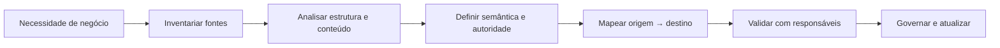
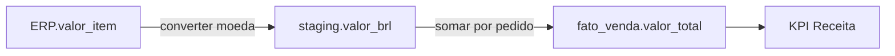

# 7.3 — Mapeamento de fontes de dados

[[7.2 Conceitos fundamentos características técnicas e métodos de BI|← Business Intelligence]] · [[7.4 Dados estruturados e não estruturados|Dados estruturados e não estruturados →]]

> [!important] Prioridade CESGRANRIO: **MÉDIA**
> O tema pode surgir como etapa de BI, integração ou governança. Priorize inventário de fontes, sistema de registro, mapeamento origem–destino, profiling, granularidade, frequência, chaves, qualidade, metadados e linhagem.

## O que você DEVE MANTER e REVISAR — o “coração” da CESGRANRIO

1. **Inventário de fontes (Seção 2):** identifica sistemas, responsáveis, conteúdo, tecnologia, formato, volume, frequência, acesso e sensibilidade.
2. **Semântica e autoridade (Seção 3):** nomes iguais podem significar coisas diferentes; fontes diferentes podem disputar a autoridade. É preciso definir sistema de registro e regra de precedência.
3. **Source-to-target mapping (Seção 5):** documenta campo de origem, destino, transformação, regra, chave e tratamento de nulos/rejeições.
4. **Profiling antes de integrar (Seção 6):** mede conteúdo real, não apenas o esquema declarado. **Pegadinha:** documentação não garante que os dados sigam as regras.
5. **Mapeamento × linhagem (Seção 7):** mapeamento especifica correspondências e regras; linhagem registra o percurso e transformações do dado ao longo do fluxo.

> [!tip] Regra mental de prova
> **Antes de mover dados, descubra quem produz, o que significa, em qual grão, com qual qualidade, quando muda e quem pode acessar.**

## 1. O que é mapeamento de fontes

É o processo de identificar, descrever, avaliar e relacionar fontes de dados às necessidades de um projeto, produto de dados ou sistema consumidor.



O resultado não é apenas uma lista de bancos: inclui significado, qualidade, acesso, periodicidade, dependências e regras de transformação.

## 2. Inventário de fontes

Para cada fonte, registre:

| Aspecto | Pergunta |
|---|---|
| Identificação | Qual sistema, base, arquivo, API ou fluxo? |
| Responsável | Quem é owner, steward e contato técnico? |
| Conteúdo | Quais entidades, campos e eventos existem? |
| Formato | Tabela, CSV, JSON, imagem, log? |
| Localização/acesso | Onde está e como é acessada? |
| Frequência | Em tempo real, diária, mensal? |
| Volume e crescimento | Quanto existe e quanto cresce? |
| Granularidade | O que uma linha/documento/evento representa? |
| Qualidade | Há nulos, duplicatas, atrasos ou inconsistências? |
| Sensibilidade | Há dado pessoal, sigiloso ou regulado? |
| Retenção | Por quanto tempo é preservado? |
| Dependências | Quais produtores e consumidores seriam afetados? |

> [!warning] Pegadinha CESGRANRIO
> Mapear fontes não é apenas identificar formato e endereço técnico. Sem semântica, responsável, qualidade e periodicidade, o inventário é insuficiente.

## 3. Fonte oficial e sistema de registro

O **system of record — SoR** é o sistema considerado autoritativo para determinado dado ou processo.

Exemplo:

```text
CRM: telefone preferencial do cliente
ERP: condição financeira e limite de crédito
Sistema fiscal: CNPJ validado
```

Uma única entidade pode ter atributos oficiais em sistemas diferentes. A regra de autoridade pode ser definida por atributo, domínio ou etapa do processo.

### 3.1 Fonte primária × secundária

- primária: origina ou registra o dado no processo;
- secundária: recebe, replica, agrega ou deriva dados de outra fonte.

> [!warning] Pegadinha CESGRANRIO
> A fonte mais acessível, mais recente ou com maior quantidade de campos não é automaticamente a fonte oficial.

## 4. Critérios de avaliação

| Critério | Risco observado |
|---|---|
| Cobertura | Faltam períodos, regiões ou entidades |
| Granularidade | Fonte agregada não atende análise detalhada |
| Atualidade | Atraso incompatível com a decisão |
| Acurácia | Valores divergem da realidade |
| Consistência | Fontes discordam |
| Estabilidade | Leiaute muda sem aviso |
| Acessibilidade | Restrições técnicas ou contratuais |
| Segurança/LGPD | Uso sem base, finalidade ou proteção adequada |
| Custo | Licença, transferência, processamento e operação |
| Viés | População ou coleta não representa o fenômeno |

### 4.1 Granularidade

```text
Fonte A: uma linha por venda
Fonte B: uma linha por loja e mês
Pergunta: quais produtos foram vendidos juntos?
```

A fonte B perdeu o detalhe de itens e não responde à pergunta, mesmo que seus totais estejam corretos.

## 5. Mapeamento origem–destino

Um **source-to-target mapping** descreve como cada elemento da origem alimenta o destino.

| Origem | Destino | Transformação/regra |
|---|---|---|
| `ERP.CLIENTE.ID` | `DIM_CLIENTE.COD_ORIGEM` | Copiar como texto |
| `ERP.CLIENTE.NOME` | `DIM_CLIENTE.NOME` | Remover espaços e padronizar caixa |
| `ERP.CLIENTE.DT_NASC` | `DIM_CLIENTE.IDADE` | Calcular na data de referência |
| `CRM.UF` | `DIM_CLIENTE.UF` | Validar contra domínio oficial |

O documento também pode registrar:

- tipo e tamanho;
- obrigatoriedade e valor padrão;
- chave de negócio;
- regra de junção;
- filtro;
- tratamento de duplicidade e rejeição;
- periodicidade;
- responsável e versão.

> [!warning] Pegadinha CESGRANRIO
> Mapeamento não é mera correspondência de nomes. Pode envolver conversão, derivação, filtro, agregação e conciliação de várias fontes.

## 6. Data profiling da fonte

Antes de confiar no esquema documentado, examine os valores reais:

- contagem e distribuição;
- nulos e campos vazios;
- cardinalidade e unicidade;
- padrões e formatos;
- mínimo, máximo e valores fora do domínio;
- duplicatas;
- integridade entre entidades;
- frequência e atraso de chegada.

```sql
SELECT
    COUNT(*) AS total,
    COUNT(cpf) AS preenchidos,
    COUNT(DISTINCT cpf) AS distintos,
    MIN(data_atualizacao) AS mais_antigo,
    MAX(data_atualizacao) AS mais_recente
FROM cliente;
```

> [!warning] Pegadinha CESGRANRIO
> O catálogo declara o que deveria existir; profiling mostra o que efetivamente existe na amostra ou conjunto examinado.

## 7. Catálogo, glossário, mapeamento e linhagem

| Artefato | Pergunta respondida |
|---|---|
| **Catálogo de dados** | Quais ativos existem, onde e com quais características? |
| **Glossário de negócio** | O que significam os termos e indicadores? |
| **Mapeamento origem–destino** | Como campos e regras alimentam o destino? |
| **Linhagem** | Por onde o dado passou e quais transformações sofreu? |
| **Dicionário de dados** | Quais campos, tipos, domínios e definições existem? |



A linhagem apoia análise de impacto, auditoria e explicação de indicadores.

## 8. Tipos de fontes — visão inicial

| Dimensão | Exemplos |
|---|---|
| Interna | ERP, CRM, sensores e logs corporativos |
| Externa | Dados públicos, parceiros e fornecedores |
| Estruturada | Tabelas e arquivos tabulares |
| Semiestruturada | JSON, XML e logs com marcadores |
| Não estruturada | Texto livre, áudio, imagem e vídeo |
| Em repouso | Arquivos e bancos armazenados |
| Em movimento | Eventos e fluxos contínuos |

A distinção aprofundada entre estruturados e não estruturados será estudada em 7.4.

## 9. Frequência e captura

| Estratégia | Uso |
|---|---|
| Carga completa | Reprocessar todo o conjunto |
| Incremental | Capturar dados novos ou alterados |
| CDC | Identificar inserções, atualizações e exclusões |
| Streaming | Consumir eventos continuamente |

O método deve ser compatível com latência, volume e capacidade da origem. Detalhes estão em [[1.19 Integração dos dados|1.19 Integração de dados]].

## 10. Identificadores e conciliação

Fontes podem usar chaves diferentes para a mesma entidade:

```text
CRM: cliente 173
ERP: parceiro C-992
Atendimento: CPF 123...
```

É necessário definir chave comum, tabela de correspondência ou regras de matching. Chaves ambíguas geram duplicação ou associação incorreta.

> [!warning] Pegadinha CESGRANRIO
> Coincidência de nome não é chave confiável. Homônimos, abreviações e mudanças exigem identificadores e regras de qualidade.

## 11. Mudança de esquema e contratos de dados

Mudanças em nome, tipo, significado ou obrigatoriedade podem quebrar consumidores. Controles:

- versionamento de esquema;
- compatibilidade retroativa quando necessária;
- testes de contrato;
- comunicação e responsáveis;
- análise de impacto pela linhagem;
- período de transição;
- monitoramento de qualidade.

Um **contrato de dados** explicita formato, semântica, qualidade, frequência e responsabilidades entre produtor e consumidor.

## 12. Segurança e conformidade

O mapeamento deve registrar:

- classificação e sensibilidade;
- finalidade de uso;
- base e restrições aplicáveis;
- perfis de acesso;
- criptografia e mascaramento;
- retenção e descarte;
- transferência para terceiros ou localidades;
- trilhas de auditoria.

> [!warning] Pegadinha CESGRANRIO
> Disponibilidade técnica de uma fonte não significa autorização jurídica ou organizacional para qualquer uso.

## 13. Entregáveis recomendados

- inventário/catálogo de fontes;
- matriz fonte × requisito;
- dicionário e glossário;
- relatório de profiling e qualidade;
- mapeamento origem–destino;
- diagrama de linhagem;
- matriz de responsáveis;
- regras de acesso e segurança;
- plano de atualização e tratamento de mudanças.

## 14. Prioridade de estudo

### Maior retorno dentro do tópico

- inventário completo de fontes;
- SoR/fonte oficial;
- granularidade, frequência e qualidade;
- source-to-target mapping;
- profiling;
- catálogo × glossário × linhagem;
- chaves e conciliação;
- segurança e sensibilidade.

### Chance média

- fonte primária × secundária;
- contratos e evolução de esquema;
- matriz fonte × requisito;
- viés, cobertura e custo;
- fontes internas × externas e em repouso × movimento.

## 15. Checklist de revisão

- [ ] Inventário inclui conteúdo, responsável, frequência, volume e acesso.
- [ ] Fonte mais recente não é automaticamente a oficial.
- [ ] Sistema de registro pode variar por atributo/domínio.
- [ ] Granularidade precisa atender à pergunta analítica.
- [ ] Mapeamento origem–destino inclui transformações e regras.
- [ ] Profiling examina os dados reais.
- [ ] Catálogo localiza ativos; glossário define termos.
- [ ] Linhagem mostra percurso e transformações.
- [ ] Chaves diferentes exigem correspondência e conciliação.
- [ ] Mudança de esquema exige versionamento e impacto.
- [ ] Acesso técnico não significa autorização de uso.

## 16. Questões inéditas — estilo CESGRANRIO

### 16.1 Questão 1

Uma equipe precisa documentar que `ERP.VENDA.VALOR_USD` alimenta `DW.FATO_VENDA.VALOR_BRL` após conversão pela cotação da data da venda. O artefato mais diretamente adequado é

A) apenas o organograma da empresa.  
B) mapeamento origem–destino, com campo e regra de transformação.  
C) plano de testes de interface sem identificação da fonte.  
D) diagrama de implantação sem semântica de dados.  
E) lista de usuários do dashboard.

> [!success]- Gabarito comentado
> **Resposta: B.** O source-to-target mapping registra correspondência entre campos, regra de conversão, chaves, filtros e demais transformações.

### 16.2 Questão 2

O catálogo afirma que `CPF` é obrigatório e único, mas a equipe deseja verificar o conteúdo efetivamente armazenado, medindo nulos, formatos inválidos e duplicidades.

A atividade apropriada é

A) data profiling.  
B) implantação contínua.  
C) particionamento horizontal.  
D) prototipação descartável.  
E) agregação OLAP.

> [!success]- Gabarito comentado
> **Resposta: A.** Profiling examina estrutura e valores reais, revelando distribuição, nulidade, unicidade e padrões. O esquema declara a regra, mas não prova que os dados a obedecem.

## 17. Resumo de véspera

```text
MAPEAR = identificar + descrever + avaliar + relacionar ao uso
INVENTÁRIO = fonte, responsável, conteúdo, formato, volume, frequência e acesso
SoR = sistema autoritativo para o dado/processo
GRÃO = o que cada registro representa
SOURCE-TO-TARGET = origem + destino + transformação + regras
PROFILING = observar conteúdo real
CATÁLOGO = quais ativos existem e onde
GLOSSÁRIO = significado de termos
DICIONÁRIO = campos, tipos e domínios
LINHAGEM = caminho e transformações do dado
CHAVES = base para conciliar entidades entre fontes
CONTRATO DE DADOS = estrutura + semântica + qualidade + responsabilidades
ACESSO TÉCNICO ≠ autorização para uso
```
