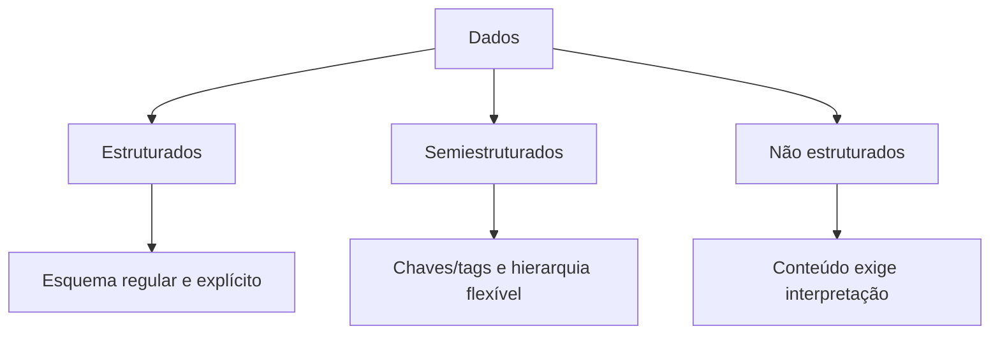
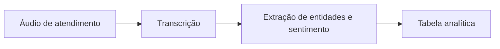

# 7.4 — Dados estruturados e dados não estruturados

[[7.3 Mapeamento de fontes de dados|← Mapeamento de fontes]] · [[7.5 Conceitos de OLAP e suas operações|OLAP →]]

> [!danger] Prioridade CESGRANRIO: **ALTA**
> O assunto é transversal a Data Lakes, Big Data e NoSQL. Priorize a distinção entre **estruturado, semiestruturado e não estruturado**, o papel do esquema e dos metadados, exemplos de formatos e tecnologias adequadas.

## O que você DEVE MANTER e REVISAR — o “coração” da CESGRANRIO

1. **Estruturados (Seção 2):** seguem esquema regular e explícito, com campos, tipos e relações previsíveis. Exemplos: tabelas relacionais e arquivos tabulares bem definidos.
2. **Semiestruturados (Seção 3):** não exigem estrutura tabular rígida, mas possuem marcadores, chaves ou hierarquia autodescritiva. Exemplos: JSON e XML.
3. **Não estruturados (Seção 4):** não possuem esquema predefinido diretamente adequado à análise tradicional. Exemplos: texto livre, imagem, áudio e vídeo.
4. **Metadados existem nos três tipos (Seção 5):** uma imagem não estruturada pode ter resolução, data, autor e localização estruturados. **Pegadinha:** não estruturado não significa sem estrutura interna ou sem metadados.
5. **Formato não garante qualidade (Seções 6 e 8):** CSV tende a ser estruturado, mas pode ter campos inconsistentes; JSON tende a ser semiestruturado, mas ainda pode seguir regras e esquemas de validação.

> [!tip] Regra mental de prova
> **Tabela com esquema regular → estruturado. Chaves/tags e hierarquia flexível → semiestruturado. Conteúdo cujo significado exige interpretação → não estruturado.**

## 1. Estrutura e esquema

O **esquema** descreve como os dados são organizados: campos, nomes, tipos, relações e restrições.



A classificação não mede importância ou qualidade. Ela descreve o grau e a forma de organização disponíveis para processamento.

## 2. Dados estruturados

São organizados segundo um modelo predefinido e regular. Registros compartilham campos e tipos conhecidos.

```text
id_cliente | nome | uf | data_cadastro
10         | Ana  | SP | 2026-01-15
11         | Caio | RJ | 2026-01-16
```

Características:

- esquema explícito;
- linhas e colunas ou registros regulares;
- tipos e restrições;
- consulta e agregação facilitadas;
- boa adequação a SQL e ferramentas tradicionais de BI.

Exemplos:

- tabelas relacionais;
- planilhas bem organizadas;
- arquivos CSV de leiaute estável;
- dados de sensores com campos fixos;
- registros transacionais.

> [!warning] Pegadinha CESGRANRIO
> Estruturado não significa obrigatoriamente relacional. Um arquivo tabular ou mensagem com campos fixos também pode ser estruturado.

## 3. Dados semiestruturados

Possuem elementos que identificam e organizam o conteúdo, mas permitem estrutura variável, campos opcionais ou aninhamento.

### 3.1 JSON

```json
{
  "id": 10,
  "nome": "Ana",
  "telefones": ["1111-2222", "3333-4444"],
  "preferencias": {
    "canal": "email"
  }
}
```

Outro documento da mesma coleção pode omitir `preferencias` ou acrescentar outros campos.

### 3.2 XML

```xml
<cliente id="10">
  <nome>Ana</nome>
  <telefone tipo="celular">1111-2222</telefone>
</cliente>
```

Outros exemplos:

- logs com campos ou marcadores;
- eventos com pares chave–valor;
- e-mails: cabeçalhos estruturados e corpo livre;
- documentos HTML;
- arquivos de configuração.

> [!warning] Pegadinhas CESGRANRIO
> - Semiestruturado não significa ausência de esquema; ele pode ser validado por JSON Schema, XSD ou regras da aplicação.
> - JSON e XML são formatos, não bancos de dados.
> - A flexibilidade pode existir entre documentos, mas cada documento ainda contém organização identificável.

## 4. Dados não estruturados

Não seguem um esquema predefinido diretamente utilizável como linhas, colunas ou campos de negócio regulares.

Exemplos:

- textos livres e documentos;
- imagens;
- áudio;
- vídeo;
- desenhos e exames;
- gravações de atendimento;
- postagens livres.

Para extrair atributos e significado, podem ser usadas:

| Conteúdo | Técnica possível |
|---|---|
| Texto | processamento de linguagem natural, classificação e extração de entidades |
| Imagem/vídeo | visão computacional e reconhecimento de objetos |
| Áudio | reconhecimento de fala e análise de sinais |
| Documento digitalizado | OCR para reconhecer caracteres |

> [!warning] Pegadinha CESGRANRIO
> Não estruturado não significa aleatório, inútil ou impossível de processar. O conteúdo possui estrutura humana ou física, mas não um esquema de dados diretamente pronto para consultas tradicionais.

## 5. Metadados e conteúdo

Um objeto não estruturado pode possuir metadados estruturados:

```text
Conteúdo: fotografia
Metadados:
  nome_arquivo = plataforma_07.jpg
  data = 2026-03-10
  resolução = 4096 × 2160
  autor = equipe_inspecao
  classificação = uso_interno
```

Metadados permitem catalogar, localizar, proteger e interpretar conteúdos. Eles não transformam necessariamente o conteúdo principal em dado estruturado.

### 5.1 E-mail como exemplo misto

```text
Cabeçalho: remetente, destinatário, data → estruturado/semiestruturado
Corpo: texto livre                         → não estruturado
Anexo: imagem                              → não estruturado
```

> [!warning] Pegadinha CESGRANRIO
> Um mesmo objeto ou fonte pode combinar tipos diferentes de dados. A classificação depende do componente analisado.

## 6. Comparação direta

| Critério | Estruturado | Semiestruturado | Não estruturado |
|---|---|---|---|
| Esquema | Regular e explícito | Flexível, com chaves/tags | Não predefinido para consulta tradicional |
| Organização | Linhas, colunas e campos fixos | Hierarquia, chaves e campos variáveis | Conteúdo livre ou multimídia |
| Exemplos | SQL, CSV tabular | JSON, XML, logs marcados | Texto, imagem, áudio, vídeo |
| Consulta direta | Facilitada | Exige navegação/interpretação de estrutura | Exige indexação ou extração de características |
| Evolução estrutural | Mais controlada | Mais flexível | Depende do processamento aplicado |
| Metadados | Presentes | Presentes | Podem estar associados |

## 7. Schema-on-write × schema-on-read

### 7.1 Schema-on-write

O esquema é definido e aplicado antes ou durante a gravação no repositório de consumo. É comum em ambientes estruturados e Data Warehouses tradicionais.

### 7.2 Schema-on-read

A interpretação é aplicada quando os dados são lidos para determinado uso. É frequente em Data Lakes e ambientes com dados diversos.

```text
Schema-on-write: estruturar → armazenar → consultar
Schema-on-read:  armazenar → interpretar para o uso → consultar
```

> [!warning] Pegadinha CESGRANRIO
> Schema-on-read não significa armazenar sem catálogo ou governança. O esquema foi adiado para o consumo, não eliminado.

## 8. Qualidade em diferentes tipos

| Tipo | Problemas frequentes |
|---|---|
| Estruturado | nulos, duplicatas, domínio inválido, quebra de integridade |
| Semiestruturado | campos ausentes, tipos variáveis, versões incompatíveis, aninhamento inconsistente |
| Não estruturado | baixa resolução, ruído, idioma desconhecido, conteúdo ambíguo, metadado ausente |

Exemplos:

```text
CSV estruturado com CPF errado       → estruturado, mas sem acurácia
JSON válido com campos inconsistentes → semiestruturado, mas de baixa qualidade
Imagem nítida sem data ou origem      → conteúdo bom, contexto insuficiente
```

> [!warning] Pegadinha CESGRANRIO
> Estrutura e qualidade são dimensões independentes. Dados estruturados podem ser ruins; não estruturados podem ser confiáveis e valiosos.

## 9. Armazenamento e processamento

| Necessidade | Solução frequentemente adequada |
|---|---|
| Transações tabulares e integridade | SGBD relacional |
| Documentos flexíveis e agregados | Banco de documentos |
| Arquivos diversos em escala | Data Lake/armazenamento de objetos |
| Pesquisa em texto | Mecanismo de indexação e busca |
| Análise dimensional | Data Warehouse/estrutura multidimensional |

Uma solução pode armazenar o conteúdo em um repositório e seus metadados/índices em outro.

## 10. Transformação entre tipos

Dados podem ganhar estrutura por extração:



O áudio original continua não estruturado; a transcrição e os atributos derivados podem ser armazenados de forma semiestruturada ou estruturada.

O sentido inverso também ocorre: uma tabela pode gerar um relatório narrativo. Transformar a representação não apaga a origem ou a linhagem.

## 11. Dados internos × externos e em repouso × movimento

Essas classificações são independentes da estrutura:

| Classificação | Exemplo |
|---|---|
| Interno estruturado | tabela de vendas do ERP |
| Externo estruturado | série econômica oficial em CSV |
| Interno não estruturado | gravação de atendimento |
| Externo semiestruturado | resposta JSON de parceiro |
| Em repouso | arquivo armazenado |
| Em movimento | fluxo contínuo de eventos |

## 12. Segurança e governança

Todos os tipos exigem:

- classificação de sensibilidade;
- controle de acesso;
- catálogo e linhagem;
- retenção e descarte;
- criptografia quando necessária;
- regras de qualidade;
- identificação de dados pessoais.

Conteúdo livre pode esconder informações pessoais sem campos claramente identificados, aumentando a dificuldade de descoberta e proteção.

## 13. Pegadinhas rápidas

| Afirmação | Julgamento |
|---|---|
| “Todo CSV é automaticamente bem estruturado.” | Falsa |
| “JSON costuma ser semiestruturado.” | Verdadeira |
| “Não estruturado não possui metadados.” | Falsa |
| “Estruturado significa alta qualidade.” | Falsa |
| “Uma fonte pode misturar diferentes tipos.” | Verdadeira |
| “Schema-on-read elimina a necessidade de esquema.” | Falsa |
| “Imagem pode possuir metadados estruturados.” | Verdadeira |
| “JSON e XML são SGBDs.” | Falsa |

## 14. Prioridade de estudo

### Alta frequência/probabilidade

- estruturado × semiestruturado × não estruturado;
- exemplos e características;
- JSON/XML como semiestruturados;
- metadados associados a conteúdo não estruturado;
- schema-on-read × schema-on-write;
- estrutura × qualidade;
- fonte com componentes mistos.

### Chance média

- extração de estrutura por OCR, PLN e visão computacional;
- escolha de armazenamento;
- interno × externo e repouso × movimento;
- riscos de segurança em conteúdo livre.

## 15. Checklist de revisão

- [ ] Estruturado possui esquema regular e explícito.
- [ ] Semiestruturado possui chaves/tags e estrutura flexível.
- [ ] Não estruturado não está pronto para consulta tabular tradicional.
- [ ] JSON e XML costumam ser semiestruturados.
- [ ] Texto livre, imagem, áudio e vídeo são não estruturados.
- [ ] CSV tabular tende a ser estruturado, mas pode conter inconsistências.
- [ ] Não estruturado pode ter metadados estruturados.
- [ ] Um e-mail pode combinar diferentes categorias.
- [ ] Estrutura não garante qualidade.
- [ ] Schema-on-read adia, mas não elimina, o esquema.
- [ ] Classificação por estrutura independe de origem interna/externa.

## 16. Questões inéditas — estilo CESGRANRIO

### 16.1 Questão 1

Um repositório contém uma fotografia de inspeção acompanhada por data, equipamento, autor e classificação de segurança em campos regulares.

Nesse caso,

A) a fotografia e seus metadados são necessariamente relacionais.  
B) a fotografia é não estruturada, embora seus metadados possam ser estruturados.  
C) a existência de metadados transforma a fotografia em tabela.  
D) dados não estruturados não podem receber classificação de segurança.  
E) a fotografia é semiestruturada apenas porque possui nome de arquivo.

> [!success]- Gabarito comentado
> **Resposta: B.** O conteúdo visual não possui esquema tabular predefinido, mas atributos que o descrevem podem ser estruturados. A banca pode confundir conteúdo e metadados.

### 16.2 Questão 2

Uma coleção armazena documentos JSON com campos identificados e subdocumentos, sendo que alguns registros possuem atributos que outros não possuem.

Esses dados são predominantemente

A) estruturados de esquema tabular fixo.  
B) não estruturados, pois JSON não contém marcadores.  
C) semiestruturados, pois possuem organização identificável e estrutura flexível.  
D) multidimensionais, pois todo campo representa uma dimensão.  
E) relacionais, pois toda chave JSON é uma chave primária.

> [!success]- Gabarito comentado
> **Resposta: C.** JSON possui chaves, valores e hierarquia identificáveis, mas admite campos opcionais e estruturas variáveis, características de dados semiestruturados.

## 17. Resumo de véspera

```text
ESTRUTURADO = esquema regular + campos/tipos previsíveis
SEMI = chaves/tags + hierarquia + flexibilidade
NÃO ESTRUTURADO = texto livre, imagem, áudio e vídeo
CSV TABULAR → geralmente estruturado
JSON/XML → geralmente semiestruturados
IMAGEM pode ser não estruturada com metadados estruturados
E-MAIL pode misturar cabeçalho, corpo e anexos de tipos diferentes
ESTRUTURA ≠ qualidade
SCHEMA-ON-WRITE = estruturar antes/durante a gravação
SCHEMA-ON-READ = interpretar no consumo
SCHEMA-ON-READ ≠ ausência de esquema ou governança
OCR/PLN/VISÃO podem extrair atributos estruturados de conteúdo livre
```
