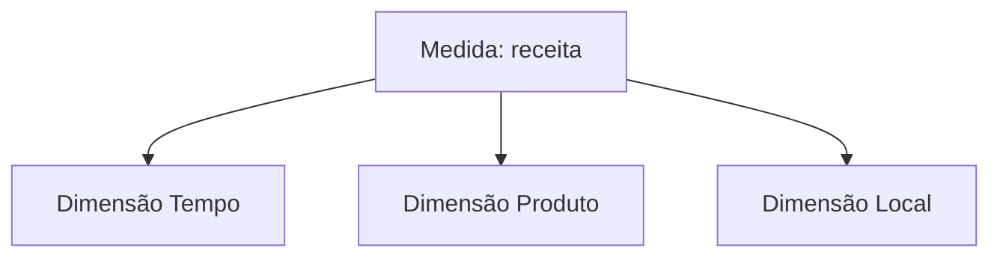

# 7.5 — Conceitos de OLAP e suas operações

[[7.4 Dados estruturados e dados não estruturados|← Dados estruturados e não estruturados]] · [[7.6 Conceitos de Data Warehouse|Data Warehouse →]] · [[1.7 Modelagem dimensional|Modelagem dimensional]]

> [!danger] Prioridade CESGRANRIO: **ALTA**
> Há registro de questão direta. Memorize exatamente `roll-up`, `drill-down`, `slice`, `dice` e `pivot`. Saiba ainda reconhecer `drill-through`, `drill-across`, cubo, medida, dimensão, hierarquia e a diferença OLAP × OLTP.

## O que você DEVE MANTER e REVISAR — o “coração” da CESGRANRIO

1. **OLAP × OLTP (Seção 2):** OLAP favorece consultas analíticas, históricas e agregadas; OLTP favorece transações operacionais curtas e concorrentes.
2. **Roll-up × drill-down (Seções 5 e 6):** roll-up agrega e sobe na hierarquia; drill-down detalha e desce. **Pegadinha:** a banca costuma inverter os sentidos.
3. **Slice × dice (Seções 7 e 8):** slice fixa um valor de uma dimensão; dice seleciona um subcubo usando conjuntos, intervalos ou critérios em várias dimensões.
4. **Pivot (Seção 9):** rotaciona/reorienta eixos para mudar a apresentação, sem significar necessariamente maior detalhe ou filtragem.
5. **Drill-through × drill-across (Seção 10):** through chega aos registros detalhados subjacentes; across compara fatos/processos relacionados por dimensões conformadas.

> [!tip] Regra mental de prova
> **UP sobe e resume; DOWN desce e detalha; SLICE corta uma fatia; DICE recorta um subcubo; PIVOT gira; THROUGH atravessa até a origem detalhada.**

## 1. O que é OLAP

**Online Analytical Processing** é uma abordagem para exploração interativa de dados segundo múltiplas dimensões, com agregações, comparações e navegação por níveis de detalhe.

Exemplos de perguntas:

- qual a receita por produto, região e mês?
- como o resultado trimestral se compara ao ano anterior?
- qual loja explica a queda de uma região?
- qual categoria supera a meta em determinado período?



OLAP representa uma visão conceitualmente multidimensional, ainda que a implementação física use tabelas relacionais.

## 2. OLAP × OLTP

| Critério | OLTP | OLAP |
|---|---|---|
| Finalidade | Operação do negócio | Análise e apoio à decisão |
| Operações | Inserções e atualizações frequentes | Leituras, agregações e comparações |
| Consultas | Curtas e previsíveis | Complexas e exploratórias |
| Dados | Atuais e detalhados | Históricos, integrados e em vários níveis |
| Usuários | Operadores e aplicações | Analistas e gestores |
| Modelagem comum | Relacional normalizada | Dimensional/multidimensional |
| Concorrência | Muitas transações curtas | Menos consultas, porém mais pesadas |

> [!warning] Pegadinhas CESGRANRIO
> - OLAP não é linguagem de programação nem simples relatório estático.
> - OLTP pode gerar relatórios e OLAP pode acessar detalhe, mas suas finalidades predominantes são diferentes.
> - “Online” indica interação responsiva, não que os dados estejam necessariamente atualizados em tempo real.

## 3. Elementos multidimensionais

| Elemento | Significado | Exemplo |
|---|---|---|
| **Fato** | Evento ou fenômeno analisado | Venda |
| **Medida** | Valor quantitativo analisado | Receita, quantidade |
| **Dimensão** | Perspectiva descritiva | Tempo, produto, loja |
| **Membro** | Valor de uma dimensão | Produto X, ano 2026 |
| **Hierarquia** | Níveis ordenados de agregação | Dia → mês → trimestre → ano |
| **Cubo** | Visão multidimensional das medidas | Receita por tempo, produto e região |
| **Célula** | Interseção de membros das dimensões | Receita de X em SP em janeiro |

### 3.1 Grão

Define o que representa uma linha do fato e o menor nível de detalhe disponível. Não é possível fazer drill-down abaixo do detalhe armazenado sem acessar outra fonte.

### 3.2 Medidas

- aditiva: soma em todas as dimensões;
- semi-aditiva: não soma corretamente em alguma dimensão, frequentemente tempo;
- não aditiva: percentuais e médias não devem ser somados diretamente.

Esses conceitos foram aprofundados em [[1.7 Modelagem dimensional|1.7 Modelagem dimensional]].

## 4. Exemplo-base

Considere receita organizada por:

```text
Tempo:   Dia → Mês → Trimestre → Ano
Produto: Item → Subcategoria → Categoria
Local:   Loja → Cidade → Estado → Região
Medida:  Receita
```

As operações seguintes usarão esse cubo lógico.

## 5. Roll-up — consolidar/subir

Agrega dados para um nível mais alto da hierarquia ou reduz o nível de detalhe.

```text
Dia → Mês → Trimestre → Ano
Loja → Cidade → Estado → Região
```

Exemplo:

```text
Receita por cidade → receita por estado
```

Também pode ocorrer pela remoção de uma dimensão da visualização, agregando seus valores.


> [!warning] Pegadinha CESGRANRIO
> Roll-up **diminui o detalhe e aumenta a agregação**. Não confunda “subir” com aumentar a quantidade de linhas.

## 6. Drill-down — detalhar/descer

É o movimento inverso ao roll-up: navega para nível mais detalhado da hierarquia.

```text
Ano → Trimestre → Mês → Dia
Região → Estado → Cidade → Loja
```

Exemplo: de receita anual por região para receita mensal por loja.

> [!warning] Pegadinha CESGRANRIO
> Drill-down permanece dentro dos níveis disponíveis da estrutura multidimensional. Acesso a registros operacionais subjacentes é normalmente chamado **drill-through**.

## 7. Slice — fatiar

Seleciona um único valor de uma dimensão, produzindo uma fatia e frequentemente reduzindo a dimensionalidade da visão.

```text
Cubo: Receita(Tempo, Produto, Região)
Slice: Tempo = 2026
Resultado: Receita(Produto, Região) para 2026
```


> [!warning] Pegadinha CESGRANRIO
> Slice fixa **um valor** de uma dimensão. Em muitas definições didáticas, isso reduz em uma a quantidade de dimensões exibidas.

## 8. Dice — recortar subcubo

Seleciona conjuntos, intervalos ou condições em duas ou mais dimensões, gerando um subcubo.

```text
Tempo ∈ {jan, fev, mar}
Produto ∈ {Gasolina, Diesel}
Região ∈ {Sul, Sudeste}
```

O resultado continua multidimensional, mas contém somente a região selecionada do cubo.

### 8.1 Slice × dice

| Operação | Seleção típica | Resultado mental |
|---|---|---|
| **Slice** | Um membro de uma dimensão | Uma fatia |
| **Dice** | Conjuntos/faixas em várias dimensões | Um subcubo |

> [!warning] Pegadinha CESGRANRIO
> Ambos filtram. A diferença didática é o padrão da seleção: **slice fixa uma dimensão; dice recorta combinações em múltiplas dimensões**.

## 9. Pivot — rotacionar

Reorienta os eixos da apresentação para oferecer outra perspectiva dos mesmos dados.

```text
Antes: linhas = Produto; colunas = Mês
Depois: linhas = Mês; colunas = Produto
```

Pivot também é chamado de rotate.

> [!warning] Pegadinha CESGRANRIO
> Pivot altera a **orientação da visualização**. Não implica, por si só, agregar, detalhar ou acessar a origem.

## 10. Outras operações

### 10.1 Drill-through

Parte de um valor agregado e atravessa a camada multidimensional até registros detalhados subjacentes.

```text
Receita de setembro em SP
   → notas/pedidos que compõem o total
```

### 10.2 Drill-across

Compara ou combina medidas de diferentes tabelas de fatos/processos que compartilham dimensões conformadas.

```text
Fato Vendas  ─┐
              ├─ por Tempo e Produto → comparar venda × estoque
Fato Estoque ─┘
```

### 10.3 Drill-up

É frequentemente usado como sinônimo de roll-up: subir para nível mais agregado.

> [!warning] Pegadinhas CESGRANRIO
> - Drill-through = sair do agregado para os registros que o originam.
> - Drill-across = cruzar processos/fatos relacionados, não descer uma hierarquia.

## 11. MOLAP, ROLAP e HOLAP

### 11.1 MOLAP

Armazena dados em estrutura multidimensional especializada, muitas vezes com agregações pré-calculadas. Favorece resposta rápida, mas pode aumentar processamento de carga e armazenamento.

### 11.2 ROLAP

Implementa a análise multidimensional sobre tabelas relacionais, usando fatos, dimensões e consultas SQL. Favorece escala e detalhe do ecossistema relacional.

### 11.3 HOLAP

Combina abordagens: agregações em armazenamento multidimensional e detalhes em estruturas relacionais, por exemplo.

| Tipo | Armazenamento predominante |
|---|---|
| MOLAP | Multidimensional especializado |
| ROLAP | Relacional |
| HOLAP | Híbrido |

> [!warning] Pegadinha CESGRANRIO
> ROLAP continua oferecendo visão multidimensional ao usuário, embora os dados estejam fisicamente em tabelas relacionais.

## 12. Agregações e pré-cálculo

Pré-calcular totais acelera consultas repetidas, mas custa espaço e tempo de atualização. Calcular sob demanda reduz armazenamento adicional, mas pode aumentar latência.

```text
Mais agregações pré-calculadas
  → consultas potencialmente mais rápidas
  → mais armazenamento e manutenção
```

A escolha depende do padrão de consultas, frequência de carga e necessidade de atualização.

## 13. OLAP e SQL

Uma consulta relacional pode implementar agregação multidimensional:

```sql
SELECT
    t.ano,
    p.categoria,
    l.regiao,
    SUM(f.valor) AS receita
FROM fato_venda f
JOIN dim_tempo   t ON t.id_tempo   = f.id_tempo
JOIN dim_produto p ON p.id_produto = f.id_produto
JOIN dim_local   l ON l.id_local   = f.id_local
GROUP BY t.ano, p.categoria, l.regiao;
```

Remover `l.regiao` do agrupamento e consolidar todas as regiões é uma forma de roll-up. Acrescentar níveis mais detalhados pode implementar drill-down.

## 14. Operações — quadro definitivo

| Operação | Ação | Palavra da banca |
|---|---|---|
| **Roll-up** | Agrega/subindo hierarquia | consolidar, resumir |
| **Drill-down** | Desce para detalhe | detalhar |
| **Slice** | Fixa um membro de uma dimensão | fatia |
| **Dice** | Seleciona subcubo por múltiplos critérios | recorte |
| **Pivot** | Reorienta eixos | girar/rotacionar |
| **Drill-through** | Vai ao registro detalhado subjacente | atravessar até origem/detalhe |
| **Drill-across** | Compara fatos por dimensões comuns | cruzar processos |

## 15. Prioridade de estudo

### Alta frequência/probabilidade

- OLAP × OLTP;
- medida, dimensão, membro e hierarquia;
- roll-up × drill-down;
- slice × dice;
- pivot;
- identificação da operação por cenário.

### Chance média

- drill-through × drill-across;
- MOLAP × ROLAP × HOLAP;
- pré-cálculo de agregações;
- grão e tipos de medidas em nível de revisão.

### Não aprofundar agora

- projeto físico de cubos;
- índices e particionamento multidimensional;
- sintaxe de linguagens proprietárias;
- otimização detalhada — item 7.7.

## 16. Checklist de revisão

- [ ] OLAP é analítico; OLTP é operacional/transacional.
- [ ] Fato contém medidas; dimensão fornece contexto.
- [ ] Hierarquia organiza níveis, como dia → mês → ano.
- [ ] Roll-up sobe e agrega.
- [ ] Drill-down desce e detalha.
- [ ] Slice fixa um membro de uma dimensão.
- [ ] Dice recorta um subcubo por múltiplos critérios.
- [ ] Pivot muda a orientação dos eixos.
- [ ] Drill-through chega aos registros subjacentes.
- [ ] Drill-across compara fatos por dimensões conformadas.
- [ ] MOLAP é multidimensional; ROLAP é relacional; HOLAP é híbrido.
- [ ] “Online” não significa necessariamente tempo real.

## 17. Questões inéditas — estilo CESGRANRIO

### 17.1 Questão 1

Um analista visualizava a receita por cidade e mês. Primeiro consolidou cidades em estados; depois trocou a disposição, colocando os meses nas linhas e os estados nas colunas.

As operações realizadas foram, respectivamente,

A) drill-down e dice.  
B) roll-up e pivot.  
C) slice e drill-through.  
D) pivot e roll-up.  
E) drill-across e slice.

> [!success]- Gabarito comentado
> **Resposta: B.** Cidade → estado reduz detalhe e agrega, portanto é roll-up. Trocar linhas e colunas reorienta a apresentação, portanto é pivot.

### 17.2 Questão 2

Sobre um cubo de vendas por tempo, produto e região, um usuário selecionou os meses de janeiro a março, duas categorias de produto e as regiões Sul e Sudeste.

Essa operação é denominada

A) slice, porque fixa obrigatoriamente um único membro.  
B) pivot, porque altera somente a orientação dos eixos.  
C) dice, porque seleciona um subcubo por critérios em várias dimensões.  
D) roll-up, porque sempre sobe uma hierarquia.  
E) drill-through, porque acessa registros operacionais.

> [!success]- Gabarito comentado
> **Resposta: C.** A seleção de conjuntos ou intervalos em várias dimensões recorta um subcubo: dice. Slice, na definição didática mais cobrada, fixa um valor de uma dimensão.

## 18. Resumo de véspera

```text
OLAP = análise multidimensional interativa
OLTP = transações operacionais
FATO = evento; MEDIDA = valor; DIMENSÃO = contexto
HIERARQUIA = Dia → Mês → Trimestre → Ano
ROLL-UP = subir/agregar/resumir
DRILL-DOWN = descer/detalhar
SLICE = fixar um membro de uma dimensão
DICE = recortar subcubo por vários critérios
PIVOT/ROTATE = girar/reorientar eixos
DRILL-THROUGH = chegar aos registros detalhados subjacentes
DRILL-ACROSS = comparar fatos por dimensões comuns
MOLAP = armazenamento multidimensional
ROLAP = armazenamento relacional
HOLAP = combinação híbrida
ONLINE ≠ obrigatoriamente tempo real
```
